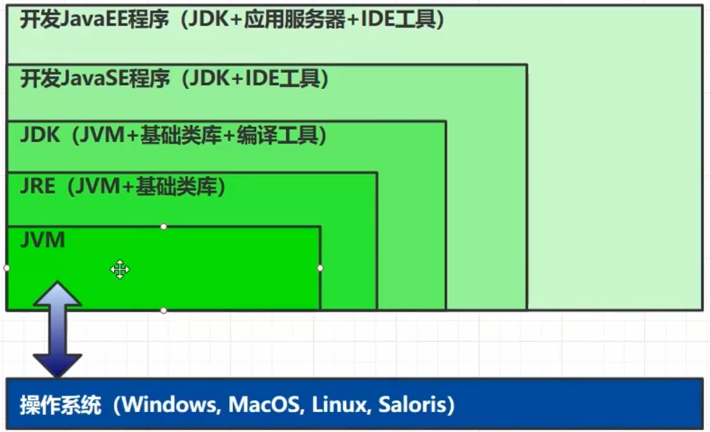
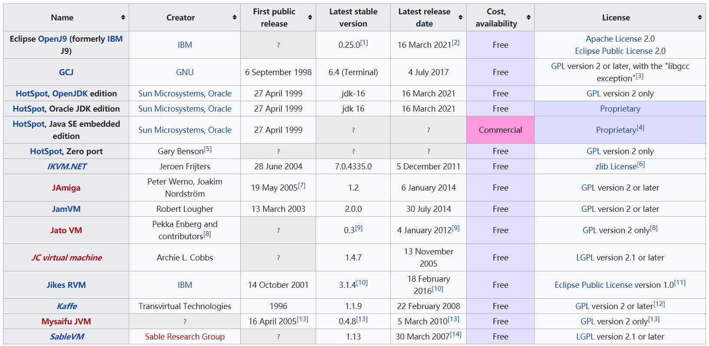
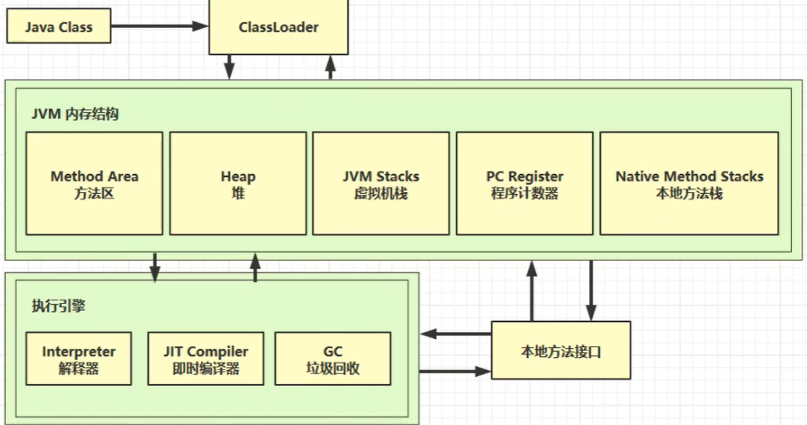

# 1. 概述

## 1.1 JVM定义

Java Virtual Machine - java程序的运行环境（Java二进制字节码的运行环境）

JVM的好处：

- 一次编写，到处运行
- 自动内存管理，垃圾回收功能
- 数组下标越界检查
  - C语言，一旦越界，可能会访问其他数据
- 多态

## 1.2 常见的JVM

本文档为基于Hotspot的学习笔记。

## 1.3 学习路线

1. Java Class文件由类加载器进行加载，其中类存储在方法区，创建的对象存储在堆上，执行对象的方法借助虚拟机栈、程序计数器、本地方法栈。

2. 字节码由解释器解释执行，其中一些热点代码会由即时编译器编译存储到方法区中，代码运行过程中的产生的垃圾由垃圾回收器进行回收。

3. 其中，一些方法实现还借助于本地方法

- 类加载系统
  - 需要将由前端编译器编译形成的字节码加载到内存中，生成一个class对象
  - 包含加载、链接、初始化三个步骤
- 运行时数据区
  - 线程共享：堆、方法区
  - 线程独享：本地方法栈、虚拟机栈、程序计数器
- 执行引擎
  - 包含了解释器、即时编译器和垃圾回收器
  - 解释器一开始就逐行翻译字节码指令，是用来确保响应时间
  - 即时编译器用来翻译一些热点代码，并将其缓存到方法区中
  - 由于操作系统只能执行机器指令，所以需要执行引擎将字节码指令翻译为机器指令

## 1.4 虚拟机的生命周期

JVM生命周期主要由启动、执行和终止三部分组成，其中引导类加载器创建一个初始类会导致虚拟机的启动，而这个初始类由具体虚拟机的实现指定。