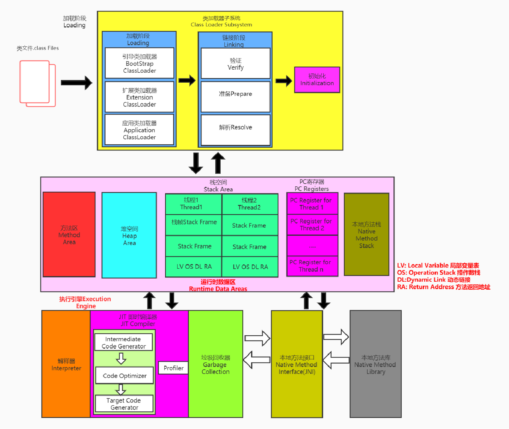

# 类加载系统


类加载器系统只负责加载class文件（文件开头有特定标识），根据class文件生成一个class对象，将其存储到运行时数据区中的方法区中

类加载系统不关心class文件是否可以正常运行，这部分由执行引擎负责

## 类的加载过程


### 加载

1. 通过类的全限定名获取字节码文件的字节流
    - 获取字节流的方式
        - 本地文件系统
        - 加密文件提取
        - 运行时动态生成
        - 网络中获取
2. 将静态存储结构转换为方法区运行时数据结构
3. 生成java.lang.Class对象来作为方法区中数据的访问入口

### 链接

链接主要包括验证、准备、解析三个步骤。

1. 验证：包括**文件格式验证、元数据验证、字节码验证、符号引用验证**，用来保证加载的字节码文件的字节流符合JVM的要求规范
2. 准备：为**类变量**分配内存，并设置默认初始值，即零值
    - 常量即final static在前端编译阶段就已经分配初始化了
    - 不会为实例变量分配初始化，类变量会分配在方法区，而实例变量是会随着对象一起分配在堆中的
3. 解析：将常量池中的符合引用转换为直接引用，通常在初始化完场后执行
    - 符号引用：一组符号来描述所引用的目标
    - 直接引用：直接指向目标的指针、偏移量或者一个间接定位的句柄

### 初始化

初始化阶段会执行<clinit>()方法，该方法是由JVM自动收集所有关于**类变量**的赋值语句以及**静态代码块中的语句**合并而来，按照其在源文件中出现的顺序执行。

**JVM规定需要保证<clinit>()方法是线程安全的**，即会对其加getClass()对象的锁。

```java
public class TestClinit {
	static {
		num = 10;
	}
	private static int num = 2;  //在链接的准备阶段，该类变量会被初始化为零值0，在初始化阶段，会执行<clinit>()方法，按照语句出现顺序，先执行先出现的静态代码块中的赋值10的代码

	public static void main(String[] args) {
			System.out.println(num);  //输出2，
	}
}
```

## 类加载器

JVM将所有类加载器分为引导类加载器和自定义类加载器两类，其中所有派生于ClassLoader抽象类的类都叫做自定义类加载器。


- 他们是包含关系并不是继承关系，可以使用getParent()可以获取其上层加载器
- 所有用户自定义类默认由系统类加载器加载，核心类库由引导类加载器加载



- 扩展类加载器/ExtClassLoader和系统类加载器/AppClassLoader都是sun.misc.Launcher的一个内部类，BootstrapClassLoader由C语言编写

### ClassLoader的常用方法及获取方法

引导类加载器不能直接获取到。

可以通过getClass().getClassLoader()方法来获取加载该类的类加载器，即类对象中有一个getClassLoader()方法，该方法可以用来获取加载该类的类加载器。

### 引导类加载器

加载哪些类

**c/C++编写**

### 自定义类加载器

什么时候需要用户自定义类加载器？

- 隔离加载类
- 修改类加载的方式（核心类库除外）
- 扩展加载源
- 防止源码泄露

**在JVM中，两个类为同一个类需要满足两个条件**：

1. 类的完整路径名一致
2. 使用相同的类加载器实例对象加载

对类加载器的引用使用自定义类加载器加载的类，需要在方法区中保存加载该类的类加载器的引用（引导类加载器为null）。当解析一个类型到另一个类型的引用时，需要保证这两个类型的类加载器是相同的。

### 双亲委派机制

类加载器收到加载类的请求，要先交给父加载器，一直传递到引导类加载器（parent但是不是父类），父加载器不能加载再交给子类加载器加载

**反向委托**

加载核心类库接口的第三方实现时，由于第三方实现不在引导类加载器的加载范围内，所以会产生反向委托，委托系统类加载器去加载第三方实现。

**好处：**

- 确保同一完整限定名的class文件会被同一个类加载器加载，同时避免类的重复加载
- 避免核心类的篡改

### 沙箱安全机制

### 类的主动使用和被动使用

主动使用：

- 创建类的实例
- 访问某个类或者接口的静态变量
- 调用类的静态方法
- 反射
- 初始化一个类的子类
- JVM启动时被标记为启动类的类
- 动态语言支持

除了其中类的主动使用外，其他的加载类的方式被称为被动使用，被动使用不会进行类的初始化。