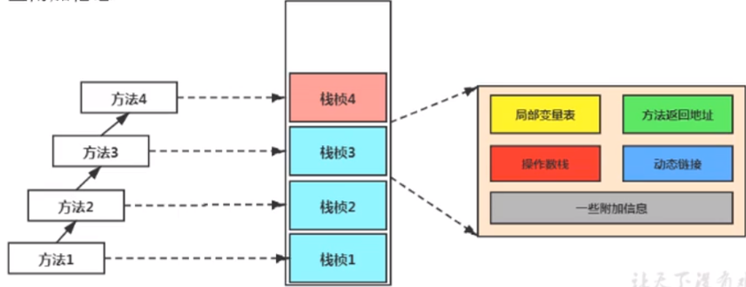
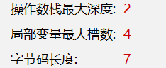
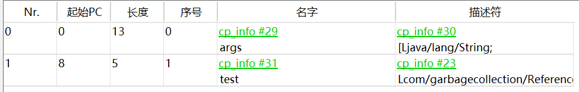
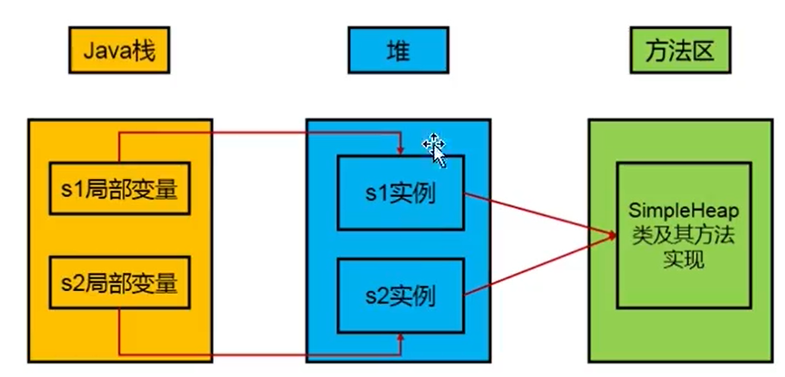
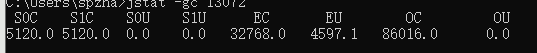
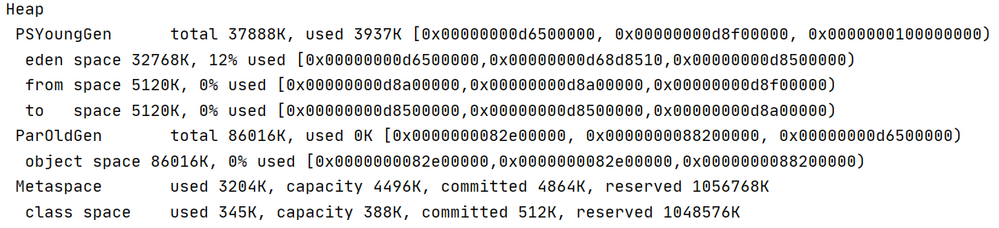

# 2. 运行时数据区


**JVM中的线程：在HotSpot中，每个线程都与操作系统中的本地线程直接映射**，当一个Java线程准备就绪后，此时一个操作系统的本地线程就会被创建，该线程终止后，本地线程也被操作系统回收。一旦一个本地线程初始化成功，它就会调用Java线程的run()方法。

堆和方法区（元空间）为所有线程共享，其周期随JVM；程序计数器、本地方法栈、虚拟机栈为线程独享，其周期随线程。

一些**后台守护线程**：虚拟机线程、周期任务线程、GC线程、编译线程、信号调度线程

**垃圾回收主要发生在堆空间中，少数发生在元空间。**

## 2.1 程序计数器

Program Counter Register 程序计数器（寄存器）

### 1）作用

记住下一条JVM指令的执行地址；因为读取指令地址十分频繁，所以采用寄存器来作为PC的实现。

特点：

1. 线程私有
2. JVM规范中规范PC不会存在内存溢出

**为什么程序计数器要设置为线程独享的？**多线程并发，线程需要来回切换，需要保证切换到某线程时，可以准确的知道该线程应该继续执行的指令地址。

**使用程序计数器存储要执行的字节码指令地址的好处**：多线程切换时，需要知道该继续执行哪条指令

相对于CPU中的寄存器来说是一个**逻辑/抽象**的概念

字节码解释器工作时就是通过改变程序计数器中的值来选取下一条要执行的字节码指令

运行时数据区中唯一一块Java 虚拟机规范中没有规定任何OutOfMemoryError情况的区域。

如果当前执行的是虚拟机栈中的方法，则**指向下一条要执行的JVM指令地址（先修改，然后执行，就相当于存储的是当前JVM指令地址）**，由执行引擎读取执行；如果执行的是本地方法栈中的方法，则是未指定值。

## 2.2 虚拟机栈

### 1）定义

Java Virtual Machine Stacks（Java 虚拟机栈）

- 每个线程运行时所需要的内存，称为虚拟机栈
- 每个栈由多个栈桢组成，对应着每次方法调用时所占用的内存
  - 参数
  - 局部变量
  - 返回地址
- 每个线程只能有一个活动栈桢，对应着当前正在执行的方法


指令集架构：栈、寄存器

由于Java要实现跨平台，不能采用基于寄存器的指令集架构，只能采用基于栈的指令集架构。

带来的问题：

- 性能下降
- 需要更多的指令来完成一项任务

内存中的堆和栈：**栈是运行时的单位，堆是存储单位。**即，栈用来解决程序如何执行的问题，堆用来解决数据存储的问题，即数据怎么放，放在哪。

**Java每个线程在创建时都会创建一个虚拟机栈（还会创建一个对应的操作系统本地线程）**，内部存放一个一个的**栈帧**，每个栈帧对应着一个Java方法调用。主管程序的运行，保存局部变量（8种基本数据类型、对象的引用地址）、部分结果，参与方法的调用与返回。

- 虚拟机栈为线程私有
- 生命周期与其线程一致

Java虚拟机栈允许**Java栈可以是固定大小的，也可以是支持动态扩展的，**可以通过参数**-Xss来设置线程支持的虚拟机栈的最大空间。**

- **栈的优点**
  - 访问速度快
  - JVM对Java 栈的操作只有两种：
    - 每个方法执行，即入栈
    - 方法执行结束，即出栈（return或者未处理异常，其实**在字节码中，函数结尾都有return**）
  - 栈存在OOM，但不需要GC
- **栈中可能出现的异常**
  - **StackOverFlow：**调用方法时，栈空间不足，则会报StackOverFlow异常
  - **OutOfMemoryError**：如果虚拟机栈支持动态扩展，则在尝试扩展无法获得足够内存，或者在创建新线程没有足够内存区创建对应的虚拟机栈，则会抛出OutOfMemoryError。

### 2）栈的存储单位

每个线程都有自己的栈，栈中的数据都是以栈帧为基本单位来存储的，栈帧是一个内存区块，是一个数据集，维系着对应的方法在执行过程中的各种数据信息。

### 3）栈帧内部的存储结构：

不同线程栈帧之间不能相互引用。



帧数据区：动态链接、方法返回地址、附加信息

#### ① 局部变量表

**局部变量表中的变量也是重要的垃圾回收根节点**，只要被局部变量表中直接或者间接引用的对象都不会被回收。

- 局部变量表是一个数字数组，主要存储方法参数和定义在方法体内的局部变量，对于非静态方法，还会在index为0的地方保存this引用
- 局部变量表是建立在线程上的栈，是线程私有的数据，不存在数据安全问题

- **局部变量表所需要的大小是在前端编译期间确定下来的**，并保存在Code的属性maximum local variables数据项中，在方法运行期间该表大小不会改变。



- 局部变量表中的变量只能在当前方法调用中有效，**虚拟机使用局部变量表完成参数值到参数变量列表的传递过**程。当方法调用结束后，局部变量表会随着方法栈桢的出栈而销毁

##### 局部变量表实例



- 起始PC和长度共同说明了该变量的作用域（在字节码中）
- 描述符中，[代表数组，L代表引用类型
- 序号为该slot的访问索引，通过该索引可成功访问到局部变量表中指定的局部变量值

- 在非静态方法中（栈帧对应一个方法，每个栈帧中都有一个局部变量表），局部变量表中index为0的固定为this
- 从方法参数开始，代码中的所有局部变量会按照顺序填入局部变量表中

##### 变量槽/Slot

局部变量表中最基本的存储单元为Slot（变量槽），32位以内的类型（包括returnAdress）只占用一个slot，62位的类型（long和double）占用两个slot

- boolean、byte、short、char在存储前都会被转换为int
- **变量槽可以重复利用**，如果一个局部变量过了其作用域，那么在其作用域之后声明的新的局部变量就有可能会重复利用过期局部变量的槽位，从而达到节省资源的目的。

- 局部变量表中的变量只能在当前方法调用中有效，**虚拟机使用局部变量表完成参数值到参数变量列表的传递过**程。当方法调用结束后，局部变量表会随着方法栈桢的出栈而销毁

#### ② 操作数栈

java -v 类名.class   反编译class文件

**操作数栈**：主要用于**保存计算过程中的中间结果**，同时作为计算过程中变量**临时的存储空间**。

- **操作数栈在方法栈帧创建时就已经创建，其大小（栈的深度）在编译期间就已经确定，初始为空**。
- 操作数栈中32位的类型占一个栈深度，64位的类型占两个栈深度
- **操作数栈中元素的数据类型必须与字节码指令的序列严格匹配，这由编译器在编译期间进行验证，同时在类加载过程中的类检验阶段的数据流分析阶段要再次验证。**

- 在方法执行过程中，根据字节码指令，从操作数栈中取出数据（出栈）或者向操作数栈中写入数据（入栈）
- 如果**被调用的方法有返回值的话，其返回值将会被压入当前栈帧的操作数栈中**，并更新PC寄存器中下一条需要执行的字节码指令

**Java虚拟机的解释引擎是基于栈（操作数栈）的执行引擎。**

**常见的一些字节码指令（先了解即可）**

- push：将变量放入操作数栈顶
- load_i：将局部变量表中指定索引   i   处元素放入操作数栈顶
- store_i：将操作数栈顶元素取出（出栈），放入到局部变量表指定索引  i  处
- add：取出栈顶两个元素并将其相加
- 带有return返回值的方法，在return值会放入操作数栈顶
- iconst_：将常量值压入操作数栈
- iinc i by 1：将局部变量表中索引   i   处元素加1

**i++ 和 ++i** 

① 当不做任何赋值操作时

两者对应字节码指令相同，即将对应局部变量表序号中的变量加1

```java
i++;
```

```java
iinc 1 by 1
```

```java
++j;
```

```java
iinc 2 by 1
```

**② 当使用两者赋值操作时**

i++会先将局部变量表中的值load进入操作数栈，然后对局部变量表中的变量进行加1操作，最后使用操作数栈中的数用来进行赋值

```java
int i = 1;
int b;
b = i++;
```

```java
iload_1
iinc 1 by 1
istore_2
```

++i会先对局部变量表中的变量进行加1操作，然后将加1后的值压入操作数栈，再使用栈顶元素进行赋值操作

```java
int j = 1;
int k;
k = ++j;
```

```java
iinc 3 by 1
iload_3
istore 4
```

**③ i = i++**

1. 先将局部变量表中的值压入操作数栈
2. 对局部变量表中的值进行加1运算
3. 将操作数栈顶值写入局部变量表中的对应位置

```java
iload_1
iinc 1 by 1
istore_1
```

[栈顶缓存技术]([https://hllvm-group.iteye.com/group/topic/34814#post-231982](https://hllvm-group.iteye.com/group/topic/34814#post-231982))

#### ③ 动态链接

Class文件的常量池中存有大量的符号引用，字节码中的方法调用指令就以常量池中指向方法的符号引用作为参数。这些符号引用部分会在类加载阶段或第一次使用的时候转换为直接引用，这种转换称为**静态解析**。另外一部分将在每次运行期间转化为直接引用，这部分称为**动态连接**。静态解析和动态连接区别在于**方法调用的符号引用转化为直接引用**的时机不同。

每一个栈帧中都保存有指向运行时常量池中该方法栈帧对应方法的引用，持有该引用是为了支持方法调用过程中的动态连接。

**字节码中的方法调用指令**

invokestatic：调用静态方法，解析阶段确定唯一方法版本

invokespecial：调用<init>方法、私有方法及父类方法，解析阶段确定唯一方法版本

invokevirtual：调用所有虚方法（还有final方法）

invokeinterface：调用接口方法

invokedynamic：动态解析出要调用的方法，然后执行

**动态类型语言和静态类型语言**

**静态类型语言**是指编译器需要确定变量的类型，**动态类型语言**在运行期才会确定变量的类型。Java是静态类型语言，但同时invokedynamic使得Java支持动态类型。

**静态链接、动态链接**

一个字节码文件被装入JVM时，被调用的目标方法在编译期间就可以确定，并且运行期间保持不变，则这种情况下将调用方法得符号引用转换为直接引用的过程称为**静态链接（静态解析）**。**私有方法**、**静态方法**、**实例构造方法**、**父类方法**、**final方法**等，都是在编译期间就可以确定的，这些方法被称为**非虚方法**。

如果被调用的方法在编译器无法确定，只能在运行期将调用方法的符号引用转换为直接引用的话，这种转换过程被称为**动态连接（动态解析）**。所有虚方法都不能再编译期间被确定。

早期绑定、晚期绑定

非虚方法（私有方法、静态方法、实例构造器、父类方法、final方法）、虚方法

非虚方法的调用在编译期间就完全确定，在类装载的解析阶段就会把涉及的符号引用解析位该方法的直接引用，不会延迟到运行期再去完成。

**为什么需要常量池？**

**静态分配/静态绑定/静态解析——重载解析**

依赖**变量的静态类型（声明的类型）**来定位方法执行版本的分配动作都被称为静态分配，**静态分配是在编译期间完成的。只有非虚方法可以在编译阶段确定具体的方法，**对于重载方法，在编译阶段根据类型的方法信息，获取合适的方法版本，然后**如果重载方法不是非虚方法，则需要在运行阶段进行动态分配**，根据具体对象信息确定要调用方法的哪个重写版本，完成符号引用向直接引用的转换。

但是，由于字面量没有显式的静态类型，所以有时候只能确定一个更加合适的重载版本。

```java
public class Overload {
    public static void sayHello(Object arg) {
        System.out.println("hello Object");
    }

    public static void sayHello(int arg) {
        System.out.println("hello int");
    }

    public static void sayHello(long arg) {
        System.out.println("hello long");
    }

    public static void sayHello(Character arg) {
        System.out.println("hello Character");
    }

    public static void sayHello(char arg) {
        System.out.println("hello char");
    }

    public static void sayHello(char... arg) {
        System.out.println("hello char...");
    }

    public static void main(String[] args) {
        sayHello('a');
    }
}
```

上述方法会按照char—>int—>long—>Character—>Object—>char...的顺序转型进行匹配。即字面量会从其最接近的类出发，在继承关系中从下往上开始搜索，越接近上层的优先级越低。

**动态分配/动态绑定/动态解析**——重写

**在运行期根据实际类型确定方法执行版本的分派过程被称为动态分派**，动态分派主要**由invokevirtual指令来完成**。该指令在运行时解析过程如下：

1. 确定操作数栈顶元素所指向的对象的**实际类型C**

2. 如果在类型C中找到与常量中描述符和简单名称都相符的方法，则进行权限校验，如果通过则返回这个方法的直接引用，查找过程结束；不通过则返回**java.lang.IllegalAccessError**异常

3. 否则，按照继承关系从下到上依次对C的各个父类进行第二步的搜索和验证过程

4. 如果始终没有找到合适的方法，则抛出**java.lang.AbstractMethodError异常**

#### ④ 虚方法表

https://blog.csdn.net/wzq6578702/article/details/82712667

- 为了避免频繁动态分派时，每次都要重新在类的方法元数据中搜索合适的目标，JVM采用在类的方法区建立一个虚方法表（不涉及非虚方法），**使用索引表来代替查找**，提高执行效率。

- 每个类中都有一个虚方法表，表中存放着各个虚方法的实际入口。在**类加载的链接阶段就会创建虚方法表**，并会开始对其进行初始化，类的变量初始值准备完成之后，JVM会把该类的方法也初始化完毕。

#### ⑤ 方法返回地址

栈帧中会保存调用该方法的PC寄存器的值，正常退出时会恢复PC寄存器的值，异常退出时会去查找异常表中对应异常的地址。

异常退出时，寄存器值修改为异常表中对应异常的地址

ireturn、lreturn、freturn、dreturn、areturn、return


一个线程虚拟机栈中，栈帧大小是可以不同的。栈帧大小取决于内部的数据结构，主要是局部变量表，操作数栈。

### 4）问题辨析

#### ① 垃圾回收是否涉及栈内存？

栈内存主要由栈桢内组成，而栈帧内存在对应方法结束后会自动被弹出释放，所以不需要垃圾收集器回收。

#### ② 栈内存分配越大越好？

Linux、MacOS默认会为每个线程分配1m栈空间，Windows取决于虚拟机内存空间大小。可以通过虚拟机参数-Xss指定栈内存。

栈内存并非分配的越大越好，因为栈内存跟方法调用有关，栈内存越大，该线程可以调用的方法就越多；但是如果分配给线程的栈内存比较大，那么就会影响可创建的线程数目，所以并不是栈内存分配的越大越好。

```
-Xss size

-Xss1m
-Xss1024k
-Xss1048576
```

#### ③ 方法内的局部变量是否线程安全？

- 如果方法内局部变量没有逃离方法的作用范围，它是线程安全的
- 如果局部变量引用了对象，并逃离了方法的作用范围，则它不是线程安全的

```java
//线程不安全
public static void m2(StringBuilder sb) {
    sb.append(1);
    sb.append(2);
    System.out.println(sb.toString());
}
//线程不安全
public static StringBuilder m3() {
    StringBuilder sb = new StringBuilder();
    sb.append(1);
    sb.append(2);
    return sb;
}
```

### 5）栈内存溢出

> java.lang.StackOverflowError

#### ① 栈桢过多导致栈内存溢出

多出现在递归调用中

- 如Json解析时，两个类中互相关联，ObjectMapper进行转换时会现入方法调用循环，从而导致栈内存溢出

```java
public class StackOverflow_ {
    static int count = 0;

    public static void main(String[] args) {
        try {
            m1();
        } catch (Throwable throwable) {
            throwable.printStackTrace();
            System.out.println(count);
        }
    }
    public static void m1() {
        count++;
        m1();
    }
}
```

#### ② 栈帧过小导致栈内存溢出

### 6）线程运行诊断

#### ① 案例1：cpu占用过多

Linux中定位：

- 用top命令定位哪个进程对cpu占用过高
- 用ps命令进一步定位是哪个线程引起的CPU占用过高
  - ps H -eo pid,tid,%cpu | grep 进程id
- 使用jstack工具

Windows中定位：

- jps命令查看所有Java进程
- jstack \<PID> 查看某个Java进程（PID）的所有线程状态
- jconsole 查看某个Java进程中线程的运行情况（图形界面）

#### ② 案例2：程序运行很长时间没有结果

Linux中定位：

- 用top命令定位哪个进程对cpu占用过高
- 用ps命令进一步定位是哪个线程引起的CPU占用过高
  - ps H -eo pid,tid,%cpu | grep 进程id
- 使用jstack工具可以发现死锁

## 2.3 本地方法栈


## 2.4 堆

### 1）堆的核心概述

#### ① 核心概述

一个进程对应于给JVM实例，一个JVM实例有一个运行时数据区，一个运行时数据区存在一个方法区和堆。

- **一个JVM实例对应一个堆内存**
  - 代码演示：编写两个Java类，分配设置不同的虚拟机参数
  - 使用Java VisualVM工具jvisualvm，该工具安装Visual GC插件
- Java堆区**在JVM启动时就被创建**，其**空间大小也被确定**，是JVM管理的最大的一块内存空间
  - 创建的大小可以调节：-Xms -Xmx
- JVM规范规定堆可以处于不连续的内存空间，但在**逻辑上应该是连续的**
- 所有线程共享Java堆，在这里还可以划分**线程私有的缓冲区（Thread Local Allocation Buffer，TLAB）**

- Java虚拟机规范中：所有的对象实例及数组都应当分配在堆上
  - 实际上，几乎所有的对象实例都分配在堆上，仍**存在对象不分配在堆上的情况**
- 数组和对象可能永远不会存储在栈上
  - **逃逸分析，对象分配在栈上**
- 堆中的垃圾对象不会马上被移除，仅**垃圾对象仅在垃圾收集的时候才会被移除**

Java 栈与堆与方法区之间的关系：



#### ② 内存细分

基于分代收集理论，我们可以将**要回收的区域**分为**新生区**、**老年区**和**永久区**（Java 7及之前）/元空间（Java 8及之后）。

- **新生区和老年区为堆的实现**，属于堆空间
  - Young Generation Space（Young/New）
    - Eden
    - Survivor
  - Tenure Generation Space（Old/Tenure）
- **永久区/元空间为方法区的实现**，属于方法区
  - Permanent Space（Perm）
  - Meta Space（Meta）

### 2）设置堆内存大小与OOM

#### ① 堆空间大小设置

> 开发时建议将初始值和最大值**设置成一样**的值，**避免堆扩容与释放造成不必要的压力**

##### I. 堆空间起始大小

-Xms	-XX:InitialHeapSize=

-X jvm的运行参数

ms memory start

- 默认情况下，物理电脑内存/64

- 要求大于1m

##### II. 堆空间最大大小

-Xmx	-XX:MaxHeapSize=

- 默认情况下，物理电脑内存/4

##### II. 如何查看设置的参数

要查看堆空间大小，一共有三种方式：

- 通过Runtime提供的方法
- 使用jstat命令
- 使用-XX:PrintGCDetails参数

###### Runtime

- totalMemory()
- maxMemory()
- 方法返回的内存总量单位为byte
- 获取到的totalMemory = eden+一个survivor区大小

```java
//返回Java虚拟机中的堆内存总量
long initialMemory = Runtime.getRuntime().totalMemory() / 1024 / 1024;
//返回Java虚拟机试图使用的最大堆内存量
long maxMemory = Runtime.getRuntime().maxMemory() / 1024 / 1024;
```

###### jstat

- 使用jps命令查看所有的java进程id
- jstat -gc 进程id，查看进程的内存情况，单位为kb
  - ms = S0C + S1C + EC



###### -XX:+PrintGCDetails

- 虚拟机参数-XX:+PrintGCDetails来获取堆大小
- PS YoungGen total = eden space + from space/to space 



#### ② OOM

一旦堆区的内存大小超过-Xmx指定的内存，就会报OOM


### 3）年轻代与老年代

### 4）图解对象分配过程

### 5）Minor GC、Major GC、Full GC

### 6）堆空间分代思想

### 7）内存分配策略

### 8）为对象分配内存：TLAB

### 10）堆空间的参数设置

### 11）堆是分配对象的唯一选择吗？

## 2.5 方法区

