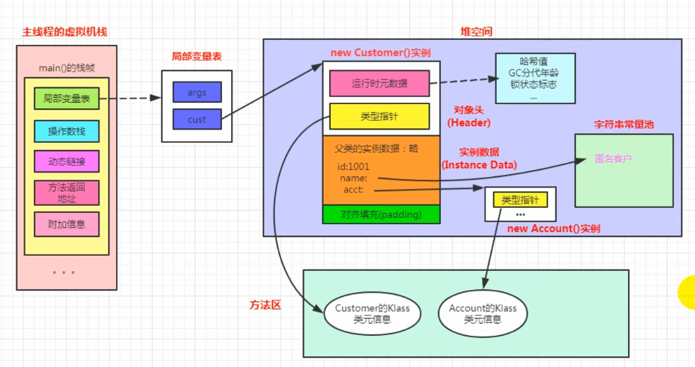
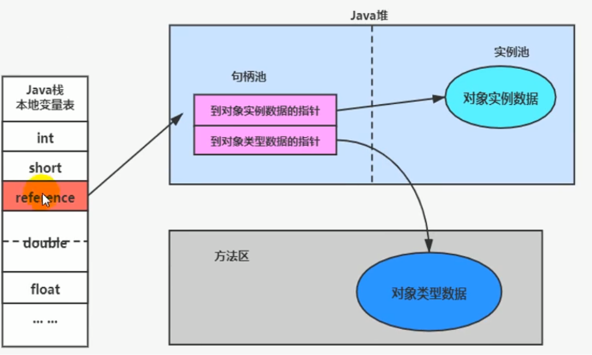

# 对象内存布局及访问定位

# 对象的实例化

### 创建对象的方法

1. new
2. 反射
   - Class的newInstance()（过时），只能调用空参的构造器，权限必须是public
   - Constructor的newInstance(xxx)，可以调用空参或有参的构造器，权限没有要求
3. 使用clone()，要求该类实现Cloneable接口
4. 使用反序列化，从网络、文件获取一个字节码文件的二进制流
5. 第三方库

### 对象创建过程：

1. 判断对象对应的类是否被加载、链接和初始化：虚拟机遇到一条new指令，首先检查这个指令的参数能否在Metaspace的常量池中定位到一个类的符号引用，并且检查这个符号引用代表的类是否已经被加载、解析和初始化（即判断类元信息是否存在）。如果没有，则在双亲委托模式下，使用当前类加载器ClassLoader+包名+类名为key查找对应的class文件，如果没有找到class文件，则报ClassNotFoundException异常，如果找到则进行类加载并生成对应的Class类对象。
2. 为对象分配内存（取决于收集器）：首先计算对象占用的空间大小，接着在堆中划分一块内存给新对象，如果实例变量成员变量是引用变量，仅分配引用变量空间即可，即4个字节大小。根据堆空间是否规整，内存分配又分为两种方法：指针碰撞和空闲链表法。如果内存是规整的，则采用指针碰撞法，即将所有使用的内存在一边，空闲的内存在一边，中间使用一个指针作为分界点的指示器，分配内存时仅仅将指向空闲那边挪动一段与对象大小相等的距离。如果垃圾收集器采用的是Serial、ParNew这种基于压缩算法的，虚拟机采用这种分配方式，一般使用带有compact（整理）过程的收集器，都是用指针碰撞。如果内存是不规整的， 则使用空闲列表的方式分配内存。即虚拟机维护一个列表，记录了哪些内存块是可用的，在分配的时候从列表上找到一块足够大的空间划分给对象实例，并更新列表上的内容。使用标记清楚算法的收集器，如CMS一般使用空闲链表的分配方式。
3. 线程并发安全问题：在堆上给每个线程预先分配一块TLAB作为线程独享的缓冲区（-XX:+UseTLAB），待 TLAB用完之后在堆上共享空间分配时需要采用CAS失败重试、区域加锁来保证分配的原子性。
4. 初始化分配到的空间：所有属性设置默认值，保证对象实例字段在不赋值时可以直接使用。
5. 设置对象的对象头： 将对象的所属类（即类的元数据信息）、对象的HashCode和对象的GC信息、锁信息等数据存储在对象的对象头中，这个过程具体设置方式取决于JVM的实现。
6. 执行init方法进行初始化：在Java程序的视角看来，初始化才正式开始：初始化成员变量、执行实例化代码块、调用类的构造方法并把堆内对象的首地址赋值给引用变量。一般来说（由字节码中是否跟随有invokespecial指令所决定），new指令之后会接着就是执行方法，把对象按照程序员的医院进行初始化。

创建对象的过程104 —> 执行引擎117

# 对象的内存布局

## 对象头

如果是数组，还需要记录数组的长度

- 运行时元数据：哈希值、GC分代年龄、锁状态标志、线程持有的锁、偏向锁ID等
- 类型指针：指向类元数据InstanceClass，确定该对象所属的类型。getClass()方法返回的就是对象所属的类型

## 实例数据

对象真正存储的有效信息，包括程序代码中定义的各种类型的字段（包括从父类继承下来的和本身拥有的字段）。相同宽度的字段总是被分配在一起，且父类中定义的变量会出现在子类之前，如果CompactFields参数为true（默认为true），子类的窄变量可能会插入到父类变量的空隙。

## 对齐填充

非必须，起到占位符的作用。

# 对象访问定位

JVM是如何通过栈帧中的对象引用访问到其内部的对象实例？

通过栈上reference访问，有两种实现：句柄访问和直接指针（HotSpot采用直接指针的方式）。

### 句柄访问

堆中划分出一个句柄池，其中每创建一个对象时都会在句柄池中创建一个对应的句柄，其中包括执行对象实例数据的指针和一个指向对象类型数据的指针。引用变量指向句柄池中对应的句柄。

优点：对象移动（垃圾收集）时引用变量不需要修改，只用修改句柄池中的句柄

缺点：访问对象时多了一次访问

### 直接指针

引用变量直接指向对象在堆上的地址。