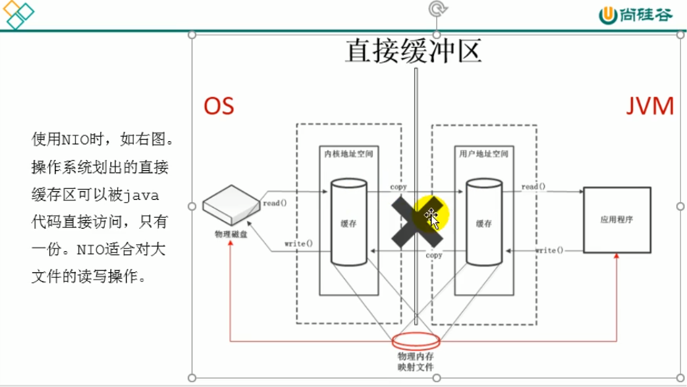

# 直接内存

并非虚拟机运行时数据区的一部分，也不是《JVM规范》中定义的内存区域，直接内存是Java堆外的，直接向系统申请的内存区间。来源于NIO，通过存在堆中的DirectByteBuffer操作Native内存。

通常，访问直接内存的读写速度会优于Java堆，即读写性能高，因此处于性能考虑，读写频繁的场合可能会考虑使用直接内存，Java的NIO库允许Java程序直接使用直接内存，用于数据缓冲区。

直接内存也会出现OOM异常：虽然直接内存大小不直接受限于-Xmx指定的最大堆大小，但是系统内存有效，Java堆和直接内存的总和依然受限于操作系统所能给出的最大内存，所以也会导致OOM异常。

直接内存大小可以通过MaxDirectMemorySize设置，如果不指定，默认大小于堆的最大值-Xmx设置的值一样

缺点：分配回收成本高、不受JVM回收管理。