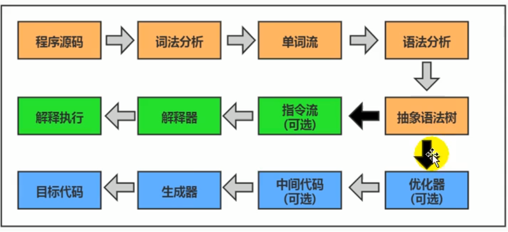
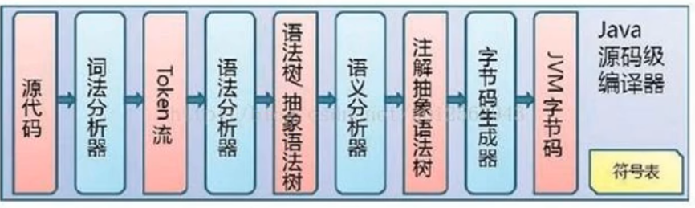
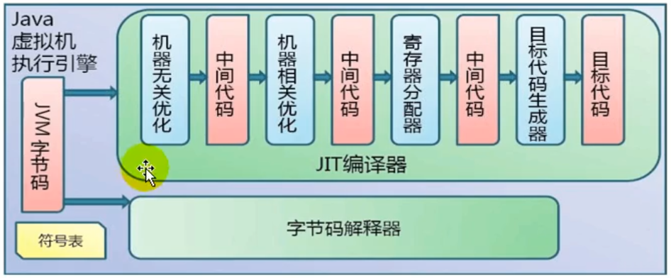
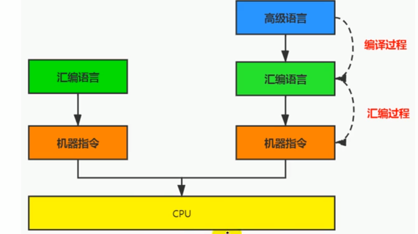
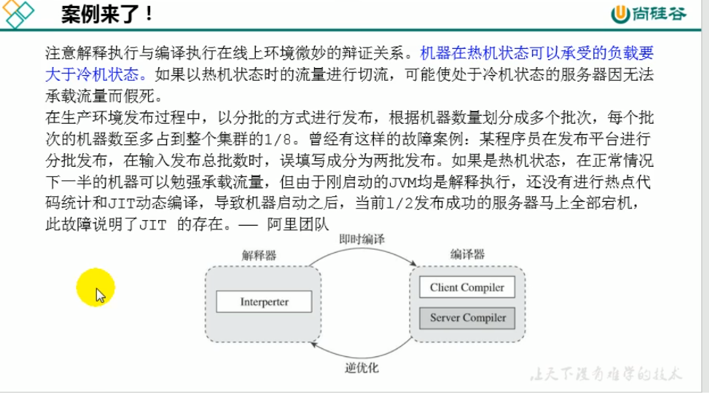
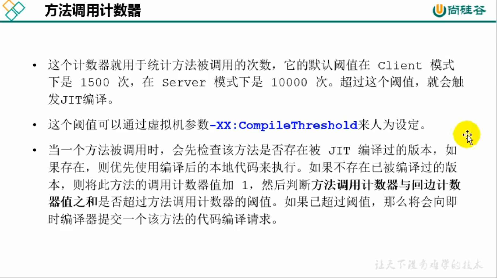
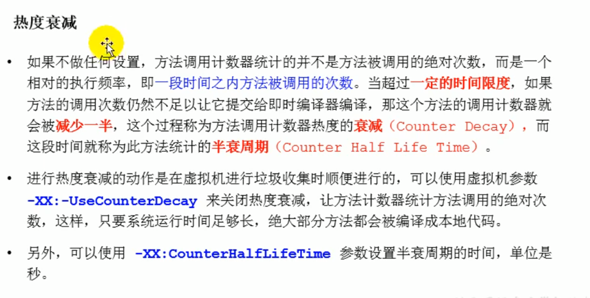
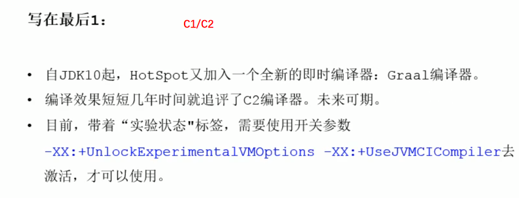
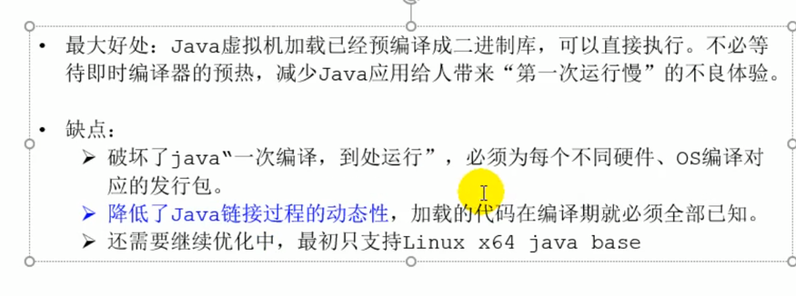

# 执行引擎

源代码经过前边编译生成字节码文件，此时再经过JVM装载到内部后，还需要执行引擎的解释器/JIT即时编译器 将字节码指令转化为机器可以识别的机器指令。

执行引擎在执行过程中究竟需要执行什么样的字节码指令完全依赖于PC寄存器，每执行完一项指令操作后，PC寄存器就会更新下一条需要被执行的指令地址。

### Java代码编译和执行的过程

解释和JIT编译器

解释器：当JVM启动时会根据预定义的规范对字节码采用**逐行解释**的方式执行，将每条字节码文件中的内容“翻译”成对应平台的本地机器指令执行。

JIT（Just In Time）编译器：虚拟机将字节码直接编译成和本地机器平台相关的机器语言

编译型语言和解释型语言

**为什么说Java是半编译半解释型语言？**

JDK 1.0时代，将Java语言定位为解释型语言，后来Java发展出可以直接编译成本地代码的解释器。现在JVM在执行Java代码的时候，通常会将解释执行和编译执行两者结合起来进行。

字节码：中间状态的二进制代码，比机器码更加抽象，需要直译器转译后才能成为机器码

### 解释器

Java语言通过字节码的方式，在一定程度上解决了传统解释型语言执行效率低的问题，同时又保留了解释型语言可移植的特点。所以Java程序运行时比较高效，而且，由于字节码并不专对一种特定的机器，因此，Java程序无须重新编译便可在多种不同的计算机上运行。

模板解释器：将每一条字节码和一个模板函数相关联，模板函数中直接产生这条字节码执行时的机器码，从而很大程度上提高了解释器的性能。

在HotSpot VM中解释器主要由Interpreter模块和Code模块组成：

- Interpreter模块：实现了解释器的核心功能
- Code模块：用于管理HotSpot VM在运行时生成的本地机器指令

### 即时编译器

JVM平台支持即时编译技术来解决解释器效率低下的问题。

即时编译的目的是避免函数被解释执行，而是将整个函数编译成机器码，每次函数执行时，只执行编译后的机器码即可，这种方式可以大幅提升执行效率。

HotSpot 、JRockit（已经被融合到HotSpot）、IBM的J9

**为什么即时编译器提高了执行效率，为什么还保留了解释器“拖累”程序的执行性能？**

HotSpot VM采用解释器于即时编译器并存的架构，JRockit VM内部就不包含解释器，字节码全部都依靠即时编译器编译后执行。在服务端这种启动时间不是重点的场景下，可以考虑采用这种方式。

相对于即时编译器，解释器响应速度块，程序启动，解释器首先发挥作用，而不必等待即时编译器全部编译完成再执行，这样可以省去许多不必要的编译时间，并且随着程序运行时间的推移，即时编译器逐渐发挥作用，根据热点探测功能，将有价值的字节码编译为本地机器指令，以换取更高的程序执行效率。

此外，还可以作为激进优化不成功时的逃生门。

前端编译器

后端运行期编译器（JIT编译器）

静态提前编译器（AOT编译器，Ahead of Time Compiler）

方法调用计数器和回边计数器

Client模式下是1500次，在Server模式下是10000次，方法调用计数器值和回边计数器值的总和超过这个阈值就会触发JIT编译。

-XX:CompileThreshold可以来设置这个阈值

热度衰减

回边计数器

**设置执行引擎的工作模式**

-Xint：完全采用解释器模式执行程序

-Xcomp：完全采用即时编译器模式执行程序，如果JIT编译出问题，则解释器会介入执行

-Xmixed（默认）：采用解释器+即时编译器的混合模式共同执行程序

HotSpot VM中内嵌有两个JIT编译器，分别为Client Compiler和Server Compiler，简称为C1编译器和C2编译器，可以通过如下参数显式指定Java 虚拟机在运行时到底使用哪一种即时编译器：

- -client：指定JVM运行在Client模式下，并使用C1编译器，C1编译器会对字节码进行简单和可靠的优化，耗时短，以达到更快的编译速度
- -server：指定JVM运行在Server模式下，并使用C2编译器，C2进行耗时较长的优化以及激进优化，但优化的代码执行效率更高。

### C1和C2编译器不同的优化策略

C1编译器主要优化策略有：

- 方法内联：将引用的函数代码编译到引用点处，减少栈帧的生成，减少参数传递和跳转过程
- 去虚拟化：对唯一的实现类进行内联
- 冗余消除：在运行期间把一些不会执行的代码折叠掉

C2的优化主要是在全局层面，逃逸分析是优化的基础，基于逃逸分析在C2上有如下几种优化：

- 标量替换
- 栈上分配
- 同步消除

在Java 7版本之后，可以通过显式命令-server默认开启分层编译策略，即程序执行可以触发C1编译，也可以加上性能监控，C2编译会根据性能监控信息进行激进优化。

