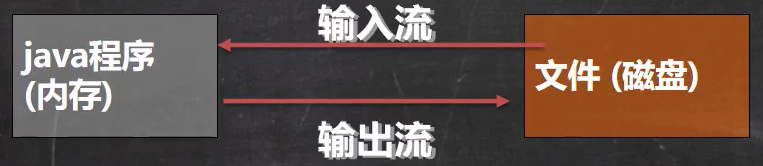
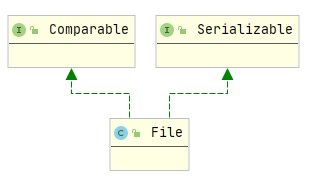
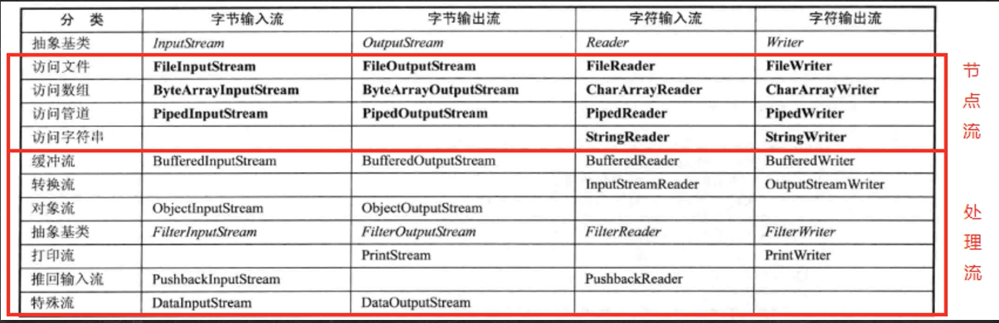
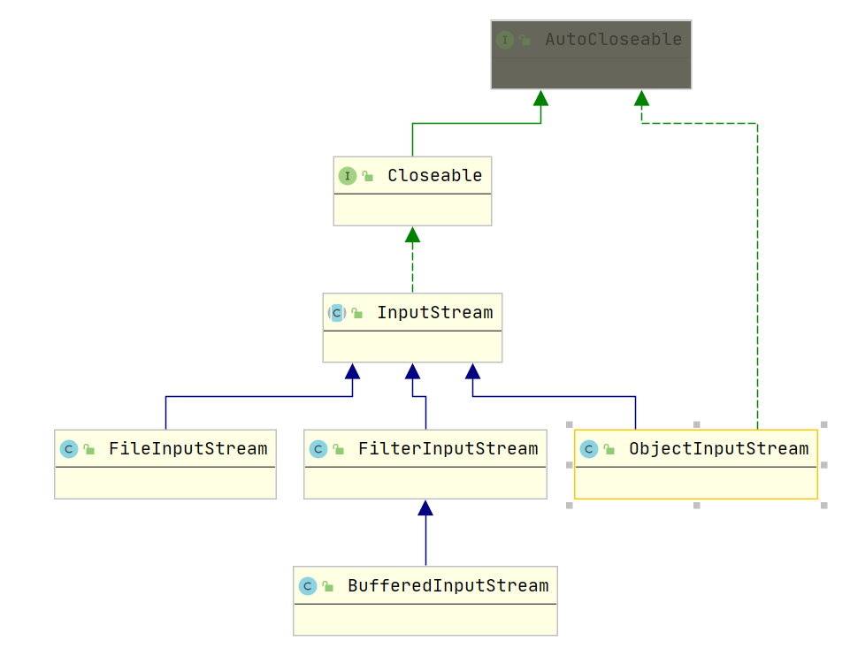

# 1. IO流

IO流

- 文件
- IO流原理及流的分类
- 节点流和处理流
- 输入流
- 输出流
- Properties

## 1.1 文件

### 1）文件流

文件在程序中是以流的形式来操作的，输入输出是相对于Java程序来说的：

- 输入流：文件（磁盘、网络等）到Java程序
- 输出流：Java程序（内存）到文件（磁盘、网络等）



### 2）File类

> **在Java中，File对应了文件和目录**



#### 创建文件

- 创建文件对象相关构造器和方法

  - 通过构造器创建的对象只是在Java程序（内存）中创建了一个File对象
  - 调用该对象的createNewFile()方法才会在物理磁盘上创建文件

  ```java
  new File(String pathname)	//根据路径创建一个File对象
  new File(File parent, String child)	//根据父文件+ 子路径构建
  new File(String parent, String child)	//根据父目录 + 子路径构建
  //使用以上三种构造方法创建文件对象后，还需要对其调用这个方法完成创建
  createNewFile()	
  ```

  ```java
  // 方式1 new File(String pathname)
  public static void create1() {
      String filePath = "D:\\new1.txt";
      File file = new File(filePath);
      try {
          file.createNewFile();
          System.out.println("文件创建成功");
      } catch (IOException e) {
          e.printStackTrace();
      }
  }
  // 方式2 new File(File parent, String child)
  public static void create2() {
      File parentFile = new File("D:\\");
      String fileName = "new2.txt";
      //这一步只是在Java程序（内存）中创建一个了 File对象
      File file = new File(parentFile, fileName);
      try {
          //这一步才在物理磁盘上创建了文件
          file.createNewFile();
          System.out.println("创建成功");
      } catch (IOException e) {
          e.printStackTrace();
      }
  }
  
  // 方式3 new File(String parent, String child)
  public static void create3() {
      String parent = "D:\\";
      String fileName = "new3.txt";
      File file = new File(parent, fileName);
      try {
          file.createNewFile();
          System.out.println("创建成功");
      } catch (IOException e) {
          e.printStackTrace();
      }
  }
  ```

#### 获取文件信息

```java
public void info() {
    //先创建文件对象
    File file = new File("D:\\new1.txt");
    File dict = new File("D:\\");
    //调用相应的方法，得到对应的信息
    System.out.println("文件名字：" + file.getName());
    //获取绝对路径
    System.out.println("绝对路径：" + file.getAbsolutePath());
    //获取文件父目录
    System.out.println("父目录：" + file.getParent());
    //获取文件大小
    System.out.println("文件大小：" + file.length());
    //文件是否存在
    System.out.println("文件是否存在：" + file.exists());
    //文件是否是file
    System.out.println("文件是否存在：" + file.isFile());
    //文件是否是目录
    System.out.println("文件是否是目录：" + file.isDirectory());
}
```

#### 目录的操作和文件删除

##### 创建目录

- 创建一级目录：file.mkdir()

- 创建多级目录：file.mkdirs()

  ```java
  //判断目录d:\\demo02是否存在，如果存在则提示存在，不存在则创建该目录
  @Test
  public void m3() {
      String dire = "d:\\demo02";
      File file = new File(dire);
      if(file.exists())
          System.out.println(dire + "已存在");
      else
          if(file.mkdir())
              System.out.println("该目录创建成功");
      else
          System.out.println("创建失败");
  }
  ```

##### 删除文件和目录

```java
//判断目录d:\\demo01是否存在，如果存在则删除
//在Java中，目录也被当作File来处理
@Test
public void m2() {
    String filePath = "d:\\demo01";
    File file = new File(filePath);
    if(file.exists()) {
        if(file.delete())
            System.out.println("删除成功");
        else
            System.out.println("删除失败");
    } else
        System.out.println("该目录不存在");
}
```

## 1.2 IO流原理及流的分类

### 1）流的分类

Java中的IO流的**输入输出是相对Java程序**而言的：

- 输入流：读取外部数据到Java程序（内存）
- 输出流：将Java程序（内存）数据输出到外部（磁盘、网络等）

JavaIO流共涉及40多个类，都是由**四个抽象类基类**派生出来的。按照操作数据单位不同、数据流的流向不同、流的角色不同，对流进行分类：

- 操作数据单位：**字节流**（8bit，**适合处理二进制文件**）、**字符流**（按字符，**适合处理文本文件**）
  - 字节流：**InputStream、OutputStream**
  - 字符流：**Reader、Writer**
  
- 按数据流方向：输入流、输出流

- 按流的角色不同：**节点流**、**处理流/包装流**

  

  - 节点流：对单个特定的数据源进行读写操纵
  - 处理流：对已存在的流（节点流或处理流）进行封装，为程序提供更强大的读写功能。处理流使用了**修饰者模式**。

#### 节点流和处理流

- 节点流是底层流，直接和数据源相接；

- **处理流**是包装节点流，即可以**消除不同节点流的实现差异**，也可以**提供更加方便的方法来完成输入输出**
- 处理流使用了**修饰器设计模式**，不会直接与数据源相连

处理流的功能：

- 性能的提高：**增加缓冲**的方式来提高输入输出效率
- 操作的便捷：处理流提供了一系列便捷的方法来完成**一次输入输出大批量的数据**

### 2）IO 流 vs File

**File相当于外部数据**，Java程序**通过IO流与File进行数据交换**。

IO流为资源，需要使用完毕在finally代码块中**释放IO流**。

### 3）常用的类

#### I. 字节流 -- InputStream



##### FileInputStream

###### 构造器

- 通过File对象来创建FileInputStream，即从该File对象中向Java程序读取数据；（File对象 --> Java程序）
- 通过路径指定的文件来创建FileInputStream，从该路径指定的文件来向Java程序读取数据；

```java
public FileInputStream(String name) throws FileNotFoundException {
}

public FileInputStream(File file) throws FileNotFoundException {
}

public FileInputStream(FileDescriptor fdObj) {
}
```

###### 常用方法

- read()：每次读取一个字节并返回读取的数据；如果读完了则返回-1
- read(byte[] b)：每次从输入流中最多读取b.length字节的数据到b中，并返回读取的数据的长度；如果读完了，则返回-1

#### II. 字节流 -- 输出流

##### FileOutputStream

###### 构造器

> 如果文件不存在时，会自动创建一个新的文件（**前提是存在目录**）

- 通过File对象来创建FileOutputStream，即从Java程序向对应的文件写入数据；（Java程序 --> File文件）

- 通过File对象来创建FileOutputStream，**并采用在文件末尾追加的方式写入**, 即从Java程序向对应的文件写入数据；（Java程序 --> File文件）

  ```java
  FileOutputStream fileOutputStream = new FileOutputStream(new File(filePath), true);
  ```

- 通过路径指定的文件来创建FileOutputStream，从Java程序向对应的文件写入数据；

  ```java
  FileOutputStream fileOutputStream = new FileOutputStream(filePath);
  ```

- 通过路径指定的文件来创建FileOutputStream，**并采用在文件末尾追加的方式写入**，从Java程序向对应的文件写入数据；

  ```java
  FileOutputStream fileOutputStream = new FileOutputStream(filePath, true);
  ```

###### 常用方法

> 写入时默认会覆盖掉原来的内容
>
> 构造方法传入true时，则会采用末尾追加的方式写入

- write(int b)

- write(byte[] b)

  ```java
  @Test
  public void writeFile() {
      String filePath = "D:\\a.txt";
      FileOutputStream fileOutputStream = null;
      try {
          fileOutputStream = new FileOutputStream(filePath);
          String str = "Hello world";
          fileOutputStream.write(str.getBytes());
      } catch (IOException e) {
          e.printStackTrace();
      } finally {
          try {
              fileOutputStream.close();
          } catch (IOException e) {
              e.printStackTrace();
          }
      }
  }
  ```

- write(byte[] b, int start, int offset)

##### 实例 -- 文件拷贝

拷贝时需要主要要使用**write(bytes, start, offset)**方法将数据写出到外部，其中offset为从外部读取到的数据的长度。

```java
public static void main(String[] args) {
    //将文件从D:\a.txt拷贝到D:\test\a.txt
    /**
         * 1. 获取原来文件的输入流
         * 2. 创建文件输出流
         */
    String originalPath = "D:\\a.txt";
    String copyPath = "D:\\test\\a.txt";
    byte[] bytes = new byte[128];
    FileInputStream fileInputStream = null;
    FileOutputStream fileOutputStream = null;
    try {
        fileInputStream = new FileInputStream(originalPath);
        fileOutputStream = new FileOutputStream(copyPath);
        int readLen = 0;
        while((readLen = fileInputStream.read(bytes)) != -1) {
            fileOutputStream.write(bytes, 0, readLen);
        }
    } catch (IOException e) {
        e.printStackTrace();
    } finally {
        try {
            if(fileInputStream != null)
                fileInputStream.close();
            if(fileOutputStream != null)
                fileOutputStream.close();
        } catch (IOException e) {
            e.printStackTrace();
        }
    }
}
```

#### III. 字符流 -- Reader

> 字符流的相关方法与字节流类似，只是在字符流中，需要用的是**char数组。**
>
> 其**底层其实是对字节流进行封装**

##### FileReader

###### 构造器

- new FileReader(File/String)

###### 常用方法

- read()：返回读取到的字符，返回类型为int；如果没有数据了，则返回-1
- read(char[])：将外部数据读取到char数组中，并返回读取的数据长度；如果没有数据了，则返回-1

##### BufferedReader

> BufferedReader是一个**处理流（包装流）**，用来包装其他节点流，以提供更强大的输入功能。
>
> 关闭处理流时，只需要关闭外层流（即**处理流会调用节点流的close()**）即可。

BufferedReader中成员变量：

- Reader in：用来接收其他**字符节点流**或者处理流
- char cb[]：用来接收输入的数据

```java
private Reader in;
private char cb[];
```

#### IV. 字符流 -- Writer

##### FileWriter

> 使用FileWrite时，每次调用write方法，**必须要调用close()或者flush()来将内容刷新到外部**

###### 构造器

- new FileWriter(File/String)：覆盖模式
- new FileWriter(File/String, boolean )：追加true时，使用追加模式

###### 常用方法

- write(int)：写入单个字符
- write(char[])
- write(char[], start, len)
- write(String)
- write(String, start, len)

```java
@Test
public void write() {
    String filePath = "D:\\write.txt";
    FileWriter fileWriter = null;
    char[] chars = new char[128];
    try {
        fileWriter = new FileWriter(filePath);
        fileWriter.write('a');   //写单个字符
        fileWriter.write(new char[]{'b', 'c','张'}); //写入char数组
        fileWriter.write(new char[]{'b', 'c','张'}, 1, 2);   /
            fileWriter.write("你好");
        fileWriter.write("你好，陌生人！", 2, 5);
    } catch (IOException e) {
        e.printStackTrace();
    } finally {
        try {
            //如果不调用flush()或者writer()，则内容不会刷新到外部
            //fileWriter.flush();
            fileWriter.close();
        } catch (IOException e) {
            e.printStackTrace();
        }
    }
}
```


