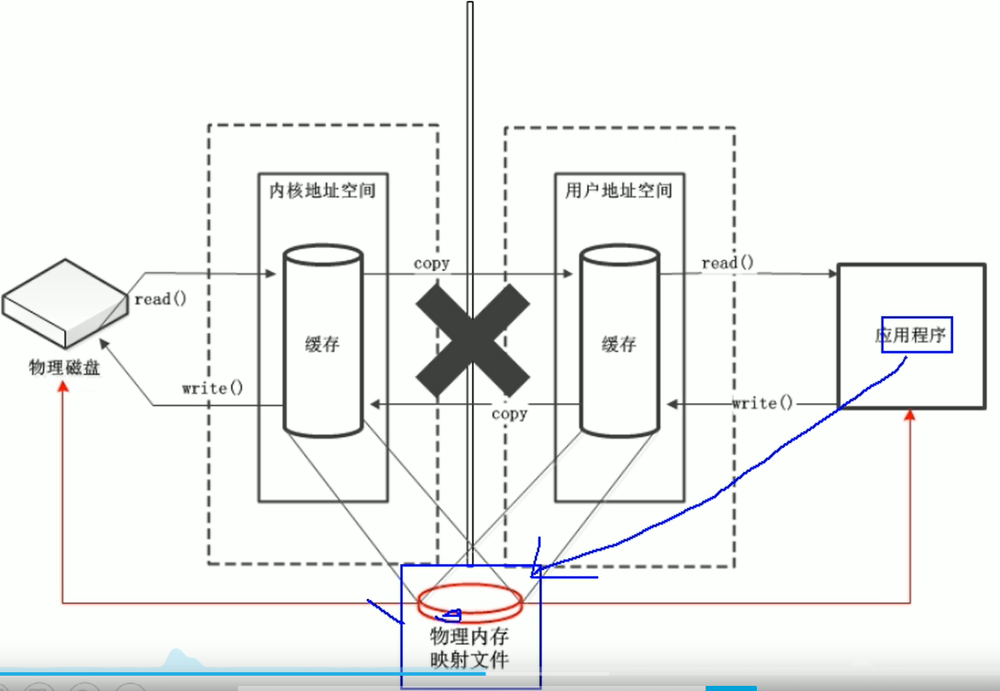
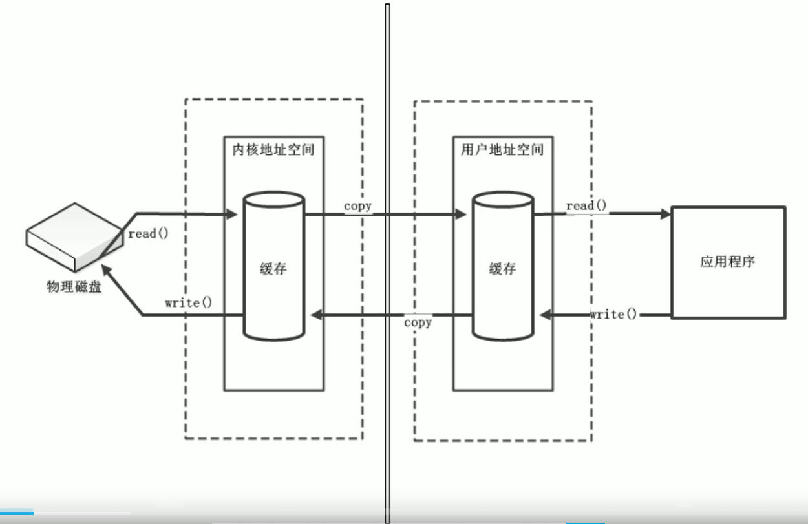

# NIO

- 缓冲区（Buffer）和通道（Channel）
- 文件通道（FileChannel）
- NIO的非阻塞式网络通信
  - **选择器**
  - SocketChannel、ServerSocketChannel、DataGramChannel
- 管道
- Java NIO2（Path、Paths与Files）

## 1. 简介

Java NIO（New IO/Non Blocking IO）是从Java 1.4开始引入的一个新的IO API，与原来IO作用和目的相同（**在程序和外部之间进行数据传输**），但使用方式完全不同。

NIO支持**面向缓冲区**、**基于通道**的IO操作，NIO以更加**高效**的方式进行文件的读写操作。

### 1.1 NIO与IO的区别

传统的IO使用**字节流或者字符流**完成Java和外部之间的数据传输，流是**单向**的，分为输入流和输出流，分别完成不同的数据传输功能。

NIO使用**通道**（**数据存储到缓冲区**）来完成外部和Java程序之间的数据传输，通道是**双向**的。可以完成数据从Java程序到外部的输出，也可以完成数据从外部到Java程序的输入。

- 如何通过buffer来实现双向传输
- 

| IO     | NIO        |
| ------ | ---------- |
| 面向流 | 面向缓冲区 |
| 阻塞IO | 非阻塞IO   |
|        | 选择器     |

Java NIO的核心：**通道（Channel）**和**缓冲区（Buffer）**。通道表示打开到IO设备（如：文件、套接字）的连接，若需要NIO，则需要获取用于连接IO设备的通道以及用于容纳数据的缓冲区。然后**操作缓冲区**，对数据进行处理。

- **获取连接到IO设备的Channel**， 负责数据传输
- **创建容纳数据的Buffer**， 负责存储传输的数据

## 2. 缓冲区（Buffer）

底层是数组，缓冲区要实现双向数据传输，就需要将其划分为不同的状态：读状态、写状态。

在写状态下，需要记录当前缓冲区（数组）中可以写数据的起始位置（position）和终止位置（limit）。

在读状态下，需要记录当前缓冲区（数组）中可以读数据的起始位置（position）和终止位置（limit）。

在写状态下，每向缓冲区中写入一个数据时，需要将position加1，

在读状态下，每读取缓冲区中一个数据时，需要将position加1。

当发生状态切换时，

- 读 --> 写：position = 0, limit = capacity；（clear()）
- 写 --> 读：limit = position, position = 0;（flip()）

此外，还需要对外提供状态转换的函数，最好能提供判断当前是处于什么状态的函数。

### 1）Buffer

#### I. 核心属性

缓冲区中的四个核心属性(Buffer类中)如下：

> 0 <= mark <= position <= limit <= capacity

- **capacity**：容量；缓冲区中最大存储数据的容量，一旦声明，不能改变
- **limit**：界限，缓冲区中**第一个不能进行读写**的元素的数组下标索引（初始化为capacity）
  - 调用flip()时，会将limit置为position
  - 调用clear()时，会将limit置为capacity
- **position**：**下一个要被读写**的元素的数组下标索引，在调用get()、put()方法时，position会自动更新
  - 调用reset()方法时，会将position值设置为之前的mark（如果mark小于0，会抛出InvalidMarkException）
  - 调用flip()、rewind()、clear()时，position会被置为0，filp()每次都将postion置为0，则说明Buffer每次都是从头开始读写的
- **mark**：备忘位置，只有调用mark()方法时，该值才会被设置为当前position的值，等下次调用reset()方法时，会将position值设置为之前的标记值
  - filp()、clear()、rewind()、discardMark()方法都会使mark失效，即将mark值设置为-1

```java
private int mark = -1;
private int position = 0;
private int limit;
private int capacity;
```

```java
// 1. 分配一个指定大小的缓冲区
ByteBuffer buf = ByteBuffer.allocate(10);
System.out.println(buf.position());		//position=0
System.out.println(buf.limit());		//limit=10
System.out.println(buf.capacity());		//capacity=10
```

#### II. 核心方法

##### ① 写状态 --> 读状态

当向buffer中写入数据之后，在下一次读取之前，必须将buffer对象的状态从写转换为读状态。

Buffer类中提供了**flip()**方法来实现Buffer对象的状态由写切换到读：

- 将limit，即第一不能读的元素的位置修改为position
- 将position，即第一个可以读元素的位置修改位0（flip方法()每次读写都是从头开始）
- 丢弃之前的标记，即将mark置为-1

注意：limit - position可以得出当前buffer中，剩余可以读的元素的个数

```java
public final Buffer flip() {
    limit = position;
    position = 0;
    mark = -1;
    return this;
}
```

##### ② 读状态 --> 写状态

在读取完成后，在下一次对缓冲区的写操作之前，需要将缓冲区的模式由读模式切换到写模式。将读模式切换到写模式有两种选择：

1. **从头开始写**，这种方式也会将之前为读完的数据给覆盖
2. 保留未读取的元素（**compact()**）

针对第一种切换方式，Buffer类中提供了**clear()**方法来完成读模式到写模式的切换。

- 将position置为0，即下次从buffer头开始写入
- 将limit置为capacity，即buffer可以写到末尾

注意：limit - position可以得出当前buffer中，剩余可以写的元素的个数

```java
public final Buffer clear() {
    position = 0;
    limit = capacity;
    mark = -1;
    return this;
}
```

##### ② 记录读写位置，之后恢复

Buffer中提供了**mark()**方法，来记录当前读/写的position位置，该方法可以配合**reset()**方法，之后将position重置为之前mark的位置。

```java
public final Buffer mark() {
    mark = position;
    return this;
}
public final Buffer reset() {
    int m = mark;
    if (m < 0)
        throw new InvalidMarkException();
    position = m;
    return this;
}
```

##### ③ 重复读

Buffer中提供了rewind()方法，可以将position重置为0，mark重置为-1，从头开始读。

- 该方法与flip()很像，差别在于，本方法中没有修改limit值

```java
public final Buffer rewind() {
    position = 0;
    mark = -1;
    return this;
}
```

##### ④ 当前缓冲区可操作的数据大小

由①和②可以知道，不管是在写模式，还是在读模式下，**limit - position**的值都表示在当下模式，buffer中还可以（读/写）操作的元素的数量。基于此，Buffer也提供了两个方法，分别用来判断当前缓冲区是否还可以继续读/写以及获取当前缓冲区可以读/写的元素的大小。

```java
public final boolean hasRemaining() {
    return position < limit;
}
public final int remaining() {
return limit - position;
}
```

### 2）基本类型对应的Buffer

根据数据类型不同（boolean除外），Java NIO提供了相应类型的缓冲区：

- **ByteBuffer**
- CharBuffer
- ShortBuffer
- IntBuffer
- LongBuffer
- FloatBuffer
- DoubleBuffer

上述缓冲区的管理方式几乎一致，其中ByteBuffer使用较为广泛。所以，我将以ByteBuffer为例，讲解Buffer的基本使用。

#### I. 创建

> 创建的方法都为静态方法

- allocate(int)

```java
public static ByteBuffer allocate(int capacity) {
    if (capacity < 0)
        throw new IllegalArgumentException();
    return new HeapByteBuffer(capacity, capacity);
}
```

#### II. 写入

##### ① 写入单个元素

- 将b写入到当前position

- 将b写入到index位置

```java
put(byte b)
put(int index, byte b)
```

##### ② 写入byte数组

- 将byte数组元素从position位置写入到buffer中（从byte数组头开始）
- byte数组元素从position位置写入到buffer中（从byte数组的start位置开始）

```java
put(byte[] src)
put(byte[] src, int offset, int length)
```

##### ③ 将某个其他基本类型的数据写入到buffer

> 这些方法为**ByteBuffer特有**，其他基本类型对应的Buffer只有①和②两类put()方法

- 将其他基本类型的元素写入到position位置，如putChar(char ch)
- 将其他基本类型的元素写入到index位置，如putChar(int index, char ch)

#### III. 读取

##### ① 读取单个元素

- 获取当前position的元素

- 通过索引下标来读取对应位置的元素

```java
get()
get(int index)
```

##### ② 将数据读取到数组

- 读取buffer中的数据，从数组的开头开始填入
- 读取buffer中的数据，并从数组的某一位置开始填入

```java
get(byte[] dst)
get(byte[] dst, int offset, int length)
```

##### ③ 读取某个元素并将其作为其他基本类型返回

> 这些方法为**ByteBuffer特有**，其他基本类型对应的Buffer只有①和②两类get()方法

- 获取当前position的元素，并将其作为其他基本类型返回
- 获取index位置的元素，并将其作为其他基本类型返回

```java
getChar()
getChar(int index)
getShort()
getShort(int index)
getInt()
getInt(int index)
getLong()
getLong(int index)
getFloat()
getFloat(int index)
getDouble()
getDouble(int index)
```

### 3）提高读写效率的关键

#### 非直接缓冲区

应用程序与磁盘之间没办法直接传输数据

- 左边为OS，右边为JVM

读取数据：

物理磁盘-->读取到内核地址空间-->copy到用户地址空间（JVM）--> 应用程序

写数据：

应用程序-->写入到用户地址空间（JVM）-->copy到内核地址空间--> 写入到物理磁盘

直接缓冲区是在物理内存中之间创建一个映射文件，Java程序数据读写变成了：

Java程序<-->映射文件<-->物理磁盘

省去了原来非直接缓冲区在内核地址和用户地址空间之间的复制开销

弊端：

- 消耗资源大
- 如果当Java程序写入到映射文件后，由操作系统决定什么时候写到磁盘中
- 可以驻留在常规的垃圾回收堆之外，

解决了在用户地址空间和内核地址空间之间的数据复制时的开销


可以通过isDirect()方法来判断缓冲区是否是直接缓冲区。






allocate()方法分配的缓冲区，是在JVM的内存中

allocateDirect()分配的为直接缓冲区，是在操作系统的物理内存中，可以提高效率。 

## 3. 通道（Channel）

在Java NIO中，Buffer是与Java程序进行数据读写的组件，但是Buffer并不能与外部设备（磁盘、网络等）建立连接。所以，要实现与外部数据交换，Java NIO提供了Channel组件来表示IO源与目标打开的连接，Java程序使用Buffer通过Channel完成与特定IO源的数据交换。

Java程序<-->Buffer<-->Channel<-->外部设备