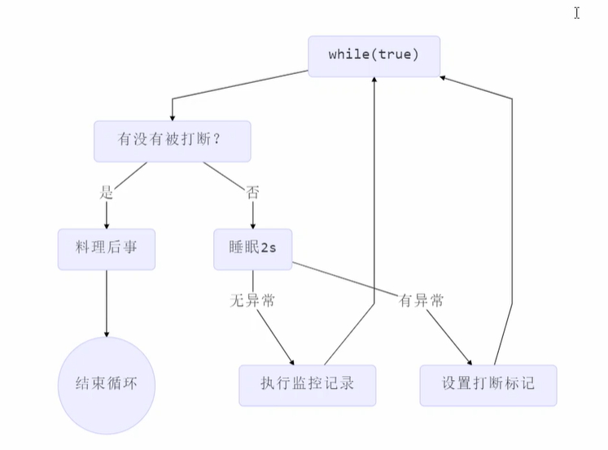

# 2. Java线程

**本章内容：**

- 创建和运行线程
- 查看线程
- 线程API,
- 线程状态
- **应用**
  - 异步调用
  - 提高效率
  - 同步等待
  - 统筹规划
- **原理方面**
  - 线程运行流程
  - Thread两种创建方式的源码
- 模式方面
  - 两阶段终止

## 2.1 创建和运行线程

### 1）直接使用Thread

```java
//创建线程对象,构造方法的参数是给线程指定的名字，推荐给创建的线程指定名字
Thread t = new Thread("t1") {
    @Override
    public void run() {
        //要执行的任务
        System.out.println("new thread");
    }
};
//启动线程
t.start();
```

### 2）使用Runnable配合Thread

把线程和任务（要执行的代码）分开

- Thread代表线程
- Runnable可运行的任务（线程要执行的代码）

```java
Runnable runnable = new Runnable() {
    public void run() {
        //要执行的任务
    }
};
Thread t = new Thread(runnable, "t2");
t.start();
```

### 3）FutureTask配合Thread

FutureTask能够接收Callable类型的参数，用来处理有返回结果的情况。

- Callable继承了Runnable，可以认为是带返回类型的Runnable

```java
@Slf4j(topic = "c.Test2")
public class Test2 {
    public static void main(String[] args) throws ExecutionException, InterruptedException {
        FutureTask<Integer> task = new FutureTask<>(new Callable<Integer>() {
            @Override
            public Integer call() throws Exception {
                log.debug("running");
                Thread.sleep(1000);
                return 100;
            }
        });

        new Thread(task, "t1").start();
        log.debug("{}", task.get());
    }
}
```

### 3）Lambda简化

带有一个抽象方法的接口会被@FunctionalInterface注解，这种接口都可以使用lambda表达式；Runnable接口仅包含一个抽象方法run()，可以使用lambda表达式简化。

```java
Runnable runnable = () -> {System.out.print("lambda");};
```

### 4）原理之Thread和Runnable之间的关系

- 用Runnable更容易与线程池等高级API配合
- 用Runnable让任务脱离了Thread继承体系，更灵活（**组合优于继承**）

## 2.2 观察多个线程交替执行

主要是理解：

- 交替执行
- 谁先谁后，不由我们控制

```java
package cn.itcast.test;

import lombok.extern.slf4j.Slf4j;

@Slf4j(topic = "c.Test3")
public class Test3 {
    public static void main(String[] args) {
        new Thread(() -> {
            while(true) {
                log.debug("running...");
            }
        }, "t1").start();

        new Thread(() -> {
            while(true) {
                log.debug("running...");
            }
        }, "t2").start();
    }
}
```

## 2.3 查看进程线程的方法

### 1）Windows

- 任务管理器
- tasklist | findstr java
- taskkill /F /PID 22860

### 2）Linux

- ps -fe 查看所有进程
- ps -fT -p \<PID>
- kill
- top
- top -H -p \<PID>

### 3）Java

- jps命令查看所有Java进程
- jstack \<PID> 查看某个Java进程（PID）的所有线程状态
- jconsole 查看某个Java进程中线程的运行情况（图形界面）


## 2.4 原理之线程运行

### 1）栈与栈桢

JVM中由堆、栈、方法区所组成，其中**栈为线程独有**，每个**线程启动后，虚拟机就会为其分配一块栈地址。**

- **栈由栈桢组成**，栈桢的压栈和出栈对应着方法的调用和结束；

- 每个线程**只能有一个活动栈桢**，对应当前正在执行的方法。

  

```java
public class TestFrames {
        //主线程中创建一个线程，分别调用其他两个方法
    public static void main(String[] args) {
        Thread t1 = new Thread("t1") {
            @Override
            public void run() {
                method1(1,2);
            }
        };
        t1.start();
        method1(1, 2);
    }
    private static int method1(int a, int b) {
        Object m = method2();
        System.out.println(m);
        return a + b;
    }
    private static Object method2(){
        return new Object();
    }
}
```

### 2）线程上下文切换

cpu不再执行当前线程代码，需要进行线程切换的场景有以下几种：

- 线程的cpu时间片用完
- 垃圾回收
- 更高优先级的线程需要运行
- 线程自己调用了sleep、yield、wait、join、park、synchronized、lock等方法

当发生线程上下文切换时，需要由操作系统保存当前线程的状态，并恢复另一个线程的状态：

- 状态：程序计数器（记住要执行的下一条jvm指令的地址）、虚拟机栈栈桢中的信息，如局部变量表、操作数栈、返回地址等（**保存到哪**）
- 线程上下文切换频繁会影响性能

## 2.5 常见方法

| **方法名**      | static | **功能说明**                      | 注意                                                         |
| :-------------- | ------ | --------------------------------- | ------------------------------------------------------------ |
| start()         |        | 启动线程，将线程状态改为就绪状态  | 对于同一个线程对象，不能多次调该方法，否则会出现IllegalThreadStateException；调用该方法后，并不一定会立即执行该方法 |
| run()           |        | 线程执行时会执行run()方法中的代码 | 默认该方法可以创建Thread的子类对象，来覆盖默认的行为         |
| join()          |        | 等待线程运行结束                  |                                                              |
| join(long n)    |        | 等待线程运行结束，最多等待n毫秒   | 单位是毫秒                                                   |
| getId()         |        | 获取线程的长整型id                | id唯一                                                       |
| getName()       |        | 获取线程名                        |                                                              |
| setName()       |        | 修改线程名                        |                                                              |
| getState()      |        | 获取线程状态                      |                                                              |
| getPriority()   |        | 获取线程优先级                    |                                                              |
| setPriority()   |        | 修改线程优先级                    |                                                              |
| sleep()         | static |                                   |                                                              |
| inInterrupted() |        | 判断线程是否被打断                | 不会清除打断标记                                             |
| interrupted()   | static | 判断当前线程是否被打断            | 返回值之后，会将打断标记重置为false                          |
|                 |        |                                   |                                                              |

### 1）start()与run()

调用一个线程对象的run()方法并不会启动新的线程，只会在当前线程中调用run()方法（在当前线程虚拟机栈中压入一个栈桢），不会起到异步调用的效果；

调用一个线程对象的start()方法，会将该线程对象置为就绪状态，该线程之后被cpu分配时间片的时候便可以运行。该线程运行时，会调用其run()方法，执行run()方法中的代码。

- 运行start()方法会让线程进入就绪状态，并不一定会立即运行改线程

- **一个线程对象只能执行一次start()方法**，若多次调用，会出现IllegalThreadStateException

```java
@Slf4j(topic = "c.Test4")
public class Test4 {

    public static void main(String[] args) {
        Thread t1 = new Thread("t1") {
            @Override
            public void run() {
                log.debug("running...");
                FileReader.read(Constants.MP4_FULL_PATH);
            }
        };
        //t1.start()
        t1.run();
        log.debug("do other things...");
    }
}
```

### 2）yield()与sleep()

#### sleep()

1. 该方法为static方法，可以通过Thread.sleep(millis)调用，会将当前线程从RUNNABLE状态进入TIMED_WAITING状态；

2. 其他线程可以使用interrupt()方法打断正在睡眠的线程，但是cpu的使用权未必立即给到睡眠结束的线程

   ```java
   @Slf4j(topic = "c.Test7")
   public class Test7 {
       static boolean flag = true;
       public static void main(String[] args) throws InterruptedException {
           Thread t1 = new Thread("t1") {
               @Override
               public void run() {
                   log.debug("enter sleep...");
                   try {
                       Thread.sleep(2000);
                   } catch (InterruptedException e) {
                       log.debug("wake up...");
                       e.printStackTrace();
                   }
                   Test7.flag = false;
               }
           };
           t1.start();
   
           Thread.sleep(1000);
           log.debug("interrupt...");
           t1.interrupt();
           if(flag)
               log.debug("唤醒之后cpu的使用权还在main线程");
           else
               log.debug("唤醒之后cpu使用权立马给到被唤醒的线程");
       }
   }
   ```

3. 建议用**TimeUnit的sleep**代替 Thread的sleep来获得更好的可读性

   ```java
   TimeUnit.SECONDS.sleep(1);
   ```

#### yield()

1. 该方法也是**static方法**，需要通过Thread.yield()调用；
2. 调用yield()会**让线程从运行状态进入就绪状态**，然后让cpu从就绪队列中选择一个优先级高的线程（也**有可能调度到刚刚让出cpu的那个线程**）；
3. **具体实现依赖于操作系统的任务调度器**
4. 该方法一般比较少用到（java.util.concurrent.locks包中的锁会用到该方法）

#### 区别：

1. 调用sleep()进入TIMED_WAITING状态的线程，在睡眠结束之前不会被cpu调度
2. 调用yield()进入就绪状态的线程，会被cpu调度

### 3）线程优先级

- 线程优先级**只起到建议作用**，调度器可以忽略
- cpu比较忙，那么优先级高的线程会获得更多的时间片，但是cpu闲时，优先级几乎没有作用

```java
@Slf4j(topic = "c.Test9")
public class Test9 {

    public static void main(String[] args) {
        Runnable task1 = () -> {
            int count = 0;
            for (;;) {
                System.out.println("---->1 " + count++);
            }
        };
        Runnable task2 = () -> {
            int count = 0;
            for (;;) {
                Thread.yield();
                System.out.println("              ---->2 " + count++);
            }
        };
        Thread t1 = new Thread(task1, "t1");
        Thread t2 = new Thread(task2, "t2");
//        t1.setPriority(Thread.MIN_PRIORITY);
//        t2.setPriority(Thread.MAX_PRIORITY);
        t1.start();
        t2.start();
    }
}
```

### 4）join()方法

当需要等待某几件事情完成后才能继续往下执行，比如等待多个线程加载资源再汇总处理，可以使用join()方法。

- 等待调用join()方法的线程执行结束，再执行当前线程（**同步**）
- **join(long millis): 最多等待millis毫秒**

执行下面代码，打印r 的结果为：0

- 因为主线程和t1线程并行执行，t1线程需要1秒之后才能算出r=10
- 而主线程一开始就要打印r的结果，所以只能打印出r=0

```java
@Slf4j(topic = "c.Test10")
public class Test10 {
    static int r = 0;
    public static void main(String[] args) throws InterruptedException {
        test1();
    }
    private static void test1() throws InterruptedException {
        log.debug("开始");
        Thread t1 = new Thread(() -> {
            log.debug("开始");
            sleep(1);
            log.debug("结束");
            r = 10;
        },"t1");
        t1.start();
//        t1.join();
        log.debug("结果为:{}", r);
        log.debug("结束");
    }
}
```

用sleep()可以解决问题嘛？

- 可以，但是不确定t1线程要执行多久，不能在t1线程结束之后就立马执行main线程

### 5）interrupt()

#### ① 打断阻塞状态（调用了sleep、wait、join）的线程

打算sleep的线程，会清空打断状态（isInterrupted()）,将其重置为false，以sleep为例

```java
public static void main(String[] args) throws InterruptedException {
    Thread t1 = new Thread(() -> {
        log.debug("sleep...");
        try {
            Thread.sleep(5000); // wait, join
        } catch (InterruptedException e) {
            e.printStackTrace();
        }
    },"t1");

    t1.start();
    //让主线程睡眠，方便t1执行
    Thread.sleep(1000);
    log.debug("interrupt");
    t1.interrupt();
    //输出false
    log.debug("打断标记:{}", t1.isInterrupted());
}
```

#### ② 打断正常的线程

- 打断正常执行的线程，只会**将打断标记置为true**，**但并不会终止其执行**
- 可以在被打断线程中判断其是否被打断，如果被打断，则终止运行

```java
public static void main(String[] args) throws InterruptedException {
    Thread t1 = new Thread(() -> {
        while(true) {
            boolean interrupted = Thread.currentThread().isInterrupted();
            if(interrupted) {
                log.debug("被打断了, 退出循环");
                break;
            }
        }
    }, "t1");
    t1.start();

    Thread.sleep(1000);
    log.debug("interrupt");
    t1.interrupt();
}
```

### 6）LockSupport.park()

- 线程打断标记为false时，调用LockSupport.park()方法会让该线程阻塞，该线程被interrupt()后，可以继续执行

- 线程打断标记为true时，调用LockSupport.park()方法并不会让线程阻塞

## 2.6 不推荐使用的方法

以下这些方法已过时，**容易破坏同步代码块，造成线程死锁**，不推荐使用。

| 方法名   | static | 功能说明         |
| -------- | ------ | ---------------- |
| stop()   |        | 停止线程运行     |
| suspend  |        | 挂起（暂停）线程 |
| resume() |        | 恢复线程运行     |

## 2.7 主线程与守护线程

默认情况下，Java进程要等待所有线程都执行结束，才会结束。有一种特殊的线程叫做**守护线程**（如垃圾回收器线程），只要其他非守护线程运行结束了，即便守护线程中的代码没有执行完，也会被强制结束。

- 可以通过调用线程的setDaemon(true)将线程设置为守护线程
- isDaemon()可以获取该线程是否是守护线程
- Tomcat中Acceptor和Poller线程也都是守护线程

例如：

```java
@Slf4j(topic = "c.Test15")
public class Test15 {
    public static void main(String[] args) throws InterruptedException {
        Thread t1 = new Thread(() -> {
            while (true) {
                if (Thread.currentThread().isInterrupted()) {
                    break;
                }
            }
            log.debug("结束");
        }, "t1");
        t1.setDaemon(true);
        t1.start();

        Thread.sleep(1000);
        log.debug("结束");
    }
}
```

输出：

```
11:36:44.364 c.Test15 [main] - 结束
```

## 2. 8 线程的状态

### 1）操作系统层面

从操作系统层面，线程的状态被划分为以下五种：

- 初始状态：仅在语言层面创建了线程对象，还未与操作系统线程相关联
- 可运行状态：（就绪状态），线程对象与操作系统线程关联，可由CPU调度
- 运行状态：获取了CPU时间片运行中的状态
- 阻塞状态：如果调用了阻塞API，线程会切换到阻塞状态，之后会由操作系统唤醒
- 终止状态：线程已经执行完毕

### 2）Java API层面


根据Java中Thread.State中的定义，Java线程一共有以下六种状态：

> 操作系统层面，线程的状态是围绕CPU来确定的；而JVM层面，线程的状态的侧重点有所不同，当线程没有获得cpu的时间片，在等待操作系统的其他资源时，其仍未RUNNABLE状态，**Java线程的状态只与自身显示引入的机制有关**，如sleep、waiting、join等。

- NEW
- RUNNABLE
  - 涵盖了操作系统中的运行、可运行以及阻塞状态（时间片只有10-20ms，Java服务于监控，在监控中看到ready，但其实际可能是running）
  - 处于RUNNABLE状态的线程，**如果是被一些资源阻塞，比如IO阻塞，网络阻塞，其会放弃时间片，等待阻塞完成，但其仍处于RUNNABLE状态**
- WAITING
- BLOCKED
- TIMED_WAITING
- TERMINATED

```java
@Slf4j(topic = "c.TestState")
public class TestState {
    public static void main(String[] args) throws IOException {
        Thread t1 = new Thread("t1") {
            @Override
            public void run() {
                log.debug("running...");
            }
        };

        Thread t2 = new Thread("t2") {
            @Override
            public void run() {
                while(true) { // runnable

                }
            }
        };
        t2.start();

        Thread t3 = new Thread("t3") {
            @Override
            public void run() {
                log.debug("running...");
            }
        };
        t3.start();

        Thread t4 = new Thread("t4") {
            @Override
            public void run() {
                synchronized (TestState.class) {
                    try {
                        Thread.sleep(1000000); // timed_waiting
                    } catch (InterruptedException e) {
                        e.printStackTrace();
                    }
                }
            }
        };
        t4.start();

        Thread t5 = new Thread("t5") {
            @Override
            public void run() {
                try {
                    t2.join(); // waiting
                } catch (InterruptedException e) {
                    e.printStackTrace();
                }
            }
        };
        t5.start();

        Thread t6 = new Thread("t6") {
            @Override
            public void run() {
                synchronized (TestState.class) { // blocked
                    try {
                        Thread.sleep(1000000);
                    } catch (InterruptedException e) {
                        e.printStackTrace();
                    }
                }
            }
        };
        t6.start();

        try {
            Thread.sleep(500);
        } catch (InterruptedException e) {
            e.printStackTrace();
        }
        log.debug("t1 state {}", t1.getState());
        log.debug("t2 state {}", t2.getState());
        log.debug("t3 state {}", t3.getState());
        log.debug("t4 state {}", t4.getState());
        log.debug("t5 state {}", t5.getState());
        log.debug("t6 state {}", t6.getState());
        System.in.read();
    }
}
```

运行结果如下：

```
11:53:07.638 c.TestState [t3] - running...
11:53:08.145 c.TestState [main] - t1 state NEW
11:53:08.149 c.TestState [main] - t2 state RUNNABLE
11:53:08.150 c.TestState [main] - t3 state TERMINATED
11:53:08.150 c.TestState [main] - t4 state TIMED_WAITING
11:53:08.150 c.TestState [main] - t5 state WAITING
11:53:08.150 c.TestState [main] - t6 state BLOCKED
```

## 2.9 习题


## 应用

#### 防止CPU占用100%

##### sleep实现

- 观察调用sleep(1)前后，该java程序对cpu的占用情况
- 可以用wait()或条件变量达到类似的效果，但是这两种都需要加锁，并需要相应的唤醒操作，一般适用于要进行同步的场景
- sleep适用于无需锁同步的场景

```java
public class TestCpu {
    public static void main(String[] args) {
        new Thread(() -> {
            while(true) {
                /*try {
                    Thread.sleep(1);
                } catch (InterruptedException e) {
                    e.printStackTrace();
                }*/
            }
        }).start();
    }
}
```

#### 同步

```java
private static void test2() throws InterruptedException {
    Thread t1 = new Thread(() -> {
        sleep(1);
        r1 = 10;
    });
    Thread t2 = new Thread(() -> {
        sleep(2);
        r2 = 20;
    });
    t1.start();
    t2.start();
    long start = System.currentTimeMillis();
    log.debug("join begin");
    t2.join();
    log.debug("t2 join end");
    t1.join();
    log.debug("t1 join end");
    long end = System.currentTimeMillis();
    log.debug("r1: {} r2: {} cost: {}", r1, r2, end - start);
}
```

#### 两阶段终止模式

如何在一个线程T1中优雅地终止线程T2？（即让T2线程处理一些后续事件后，T2线程自动终止）

应用场景

监控



##### 错误思路

- 使用线程对象的stop()方法停止线程
  - **stop()（已被废弃）**方法会杀死线程，但是如果线程被杀死时，其还锁住了共享资源，那么其他线程将永远无法获取该资源
- 使用System.exit(int)方法停止线程
  - 会导致整个程序停止

##### interrupt()实现

```java
@Slf4j(topic = "c.TwoPhaseTermination")
public class Test13 {
    public static void main(String[] args) throws InterruptedException {
        TwoPhaseTermination tpt = new TwoPhaseTermination();
        tpt.start();

        Thread.sleep(3500);
        
        log.debug("停止监控");
        tpt.stop();
    }
}

@Slf4j(topic = "c.TwoPhaseTermination")
class TwoPhaseTermination {
    // 监控线程
    private Thread monitorThread;

    // 启动监控线程
    public void start() {
        monitorThread = new Thread(() -> {
            while (true) {
                Thread current = Thread.currentThread();
                // 是否被打断
                if (current.isInterrupted()) {
                    log.debug("料理后事");
                    break;
                }
                try {
                    Thread.sleep(1000);
                    log.debug("执行监控记录");
                } catch (InterruptedException e) {
                    //如果执行到Thread.sleep(1000)处被打断，则打断标记仍会为flase，需要再次执行interrupt()将打断标记置为true
                    current.interrupt();
                }
            }
        }, "monitor");
        monitorThread.start();
    }

    // 停止监控线程
    public void stop() {
        //stop = true;
        monitorThread.interrupt();
    }
}
```

#### 烧开水问题

##### 问题描述


##### 解法1：join()

```java
public class Test16 {

    public static void main(String[] args) {
        Thread t1 = new Thread(new Runnable() {
            @Override
            public void run() {
                log.debug("洗水壶");
                sleep(1);
                log.debug("烧开水");
                sleep(15);
            }
        }, "老张");
        Thread t2 = new Thread(new Runnable() {
            @Override
            public void run() {
                log.debug("洗茶壶");
                sleep(1);
                log.debug("洗茶杯");
                sleep(2);
                log.debug("拿茶叶");
                sleep(1);
                try {
                    t1.join();
                } catch (InterruptedException e) {
                    e.printStackTrace();
                }
                log.debug("泡茶");
            }
        }, "小王");
        t1.start();
        t2.start();
    }
}
```

该解法的缺陷：

1. 上边的两个线程其实是各执行各的，如果要模拟老王把水壶交给小王泡茶，或模拟小王把茶叶交给老王泡茶该如何模拟
2. 上边模拟的是小张等老张烧好开水，小张泡茶，如果要实现老张等小张拿完茶叶该怎么办？代码怎么样可以适用于两种情况？