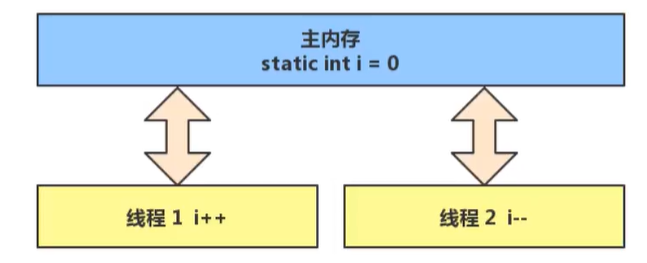
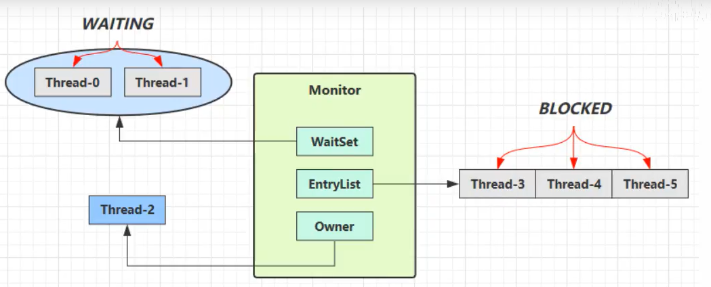
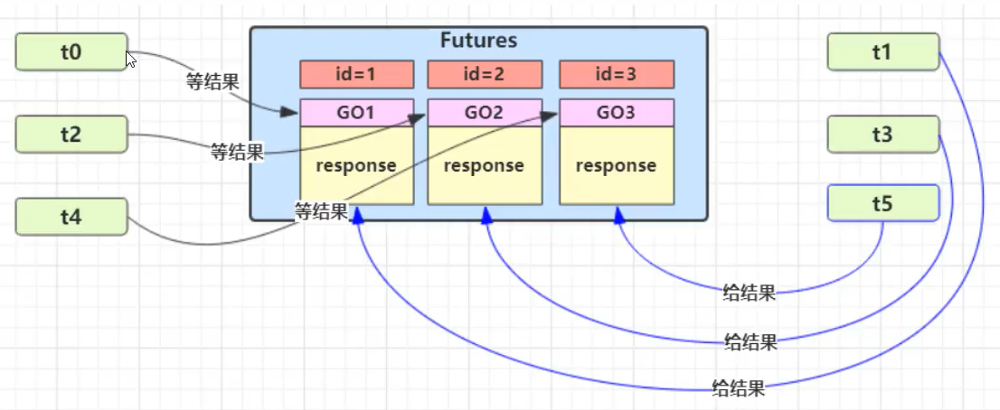
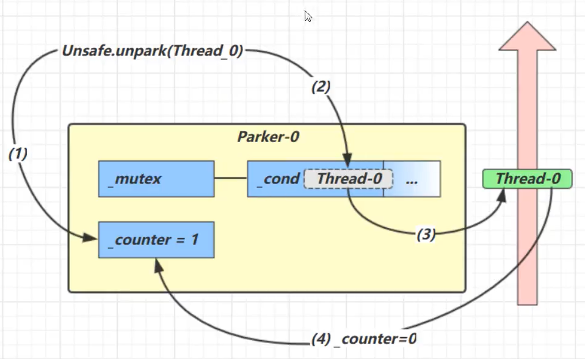
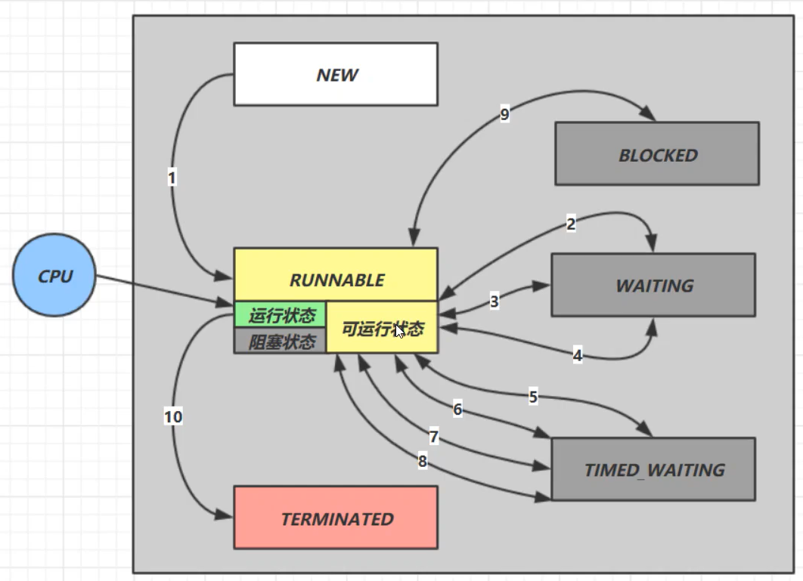
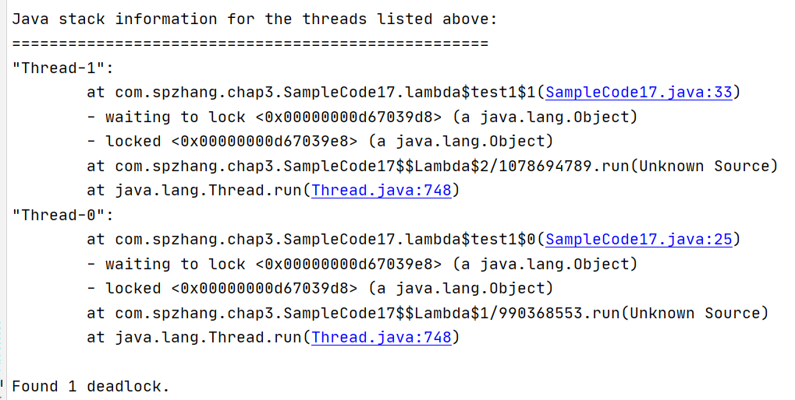

# 3. 共享模型之管程

[TOC]

并发之共享模型

- 管程-悲观锁
- JMM
- 无锁-乐观锁（非阻塞）
- 不可变
- 并发工具
- 异步编程

并发之非共享模型

**本章内容**

- 共享问题
- synchronized
- 线程安全性分析
- Monitor
- wait/notify
- 线程状态转换
- 活跃性
- Lock

## 3.1 共享问题

分时系统中多线程访问共享资源，可能存在某个线程状态切换的时候，共享资源

### Java体现

两个线程对初始值为0的静态变量一个做自增，一个做自减，各做1000次，结果是0吗？

```java
public class SampleCode1 {
    static int count = 0;
    public static void main(String[] args) {
        Thread t1 = new Thread(new Runnable() {
            @Override
            public void run() {
                for (int i = 0; i < 5000; i++) {
                    count++;
                }
            }
        }, "t1");
        Thread t2 = new Thread(new Runnable() {
            @Override
            public void run() {
                for (int i = 0; i < 5000; i++) {
                    count--;
                }
            }
        }, "t2");
        t1.start();
        t2.start();
        t1.yield();
        t2.yield();
        System.out.println(count);
    }
}
```

### 问题分析

**自增、自减并不是原子操作**；例如，对于i++而言，实际会产生的JVM字节码指令为：

```
getstatic	i	//获取静态变量i的值
iconst_1	//准备常量1
iadd	//自增
putstatic	i	//将修改后的值存入静态变量i
```

对应i--也是类似：

```
getstatic	i	//获取静态变量i的值
iconst_1	//准备常量
isub	//自减
putstatic	i	//将修改后的值存入静态变量i
```

而Java的内存模型如下，完成静态变量的自增、自减需要在主存和工作内存中进行数据交换：



所以，对于线程1、2交替执行的情况，其可能进行了脏读，即读取到了未写回的数据，从而导致最终计算结果出错。

### 临界区Critical Section

- 一个程序运行多个线程本身是没有问题的

- 问题出在多线程访问共享资源

  - 多线程对共享资源**读写操作时发生指令交错**，就会出现问题

- 一段代码块内如果**存在对共享资源的多线程读写操作**，这段代码块为**临界区**。

  ```java
  static int counter = 0;
  static void increment() 
  //临界区
  {
      counter++;
  }
  static void increment()
  //临界区
  {
      counter--;
  }
  ```

  

### 竞态条件Race Condition

**多个线程**在**临界区**内执行，由于**代码的执行序列不同**而导致**结果无法预测**，称之为**竞态条件**。

## 3.2 synchronized解决方案

为了避免临界区的竞态条件发生，有以下几种方式可以达到目的：

- 阻塞式的解决方案：**synchronized**、Lock
- 非阻塞式的解决方案(**适用于多核CPU**)：原子变量

synchronized，又称**对象锁**，采用**互斥**的方式让同一时刻至多只有一个线程能持有对象锁，**想获取这个对象锁的其他线程就会阻塞住**。这样就能保证拥有锁的线程可以安全的执行临界区内的代码，不用担心线程上下文切换。

> **注意**
>
> Java中互斥和同步都可以通过synchronized来实现，但它们之间有所不同：
>
> 1. 互斥是保证临界区的竞态条件不会发生，同一时刻只有一个线程执行临界区代码；
> 2. 同步是线程的执行先后、顺序不同，需要一个线程等待其他线程运行到某个点

### 1）基本用法

```java
synchronized(对象) {	//线程1先只有锁，线程2要获取锁就会被阻塞
    临界区
}

//修饰实例方法
synchronized void increment() {
    
}
//上述方法其实就是锁实例对象
void increment() {
    synchronized(this) {
        
    }
}

//修饰静态方法
synchronized static void increment() {
    
}
//其实是锁类对象
static void increment() {
    synchronized(ClassName.class) {
        
    }
}
```

线程要执行synchronized代码块时，要先获取对象锁，只有成功地获取到了对象锁，该线程才能执行synchronized代码块中的代码；否则，该线程会被阻塞。

- synchronized其实是**利用了对象锁来保证临界区代码的原子性**。

- 如果线程在执行synchronized代码块中代码时，时间片用完了，则此时仍保留对象锁，等待下次调用，**只有执行完synchronized代码块中代码时，才会释放对象锁**；
- **只有当对象锁被持有它的线程释放，其他线程才有机会获取到该对象锁**；
- 当线程释放对象锁时会唤醒被该对象锁阻塞的其他线程（**唤醒只是将其状态切换到RUNNABLE，并不一定会立即执行**）

### 2）变量的线程安全分析

成员变量和静态变量是否线程安全？

- 被共享并且有读写操作，则这段代码是临界区，需要考虑线程安全

  ```java
  class ThreadUnsafe {
      //定义一个list
      //成员变量
      List<Integer> list = new LinkedList<>();
      public void method1(int loopNumber) {
          for (int i = 0; i < loopNumber; i++) {
              method2();
              method3();
          }
      }
      private void method2() {
          list.add(1);
      }
      private void method3() {
          list.remove(0);
      }
  }
  ```

局部变量是否线程安全？

局部变量是线程安全的，但是局部变量引用的对象则未必

- 如果局部变量引用的对象逃离方法的作用范围，则需要考虑线程安全

  ```java
  class ThreadSafe {
      //定义一个list
      public void method1(int loopNumber) {
          List<Integer> list = new LinkedList<>();
          for (int i = 0; i < loopNumber; i++) {
              method2(list);
              //因为子类重写了method3，并且创建了线程，所以list可能会逃出method1
              method3(list);
          }
      }
      private void method2(List<Integer> list) {
          list.add(1);
      }
      //设置为public才会能被子类重写，
      public void method3(List<Integer> list) {
          list.remove(0);
      }
  }
  
  class ThreadSafeSubclass extends ThreadSafe {
      
      @Override
      public void method3(List<Integer> list) {
          new Thread(() -> {
              list.remove(0);
          }).start();
      }
  }
  ```

  - 从上边的例字可以看出，**private或final提供安全**的意义所在（**开闭原则中的闭**）。
  - **如String设置成final，避免了子类继承String从而导致String对象通过子类覆盖方法中的new Thread逃逸，破坏String的线程安全性。**

#### 实例分析

例1：

```java
public class MyServlet extends HttpServlet {
	//不是线程安全的
	Map<String, Object> map = new HashMap();
	//线程安全
	String s1 = "...";
	//不是线程安全的
	Date d1 = new Date();
	//不是线程安全的
	final Date d2 = new Date();
	//不是线程安全的
	private UserService userService =  new UserServiceImpl();
	...
	public class UserServiceImpl implements UserService {
		//不是线程安全的
		private count = 0;
	}
}
```

例2：

```java
@Aspect
@Component
public class MyAspect {
    //MyAspect为单例，其成员变量不是线程安全的
    private long start = 0L;
}
```

## 3.3 常见的线程安全类

- String
- Integer（所有的包装类）
- StringBuffer
- Random
- Vector（线程安全的list实现）
- Hashtable（通过添加synchronized）
- java.util.concurrent包下的类

这里的线程安全是指，多个线程**调用他们同一个实例的某个方法**时，是**线程安全**的。

```java
Hashtable table = new Hashtable();

new Thread(() -> {
    table.put("key", "value1");
}).start();
new Thread(() -> {
    table.put("key", "value2");
}) .start();
```

### **线程安全类方法的组合**

**分析下面的方法是否线程安全？**

```java
Hashtable table = new Hashtable();
if(table.get("key") == null) {	//线程1执行完判断条件后会释放对象锁，此时其他线程就有机会获取对象锁，从而导致两个线程都执行if代码块中的代码
	table.put("key", value);
}
```

### 不可变类线程安全性

String、Integer（包装类）都是不可变类，其内部状态不可改变，所以他们的方法都是线程安全的。

String类中的replace、substring等方法并不会改变String对象的值，都是创建了新的字符串来返回。

```java
public class Immutable {
    private int value = 0;
    public Immutable(int value) {	this.value = value;}
    public　int getValue() {	return value;}
}
```

## 3.4 Monitor对象头

### 1）Java对象头

HotSpot虚拟机中，对象在内存中存储的布局可以分为三块区域：对象头（Header）、实例数据（Instance Data）和对齐填充（Padding）。 

#### 32位虚拟机

**普通对象**

- Object Header(64位/8字节)
  - MarkWord(32位/4字节)
  - KlassWord(32位/4字节)

**数组对象**

- Object Header(96位/12字节)
  - MarkWord(32位/4字节)
  - KlassWord(32位/4字节)
  - array length(32位/4字节)

**MarkWord结构**

#### 64位虚拟机

**普通对象**

- Object Header()
  - MarkWord(64位/8字节)
  - KlassWord(32位/4字节，未开启压缩：64位/8字节)

**数组对象**

- Object Header(192位/24字节)
  - MarkWord(64位/8字节)
  - KlassWord(32/4字节)
  - array length(64位/8字节)

**MarkWord结构**

#### MarkWord

Mark Word主要用来**存储对象运行时存储的数据**，如哈希码、GC分代年龄、线程持有的锁、偏向线程ID（偏向锁，对象有哈希码时，就会关闭）、线程持有的锁等等。

- 为了能够存储对象运行时数据（较多），Mark Word被设计成了一个**非固定的数据结构（根据对象状态会复用某些位）**以便来存储尽可能多的信息。在32位虚拟机和64位虚拟机下，Mark Word存储内容分别为：

  

  ​															32位虚拟机Mark Word结构

  ​			

  ​														64位虚拟机Mark Word结构

根据Mark Word的结构，我们可以看到，一个对象一共存在**5种状态**。Mark Word主要通过最后2位（偏向锁状态借助了倒数第三位）来标识其所处的状态：

- **正常**：最后三位为**001**，
- **偏向锁**：最后三位为**101**，除此之外23/54位指向偏向的线程ID
- **轻量级锁**：最后两位为**00**，剩余30/62位指向用于该锁的线程**栈中**的**锁记录地址（LockRecord）**
- **重量级锁**：最后两位为**10**，剩下30/62位为关联的**Monitor对象地址**
- **GC**：最后两位为**11**

> **注**：可以借助**jol-core**来获取对象的对象头进行分析
>
> ```xml
> <dependency>
>     <groupId>org.openjdk.jol</groupId>
>     <artifactId>jol-core</artifactId>
>     <version>0.10</version>
> </dependency>
> ```

### 2）Monitor（锁）

> C语言实现

Monitor被翻译为**监视器**或**管程**。在JVM中，ObjectMonitor是操作系统管程的实现，主要数据结构有：

- _count：基于owner线程获取锁的次数
- _owner：指向持有ObjectMonitor对象的线程
- _WaitSet：存放处于wait状态的线程队列
- _EntryList：存放处于等待锁block状态的线程队列

- _recursions：锁重入的次数

每个Java对象都可以关联一个Monitor对象，如果使用synchronized给对象上锁（**重量级**）之后，该对象头中的MarkWord中就被设置为指向Monitor对象的指针。



1. Thread-2线程要执行synchronized代码块时，先查看obj的Mark Word中有没有指向一个Monitor锁
   - 如果没有，则将obj的MarkWord中30位拿来指向一个Monitor锁（此时owner为null，这一步同时会**将objMark Word中的hashcode、分代年龄等信息添加到Monitor锁对象中**,待没有线程获取持有锁时，再将其还原），并将Monitor锁中的Owner设置为Thread-2
   - 如果有，则将Thread-2添加进入Monitor中的EntryList（等待队列），并且将Thread-2线程状态切换为BLOCKED状态
2. 当Thread-2执行完synchronized代码块时，会释放对象锁，然后唤醒EntryList中等待的线程来竞争锁（**非公平的，即不是先到先竞争到**）
3. WaitSet中的Thread-0，Thread-1是之前获得过的锁，但条件不满足进入WAITING状态的线程

> **注意**
>
> - synchronized必须是进入同一个对象的monitor才有上述的效果
> - 不加synchronized的对象不会管理监视器，不遵从上述规则

### 3）synchronized原理

> **用于锁的对象一般设置为final，确保其不会指向其他的对象**

#### 字节码

- **monitorenter**：进入synchronized代码块时会执行monitorenter指令，将lock对象MarkWord置为Monitro锁对象的指针

- **monitorexit**：离开synchronized代码块时，会执行monitorexit指令，将lock对象的Mark Word重置，唤醒EntryList中的线程

即便**运行synchronized代码块时抛出异常，也能正确的释放锁**。

- 字节码中会自动添加一段字节码指令，当出现异常，会再次执行monitorexit指令（通过异常表配合），尝试将lock对象的Mark Word重置，唤醒EntryList中的线程

```java
public class SampleCode5 {
    private static Object lock = new Object();
    static int counter = 0;

    public static void main(String[] args) {
        synchronized (lock) {
            counter++;
        }
    }
}
```

```java
 0 getstatic #2 <com/spzhang/chap3/SampleCode5.lock>
 3 dup
 4 astore_1
 5 monitorenter
 6 getstatic #3 <com/spzhang/chap3/SampleCode5.counter>
 9 iconst_1
10 iadd
11 putstatic #3 <com/spzhang/chap3/SampleCode5.counter>
14 aload_1
15 monitorexit
16 goto 24 (+8)
19 astore_2
20 aload_1
21 monitorexit
22 aload_2
23 athrow	
24 return
//异常表
Nr.	起始PC 结束PC 捕获类型	   跳转
0	6	   16	cp_info any   19
1	19	   22	cp_info any   19
```

#### 优化

##### 故事

故事角色

- 老王 \- JVM

- 小南 \- 线程

- 小女 \- 线程

- 房间 \- 对象

- 房间门上 \- 防盗锁 \- Monitor

- 房间门上 \- 小南书包 \- 轻量级锁房间门上 \- 刻上小南大名 \- 偏向锁

- 批量重刻名 \- 一个类的偏向锁撤销到达 20 阈值

- 不能刻名字 \- 批量撤销该类对象的偏向锁，设置该类不可偏向

小南要使用房间保证计算不被其它人干扰（原子性），最初，他用的是防盗锁，当上下文切换时，锁住门。这样，即使他离开了，别人也进不了门，他的工作就是安全的。

但是，很多情况下没人跟他来竞争房间的使用权。小女是要用房间，但使用的时间上是错开的，小南白天用，小女晚上用。每次上锁太麻烦了，有没有更简单的办法呢？

小南和小女商量了一下，约定不锁门了，而是谁用房间，谁把自己的书包挂在门口，但他们的书包样式都一

样，因此每次进门前得翻翻书包，看课本是谁的，如果是自己的，那么就可以进门，这样省的上锁解锁了。万一书包不是自己的，那么就在门外等，并通知对方下次用锁门的方式。

后来，小女回老家了，很长一段时间都不会用这个房间。小南每次还是挂书包，翻书包，虽然比锁门省事了，但仍然觉得麻烦。于是，小南干脆在门上刻上了自己的名字：【小南专属房间，其它人勿用】，下次来用房间时，只要名字还在，那么说明没人打扰，还是可以安全地使用房间。如果这期间有其它人要用这个房间，那么由使用者将小南刻的名字擦掉，升级为挂书包的方式。

同学们都放假回老家了，小南就膨胀了，在 20 个房间刻上了自己的名字，想进哪个进哪个。后来他自己放假回老家了，这时小女回来了（她也要用这些房间），结果就是得一个个地擦掉小南刻的名字，升级为挂书包的方式。老王觉得这成本有点高，提出了一种批量重刻名的方法，他让小女不用挂书包了，可以直接在门上刻上自己的名字

后来，刻名的现象越来越频繁，老王受不了了：算了，这些房间都不能刻名了，只能挂书包

- 当没有很多其他线程参与共享资源的竞争时，每次执行synchronized代码的获取锁及释放锁的操作带来的开销太大。

- 如果参与竞争的线程数较少，可以在每次要执行synchronized代码块的时候，可以考虑设置一个标识（在MarkWord设置）

##### 轻量级锁

请用场景：如果一个对象虽然有多线程访问，但多线程访问的时间是错开的（没有竞争），那么可以使用轻量级锁优化。

- 轻量级锁对使用者是透明的，即语法仍然是synchronized

> https://blog.csdn.net/qq_28051453/article/details/105449964

批量重偏向和批量撤销是针对类的优化，和对象无关。

> https://blog.csdn.net/weixin_39962341/article/details/111047559

类中记录重偏向：

- 当达到批量重偏向阈值（默认20）时，之后进行批量重偏向（重偏向一次，类中记录重偏向的次数+1）
- 当达到批量撤销的阈值（默认40）时，之后进行批量撤销

偏向锁重偏向一次之后不可再次重偏向。

当某个类已经触发批量撤销机制后，JVM会默认当前类产生了严重的问题，剥夺了该类的新实例对象使用偏向锁的权利

当一个锁对象类的撤销次数达到20次时，虚拟机会认为这个锁不适合再偏向于原线程，于是会在偏向锁撤销达到20次时让这一类锁尝试偏向于其他线程。

当一个锁对象类的撤销次数达到40次时，虚拟机会认为这个锁根本就不适合作为偏向锁使用，因此会将类的偏向标记关闭，之后现存对象加锁时会升级为轻量级锁，锁定中的偏向锁对象会被撤销，新创建的对象默认为无锁状态。

## 3.5 wait notify

> wait/notify是Object中的方法。

### 1）原理

**为什么需要wait和notify方法？**

当进入synchronized代码块的线程，因为**等待其他资源而不能继续执行时**，其一直占有对象锁，导致**其他等待该对象锁线程一直等待**。

​	

- owner线程发现自己需要**等待其他资源**时，调用**wait**方法，即可**释放锁对象**（此时**会唤醒EntryList中的线程**），**进入WaitSet列表**，变为WAITING状态
- BLOCKED和WAITING状态的线程都处于阻塞状态，**不占用CPU**
- WaitSet中的线程会在**owner线程**调用**notify**或者**notifyAll**时唤醒（**进入EntryList中重新竞争**）

### 2）API介绍

- obj.wait()将当前拥有object对象锁的线程**释放对象锁并进入WaitSet**
- obj.wait(long timeout)有时限的等待，wait方法是无时限等待（其实内部调用了wait(0)）
- obj.wait(long timeout, int nanos)内部实现是判断只要有nanos大于0，就让timeout+1，不能精确到纳秒，timeout是毫秒
- obj.notify()从object的WaitSet中挑一个线程唤醒（**java 1.8唤醒改为公平的，按先进先出唤醒**）
- obj.notifyAll()让object上WaitSet中的线程全部唤醒（即进入EntryList）

wait/notify都是Object对象的方法，是线程协作的一种手段。**必须获得对象的锁，才能调用wait/notify方法**；否则，程序会**报IllegalMonitorStateException异常**：

```
Exception in thread "main" java.lang.IllegalMonitorStateException
	at java.lang.Object.wait(Native Method)
	at java.lang.Object.wait(Object.java:502)
	at com.spzhang.chap3.SampleCode8.main(SampleCode8.java:10)
```

```java
public class SampleCode8 {
    static final Object lock = new Object();
    synchronized int add(int a, int b) throws InterruptedException {
        //调用实例对象的wait
        this.wait();
        return a + b;
    }
    synchronized static int sum(int a, int b) {
        try {
            //调用类对象的wait
            SampleCode8.class.wait();
        } catch (InterruptedException e) {
            e.printStackTrace();
        }
        return a + b;
    }
    
    public static void main(String[] args) {
        synchronized (lock) {
            try {
                lock.wait();
            } catch (InterruptedException e) {
                e.printStackTrace();
            }
        }
//        会报IllegalMonitorStateException
//        try {
//            lock.wait();
//        } catch (InterruptedException e) {
//            e.printStackTrace();
//        }
    }
}
```

### 3）正确使用

#### sleep与wait的区别

1. sleep是**Thread的静态方法**，wait是Object的实例方法
2. sleep不需要强制和synchronized使用，但wait需要跟synchronized一起用
3. 如果在synchronized代码块中**执行sleep，该线程不会释放对象锁**；而**wait会使得该线程释放对象锁**

#### 问题实例

> 模拟小南有烟后才能继续干活

notify唤醒了某个其实没有满足条件的线程怎么办？（虚假唤醒）

```java
synchronized(lock) {
    while(条件不成立) {
    	lock.wait();
	}
}

//另一个线程用notifyAll()唤醒
synchronized(lock) {
    lock.notifyAll();
}
```


## 3.6 同步模式之保护性暂停

即Guarded Suspension，用在一个线程等待另一个线程的执行结果。

- 有**一个结果**需要从一个线程传递到另一个线程，让他们**关联同一个GuardedObject**
- 如果有结果不断从一个线程到另一个线程那么可以使用**消息队列（生产者/消费者）**
- JDK中，**join**的实现、**Futrue**的实现，采用的就是此模式
- 因为要等待另一方的结果，因此归类到**同步模式**

该模式相对于join的优势：

- 等待结果的那个变量可以设置为局部的
- join要等待线程结束才能执行


### 1）基本实现

```java
public class SampleCode12 {
    //线程1等待线程2的结果

    public static void main(String[] args) {
        //同一个GuardedObject对象
        GuardedObject guardedObject = new GuardedObject();
        new Thread(() -> {
            System.out.println("t1等待结果");
            List<String> response = (List<String>) guardedObject.getResponse();
            System.out.println("下载内容：" + response.toString());
        }, "t1").start();
        new Thread(() -> {
            System.out.println("t2执行下载");
            try {
                List<String> list = Downloader.download();
                guardedObject.setResponse(list);
            } catch (IOException e) {
                e.printStackTrace();
            }
        }, "t2").start();
    }
}

//
class GuardedObject {
    //结果
    private Object response;
    //获取结果
    public Object getResponse() {
        synchronized (this) {
            //还没有结果
            while(response == null) {
                try {
                    this.wait();
                } catch (InterruptedException e) {
                    e.printStackTrace();
                }
            }
            return response;
        }
    }
    //限时等待
     public Object getResponse(long timeout) {
        synchronized (this) {
            //还没有结果
            long beginTime = System.currentTimeMillis();
            long passedTime = 0;
            while(response == null) {
                //这轮循环应该等待的时间
                long waitTime = timeout - passedTime;
                if(waitTime <= 0)
                    break;
                try {
                    this.wait(waitTime);
                } catch (InterruptedException e) {
                    e.printStackTrace();
                }
                passedTime = System.currentTimeMillis() - beginTime;
            }
            return response;
        }
    }
    //产生结果
    public void setResponse(Object object) {
        synchronized (this) {
            this.response = object;
            this.notifyAll();
        }
    }
}

class Downloader {
    public static List<String> download() throws IOException {
        HttpURLConnection conn = (HttpURLConnection) new URL("https://www.baidu.com").openConnection();
        List<String> lines = new ArrayList<>();
        BufferedReader reader = new BufferedReader(new InputStreamReader(conn.getInputStream(), StandardCharsets.UTF_8));
        String line;
        while((line = reader.readLine()) != null) {
            lines.add(line);
        }
        return lines;
    }
}
```

### 2）join原理

- 获取当前时间
- 进入循环之后，计算还需要等待的时间
- 判断需要等待的时间是否有效，如果小于0则跳出循环
- 调用wait(delay)等待需要等待的时间
- 获取已经等待的时间

```java
public final synchronized void join(long millis)
    throws InterruptedException {
    long base = System.currentTimeMillis();
    long now = 0;

    if (millis < 0) {
        throw new IllegalArgumentException("timeout value is negative");
    }

    if (millis == 0) {
        while (isAlive()) {
            wait(0);
        }
    } else {
        while (isAlive()) {
            long delay = millis - now;
            if (delay <= 0) {
                break;
            }
            wait(delay);
            now = System.currentTimeMillis() - base;
        }
    }
}
```

### 3）扩展

如果需要多个类之间使用GuardedObject对象，作为参数传递不是很方便，可以设计一个**解耦的中间类**，这样不仅可以**解耦结果等待着和结果生产者**，还能同时**支持多个任务的管理**。

- GuardedObject类需要增加id标识



- 使用Mailboxes类来解耦收信和送信

```java
public class SampleCode12 {
    //线程1等待线程2的结果

    public static void main(String[] args) throws InterruptedException {


        for(int i = 0; i < 3; i++) {
            new People().start();
        }
        TimeUnit.SECONDS.sleep(1);
        for (Integer id : Mailboxes.getIds()) {
            new Postman(id, "内容" + id).start();
        }
    }
}

//
class GuardedObject {
    private int id;

    public GuardedObject(int id) {
        this.id = id;
    }

    public int getId() {
        return id;
    }

    //结果
    private Object response;
    //获取结果
    public Object getResponse() {
        synchronized (this) {
            //还没有结果
            while(response == null) {
                try {
                    this.wait();
                } catch (InterruptedException e) {
                    e.printStackTrace();
                }
            }
            return response;
        }
    }
    //限时等待
    public Object getResponse(long timeout) {
        synchronized (this) {
            //还没有结果
            long beginTime = System.currentTimeMillis();
            long passedTime = 0;
            while(response == null) {
                //这轮循环应该等待的时间
                long waitTime = timeout - passedTime;
                if(waitTime <= 0)
                    break;
                try {
                    this.wait(waitTime);
                } catch (InterruptedException e) {
                    e.printStackTrace();
                }
                passedTime = System.currentTimeMillis() - beginTime;
            }
            return response;
        }
    }
    //产生结果
    public void setResponse(Object object) {
        synchronized (this) {
            this.response = object;
            this.notifyAll();
        }
    }
}

class People extends Thread{
    @Override
    public void run() {
        //收信
        GuardedObject guardedObject = Mailboxes.createGuardedObject();
        System.out.println("收信 id：" + guardedObject.getId());
        Object mail = guardedObject.getResponse(5000);
        System.out.println("收到信后 id：" + guardedObject.getId() + " 内容：" + guardedObject.getResponse());

    }
}

class Postman extends Thread{
    private int id;
    private String mail;

    public Postman(int id, String mail) {
        this.id = id;
        this.mail = mail;
    }

    @Override
    public void run() {
        GuardedObject guardedObject = Mailboxes.getGuardedObject(id);
        guardedObject.setResponse(mail);
    }
}

class Mailboxes {
    private static  Map<Integer, GuardedObject> boxes = new Hashtable<>();
    private static int id = 1;
    public static GuardedObject getGuardedObject(int id) {
        return boxes.remove(id);
    }
    //产生唯一的id
    private static synchronized  int generatedId() {
        return id++;
    }
    public static GuardedObject createGuardedObject() {
        GuardedObject go = new GuardedObject(generatedId());
        boxes.put(go.getId(), go);
        return go;
    }
    public static Set<Integer> getIds() {
        return boxes.keySet();
    }

}
```

## 3.7 异步模式之生产者/消费者

> 上边的保护性暂停是同步的并且是1对1的，而生产者/消费者是异步的多对多的。

- 不需要产生结果和消费结果的线程一一对应
- 消费队列可以用来平衡生产和消费的线程资源
- 生产者仅负责产生结果数据，不关心数据该如何处理，而消费者专心处理结果数据
- **消息队列是有容量限制的**，满时不会再加入数据，空时不会再消耗数据
- JDK中各种阻塞队列，采用的就是这种模式


```java
package com.spzhang.chap3;

import java.util.LinkedList;
import java.util.concurrent.TimeUnit;

/**
 * 生产者消费者
 */
public class SampleCode14 {
    public static void main(String[] args) {
        MessageQueue queue = new MessageQueue(2);
        for(int i = 0; i < 3; i++) {
            int id = i;
            new Thread(() -> {
                queue.put(new Message(id, "id值" + id));

            }, "生产者" + i).start();
        }
        new Thread(() -> {
            while(true) {
                try {
                    TimeUnit.SECONDS.sleep(1);
                } catch (InterruptedException e) {
                    e.printStackTrace();
                }
                queue.take();
            }

        }, "消费者").start();
    }
}


//消息队列类，java线程之间通信
class MessageQueue {
    //消息的队列集合
    private LinkedList<Message> list = new LinkedList<>();
    //队列容量
    private int capcity;
    //获取消息

    public MessageQueue(int capcity) {
        this.capcity = capcity;
    }

    public synchronized Message take() {
        //检查队列是否为空
        synchronized (list) {
            while(list.isEmpty()) {
                try {
                    System.out.println("队列为空，消费者线程等待");
                    list.wait();
                } catch (InterruptedException e) {
                    e.printStackTrace();
                }
            }
            //从队列头部获取消息并返回
            Message message = list.removeFirst();
            list.notifyAll();
            System.out.println("消费者已消费数据");
            return message;
        }
    }
    //存入消息
    public void put(Message message) {
        synchronized (list) {
            while(list.size() == capcity) {
                try {
                    System.out.println("队列已满，生产者线程只能等待");
                    list.wait();
                } catch (InterruptedException e) {
                    e.printStackTrace();
                }
            }
            //将消息加入队列尾部
            list.addLast(message);
            System.out.println("生产者已生产消息");
            list.notifyAll();
        }
    }
}
final class Message {
    private int id;
    private Object value;

    @Override
    public String toString() {
        return "Message{" +
                "id=" + id +
                ", value=" + value +
                '}';
    }

    public int getId() {
        return id;
    }

    public Object getValue() {
        return value;
    }

    public Message(int id, Object value) {
        this.id = id;
        this.value = value;
    }
}
```

## 3.8 park和unpark

### 1）基本使用

它们是LockSupport类中的方法

```java
//在线程内调用
LockSupport.park();

LockSupport.unpark(线程名);
```

与Object的wait和notify相比

- wait和notify必须在synchronized代码块中使用，而park和unpark不必
- park和unpark是以线程为单位来阻塞和唤醒线程，而notify只能随机唤醒一个等待线程，notifyAll是唤醒所有线程
- unpark可以在线程park前调用，也可以在线程park之后调用

### 2）原理

每个线程都有自己的一个Park对象，由_counter,\_cond和\_mutex组成。

- 每次调用park就是看需不需要停下来休息
  - 如果备用干粮耗尽（_counter=0），那么钻进帐篷（\_cond）歇息
  - 如果备用干粮充足（\_counter>0），那么不需要停留，吃一块干粮，继续前进
- 调用unpark，就好比令干粮充足
  - 如果这时线程还在帐篷，就唤醒让他继续前进
  - 如果这时线程还在运行，那么下次他调用park时，仅是消耗掉备用干粮，不需停留继续前进
    - 因为背包空间有限，**多次调用unpark仅会补充一份备用干粮**

#### park() -> unpark(Thread_0)


1. 当前线程调用Unsafe.park()方法
2. 检查\_counter,本情况如0，这时获得_mutex互斥锁
3. 线程进入_cond条件变量阻塞
4. 设置_counter=0



1. 调用Unsafe.unpark(Thread_0)方法，设置_counter为1
2. 唤醒_cond条件变量中的Thread_0
3. Thread_0恢复运行
4. 设置_counter为0

#### unpark(Thread_0) -> park()


1. 调用Unsafe.unpark(Thread_0)方法，设置_counter为1
2. 当前线程调用Unsafe.park()方法
3. 检查_counter,本情况为1，这时线程无需阻塞，继续运行
4. 设置_counter为0

### 3）LockSupport.park()与Thread.sleep(millis)比较

> LockSupport.park()还有几个兄弟方法——parkNanos()、parkUtil()等，我们这里说的park()方法统称这一类方法。

（1）从功能上来说，Thread.sleep()和LockSupport.park()方法类似，**都是阻塞当前线程的执行**，且**都不会释放当前线程占有的锁资源**；

（2）**Thread.sleep()没法从外部唤醒**，只能自己醒过来；LockSupport.park()方法可以被另一个线程调用LockSupport.unpark()方法唤醒；

（4）**Thread.sleep()方法声明上抛出了InterruptedException中断异常**，所以调用者需要捕获这个异常或者再抛出；LockSupport.park()方法不需要捕获中断异常；

（6）**Thread.sleep()本身就是一个native方法**；LockSupport**.park()**底层是**调用的Unsafe的native方法；**

### 4）Object.wait()和LockSupport.park()的区别

（1）obj.wait()方法需要在synchronized块中执行；LockSupport.park()可以在任意地方执行；

（2）**obj.wait()方法声明抛出了中断异常**，调用者需要捕获或者再抛出；LockSupport.park()不需要捕获中断异常

（3）**obj.wait()不带超时的，需要另一个线程执行notify()来唤醒**，但不一定继续执行后续内容；**LockSupport.park()不带超时的，需要另一个线程执行unpark()来唤醒，一定会继续执行后续内容**；

（4）如果在wait()之前执行了notify()会怎样？**抛出IllegalMonitorStateException异常**；如果在park()之前执行了unpark()会怎样？**线程不会被阻塞，直接跳过park()，继续执行后续内容**；

（5）wait为实例方法，park为静态方法

## 3.9 重新理解线程转换



> 假设有线程t
>
> **park()、wait()、join()都可以被interrupt打断，而sleep()不可以被打断**

### 情况1 NEW --> RUNNABLE

- 当调用t.start()方法时，t的状态由NEW变为RUNNABLE，该状态转换只会发生一次

### 情况2 RUNNABLE <--> WAITING

t线程用synchronized(obj)获取了对象锁后

- 调用**obj.wait()**方法时，t线程从RUNNABLE -->WAITING状态
- 调用**obj.notify()**, obj.notifyAll(),**t.interrupt()**时
  - 竞争锁成功：t线程从WAITING --> RUNNABLE(可以被调度)
  - 竞争锁失败：t线程从WAITING --> BLOCKED

### 情况3 RUNNABLE <--> WAITING

- 当前线程调用**t.join()**方法时，当前线程从RUNNABLE --> WAITING
  - **当前线程**在t线程对象的监视器上**等待**
- t线程运行结束，或调用当前线程的**interrupt()**，当前线程从WAITING --> RUNNABLE

### 情况4 RUNNABLE <--> WAITING

- **t线程内**调用LockSupport.park()方法会让当前线程从RUNNABLE --> WAITING
- 调用**LockSupport.unpark(t)**，或者调用**t.interrupt()**，当前线程从WAITING --> RUNNABLE

### 情况5 RUNNABLE <--> TIMED_WAITING

t线程用synchronized(obj)获取了对象锁后

- 调用obj.wait(long n)方法时，t线程从RUNNABLE -->TIMED_WAITING状态
- t线程等待时间超过了n毫秒，或者调用obj.notify(), obj.notifyAll(),**t.interrupt()**时：
  - 竞争锁成功：t线程从TIMED_WAITING--> RUNNABLE(可以被调度)
  - 竞争锁失败：t线程从TIMED_WAITING --> BLOCKED

### 情况6 RUNNABLE <--> TIMED_WAITING

- 当前线程调用t.join(long n)方法时，当前线程从RUNNABLE --> TIMED_WAITING
  - 当前线程再t线程对象的监视器上等待
- t线程运行结束，或当前线程等待超过n毫秒，或**调用当前线程的interrupt()**，当前线程从TIMED_WAITING --> RUNNABLE

### 情况7 RUNNABLE <--> TIMED_WAITING

- t线程内调用LockSupport.parkNanos(long nanos)或LockSupport.parkUntil(long millis)时，t线程从RUNNABLE --> TIMED_WAITING
- 调用LockSupport.unpark(t)，或者调用**t.interrupt()**，或者等待超时，当前线程从TIMED_WAITING --> RUNNABLE

### 情况8 RUNNABLE <-->TIMED_WAITING

- 当前线程调用Thread.sleep(long n),当前线程从RUNNABLE --> TIMED_WAITING

- **当前线程等待时间超过n毫秒**，当前线程从TIME_WAITING --> RUNNABLE

### 情况9 RUNNABLE <--> BLOCKED

- t线程用synchronized(obj)获取对象锁时如果竞争时便，则从RUNNABLE --> BLOCKED
- 处于BLOCKED状态的t线程竞争锁成功，则会从BLOCKED变为RUNNABLE

### 情况10 RUNNABLE --> TERMINATED

线程内的代码运行完毕

## 3.10 多把锁

> com.spzhang.chap3. SampleCode16

一间屋子有两个功能：睡觉、学习，互不相干。

现在小南要学习，小女要睡觉，如果只用一间屋子（一个对象锁）的画，并发度很低。

解决方法是准备多个房间（多个对象锁）。

- 将锁的粒度细分，可以增强并发
  - 如果一个线程需要同时获得多把锁，容易发生死锁

```java
class BigRoom {
    private final Object studyRoom= new Object();
    private  final Object sleepRoom = new Object();
    public void sleep() {
        synchronized (sleepRoom) {
            System.out.println("睡觉2小时");
            try {
                TimeUnit.SECONDS.sleep(2);
            } catch (InterruptedException e) {
                e.printStackTrace();
            }
        }
    }

    public void study() {
        synchronized (studyRoom) {
            System.out.println("学习1小时");
            try {
                TimeUnit.SECONDS.sleep(1);
            } catch (InterruptedException e) {
                e.printStackTrace();
            }
        }
    }
}
```

## 3.11 活跃性

> 由于某种原因，**线程内有限的代码一直执行不完**

### 1）死锁

> com.spzhang.chap3.SampleCode17

#### 基本定义

一个线程需要同时获取多把锁时，容易发生死锁。

t1线程获得A对象锁，接下来想获取B对象锁；而t2线程获得了B对象的锁，接下来想获取A对象锁。

```java
private static void test1() {
    Object A = new Object();
    Object B = new Object();
    new Thread(() -> {
        synchronized (A) {
            System.out.println("线程1获取了锁A");
            try {
                TimeUnit.SECONDS.sleep(1);
            } catch (InterruptedException e) {
                e.printStackTrace();
            }
            synchronized (B) {
                System.out.println("线程1获取了锁B");
            }
        }
    }).start();
    new Thread(() -> {
        synchronized (B) {
            System.out.println("线程2获取了锁B");
            synchronized (A) {
                System.out.println("线程1获取了锁A");
            }
        }
    }).start();
}
```

#### 定位死锁

- 检测死锁可以使用jconsole工具

  

- 使用jps定位线程id，使用jstack定位死锁

  

#### 哲学家就餐问题

> com.spzhang.chap3.SampleCode18

五位哲学家，围坐在圆桌旁

- 他们只做两件事，思考和吃饭，思考一会吃一口饭，吃完饭后接着思考
- 吃饭时要用两根筷子吃饭，桌上共有5根筷子，每位哲学家左右手各有一根筷子
- 如果筷子被身边的人拿着，自己就得等待

```java
public class SampleCode18 {
    public static void main(String[] args) {
        Chopstick c1 = new Chopstick("1");
        Chopstick c2 = new Chopstick("2");
        Chopstick c3 = new Chopstick("3");
        Chopstick c4 = new Chopstick("4");
        Chopstick c5 = new Chopstick("5");
        new Philosopher("苏格拉底", c1, c2).start();
        new Philosopher("柏拉图", c2, c3).start();
        new Philosopher("亚里士多德", c3, c4).start();
        new Philosopher("赫拉克利特", c4, c5).start();
        new Philosopher("阿基米德", c5, c1).start();

    }
}

class Philosopher extends Thread {
    private Chopstick left;
    private Chopstick right;

    public Philosopher(String name, Chopstick left, Chopstick right) {
        super(name);
        this.left = left;
        this.right = right;
    }

    @Override
    public void run() {
        while(true) {
            //尝试获得左手边筷子
            synchronized (left) {
                //尝试获得右手边筷子
                synchronized (right) {
                    eat();
                }
            }
        }
    }

    private void eat() {
        System.out.println(this.getName() + "eating...");
        try {
            TimeUnit.SECONDS.sleep(1);
        } catch (InterruptedException e) {
            e.printStackTrace();
        }
    }
}
class Chopstick {
    private String name;

    @Override
    public String toString() {
        return "Chopstick{" +
                "name='" + name + '\'' +
                '}';
    }

    public Chopstick(String name) {
        this.name = name;
    }
}
```

### 2）活锁

**两个线程没有阻塞，但是改变了对方的结束条件**（如一个++，一个--），使得双方都不能满足结束的条件从而一直在执行。

- 可以增加一些随机的睡眠时间，来避免活锁的产生

### 3）饥饿

死锁问题如下：


可以采用顺序加锁的方式来解决死锁问题：


但是该解决方案存在造成某**线程饥饿（获取不到锁）**的问题。

```java
new Philosopher("苏格拉底", c1, c2).start();
new Philosopher("柏拉图", c2, c3).start();
new Philosopher("亚里士多德", c3, c4).start();
new Philosopher("赫拉克利特", c4, c5).start();
//修改获取c1和c5的顺序后可以解决死锁问题，但是会导致饥饿
new Philosopher("阿基米德", c1, c5).start();
```

## 3.12 ReentrantLock

相对于synchronized，它具备如下特点：

- 可中断
- 可以设置**超时时间**
- 可以设置为**公平锁**
- 支持多个条件变量（**多个waitset**）

与synchronized一样，都支持可重入

**基本语法**

```java
//获取锁，lock()方法不可打断
reentrantLock.lock();
try {
    //临界区
} finally {
    //释放锁
    reentrantLock.unlock();
}
```

### 1）可重入

> com.spzhang.chap3.SampleCode19

可重入是指同一个线程如果首次获得了这把锁，那么因为它是这把锁的拥有者，因此有权利再次获取这把锁。

如果是不可重入锁，那么第二次获得锁时，自己也会被锁挡住。

### 2）可打断

可以使用**lockInterruptibly()**方法来尝试获取锁：

- 如果没有竞争，则获取lock对象锁。

- 如果有竞争，就进入阻塞队列，可以被其他线程用interrupt方法打断
- 避免死锁，避免无限制等待下去

```java
public class SampleCode20 {
    private static ReentrantLock reentrantLock = new ReentrantLock();

    public static void main(String[] args) {
        Thread t1 = new Thread(() -> {
            try {
                System.out.println("尝试获取锁");
                reentrantLock.lockInterruptibly();
            } catch (InterruptedException e) {
                e.printStackTrace();
                System.out.println("没有获取锁，返回");
                return ;
            }
            try {
                System.out.println("获取到锁");
            } finally {
                reentrantLock.unlock();
            }
        });

        reentrantLock.lock();
        t1.start();

        try {
            TimeUnit.SECONDS.sleep(1);
        } catch (InterruptedException e) {
            e.printStackTrace();
        }
        System.out.println("打断t1线程");
        t1.interrupt();
    }
}
```

### 3）锁超时

> 相对于锁打断，锁超时是一种主动的避免死等的手段。

- tryLock()：尝试获取锁，返回boolean值表示是否获取到了锁，不会等待

- tryLock(long，TimeUnit)：在有限时间内尝试获取锁，如果在指定时间内未获取到锁，则返回false；支持可打断特性，**可以被其他线程打断**

  ```java
  public class SampleCode21 {
      static ReentrantLock lock = new ReentrantLock();
  
      public static void main(String[] args) {
          Thread t1 = new Thread(() -> {
              System.out.println("尝试获得锁");
              try {
                  if(!lock.tryLock(2, TimeUnit.SECONDS)) {
                      System.out.println("获取不到锁");
                      return ;
                  }
              } catch (InterruptedException e) {
                  e.printStackTrace();
                  System.out.println("被打断了，未获取到锁");
                  return ;
              }
              try {
                  System.out.println("获取到锁");
              } finally {
                  lock.unlock();
              }
          });
  
          lock.lock();
          System.out.println("获取到锁");
          t1.start();
          try {
              TimeUnit.SECONDS.sleep(1);
          } catch (InterruptedException e) {
              e.printStackTrace();
          }
          lock.unlock();
      }
  }
  
  ```

#### 解决哲学家就餐问题

1. 将Chopstick类继承ReentrantLock

2. 哲学家就餐前，通过Chopstick对象的tryLock()尝试获取锁（该方法不会导致该线程一直等待对象锁）

   ```java
   class Philosopher extends Thread {
       private Chopstick left;
       private Chopstick right;
   
       public Philosopher(String name, Chopstick left, Chopstick right) {
           super(name);
           this.left = left;
           this.right = right;
       }
   
       @Override
       public void run() {
           while(true) {
               //尝试获得左手边筷子
               if(left.tryLock()) {
                   try{
                       //尝试获得右手边筷子
                       if(right.tryLock()) {
                           try {
                               eat();
                           } finally {
                               right.unlock();
                           }
                       }
                   } finally {
                       left.unlock();
                   }
               }
           }
       }
   
       private void eat() {
           System.out.println(this.getName() + "eating...");
           try {
               TimeUnit.SECONDS.sleep(1);
           } catch (InterruptedException e) {
               e.printStackTrace();
           }
       }
   }
   class Chopstick extends ReentrantLock {
       private String name;
   
       @Override
       public String toString() {
           return "Chopstick{" +
                   "name='" + name + '\'' +
                   '}';
       }
   
       public Chopstick(String name) {
           this.name = name;
       }
   }
   ```

### 4）公平锁

ReentrantLock默认是不公平锁；创建ReentrantLock时，可以通过构造方法传入true，则会创建一个公平锁。

- **公平锁一般没有必要，会降低并发度**

### 5）条件变量

> com.spzhang.SampleCode

synchronized中也有条件变量，即waitSet休息室，当条件不满足时进入waitSet等待；ReentrantLock对象可以创建多个条件变量，满足不同条件的线程可以进入不同的waitSet。

- 根据ReentrantLock对象创建Condition对象
- 获取锁后，可以调用该锁的Condition对象中的await()方法来将当前线程放进waitSet
- 之后可以通过Condition对象的signal()或者signalAll()来唤醒该条件变量上的线程

#### 问题模拟

> 模拟小南有烟后才能继续干活


## 3.15 拓展问题

### 1）如何保证两个线程同时执行synchronized时的线程安全