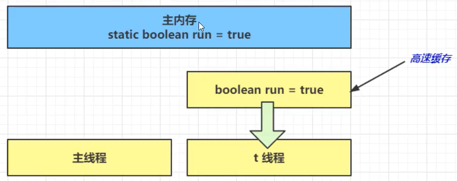
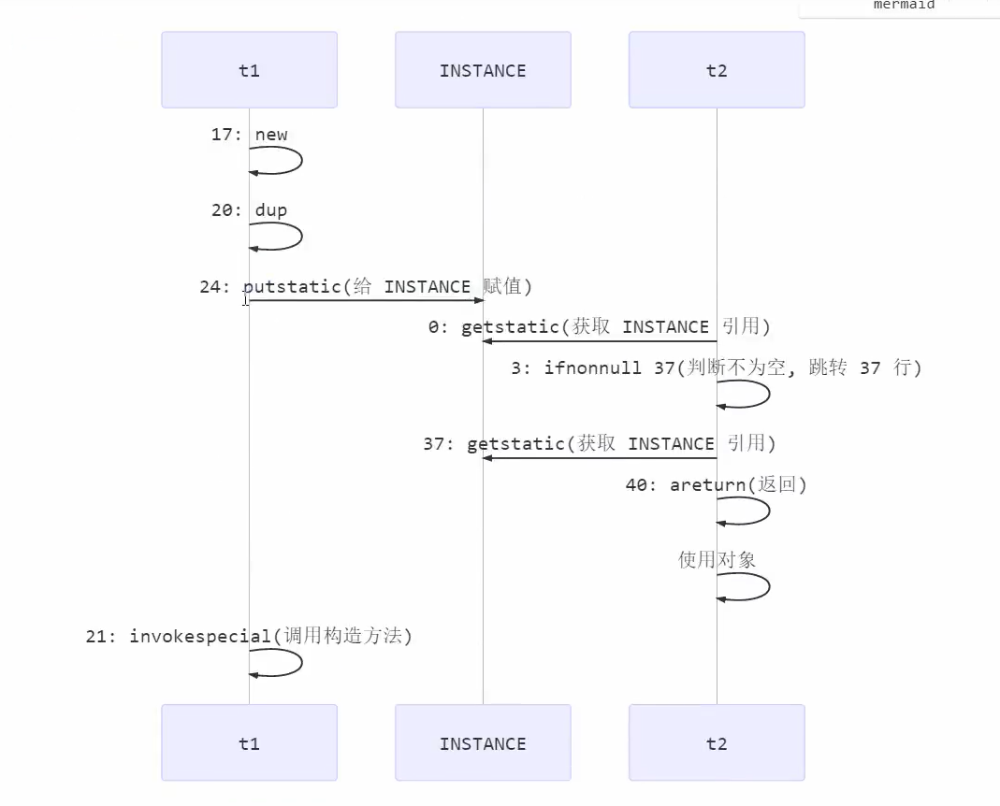

# 4. 共享模型之内存

JMM存在的问题：

- 原子性
- 可见性
- 有序性：synchronzied是通过代码块同步来保证代码有序的，与volatile原理不同。

上一章讲解的Monitor主要关注的是访问共享变量时，保证临界区代码的原子性。

这一章学习共享变量在多线程间的**可见性**问题及多条指令执行时的**有序性**问题。

## 4.1 JMM

JMM即Java Memory Model，它定义了**主存、工作内存抽象**概念，底层对应着CPU寄存器、缓存、硬件内存、CPU指令优化等。

- 主内存：存储所有共享变量的内存
- 工作内存：线程私有的内存区域

JMM体现在以下几个方面

- **原子性**：保护指令不会受到**线程上下文切换**影响
- **可见性**：保证指令不会受到**CPU缓存**的影响
- **有序性**：保证指令不会受到**CPU指令并行优化**的影响

### 1）可见性问题

一个线程修改了主存中的数据，但是由于JMM的主存、工作内存机制，这次修改对其他线程不可见。

#### 1. 问题实例

```java
package com.spzhang.chap4;

import java.util.concurrent.TimeUnit;

public class SampleCode1 {
    static boolean run = true;
    public static void main(String[] args) {
        new Thread(() -> {
            while(run) {
                //println使用synchronized修饰
//                System.out.println("run为true，继续执行");
            }
        }, "t").start();

        try {
            TimeUnit.SECONDS.sleep(1);
        } catch (InterruptedException e) {
            e.printStackTrace();
        }

        run = false;		//线程不会如期停下来
        System.out.println("尝试停止另一个线程");	
    }
}
```

为什么呢？

1. 初始状态，t线程刚开始从主内存读取了run的值到工作内存；

   

2. 因为t线程要频繁从主内存中读取run的值，JIT编译器会将run的值缓存至自己工作内存中的高速缓存中，减少对主存中run的访问，提高效率



3. 1秒之后main线程修改了run的值，并同步至主存，而t是从自己工作内存中的高速缓存中读取这个变量的值，结果永远是旧值


#### 2. 解决办法

**volatile**可以用来修饰成员变量和类变量，可以避免从自己的工作缓存中查找变量的值，必须到主存中获取它的值，**线程操作volatile变量都是直接操作主存**。

- synchronized关键字也可以解决可见性问题

#### 3. 可见性 VS 原子性

可见性指的是保证一个线程对共享变量的修改对另一个线程立即可见；原子性指的是一段代码在执行的过程中，不会因为上下文切换而影响代码块中变量的状态。

注意：synchronized可以保证代码块的原子性，也可以保证可见性，而volatile只能保证可见性（每次操作都是操作主存）。但synchronized属于重量级操作，性能相对较低。

- synchronized修饰了println(String)方法

#### 4. 终止模式之两阶段终止

```java
/**
 * volatile实现两阶段终止
 */
public class SampleCode2 {
    public static void main(String[] args) {
        TwoPhaseTermination tpt  = new TwoPhaseTermination();
        tpt.start();

        try {
            TimeUnit.SECONDS.sleep(3);
        } catch (InterruptedException e) {
            e.printStackTrace();
        }
        System.out.println("停止监控");
        tpt.stop();
    }
}


class TwoPhaseTermination {
    private Thread monitorThread;
    private volatile boolean stop;

    public void start() {
        monitorThread = new Thread(() -> {
            while(true) {
                Thread current = Thread.currentThread();
                //是否被打断
                if(stop) {
                    System.out.println("被打断，料理后事");
                    break;
                }
                try {
                    TimeUnit.SECONDS.sleep(1);
                    System.out.println("执行监控记录");
                } catch (InterruptedException e) {
//                    e.printStackTrace();
                }
            }
        }, "monitor");
        monitorThread.start();
    }
    public void stop() {
        stop = true;
        //让处于sleep的线程能够立即终止
        monitorThread.interrupt();
    }
}
```

#### 5. 同步模式之balking(犹豫模式)

Balking模式用在一个线程或本线程已经做了某一件相同的事，那么本线程就无需再做了，直接结束返回。

- 保护性暂停用于一个线程等待另一个线程的结果，当条件不满足时线程等待。

```java
synchronized (this) {
    if(starting) {
        System.out.println("已经执行过start");
        return ;
    }
    starting = true;
}
```

它还经常用来实现线程安全的单例(懒汉)

```java
public final class Singleton {
    private Singleton() {
    }
    private static Singleton INSTANCE = null;
    public static synchronized Singleton getInstance() {
        if(INSTANCE != null)
            return INSTANCE;
        INSTANCE = new Singleton();
        return INSTANCE;
    }
}
```

### 2）有序性

JVM会在不影响正确性的前提下，可以调整语句的执行顺序

```java
static int i;
static int j;

//在某个线程内执行如下赋值
i = ...;
j = ...;
```

可以看到，至于是先执行i还是执行j，对最终的结果不会产生影响。所以，上面代码真正执行时，既可以是

```java
i = ...;
j = ...;
```

也可以是

```java
j = ...;
i = ...;
```

这种特性称为**指令重排**，**多线程下指令重排会影响正确性**。为什么要有重排指令这项优化呢？从CPU执行指令的原理来理解一下吧

#### 1. CPU层面的指令重排序优化

现代处理器会设计为一个时钟周期内完成一条执行时间最长的CPU指令。因为指令可以再划分成一个个更小的阶段。例如，每条指令可以分为：取指令 - 指令译码 - 执行指令 - 内存访问 - 数据写回这5个阶段。


现代CPU支持多级指令流水线，例如支持同时执行取指令 - 指令 - 指令译码 - 执行指令 - 内存访问 - 数据写回的处理器，就可以称之为五级指令流水线，这时，CPU可以在一个时钟周期内，同时运行五条指令的不同阶段（相当于一条执行时间最长的复杂指令）。本质上，流水线技术并不能缩短单条指令的执行时间，但它变相地提高了指令吞吐率。

> 奔腾四支持高达35级流水线，但由于功耗太高被废弃。


在不改变程序结果的前提下，这些指令的各个阶段可以通过重排序和组合来实现指令级并行，这一技术在80's和90's中占据了计算架构的重要地位。

> 分阶段，分工是提升效率的关键。

指令重排的前提是，重排指令不能影响结果，例如

```java
int a = 10;
int b = a - 5;
```

#### 2. Java层面的指令重排序优化

```java
int num = 0;
boolean ready = false;

//线程1执行此方法
public void actor(I_Result r) {
    if(ready) {
        r.r1 = num + num;
    } else {
        r.rl = 1;
    }
}
//线程2执行此方法
public void actor2(I_Result r) {
    num = 2;
    ready = true
}
```

I_Result r是一个对象，有一个属性r1用来保存结果。

问，可能的结果有几种？

情况1：线程1先执行，这时ready = false，进入else分支结果为1

情况2：线程2先执行num = 2，但还没来的及执行ready = true，所以此时结果仍为1

情况3：线程2先执行完，此时ready = true，结果为4

**情况4（指令重排优化）**：线程2先执行ready = true，切换到线程1，进入if分支，结果为0

情况4叫做**指令重排**，是**JIT编译器在运行时的一些优化**，可以借助java并发压测工具**jcstress**来复现。

> https://github.com/openjdk/jcstress

项目右键-->打开命令行，执行以下命令

```java
mvn archetype:generate -DinteractiveMode=false -DarchetypeGroupId=org.openjdk.jcstress -DarchetypeArtifactId=jcstress-java-test-archetype -DgroupId=org.sample -DartifactId=test -Dversion=1.0
```

### 3）volatile原理

> volatile关键在在JDK1.5之后才生效。

volatile的底层实现原理是内存屏障（Memory Barrier/Fence）

- 对volatile变量的**写指令后会加入写屏障**
- 对volatile变量的**读指令前会加入读屏障**

#### 1. 如何保证可见性

- 写屏障保证在该屏障之前的对所有共享变量的改动，都同步到主存当中

```java
public void actor2() {
    num = 2;
    ready = true;	//read是volatile，赋值操作带写屏障
    //添加写屏障
}
```

- 读屏障保证在屏障之后，对所有共享变量的读取，加载的是主存中最新数据

```java
public void actor1(IResult r) {
    //ready是volatile变量，读取值带读屏障
    //读屏障
    if(ready)
        r.r1 = num + num;
    else
        r.r1 = 1;
}
```


#### 2. 如何保证有序性

> 有序性的保证只是保证了本线程内相关代码不被重排序

- 写屏障会确保指令重排序时，不会将写屏障之前的代码排在写屏障之后

```java
public void actor2() {
    num = 2;
    ready = true;	//read是volatile，赋值操作带写屏障
    //添加写屏障
}
```

- 读屏障会确保指令重排序时，不会将读屏障之后的代码排在读屏障之前

```java
public void actor1(IResult r) {
    //读屏障
    //ready是volatile变量，读取值带读屏障
    if(ready)
        r.r1 = num + num;
    else
        r.r1 = 1;
}
```


### 4）DCL问题

以著名的double-checked locking单例模式为例

```java
public final class Singleton {
    private Singleton() {
    }
    private static Singleton INSTANCE = null;
    public static Singleton getInstance() {
        synchronized(Singleton.class) {
            if(INSTANCE == null)
                return new Singleton();
        }
        return INSTANCE;
    }
}
```

以上实现的特点：

- 懒惰实例化
- 首次使用getInstance()才使用synchronized加锁，后续使用时无需加索

存在的问题：

- **每次要获取实例对象时，都要竞争锁，开销较大**

- 可以通过double-checked来解决这个问题，使得**只有首次访问才会竞争锁**

  ```java
  public final class Singleton {
      private Singleton() {
      }
      private static Singleton INSTANCE = null;
      public static synchronized Singleton getInstance() {
          if(INSTANCE == null) {
              //首次访问会同步，而之后的使用没有使用synchronized
              synchronized (Singleton.class) {
                  if(INSTANCE == null) {
                      INSTANCE = new Singleton();
                  }
              }
          }
          return INSTANCE;
      }
  }
  ```

#### 1. 存在的问题

上述代码中，由于**外层的if判断在synchronzied代码块**外，在多线程执行下，由于单线程内的**指令重排**，可能导致上述代码出现问题。

这里的指令重排主要指的是，创建INSTANCE对象时的指令重排。

```
INSTANCE = new Singleton();
```

上述语句，会被翻译为四条字节码指令：

```
 0 getstatic #5 <com/spzhang/chap4/Singleton.INSTANCE>
 3 ifnonnull 43 (+40)
 6 ldc #6 <com/spzhang/chap4/Singleton>
 8 dup
 9 astore_0
10 monitorenter
11 getstatic #5 <com/spzhang/chap4/Singleton.INSTANCE>
14 ifnonnull 33 (+19)
17 new #6 <com/spzhang/chap4/Singleton>
20 dup
21 invokespecial #7 <com/spzhang/chap4/Singleton.<init>>
24 putstatic #5 <com/spzhang/chap4/Singleton.INSTANCE>
27 getstatic #5 <com/spzhang/chap4/Singleton.INSTANCE>
30 aload_0
31 monitorexit
32 areturn
33 aload_0
34 monitorexit
35 goto 43 (+8)
38 astore_1
39 aload_0
40 monitorexit
41 aload_1
42 athrow
43 getstatic #5 <com/spzhang/chap4/Singleton.INSTANCE>
46 areturn
```

- 17表示创建对象，将对象引用入栈（只是分配内存，确定存储地址）
- 20表示复制一份对象引用（地址）
- 21表示 利用一个对象引用，调用构造方法（实例化）
- 24表示利用一个对象引用，复制给INSTANCE（将对象地址给INSTANCE）

JVM可能会对上述字节码指令进行优化，将其优化为：先执行24，再执行21。如果两个线程t1，t2按如下时间执行：



- 关键在于0 getstatic这条字节码指令在monitor之外，可以越过monitor取INSTANCE，而此时，由于字节码重排序，t1线程可能并未完成对INSTANCE的对象初始化。

#### 2. 问题解决

- 将INSTANCE使用volatile关键字修饰

```java
public final class Singleton {
    private Singleton() {
    }
    private volatile static Singleton INSTANCE = null;
    public static synchronized Singleton getInstance() {
        if(INSTANCE == null) {
            synchronized (Singleton.class) {
                if(INSTANCE == null) {
                    INSTANCE = new Singleton();
                }
            }
        }
        return INSTANCE;
    }
}
```


- 将INSTANCE改为volatile变量时，在对INSTANCE赋值时（putstatic字节码指令）会在该指令后添加写屏障，阻止重排序。

### 5）happens-before

happens-before规定了对共享变量的写操作对其他线程的读操作可见，它是可见性与有序性的一套规则总结。抛开以下happens-before规则，JMM并不能保证一个线程对共享变量的写，对于其他线程对该共享变量的读可见。

- 线程解锁m之前对变量的写，对于接下来对m加锁的其他线程对该变量的读可见

  ```java
  
  ```

- 线程对volatile变量的写，对接下来其他线程对该变量的读可见

- 线程start前对变量的写，对该线程开始后对该变量的读可见

- 线程结束前对变量的写，对其他线程得知它结束后的读可见（比如其他线程调用t1.isAlive()或t1.joint()等待它结束）

- 线程t1打断t2(interrupt)前对变量的写，对于其他线程得知t2被打断后对变量的读可见（t2.interrupted()或t2.isInterrupted()）

- 变量默认初始化的写，对其他线程对该变量的读可见

- 具有传递性