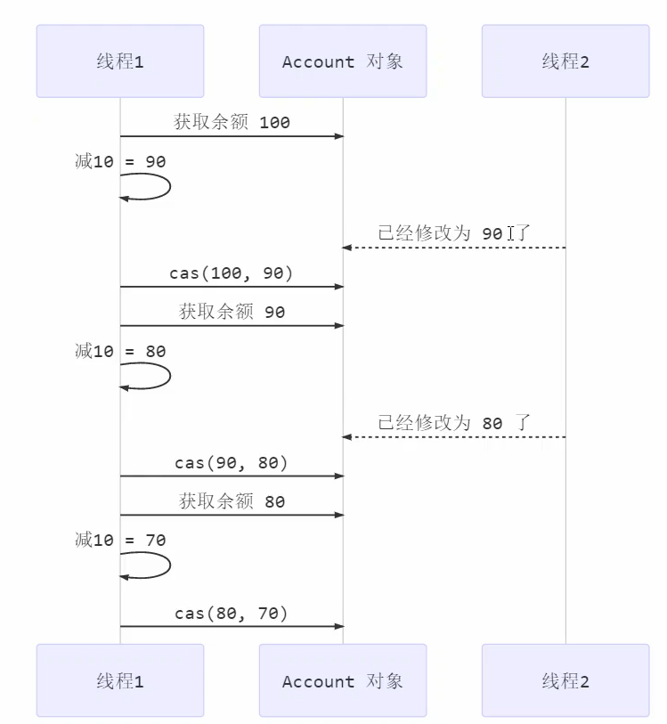
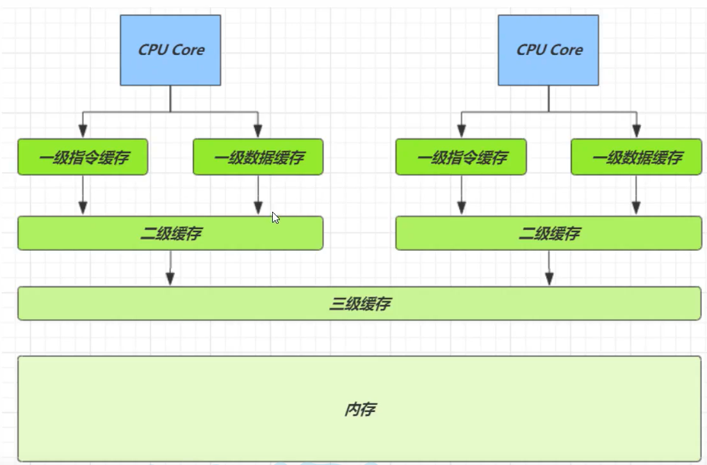
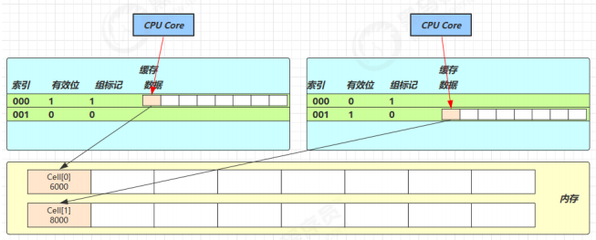
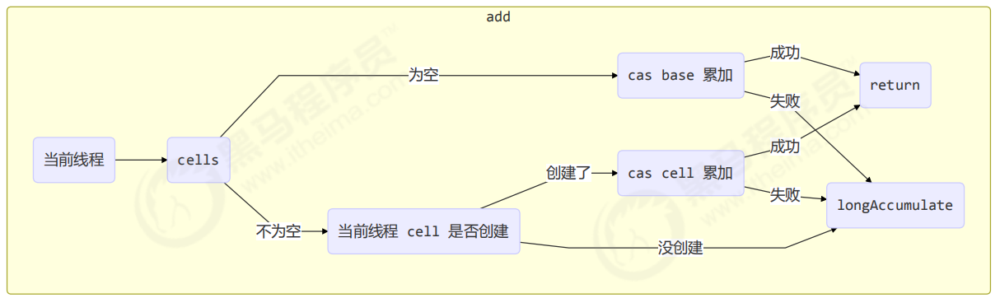

# 5. 共享模型之无锁

本章内容

- CAS与volatile
- 原子整数
- 原子引用
- 原子自加器
- Unsafe

## 5.1 CAS与volatile

**CAS（Compare And Swap）**，比较并设置，在CPU指令级别是原子的。底层是lock cmpxchg指令（x86架构），不管在单核还是多核CPU中都可以保证比较并设置的原子性。

```java
while(true) {
    //CAS不成功，则重新获取当前的值
    int prev = balance.get();
    int next = prev - 10;
    if(balance.compareAndSet(prev, next)) {
        //CAS成功，则完成任务退出循环
        break;
    }
}
```



**volatile**

获取共享变量时，为了保证变量的可见性，必须使用volatile来修饰这个共享变量。volatile可以修饰成员变量和静态变量，可以避免线程从自己的工作缓存中查找变量的值，必须到主存中获取它的值，线程操作volatile变量都是直接操作主存，即一个线程对volatile变量的修改，对另一个线程可见。

CAS必须配合volatile才能读取到共享变量的最新之来实现比较并交换

## 5.2 为什么无锁效率高

- 无锁情况下，即时CAS失败，但线程仍在继续运行，**没有发生上下文切换**；

- 而synchronzied获取锁失败时，线程会被阻塞，此时要发生线程上下文切换，有保存现场、恢复现场的开销

无锁也**需要额外的CPU/核的支持**，否则会阻塞其他线程（因为只有一个CPU核），线程数少于CPU数比较能发挥CAS的优势


**特点：**

结合CAS和volatile可以实现无锁并发，适用于线程少、多核CPU的场景下

- CAS是基于乐观锁的思想，不怕别的线程来修改共享变量
- synchronized基于悲观锁的思想，
- CAS体现的**无锁并发**、**无阻塞并发**
  - 因为没有使用synchronized，线程不会陷入阻塞，这是效率提升的因素之一
  - 但如果竞争激烈，重试必然频繁发生，反而会影响效率

## 5.3 原子整数

J.U.C并发包提供了

- AtomicBoolean
- AtomicInteger
- AtomicLong

### AtomicInteger

```java
//两种构造方法
//无参的默认值为0

//比较value当前值是否等于except，如果是则将其更新为update值，成功返回true，失败返回false
boolean compareAndSet(int except, int update);
//先自增，然后获取值	++value
int incrementAndGet();
//先返回，再自增
int getAndIncrement();
//先将value加num，然后将结果返回
int addAndget(int num);
//先保存当前value值，用作待会返回，然后再将value加num
int getAndAdd(int num);

AtomicInteger i = new AtomicInteger(1);
//             读取到      设置值
i.updateAndGet(value -> value * 10);
System.out.println(i.getAndUpdate(value -> value * 10));
System.out.println(i.get());
```

要调用**getAndUpdate**方法，需要传入一个**IntUnaryOperator接口**的类的对象，在接口实现中指明需要update的操作。

```java
//要调用getAndUpdate方法，需要传入一个IntUnaryOperator接口的类的对象，在接口实现中指明需要update的操作
public final int getAndUpdate(IntUnaryOperator updateFunction) {
    int prev, next;
    do {
        prev = get();
        next = updateFunction.applyAsInt(prev);
    } while (!compareAndSet(prev, next));
    return prev;
}
```

将具体要做的运算，封装起来，抽象成了


```java
@FunctionalInterface
public interface IntUnaryOperator {

    /**
     * Applies this operator to the given operand.
     *
     * @param operand the operand
     * @return the operator result
     */
    int applyAsInt(int operand);
}
```

## 5.4 原子引用

- AtomicReference
- AtomicMarkableReference
- AtomicStampedReference

AtomicReference能不能判断出共享变量被其他线程修改过？（**ABA问题**）

仅比较值不够，需要加一个版本号

**AtomicStampedReferencek**可以查看被改了多少次（现在的版本号减去之前获得的版本号）

有时候不关心被修改了多少次，只关心是否被修改

**AtomicMarkableReference**与AtomicStampedReference类似，只是在AtomicMarkableReference中提供的是boolean值标记，不是int类型的版本号。

## 5.5 原子数组

- AtomicIntegerArray
- AtomicLongArray
- AtomicReferenceArray

## 5.6 字段更新器

- AtomicReferenceFieldUpdater
- AtomicIntegerFieldUpdater
- AtomicLongFieldUpdater

字段必须为volatile。

1. 根据对象所属类、字段属性、字段名来创建一个字段更新器

   ```java
   public class Test5 {
       private volatile int field;
       public static void main(String[] args) {
           AtomicIntegerFieldUpdater fieldUpdater =
           AtomicIntegerFieldUpdater.newUpdater(Test5.class, "field");
           Test5 test5 = new Test5();
            fieldUpdater.compareAndSet(test5, 0, 10);
            // 修改成功 field = 10
            System.out.println(test5.field);
            // 修改成功 field = 20
            fieldUpdater.compareAndSet(test5, 10, 20);
            System.out.println(test5.field);
            // 修改失败 field = 20
            fieldUpdater.compareAndSet(test5, 10, 30);
            System.out.println(test5.field);
        }
   }
   ```

   

2. 通过字段更新器来对字段进行原子操作（需要传递对象、该字段目前的值、期望字段更新值）

## 5.7 原子累加器

- LongAdder

源码

Doug Lea的作品，

关键域

```java
// 累加单元数组, 懒惰初始化
transient volatile Cell[] cells;
// 基础值, 如果没有竞争, 则用 cas 累加这个域
transient volatile long base;
// 在 cells 创建或扩容时, 置为 1, 表示加锁
transient volatile int cellsBusy;
```

### 伪共享

其中Cell为累加单元

```java
//该注解防止缓存行伪共享
@sun.misc.Contended 
static final class Cell {
        volatile long value;
        Cell(long x) { value = x; }
        final boolean cas(long cmp, long val) {
            return UNSAFE.compareAndSwapLong(this, valueOffset, cmp, val);
        }

        // Unsafe mechanics
    	...
    }
```




由于CPU与内存的速度差异很大，需要靠**预读数据到缓存**来提升效率。

- 缓存以缓存行为单位，每个缓存行对应着一块内存，一般是64byte（8个long）
- 缓存的加入会造成数据副本的产生，即同一份数据会缓存在不同的缓存行
- 由于缓存一致性协议，如果某个CPU核心更改了数据，其他CPU核心对应的整个缓存行也会失效


由于**Cell是数组类型，在内存中是连续存储的**，一个Cell为24字节（16字节的对象头和8字节的value），因此缓存行可以存下2个Cell对象，则存在以下问题：

- Core-0要修改Cell[0]
- Core-1要修改Cell[1]

无论谁修改成功，都会导致对方Core的缓存行失效，会导致效率降低。


@sun.misc.Contended用来解决这个问题，它的原理是在使用此注解的对象或字段的前后各增加128字节大小的padding，从而让CPU将对象预读至缓存时占用不同的缓存行，这样，不会造成对方的缓存行失效。



### add()

```java
public void add(long x) {
 // as 为累加单元数组
 // b 为基础值
 // x 为累加值
 Cell[] as; long b, v; int m; Cell a;
 // 进入 if 的两个条件
 // 1. as 有值, 表示已经发生过竞争, 进入 if 
// 2. cas 给 base 累加时失败了, 表示 base 发生了竞争, 进入 if
 if ((as = cells) != null || !casBase(b = base, b + x)) {
 // uncontended 表示 cell 没有竞争
 boolean uncontended = true;
 if (
 // as 还没有创建
 as == null || (m = as.length - 1) < 0 ||
 // 当前线程对应的 cell 还没有
 (a = as[getProbe() & m]) == null ||
 // cas 给当前线程的 cell 累加失败 uncontended=false ( a 为当前线程的 cell )
 !(uncontended = a.cas(v = a.value, v + x))
 ) {
 // 进入 cell 数组创建、cell 创建的流程
 longAccumulate(x, null, uncontended);
 }
 }
}
```

流程图



### longAccumulate

### sum

## 5.8 Unsafe

### 获取Unsafe对象

Unsafe对象提供了非常底层的，操作内存、操作线程的方法，Unsafe对象不能直接调用，只能通过反射获得。

```java
Field theUnsafe = Unsafe.class.getDeclaredField("theUnsafe");
theUnsafe.setAccessible(true);
Object unsafe = (Unsafe) theUnsafe.get(null);
System.out.println(unsafe);
```

### Unsafe CAS操作

1. 获取域的偏移地址
2. 执行CAS操作

```java
public static void main(String[] args) throws NoSuchFieldException, IllegalAccessException {
		...
        // 1. 获取域的偏移地址
        long idOffset = unsafe.objectFieldOffset(Teacher.class.getDeclaredField("id"));
        long nameOffset = unsafe.objectFieldOffset(Teacher.class.getDeclaredField("name"));

        // 2. 执行CAS操作
        unsafe.compareAndSwapInt(t, idOffset, t.getId(), t.getId() + 1);
        unsafe.compareAndSwapObject(t, nameOffset, t.getName(), "spzhang1");

        // 3. 验证
        System.out.println(t);
    }
```

### Unsafe实现AtomicInteger

- 需要使用volatile来配合CAS保证变量的可见性
- 静态初始化时初始化其value域的偏移量，方便后续调用Unsafe的CAS方法

```java
class MyAtomicInteger {
    private volatile int value;
    private static final long valueOffset;
    static final Unsafe UNSAFE;
    static {
        UNSAFE = UnsafeAccessor.getUnsafe();
        try {
            valueOffset = UNSAFE.objectFieldOffset(MyAtomicInteger.class.getDeclaredField("value"));
        } catch (NoSuchFieldException e) {
            e.printStackTrace();
            throw new RuntimeException(e);
        }
    }
    public int getValue() {
        return value;
    }
    public void decrement(int amount) {
        while(true) {
            int prev = value;
            int next = value - amount;
            if(UNSAFE.compareAndSwapInt(this, valueOffset, prev, next)) 
                break;
        }
    }
}
```

