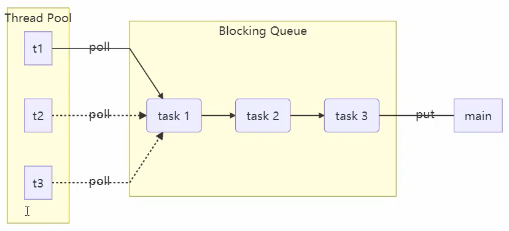
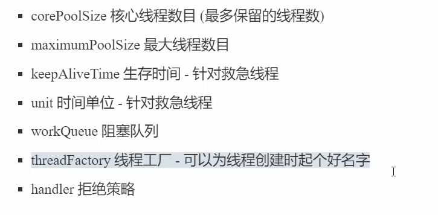
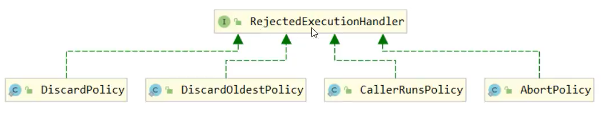
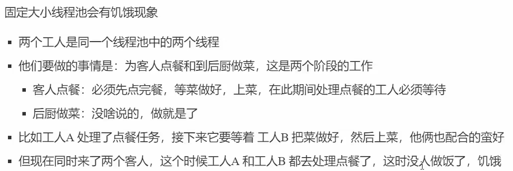

# 7. 并发工具之线程池

## 7.1 自定义线程池



### BlockingQueue

> BlockingQueue是平衡消费者和生产者的桥梁

1. 任务队列

   ```java
   // 1. 任务队列
   private Deque<T> queue = new ArrayDeque<>();
   ```

2. 锁，使用RTL可以将生产者和消费者阻塞分开

   ```java
   private ReentrantLock lock = new ReentrantLock();
   ```

3. .生产者和消费者的条件变量

   ```java
   // 3. 生产者的条件变量
   private Condition fullWaitSet = lock.newCondition();
   // 4. 消费者条件变量
   private Condition emptyWaitSet = lock.newCondition();
   ```

4. 容量

   ```java
   // 5. 容量
   private int capcity;
   ```

5. 获取阻塞队列中的任务

   - 永久等待

     ```java
     // 阻塞获取
         public T take() {
             lock.lock();
             try {
                 while(queue.isEmpty()) {
                     try {
                         emptyWaitSet.await();
                     } catch (InterruptedException e) {
                         e.printStackTrace();
                     }
                 }
                 T t = queue.removeFirst();
                 fullWaitSet.signal();
                 return t;
             } finally {
                 lock.unlock();
             }
         }
     ```

   - 限时等待

     ```java
     // 限时等待
     public T take(long timeout, TimeUnit unit) {
         lock.lock();
         try {
             long nanos = unit.toNanos(timeout);
             while(queue.isEmpty()) {
                 try {
                     // 返回的剩余等待时间
                     if(nanos <= 0)
                         return null;
                     nanos = emptyWaitSet.awaitNanos(nanos);
                 } catch (InterruptedException e) {
                     e.printStackTrace();
                 }
             }
             T t= queue.removeFirst();
             fullWaitSet.signal();
             return t;
         } finally {
             lock.unlock();
         }
     
     }
     ```

6. 向队列中添加任务

   - 永久等待添加

   ```java
   // 阻塞添加
   public void put(T element) {
       lock.lock();
       try {
           while(queue.size() == capcity) {
               try {
                   fullWaitSet.await();
               } catch (InterruptedException e) {
                   e.printStackTrace();
               }
           }
           queue.addLast(element);
           emptyWaitSet.signal();
       } finally {
           lock.unlock();
       }
   }
   ```

   - 限时等待添加

     ```java
     // 限时添加
     public boolean put(T element, long timeout, TimeUnit timeUnit) {
         lock.lock();
         try {
             long nanos = timeUnit.toNanos(timeout);
             while(queue.size() == capcity) {
                 try {
                     System.out.println("等待加入任务队列" + element);
                     if(nanos <= 0)
                         return false;
                     nanos = fullWaitSet.awaitNanos(nanos);
                 } catch (InterruptedException e) {
                     e.printStackTrace();
                 }
             }
             System.out.println("成功加入任务队列" + element);
             queue.addLast(element);
             emptyWaitSet.signal();
             return true;
         } finally {
             lock.unlock();
         }
     }
     ```

7. 获取当前阻塞队列中的任务数量

```java
// 获取大小
public int size() {
    lock.lock();
    try {
        return queue.size();
    } finally {
        lock.unlock();
    }
}
```

### ThreadPool

1. 成员变量

   ```java
   // 任务队列
   private BlockingQueue<Runnable> taskQueue;
   // 线程集合
   private HashSet<Worker> workers = new HashSet<>();
   // 核心线程数
   private int coreSize;
   // 获取任务的超时时间
   private long timeout;
   private TimeUnit timeUnit;
   ```

2. 构造函数

   ```java
   public ThreadPool(int coreSize, long timeout, TimeUnit timeUnit, int capcity) {
       this.coreSize = coreSize;
       this.timeout = timeout;
       this.timeUnit = timeUnit;
       taskQueue = new BlockingQueue<>(capcity);
   }
     
   ```

3. 执行任务

   ```java
   // 执行任务
   public void execute(Runnable task) {
       synchronized (workers) {
           // 当任务数没有超过coreSize时，直接交给worker对象执行
           // 如果任务数超过coreSize时，加入任务队列暂存
           if(workers.size() < coreSize) {
               Worker worker = new Worker(task);
               System.out.println("新增worker" + worker);
               workers.add(worker);
               worker.start();
           } else {
               System.out.println("加入任务队列" + task);
               taskQueue.put(task);
           }
       }
   }
   ```

4. 处理任务的内部类（线程集合中的类）

   ```java
   // 处理任务的内部类
   class Worker extends Thread{
       private Runnable task;
   
       public Worker(Runnable task) {
           this.task = task;
       }
   
       @Override
       public void run() {
           // 执行任务：1）当task不为空，则直接执行任务；2）当task执行完毕，再接着从任务队列获取任务并执行
           while(task != null || (task = taskQueue.take(1000, TimeUnit.MILLISECONDS)) != null) {
               try {
                   System.out.println("正在执行任务" + task);
                   task.run();
               } catch(Exception e) {
                   e.printStackTrace();
               } finally {
                   task = null;
               }
           }
           synchronized (workers) {
               System.out.println("worker被移除" + this);
               workers.remove(this);
           }
       }
   }
   ```

### 拒绝策略

通过策略模式来实现当任务队列满时，由用户自己决定如何处理。

#### RejectPolicy接口

```java
@FunctionalInterface
interface RejectPolicy<T> {
    void reject(BlockingQueue<T> queue, T task);
}
```

#### ThreadPool成员变量

> 需要构造函数中进行初始化

```java
private RejectPolicy<Runnable> rejectPolicy;
```

#### 重写execute()

- 当任务队列满时：

```java
// taskQueue.put(task);
// 1)死等；2）带超时时间等待；3）放弃任务执行；4）抛出异常；5）让调用者自己执行任务
taskQueue.tryPut(rejectPolicy, task);
```

#### BlockingQueue添加tryPut()方法

```java
//拒绝策略，当任务队列满时，由用户决定如何处理
public void tryPut(RejectPolicy<T> rejectPolicy, T task) {
    lock.lock();
    try {
        // 判断队列是否满
        if(queue.size() == capcity) {
            rejectPolicy.reject(this, task);
        } else {    // 有空闲
            System.out.println("成功加入任务队列" + task);
            queue.addLast(task);
            emptyWaitSet.signal();
        }
    } finally {
        lock.unlock();
    }
}
```

### 演示

```java
public static void main(String[] args) {
    ThreadPool threadPool = new ThreadPool(2, 1000, TimeUnit.MILLISECONDS,(queue, task) -> {
        // 1. 死等
        // queue.put(task);
        // 2. 限时等待
        // queue.put(task, 200, TimeUnit.MILLISECONDS);
        // 3. 让调用者放弃
        // System.out.println("放弃执行" + task);
        // 4. 调用者抛出异常
        // throw new RuntimeException("任务执行失败" + task);
        // 5. 调用者自己执行任务
        task.run();
    }, 5);
    for (int i = 0; i < 15; i++) {
        int j = i;
        threadPool.execute(() -> {
            try {
                Thread.sleep(1000);
            } catch (InterruptedException e) {
                e.printStackTrace();
            }
            System.out.println(j);

        });
    }
}
```

## 7.2 ThreadPoolExecutor


- ScheduledThreadPoolExecutor：带有任务调度的线程池

### 1）线程池状态

ThreadPoolExecutor使用int的高3位来表示线程池状态，低29位表示线程数量。

- 为什么不适用两个整数分别存储状态和线程数量?

  - 一次原子操作可以同时将状态和线程数量赋值

    ```java
    //c为旧值
    ctl.compareAndSet(c, ctlOf(targetState, workerCountOf(c)));
    //rs为高3位代表线程池状态，wc为低29位，代表线程个数，ctlPf是合并它们
    private static int ctlOf(int re, int wc){ return rs | wc; }
    ```

状态：

RUNNING：111

SHUTDOWN：000，不会接收新任务，但会将阻塞队列剩余任务处理完毕

STOP：001，会中断正在执行的任务（interrupt()），并抛弃阻塞队列任务

TIDYING：010，任务全部执行完毕，活动线程为0即将进入终结状态

TERMINATED：011，终结状态

TERMINATED>TIDYING>STOP>SHUTDOWN>RUNNING(最高位为1，为负数)

### 2）构造方法

```java
public ThreadPoolExecutor(int corePoolSize,
                          int maximumPoolSize,
                          long keepAliveTime,
                          TimeUnit unit,
                          BlockingQueue<Runnable> workQueue,
                          ThreadFactory threadFactory,
                          RejectedExecutionHandler handler) 
```



- corePoolSize：核心线程数目（最多保留的线程数）
- maximumPoolSize：最大线程数
- keepAliveTime：生存时间（针对救急线程）
- unit：时间单位（针对救急线程）
- workQueue：阻塞队列
- threadFactory：线程工厂-可以为线程创建时起个名字
- handler：拒绝策略

当阻塞队列（有界队列）满时，ThreadPoolExecutor并不会直接执行拒绝策略，而是会判断是否存在救急线程（救急线程在满生存时间时自动销毁）或者创建救急线程（可创建救急线程数=最大线程数-核心线程数），如果不可以，则再调用拒绝策略。

#### 

### 3）拒绝策略

如果线程池中的线程数达到了maximumPoolSize仍然有新任务到达，这时会执行拒绝策略。JDK提供了3中实现：

- AbortPolicy让调用者抛出RejectedExecutionException异常（默认策略）
- CallerRunsPolicy让调用者运行任务
- DiscardPolicy放弃本次任务
- DiscardOldestPolicy放弃队列中最早的任务，本任务取而代之



其他框架也提供了拒绝策略的实现：

- Dubbo的实现在抛出RejectExecutionException异常之前会记录日志，并dump线程栈信息，方便定位问题
- Netty的实现是创建一个新线程来执行任务
- ActiveMQ的实现，带超时等待尝试放入队列，类似之前自定义的拒绝策略
- PinPoint的实现，会逐一尝试策略联众每种拒绝策略

根据这个构造方法， JDK Executors类中提供了众多工厂方法，用于创建各种不同用途的线程池。

### 4）Executors

#### 创建固定大小的线程池

Executors提供了**new FixedThreadPool()**方法来创建固定大小的线程池，即corePoolSize跟maximumPoolSize相等，即不提供救急线程机制。

- 核心线程数=最大线程池，没有救急线程

- 阻塞队列是无界的，可以放任意数量的线程
- 适用于任务量已知，相对耗时的任务
- 核心线程并不是守护线程，执行完任务也不会主动结束

该方法有两个重载方法：

- 不提供线程工厂，使用Executors默认的线程工厂
- 提供线程工厂

```java
public static ExecutorService newFixedThreadPool(int nThreads) {
    return new ThreadPoolExecutor(nThreads, nThreads,
                                  0L, TimeUnit.MILLISECONDS,
                                  new LinkedBlockingQueue<Runnable>());
}

public static ExecutorService newFixedThreadPool(int nThreads, ThreadFactory threadFactory) {
    return new ThreadPoolExecutor(nThreads, nThreads,
                                  0L, TimeUnit.MILLISECONDS,
                                  new LinkedBlockingQueue<Runnable>(),
                                  threadFactory);
}
```

自定义线程工厂

```java
ExecutorService pool = Executors.newFixedThreadPool(10, new ThreadFactory() {
    private AtomicInteger t = new AtomicInteger(1);

    @Override
    public Thread newThread(Runnable r) {
        return new Thread(r, "mypool_t" + t.getAndIncrement());
    }
});
```

#### 创建带缓冲功能的线程池

- 核心线程数为0，最大线程数为Integer.MAX_VALUE，救急线程空闲生存时间是60s
  - 全部都是救急线程
  - 救急线程可以无限创建
- 队列采用了SynchronizedQueue，实现特点
  - 没有容量，没有线程来取是放不进去的
- 线程池中的线程数会根据任务量不断增长，没有上限，适用于任务数密集，但每个任务执行事件较短的情况

```java
public static ExecutorService newCachedThreadPool() {
    return new ThreadPoolExecutor(0, Integer.MAX_VALUE,
                                  60L, TimeUnit.SECONDS,
                                  new SynchronousQueue<Runnable>());
}
```

#### 创建单线程线程池

和自己创建一个线程的区别：

- 任务执行失败时处理情况不同：自己创建线程来串行执行任务，如果任务执行失败而终止那么没有任何补救措施，而线程池还会新建一个线程，保证池的正常工作

与调用newFixedThreadPool(1)的区别：

- Executors.newSingleThreadExecutor()线程数始终为1，不能修改
  - FinalizableDelegatedExecutorService应用的是**装饰器模式**，只对外暴漏了ExecutorService接口，不能调用ThreadPoolExecutor的方法
- Executors.newFixedThreadPool(1)返回的线程池核心线程数以后还可以修改
  - 对外暴露的是ThreadPoolExecutor对象，可以强转后调用setCorePoolSize()等方法进行修改

```java
public static ExecutorService newSingleThreadExecutor() {
    return new FinalizableDelegatedExecutorService
        (new ThreadPoolExecutor(1, 1,
                                0L, TimeUnit.MILLISECONDS,
                                new LinkedBlockingQueue<Runnable>()));
}
```

使用场景：希望执行的任务排队执行，线程数固定为1，任务数多于1时，会放入无界队列排队。任务执行完毕，唯一的线程也不会被释放。

#### 不推荐使用Executors创建线程池

- 使用Executors创建的线程池容易发生内存溢出：
  1. 创建缓存线程池时，Executors方法指定的最大线程数为Integer.MAX_VALUE，容易造成内存溢出
  2. 不方便控制参数

### 5） 提交任务

#### ① 执行有单个返回结果的任务

AbstractExecutorService提供了**submit()**方法，用来执行有单个返回结果的任务。

```java
public static void main(String[] args) {
    ExecutorService pool = Executors.newFixedThreadPool(1);
	//类似于保护性暂停
    Future<String> res = pool.submit(new Callable<String>() {
        @Override
        public String call() throws Exception {
            TimeUnit.SECONDS.sleep(1);
            return "submit";
        }
    });
    try {
        System.out.println(res.get());
    } catch (InterruptedException e) {
        e.printStackTrace();
    } catch (ExecutionException e) {
        e.printStackTrace();
    }
}
```

#### ② 提交许多任务

AbstractExecutorService提供了invokeAll()方法，该方法接收一个继承了Callable的任务集合，会返回任务执行结果列表。此外，还提供了一个限时执行的重载版本。

```java
public <T> List<Future<T>> invokeAll(Collection<? extends Callable<T>> tasks)
throws InterruptedException {
}

public <T> List<Future<T>> invokeAll(Collection<? extends Callable<T>> tasks,
long timeout, TimeUnit unit)
throws InterruptedException {
}
```

#### ③ 提交一个任务

AbstractExecutorService提供了invokeAny()方法，该方法接收一个继承了Callable的任务集合，该集合中的任一任务执行完毕，会返回其执行结果，并将其他任务全部取消。此外，还提供了一个限时执行的重载版本。

```java
public <T> T invokeAny(Collection<? extends Callable<T>> tasks)
    throws InterruptedException, ExecutionException {
}
public <T> T invokeAny(Collection<? extends Callable<T>> tasks,
long timeout, TimeUnit unit)
throws InterruptedException, ExecutionException, TimeoutException {
}
```

### 6）关闭线程池

#### shutdown()

- 将线程池的状态变为SHUTDOWN
- 不会接收新任务
- 会将线程池中的任务执行完
- 该方法不会阻塞调用线程的执行

```java
public void shutdown() {
    final ReentrantLock mainLock = this.mainLock;
    mainLock.lock();
    try {
        checkShutdownAccess();
        advanceRunState(SHUTDOWN);
        // 仅会打断空闲线程
        interruptIdleWorkers();
        onShutdown(); // hook for ScheduledThreadPoolExecutor
    } finally {
        mainLock.unlock();
    }
    // 尝试终结（没有的运行可以立刻终结，如果还有运行的线程也不会等）
    tryTerminate();
}
```

#### shutdownNow()

- 线程池的状态改为STOP

- 不会接收新任务
- 会将队列中的任务返回
- 用interrupt的方式中断正在执行的任务

```java
public List<Runnable> shutdownNow() {
    List<Runnable> tasks;
    final ReentrantLock mainLock = this.mainLock;
    mainLock.lock();
    try {
        checkShutdownAccess();
        advanceRunState(STOP);
        // 打断所有线程
        interruptWorkers();
        // 获取队列中剩余任务
        tasks = drainQueue();
    } finally {
        mainLock.unlock();
    }
    // 尝试终结
    tryTerminate();
    return tasks;
}
```

#### 其他方法

```java
// 不在RUNNING状态都会返回true
boolean isShutdown();

// 判断线程池是否处于TERMINATED状态
boolean isTerminated();

// 调用shutdown后，由于调用线程并不会等待所有任务运行结束，因此如果它想在线程池TERMINATED后做些事情，可以利用此方法等待（会阻塞调用线程）
boolean awaitTermination(long timeout, TimeUnit unit) 
		throws InterruptedException;
```

## 7.3 异步工作模式之工作线程

### 1）定义

不同的任务类型，应该使用不同的线程池来处理

### 2）饥饿




### 3）创建多少线程池合适

- 过小会导致程序不能充分利用系统资源，容易导致饥饿
- 过大会导致更多的线程上下文切换，占用更多内容

#### ① CPU密集型运算

通常采用CPU核数 + 1能够实现最优的CPU利用率， + 1是保证当线程由于页缺失故障（操作系统）或其他原因导致暂停时，额外的线程就可以运行，保证CPU时钟周期不被浪费。

#### ② IO密集型运算

CPU不总是处于繁忙状态，例如当执行约为计算时，会使用CPU资源，但当执行IO操作、远程RPC调用时，包括进行数据库操作时，这时CPU就闲下来了，可以利用多线程提高它的利用率。

​		线程数 = 核数 * 期望CPU利用率 * 总时间（CPU计算时间 + 等待时间） / CPU计算时间

## 7.4 延时、定时执行任务

### 1）Timer

对于一些延时、定时执行的任务，可以使用Java 提供的Timer类（过时）来达到延时、定时的效果。

缺点：

- 所有任务都只能由同一线程调度执行
- 这样其他任务容易被阻塞
- 当某一任务出现异常，则其他任务也不会被执行

```java
public class Timer_ {
    @Test
    public void m1() {
        Timer timer = new Timer();
        TimerTask task1 = new TimerTask() {
            @Override
            public void run() {
                System.out.println("task1");
                try {
                    TimeUnit.SECONDS.sleep(1);
                } catch (InterruptedException e) {
                    e.printStackTrace();
                }
            }
        };
        TimerTask task2 = new TimerTask() {
            @Override
            public void run() {
                System.out.println(System.currentTimeMillis() + "task2");
            }
        };
        System.out.println(System.currentTimeMillis() + "start");
        timer.schedule(task1, 1000);
        timer.schedule(task2, 1000);

    }
}
```

### 2）ScheduledExecutorServicePool

#### ① 延时执行任务

- schedule()

```java
public void m2() {
    ScheduledExecutorService pool = Executors.newScheduledThreadPool(2);

    pool.schedule(() -> {
        System.out.println("task1");
    }, 1, TimeUnit.SECONDS);

    pool.schedule(() -> {
        System.out.println("task2");
    }, 1, TimeUnit.SECONDS);

}
```

#### ② 定时执行任务

- scheduleAtFixedRate()

- scheduleWithFixedDelay()

```java
pool.scheduleAtFixedRate(() -> {
    System.out.println(System.currentTimeMillis() + "running");
}, 1, 1, TimeUnit.SECONDS);

pool.scheduleWithFixedDelay(() -> {
    System.out.println("running");
},1,2,TimeUnit.SECONDS);
```