# 0. 前言

## 0.2 预备知识

- 基于JDK 8，最好对函数式编程，lambda有一定的了解

- 采用了slf4j打印日志，这是最好的实践

- 采用了lombok简化了java bean的编写

- 给每个线程好名字，这是一项好的实践

  pom.xml配置

  ``` xml
  
  ```

  logback.xml配置

  ```xml
  
  ```


# 1. 进程线程概念

本章内容：

- 进程与线程的概念
- 并行与并发的概念
- 线程的基本应用

## 1.1 进程与线程

### 进程

- 资源分配的最小单位

- 大部分程序可以同时运行多个实例进程，也有的程序只能启动一个实例进程（如何实现）

### 线程

- 调度的最小单位

### 对比

- 进程基本上相互独立，而线程存在于进程内，是进程的一个子集
- 进程拥有共享的资源，如内存空间等，供内部的线程共享
- 进程间通信更为复杂
  - 同一台计算机的进程间通信称为IPC（inter-process communication）
  - 不同计算机之间的进程通信，需要通过网络，并遵守共同的协议，例如HTTP
- 线程通信相对简单，它们共享进程内的内存（如多个线程可以访问同一个共享变量）
- 线程切换相对于进程切换开销低（**两者切换的过程**）

## 1.2 并行与并发

**单核cpu下，线程实际还是串行执行的**。操作系统中有一个组件叫做**任务调度器**，将cpu的时间片（windows下时间片最小约为15毫秒）分给不同的线程使用，只是由于cpu在线程间（时间片很短）的切换很快，人类的感觉是同时运行的。即，**微观串行，宏观并行**。

一般将这种轮流执行，称为**并发concurrent**。

**多核cpu下**，每个核（core）都可以调度运行线程，这时候线程可以是**并行**的。

引用Rob Pike的一段描述：

- 并发（concurrent）是同一时间应对（dealing with）多件事情的能力
- 并行（parallel）是同一时间动手做（doing）多件事情的能力

## 1.3 应用

### 应用之**异步调用**（案例1）

从方法调用的角度来讲：

- 如果需要等待结果返回，才能继续运行则被称为同步
- 如果不需要等待结果返回，就能继续运行则被称为异步

注意：在多线程中，同步还可以指多个线程步调一致。

#### 1）设计

多线程可以让方法执行变为异步（即不要干巴巴干等着），比如说**读取磁盘文件**时，假设读取操作花费了5秒钟，如果没有线程调度机制，这5秒调用者什么都做不了，其代码都得暂停。。。

#### 2）结论

**如果某项操作较为耗时，可以创建一个线程来完成这项任务，避免阻塞主线程**：

- 比如在项目中，视频文件需要转换格式等操作比较费时，这时开一个新线程处理视频转换，避免阻塞主线程；

- **tomcat的异步servlet**也是类似的目的，让用户线程处理耗时较长的操作，避免阻塞tomcat的工作线程；

- **UI程序中，开线程进行其他操作，避免阻塞UI线程**；

### 应用之提高效率（案例1）

> 注意：需要在多核CPU才能提高效率，单核不能提高效率

充分利用多核cpu的优势，提高运行效率，想象下面的场景，执行3个计算，最后将计算结果汇总。

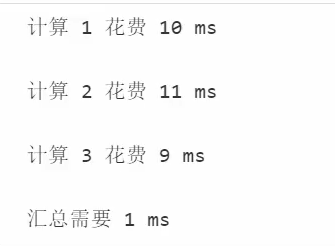

- 如果是串行执行，那么总共花费时间是10+11+9+1=31ms
- 如果是四核CPU，各个核心分别使用线程1执行计算1，线程2执行计算2，线程3执行计算3，那么3个线程是并行的，花费时间取决于最长的那个线程运行的时间，即11+1=12ms

#### 1）设计

##### ① 环境搭建

- 基准测试工具选择：选择JMH，它会执行程序预热，执行多次测试并平均

- CPU核数限制，有两种思路：

  1. 使用虚拟机，分配合适的核
  2. 使用msconfig，分配合适的核，需要重启比较麻烦

- 并行计算方式的选择 

  1. 最初想直接使用parallel stream，后来发现它有自己的问题
  2. 改为了自己手动控制thread，实现简单的并行计算 

- 测试代码如下：

  ```shell
  mvn archetype:generate -DinteractiveMode=false -DarchetypeGroupId=org.openjdk.jmh -
  DarchetypeArtifactId=jmh-java-benchmark-archetype -DgroupId=org.sample -DartifactId=test -
  Dversion=1.0
  ```

  ```java
  package com.itcast;
  
  import org.openjdk.jmh.annotations.*;
  
  import java.util.Arrays;
  import java.util.concurrent.FutureTask;
  
  @Fork(1)
  @BenchmarkMode(Mode.AverageTime)
  @Warmup(iterations=3)
  @Measurement(iterations=5)
  public class MyBenchmark {
      static int[] ARRAY = new int[1000_000_00];
      static {
          Arrays.fill(ARRAY, 1);
      }
      @Benchmark
      public int c() throws Exception {
          int[] array = ARRAY;
          FutureTask<Integer> t1 = new FutureTask<>(()->{
              int sum = 0;
              for(int i = 0; i < 250_000_00;i++) {
                  sum += array[0+i];
              }
              return sum;
          });
          FutureTask<Integer> t2 = new FutureTask<>(()->{
              int sum = 0;
              for(int i = 0; i < 250_000_00;i++) {
                  sum += array[250_000_00+i];
              }
              return sum;
          });
          FutureTask<Integer> t3 = new FutureTask<>(()->{
              int sum = 0;
              for(int i = 0; i < 250_000_00;i++) {
                  sum += array[500_000_00+i];
              }
              return sum;
          });
          FutureTask<Integer> t4 = new FutureTask<>(()->{
              int sum = 0;
              for(int i = 0; i < 250_000_00;i++) {
                  sum += array[750_000_00+i];
              }
              return sum;
          });
          new Thread(t1).start();
          new Thread(t2).start();
          new Thread(t3).start();
          new Thread(t4).start();
          return t1.get() + t2.get() + t3.get()+ t4.get();
      }
      @Benchmark
      public int d() throws Exception {
          int[] array = ARRAY;
          FutureTask<Integer> t1 = new FutureTask<>(()->{
              int sum = 0;
              for(int i = 0; i < 1000_000_00;i++) {
                  sum += array[0+i];
              }
              return sum;
          });
          new Thread(t1).start();
          return t1.get();
      }
  }
  ```

##### ② 双核CPU（四个逻辑CPU）

```shell
C:\Users\spzha\OneDrive\Study\coding\concurrent\jmh_performance\target>java -jar -Xmx2G benchmarks.jar
    ...
Benchmark            Mode  Samples  Score  Score error  Units
c.i.MyBenchmark.c    avgt        5  0.024        0.005   s/op
c.i.MyBenchmark.d    avgt        5  0.044        0.013   s/op
```

可以看到多核下，效率提升还是很明显的，快了一倍左右。

##### ③ 单核CPU

```shell
C:\Users\lenovo\eclipse-workspace\test>java -jar target/benchmarks.jar
	...
Benchmark Mode Samples Score Score error Units
o.s.MyBenchmark.c avgt 5 0.061 0.060 s/op
o.s.MyBenchmark.d avgt 5 0.064 0.071 s/op
```

性能几乎是一样的。

### 2）结论

1. **单核cpu下，多线程并不能实际提高程序运行效**率，但是可以让不同的线程轮流使用cpu，**避免被某一个线程一直占用。**
2. 多核cpu可以并行跑多个线程，但能否提高程序运行效率还是要分情况的
   - **并非所有的任务都能拆分（阿姆达尔定律）**
   - 并非所有任务都需要拆分，任务的目的如果不同，谈拆分核效率没啥意义
3. **IO操作不占用cpu，只是一般拷贝文件使用的是阻塞IO，相当于线程虽然不用cpu，但需要一直等待IO接数，没能充分利用线程**。所以才有后面的非阻塞IO和异步IO优化。

# 2. Java线程

**本章内容：**

- 创建和运行线程
- 查看线程
- 线程API,
- 线程状态
- **应用**
  - 异步调用
  - 提高效率
  - 同步等待
  - 统筹规划
- **原理方面**
  - 线程运行流程
  - Thread两种创建方式的源码
- 模式方面
  - 两阶段终止

## 2.1 创建和运行线程

### 1）直接使用Thread

```java
//创建线程对象,构造方法的参数是给线程指定的名字，推荐给创建的线程指定名字
Thread t = new Thread("t1") {
    @Override
    public void run() {
        //要执行的任务
        System.out.println("new thread");
    }
};
//启动线程
t.start();
```

### 2）使用Runnable配合Thread

把线程和任务（要执行的代码）分开

- Thread代表线程
- Runnable可运行的任务（线程要执行的代码）

```java
Runnable runnable = new Runnable() {
    public void run() {
        //要执行的任务
    }
};
Thread t = new Thread(runnable, "t2");
t.start();
```

### 3）FutureTask配合Thread

FutureTask能够接收Callable类型的参数，用来处理有返回结果的情况。

- Callable继承了Runnable，可以认为是带返回类型的Runnable

```java
@Slf4j(topic = "c.Test2")
public class Test2 {
    public static void main(String[] args) throws ExecutionException, InterruptedException {
        FutureTask<Integer> task = new FutureTask<>(new Callable<Integer>() {
            @Override
            public Integer call() throws Exception {
                log.debug("running");
                Thread.sleep(1000);
                return 100;
            }
        });

        new Thread(task, "t1").start();
        log.debug("{}", task.get());
    }
}
```

### 3）Lambda简化

带有一个抽象方法的接口会被@FunctionalInterface注解，这种接口都可以使用lambda表达式；Runnable接口仅包含一个抽象方法run()，可以使用lambda表达式简化。

```java
Runnable runnable = () -> {System.out.print("lambda");};
```

### 4）原理之Thread和Runnable之间的关系

- 用Runnable更容易与线程池等高级API配合
- 用Runnable让任务脱离了Thread继承体系，更灵活（**组合优于继承**）

## 2.2 观察多个线程交替执行

主要是理解：

- 交替执行
- 谁先谁后，不由我们控制

```java
package cn.itcast.test;

import lombok.extern.slf4j.Slf4j;

@Slf4j(topic = "c.Test3")
public class Test3 {
    public static void main(String[] args) {
        new Thread(() -> {
            while(true) {
                log.debug("running...");
            }
        }, "t1").start();

        new Thread(() -> {
            while(true) {
                log.debug("running...");
            }
        }, "t2").start();
    }
}
```

## 2.3 查看进程线程的方法

### 1）Windows

- 任务管理器
- tasklist | findstr java
- taskkill /F /PID 22860

### 2）Linux

- ps -fe 查看所有进程
- ps -fT -p \<PID>
- kill
- top
- top -H -p \<PID>

### 3）Java

- jps命令查看所有Java进程
- jstack \<PID> 查看某个Java进程（PID）的所有线程状态
- jconsole 查看某个Java进程中线程的运行情况（图形界面）


## 2.4 原理之线程运行

### 1）栈与栈桢

JVM中由堆、栈、方法区所组成，其中**栈为线程独有**，每个**线程启动后，虚拟机就会为其分配一块栈地址。**

- **栈由栈桢组成**，栈桢的压栈和出栈对应着方法的调用和结束；

- 每个线程**只能有一个活动栈桢**，对应当前正在执行的方法。

  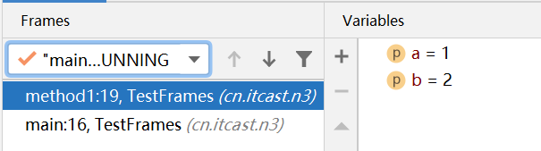

```java
public class TestFrames {
        //主线程中创建一个线程，分别调用其他两个方法
    public static void main(String[] args) {
        Thread t1 = new Thread("t1") {
            @Override
            public void run() {
                method1(1,2);
            }
        };
        t1.start();
        method1(1, 2);
    }
    private static int method1(int a, int b) {
        Object m = method2();
        System.out.println(m);
        return a + b;
    }
    private static Object method2(){
        return new Object();
    }
}
```

### 2）线程上下文切换

cpu不再执行当前线程代码，需要进行线程切换的场景有以下几种：

- 线程的cpu时间片用完
- 垃圾回收
- 更高优先级的线程需要运行
- 线程自己调用了sleep、yield、wait、join、park、synchronized、lock等方法

当发生线程上下文切换时，需要由操作系统保存当前线程的状态，并恢复另一个线程的状态：

- 状态：程序计数器（记住要执行的下一条jvm指令的地址）、虚拟机栈栈桢中的信息，如局部变量表、操作数栈、返回地址等（**保存到哪**）
- 线程上下文切换频繁会影响性能

## 2.5 常见方法

| **方法名**      | static | **功能说明**                      | 注意                                                         |
| :-------------- | ------ | --------------------------------- | ------------------------------------------------------------ |
| start()         |        | 启动线程，将线程状态改为就绪状态  | 对于同一个线程对象，不能多次调该方法，否则会出现IllegalThreadStateException；调用该方法后，并不一定会立即执行该方法 |
| run()           |        | 线程执行时会执行run()方法中的代码 | 默认该方法可以创建Thread的子类对象，来覆盖默认的行为         |
| join()          |        | 等待线程运行结束                  |                                                              |
| join(long n)    |        | 等待线程运行结束，最多等待n毫秒   | 单位是毫秒                                                   |
| getId()         |        | 获取线程的长整型id                | id唯一                                                       |
| getName()       |        | 获取线程名                        |                                                              |
| setName()       |        | 修改线程名                        |                                                              |
| getState()      |        | 获取线程状态                      |                                                              |
| getPriority()   |        | 获取线程优先级                    |                                                              |
| setPriority()   |        | 修改线程优先级                    |                                                              |
| sleep()         | static |                                   |                                                              |
| inInterrupted() |        | 判断线程是否被打断                | 不会清除打断标记                                             |
| interrupted()   | static | 判断当前线程是否被打断            | 返回值之后，会将打断标记重置为false                          |
|                 |        |                                   |                                                              |

### 1）start()与run()

调用一个线程对象的run()方法并不会启动新的线程，只会在当前线程中调用run()方法（在当前线程虚拟机栈中压入一个栈桢），不会起到异步调用的效果；

调用一个线程对象的start()方法，会将该线程对象置为就绪状态，该线程之后被cpu分配时间片的时候便可以运行。该线程运行时，会调用其run()方法，执行run()方法中的代码。

- 运行start()方法会让线程进入就绪状态，并不一定会立即运行改线程

- **一个线程对象只能执行一次start()方法**，若多次调用，会出现IllegalThreadStateException

```java
@Slf4j(topic = "c.Test4")
public class Test4 {

    public static void main(String[] args) {
        Thread t1 = new Thread("t1") {
            @Override
            public void run() {
                log.debug("running...");
                FileReader.read(Constants.MP4_FULL_PATH);
            }
        };
        //t1.start()
        t1.run();
        log.debug("do other things...");
    }
}
```

### 2）yield()与sleep()

#### sleep()

1. 该方法为static方法，可以通过Thread.sleep(millis)调用，会将当前线程从RUNNABLE状态进入TIMED_WAITING状态；

2. 其他线程可以使用interrupt()方法打断正在睡眠的线程，但是cpu的使用权未必立即给到睡眠结束的线程

   ```java
   @Slf4j(topic = "c.Test7")
   public class Test7 {
       static boolean flag = true;
       public static void main(String[] args) throws InterruptedException {
           Thread t1 = new Thread("t1") {
               @Override
               public void run() {
                   log.debug("enter sleep...");
                   try {
                       Thread.sleep(2000);
                   } catch (InterruptedException e) {
                       log.debug("wake up...");
                       e.printStackTrace();
                   }
                   Test7.flag = false;
               }
           };
           t1.start();
   
           Thread.sleep(1000);
           log.debug("interrupt...");
           t1.interrupt();
           if(flag)
               log.debug("唤醒之后cpu的使用权还在main线程");
           else
               log.debug("唤醒之后cpu使用权立马给到被唤醒的线程");
       }
   }
   ```

3. 建议用**TimeUnit的sleep**代替 Thread的sleep来获得更好的可读性

   ```java
   TimeUnit.SECONDS.sleep(1);
   ```

#### yield()

1. 该方法也是**static方法**，需要通过Thread.yield()调用；
2. 调用yield()会**让线程从运行状态进入就绪状态**，然后让cpu从就绪队列中选择一个优先级高的线程（也**有可能调度到刚刚让出cpu的那个线程**）；
3. **具体实现依赖于操作系统的任务调度器**
4. 该方法一般比较少用到（java.util.concurrent.locks包中的锁会用到该方法）

#### 区别：

1. 调用sleep()进入TIMED_WAITING状态的线程，在睡眠结束之前不会被cpu调度
2. 调用yield()进入就绪状态的线程，会被cpu调度

### 3）线程优先级

- 线程优先级**只起到建议作用**，调度器可以忽略
- cpu比较忙，那么优先级高的线程会获得更多的时间片，但是cpu闲时，优先级几乎没有作用

```java
@Slf4j(topic = "c.Test9")public class Test9 {    public static void main(String[] args) {        Runnable task1 = () -> {            int count = 0;            for (;;) {                System.out.println("---->1 " + count++);            }        };        Runnable task2 = () -> {            int count = 0;            for (;;) {                Thread.yield();                System.out.println("              ---->2 " + count++);            }        };        Thread t1 = new Thread(task1, "t1");        Thread t2 = new Thread(task2, "t2");//        t1.setPriority(Thread.MIN_PRIORITY);//        t2.setPriority(Thread.MAX_PRIORITY);        t1.start();        t2.start();    }}
```

### 4）join()方法

当需要等待某几件事情完成后才能继续往下执行，比如等待多个线程加载资源再汇总处理，可以使用join()方法。

- 等待调用join()方法的线程执行结束，再执行当前线程（**同步**）
- **join(long millis): 最多等待millis毫秒**

执行下面代码，打印r 的结果为：0

- 因为主线程和t1线程并行执行，t1线程需要1秒之后才能算出r=10
- 而主线程一开始就要打印r的结果，所以只能打印出r=0

```java
@Slf4j(topic = "c.Test10")public class Test10 {    static int r = 0;    public static void main(String[] args) throws InterruptedException {        test1();    }    private static void test1() throws InterruptedException {        log.debug("开始");        Thread t1 = new Thread(() -> {            log.debug("开始");            sleep(1);            log.debug("结束");            r = 10;        },"t1");        t1.start();//        t1.join();        log.debug("结果为:{}", r);        log.debug("结束");    }}
```

用sleep()可以解决问题嘛？

- 可以，但是不确定t1线程要执行多久，不能在t1线程结束之后就立马执行main线程

### 5）interrupt()

#### ① 打断阻塞状态（调用了sleep、wait、join）的线程

打算sleep的线程，会清空打断状态（isInterrupted()）,将其重置为false，以sleep为例

```java
public static void main(String[] args) throws InterruptedException {    Thread t1 = new Thread(() -> {        log.debug("sleep...");        try {            Thread.sleep(5000); // wait, join        } catch (InterruptedException e) {            e.printStackTrace();        }    },"t1");    t1.start();    //让主线程睡眠，方便t1执行    Thread.sleep(1000);    log.debug("interrupt");    t1.interrupt();    //输出false    log.debug("打断标记:{}", t1.isInterrupted());}
```

#### ② 打断正常的线程

- 打断正常执行的线程，只会**将打断标记置为true**，**但并不会终止其执行**
- 可以在被打断线程中判断其是否被打断，如果被打断，则终止运行

```java
public static void main(String[] args) throws InterruptedException {    Thread t1 = new Thread(() -> {        while(true) {            boolean interrupted = Thread.currentThread().isInterrupted();            if(interrupted) {                log.debug("被打断了, 退出循环");                break;            }        }    }, "t1");    t1.start();    Thread.sleep(1000);    log.debug("interrupt");    t1.interrupt();}
```

### 6）LockSupport.park()

- 线程打断标记为false时，调用LockSupport.park()方法会让该线程阻塞，该线程被interrupt()后，可以继续执行

- 线程打断标记为true时，调用LockSupport.park()方法并不会让线程阻塞

## 2.6 不推荐使用的方法

以下这些方法已过时，**容易破坏同步代码块，造成线程死锁**，不推荐使用。

| 方法名   | static | 功能说明         |
| -------- | ------ | ---------------- |
| stop()   |        | 停止线程运行     |
| suspend  |        | 挂起（暂停）线程 |
| resume() |        | 恢复线程运行     |

## 2.7 主线程与守护线程

默认情况下，Java进程要等待所有线程都执行结束，才会结束。有一种特殊的线程叫做**守护线程**（如垃圾回收器线程），只要其他非守护线程运行结束了，即便守护线程中的代码没有执行完，也会被强制结束。

- 可以通过调用线程的setDaemon(true)将线程设置为守护线程
- isDaemon()可以获取该线程是否是守护线程
- Tomcat中Acceptor和Poller线程也都是守护线程

例如：

```java
@Slf4j(topic = "c.Test15")public class Test15 {    public static void main(String[] args) throws InterruptedException {        Thread t1 = new Thread(() -> {            while (true) {                if (Thread.currentThread().isInterrupted()) {                    break;                }            }            log.debug("结束");        }, "t1");        t1.setDaemon(true);        t1.start();        Thread.sleep(1000);        log.debug("结束");    }}
```

输出：

```
11:36:44.364 c.Test15 [main] - 结束
```

## 2. 8 线程的状态

### 1）操作系统层面

从操作系统层面，线程的状态被划分为以下五种：

- 初始状态：仅在语言层面创建了线程对象，还未与操作系统线程相关联
- 可运行状态：（就绪状态），线程对象与操作系统线程关联，可由CPU调度
- 运行状态：获取了CPU时间片运行中的状态
- 阻塞状态：如果调用了阻塞API，线程会切换到阻塞状态，之后会由操作系统唤醒
- 终止状态：线程已经执行完毕

### 2）Java API层面

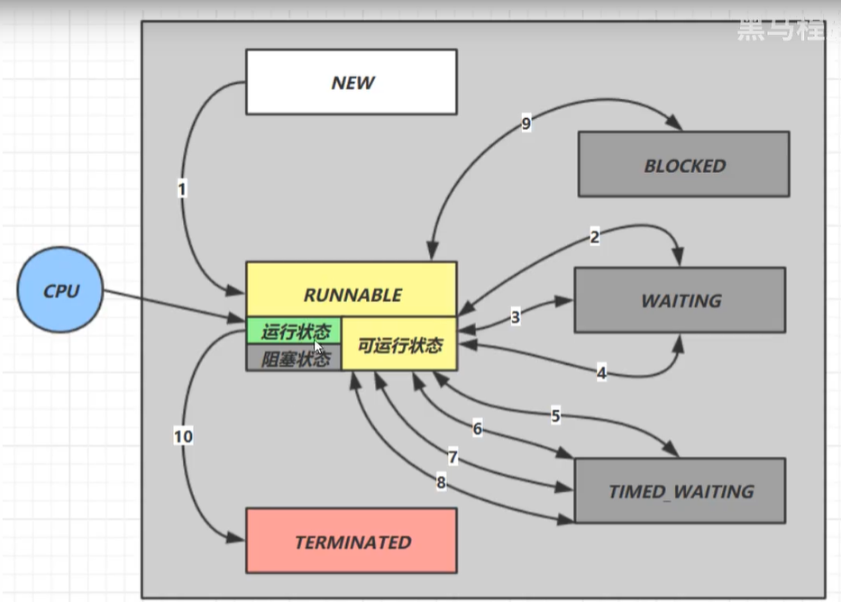

根据Java中Thread.State中的定义，Java线程一共有以下六种状态：

> 操作系统层面，线程的状态是围绕CPU来确定的；而JVM层面，线程的状态的侧重点有所不同，当线程没有获得cpu的时间片，在等待操作系统的其他资源时，其仍未RUNNABLE状态，**Java线程的状态只与自身显示引入的机制有关**，如sleep、waiting、join等。

- NEW
- RUNNABLE
  - 涵盖了操作系统中的运行、可运行以及阻塞状态（时间片只有10-20ms，Java服务于监控，在监控中看到ready，但其实际可能是running）
  - 处于RUNNABLE状态的线程，**如果是被一些资源阻塞，比如IO阻塞，网络阻塞，其会放弃时间片，等待阻塞完成，但其仍处于RUNNABLE状态**
- WAITING
- BLOCKED
- TIMED_WAITING
- TERMINATED

```java
@Slf4j(topic = "c.TestState")public class TestState {    public static void main(String[] args) throws IOException {        Thread t1 = new Thread("t1") {            @Override            public void run() {                log.debug("running...");            }        };        Thread t2 = new Thread("t2") {            @Override            public void run() {                while(true) { // runnable                }            }        };        t2.start();        Thread t3 = new Thread("t3") {            @Override            public void run() {                log.debug("running...");            }        };        t3.start();        Thread t4 = new Thread("t4") {            @Override            public void run() {                synchronized (TestState.class) {                    try {                        Thread.sleep(1000000); // timed_waiting                    } catch (InterruptedException e) {                        e.printStackTrace();                    }                }            }        };        t4.start();        Thread t5 = new Thread("t5") {            @Override            public void run() {                try {                    t2.join(); // waiting                } catch (InterruptedException e) {                    e.printStackTrace();                }            }        };        t5.start();        Thread t6 = new Thread("t6") {            @Override            public void run() {                synchronized (TestState.class) { // blocked                    try {                        Thread.sleep(1000000);                    } catch (InterruptedException e) {                        e.printStackTrace();                    }                }            }        };        t6.start();        try {            Thread.sleep(500);        } catch (InterruptedException e) {            e.printStackTrace();        }        log.debug("t1 state {}", t1.getState());        log.debug("t2 state {}", t2.getState());        log.debug("t3 state {}", t3.getState());        log.debug("t4 state {}", t4.getState());        log.debug("t5 state {}", t5.getState());        log.debug("t6 state {}", t6.getState());        System.in.read();    }}
```

运行结果如下：

```
11:53:07.638 c.TestState [t3] - running...11:53:08.145 c.TestState [main] - t1 state NEW11:53:08.149 c.TestState [main] - t2 state RUNNABLE11:53:08.150 c.TestState [main] - t3 state TERMINATED11:53:08.150 c.TestState [main] - t4 state TIMED_WAITING11:53:08.150 c.TestState [main] - t5 state WAITING11:53:08.150 c.TestState [main] - t6 state BLOCKED
```

## 2.9 习题


## 应用

#### 防止CPU占用100%

##### sleep实现

- 观察调用sleep(1)前后，该java程序对cpu的占用情况
- 可以用wait()或条件变量达到类似的效果，但是这两种都需要加锁，并需要相应的唤醒操作，一般适用于要进行同步的场景
- sleep适用于无需锁同步的场景

```java
public class TestCpu {    public static void main(String[] args) {        new Thread(() -> {            while(true) {                /*try {                    Thread.sleep(1);                } catch (InterruptedException e) {                    e.printStackTrace();                }*/            }        }).start();    }}
```

#### 同步

```java
private static void test2() throws InterruptedException {    Thread t1 = new Thread(() -> {        sleep(1);        r1 = 10;    });    Thread t2 = new Thread(() -> {        sleep(2);        r2 = 20;    });    t1.start();    t2.start();    long start = System.currentTimeMillis();    log.debug("join begin");    t2.join();    log.debug("t2 join end");    t1.join();    log.debug("t1 join end");    long end = System.currentTimeMillis();    log.debug("r1: {} r2: {} cost: {}", r1, r2, end - start);}
```

#### 两阶段终止模式

如何在一个线程T1中优雅地终止线程T2？（即让T2线程处理一些后续事件后，T2线程自动终止）

应用场景

监控


##### 错误思路

- 使用线程对象的stop()方法停止线程
  - **stop()（已被废弃）**方法会杀死线程，但是如果线程被杀死时，其还锁住了共享资源，那么其他线程将永远无法获取该资源
- 使用System.exit(int)方法停止线程
  - 会导致整个程序停止

##### interrupt()实现

```java
@Slf4j(topic = "c.TwoPhaseTermination")public class Test13 {    public static void main(String[] args) throws InterruptedException {        TwoPhaseTermination tpt = new TwoPhaseTermination();        tpt.start();        Thread.sleep(3500);                log.debug("停止监控");        tpt.stop();    }}@Slf4j(topic = "c.TwoPhaseTermination")class TwoPhaseTermination {    // 监控线程    private Thread monitorThread;    // 启动监控线程    public void start() {        monitorThread = new Thread(() -> {            while (true) {                Thread current = Thread.currentThread();                // 是否被打断                if (current.isInterrupted()) {                    log.debug("料理后事");                    break;                }                try {                    Thread.sleep(1000);                    log.debug("执行监控记录");                } catch (InterruptedException e) {                    //如果执行到Thread.sleep(1000)处被打断，则打断标记仍会为flase，需要再次执行interrupt()将打断标记置为true                    current.interrupt();                }            }        }, "monitor");        monitorThread.start();    }    // 停止监控线程    public void stop() {        //stop = true;        monitorThread.interrupt();    }}
```

#### 烧开水问题

##### 问题描述


##### 解法1：join()

```java
public class Test16 {    public static void main(String[] args) {        Thread t1 = new Thread(new Runnable() {            @Override            public void run() {                log.debug("洗水壶");                sleep(1);                log.debug("烧开水");                sleep(15);            }        }, "老张");        Thread t2 = new Thread(new Runnable() {            @Override            public void run() {                log.debug("洗茶壶");                sleep(1);                log.debug("洗茶杯");                sleep(2);                log.debug("拿茶叶");                sleep(1);                try {                    t1.join();                } catch (InterruptedException e) {                    e.printStackTrace();                }                log.debug("泡茶");            }        }, "小王");        t1.start();        t2.start();    }}
```

该解法的缺陷：

1. 上边的两个线程其实是各执行各的，如果要模拟老王把水壶交给小王泡茶，或模拟小王把茶叶交给老王泡茶该如何模拟
2. 上边模拟的是小张等老张烧好开水，小张泡茶，如果要实现老张等小张拿完茶叶该怎么办？代码怎么样可以适用于两种情况？

# 3. 共享模型之管程

[TOC]

并发之共享模型

- 管程-悲观锁
- JMM
- 无锁-乐观锁（非阻塞）
- 不可变
- 并发工具
- 异步编程

并发之非共享模型

**本章内容**

- 共享问题
- synchronized
- 线程安全性分析
- Monitor
- wait/notify
- 线程状态转换
- 活跃性
- Lock

## 3.1 共享问题

分时系统中多线程访问共享资源，可能存在某个线程状态切换的时候，共享资源

### Java体现

两个线程对初始值为0的静态变量一个做自增，一个做自减，各做1000次，结果是0吗？

```java
public class SampleCode1 {
    static int count = 0;
    public static void main(String[] args) {
        Thread t1 = new Thread(new Runnable() {
            @Override
            public void run() {
                for (int i = 0; i < 5000; i++) {
                    count++;
                }
            }
        }, "t1");
        Thread t2 = new Thread(new Runnable() {
            @Override
            public void run() {
                for (int i = 0; i < 5000; i++) {
                    count--;
                }
            }
        }, "t2");
        t1.start();
        t2.start();
        t1.yield();
        t2.yield();
        System.out.println(count);
    }
}
```

### 问题分析

**自增、自减并不是原子操作**；例如，对于i++而言，实际会产生的JVM字节码指令为：

```
getstatic	i	//获取静态变量i的值
iconst_1	//准备常量1
iadd	//自增
putstatic	i	//将修改后的值存入静态变量i
```

对应i--也是类似：

```
getstatic	i	//获取静态变量i的值
iconst_1	//准备常量
isub	//自减
putstatic	i	//将修改后的值存入静态变量i
```

而Java的内存模型如下，完成静态变量的自增、自减需要在主存和工作内存中进行数据交换：


所以，对于线程1、2交替执行的情况，其可能进行了脏读，即读取到了未写回的数据，从而导致最终计算结果出错。

### 临界区Critical Section

- 一个程序运行多个线程本身是没有问题的

- 问题出在多线程访问共享资源

  - 多线程对共享资源**读写操作时发生指令交错**，就会出现问题

- 一段代码块内如果**存在对共享资源的多线程读写操作**，这段代码块为**临界区**。

  ```java
  static int counter = 0;
  static void increment() 
  //临界区
  {
      counter++;
  }
  static void increment()
  //临界区
  {
      counter--;
  }
  ```

  

### 竞态条件Race Condition

**多个线程**在**临界区**内执行，由于**代码的执行序列不同**而导致**结果无法预测**，称之为**竞态条件**。

## 3.2 synchronized解决方案

为了避免临界区的竞态条件发生，有以下几种方式可以达到目的：

- 阻塞式的解决方案：**synchronized**、Lock
- 非阻塞式的解决方案(**适用于多核CPU**)：原子变量

synchronized，又称**对象锁**，采用**互斥**的方式让同一时刻至多只有一个线程能持有对象锁，**想获取这个对象锁的其他线程就会阻塞住**。这样就能保证拥有锁的线程可以安全的执行临界区内的代码，不用担心线程上下文切换。

> **注意**
>
> Java中互斥和同步都可以通过synchronized来实现，但它们之间有所不同：
>
> 1. 互斥是保证临界区的竞态条件不会发生，同一时刻只有一个线程执行临界区代码；
> 2. 同步是线程的执行先后、顺序不同，需要一个线程等待其他线程运行到某个点

### 1）基本用法

```java
synchronized(对象) {	//线程1先只有锁，线程2要获取锁就会被阻塞
    临界区
}

//修饰实例方法
synchronized void increment() {
    
}
//上述方法其实就是锁实例对象
void increment() {
    synchronized(this) {
        
    }
}

//修饰静态方法
synchronized static void increment() {
    
}
//其实是锁类对象
static void increment() {
    synchronized(ClassName.class) {
        
    }
}
```

线程要执行synchronized代码块时，要先获取对象锁，只有成功地获取到了对象锁，该线程才能执行synchronized代码块中的代码；否则，该线程会被阻塞。

- synchronized其实是**利用了对象锁来保证临界区代码的原子性**。

- 如果线程在执行synchronized代码块中代码时，时间片用完了，则此时仍保留对象锁，等待下次调用，**只有执行完synchronized代码块中代码时，才会释放对象锁**；
- **只有当对象锁被持有它的线程释放，其他线程才有机会获取到该对象锁**；
- 当线程释放对象锁时会唤醒被该对象锁阻塞的其他线程（**唤醒只是将其状态切换到RUNNABLE，并不一定会立即执行**）

### 2）变量的线程安全分析

成员变量和静态变量是否线程安全？

- 被共享并且有读写操作，则这段代码是临界区，需要考虑线程安全

  ```java
  class ThreadUnsafe {
      //定义一个list
      //成员变量
      List<Integer> list = new LinkedList<>();
      public void method1(int loopNumber) {
          for (int i = 0; i < loopNumber; i++) {
              method2();
              method3();
          }
      }
      private void method2() {
          list.add(1);
      }
      private void method3() {
          list.remove(0);
      }
  }
  ```

局部变量是否线程安全？

局部变量是线程安全的，但是局部变量引用的对象则未必

- 如果局部变量引用的对象逃离方法的作用范围，则需要考虑线程安全

  ```java
  class ThreadSafe {
      //定义一个list
      public void method1(int loopNumber) {
          List<Integer> list = new LinkedList<>();
          for (int i = 0; i < loopNumber; i++) {
              method2(list);
              //因为子类重写了method3，并且创建了线程，所以list可能会逃出method1
              method3(list);
          }
      }
      private void method2(List<Integer> list) {
          list.add(1);
      }
      //设置为public才会能被子类重写，
      public void method3(List<Integer> list) {
          list.remove(0);
      }
  }
  
  class ThreadSafeSubclass extends ThreadSafe {
      
      @Override
      public void method3(List<Integer> list) {
          new Thread(() -> {
              list.remove(0);
          }).start();
      }
  }
  ```

  - 从上边的例字可以看出，**private或final提供安全**的意义所在（**开闭原则中的闭**）。
  - **如String设置成final，避免了子类继承String从而导致String对象通过子类覆盖方法中的new Thread逃逸，破坏String的线程安全性。**

#### 实例分析

例1：

```java
public class MyServlet extends HttpServlet {
	//不是线程安全的
	Map<String, Object> map = new HashMap();
	//线程安全
	String s1 = "...";
	//不是线程安全的
	Date d1 = new Date();
	//不是线程安全的
	final Date d2 = new Date();
	//不是线程安全的
	private UserService userService =  new UserServiceImpl();
	...
	public class UserServiceImpl implements UserService {
		//不是线程安全的
		private count = 0;
	}
}
```

例2：

```java
@Aspect@Componentpublic class MyAspect {    //MyAspect为单例，其成员变量不是线程安全的    private long start = 0L;}
```

## 3.3 常见的线程安全类

- String
- Integer（所有的包装类）
- StringBuffer
- Random
- Vector（线程安全的list实现）
- Hashtable（通过添加synchronized）
- java.util.concurrent包下的类

这里的线程安全是指，多个线程**调用他们同一个实例的某个方法**时，是**线程安全**的。

```java
Hashtable table = new Hashtable();new Thread(() -> {    table.put("key", "value1");}).start();new Thread(() -> {    table.put("key", "value2");}) .start();
```

### **线程安全类方法的组合**

**分析下面的方法是否线程安全？**

```java
Hashtable table = new Hashtable();if(table.get("key") == null) {	//线程1执行完判断条件后会释放对象锁，此时其他线程就有机会获取对象锁，从而导致两个线程都执行if代码块中的代码	table.put("key", value);}
```

### 不可变类线程安全性

String、Integer（包装类）都是不可变类，其内部状态不可改变，所以他们的方法都是线程安全的。

String类中的replace、substring等方法并不会改变String对象的值，都是创建了新的字符串来返回。

```java
public class Immutable {    private int value = 0;    public Immutable(int value) {	this.value = value;}    public　int getValue() {	return value;}}
```

## 3.4 Monitor对象头

### 1）Java对象头

HotSpot虚拟机中，对象在内存中存储的布局可以分为三块区域：对象头（Header）、实例数据（Instance Data）和对齐填充（Padding）。 

#### 32位虚拟机

**普通对象**

- Object Header(64位/8字节)
  - MarkWord(32位/4字节)
  - KlassWord(32位/4字节)

**数组对象**

- Object Header(96位/12字节)
  - MarkWord(32位/4字节)
  - KlassWord(32位/4字节)
  - array length(32位/4字节)

**MarkWord结构**

#### 64位虚拟机

**普通对象**

- Object Header()
  - MarkWord(64位/8字节)
  - KlassWord(32位/4字节，未开启压缩：64位/8字节)

**数组对象**

- Object Header(192位/24字节)
  - MarkWord(64位/8字节)
  - KlassWord(32/4字节)
  - array length(64位/8字节)

**MarkWord结构**

#### MarkWord

Mark Word主要用来**存储对象运行时存储的数据**，如哈希码、GC分代年龄、线程持有的锁、偏向线程ID（偏向锁，对象有哈希码时，就会关闭）、线程持有的锁等等。

- 为了能够存储对象运行时数据（较多），Mark Word被设计成了一个**非固定的数据结构（根据对象状态会复用某些位）**以便来存储尽可能多的信息。在32位虚拟机和64位虚拟机下，Mark Word存储内容分别为：

  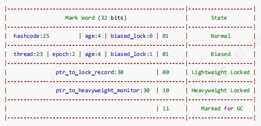

  ​															32位虚拟机Mark Word结构

  ​			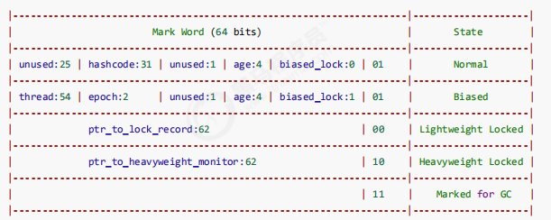

  ​														64位虚拟机Mark Word结构

根据Mark Word的结构，我们可以看到，一个对象一共存在**5种状态**。Mark Word主要通过最后2位（偏向锁状态借助了倒数第三位）来标识其所处的状态：

- **正常**：最后三位为**001**，
- **偏向锁**：最后三位为**101**，除此之外23/54位指向偏向的线程ID
- **轻量级锁**：最后两位为**00**，剩余30/62位指向用于该锁的线程**栈中**的**锁记录地址（LockRecord）**
- **重量级锁**：最后两位为**10**，剩下30/62位为关联的**Monitor对象地址**
- **GC**：最后两位为**11**

> **注**：可以借助**jol-core**来获取对象的对象头进行分析
>
> ```xml
> <dependency> <groupId>org.openjdk.jol</groupId> <artifactId>jol-core</artifactId> <version>0.10</version></dependency>
> ```

### 2）Monitor（锁）

> C语言实现

Monitor被翻译为**监视器**或**管程**。在JVM中，ObjectMonitor是操作系统管程的实现，主要数据结构有：

- _count：基于owner线程获取锁的次数
- _owner：指向持有ObjectMonitor对象的线程
- _WaitSet：存放处于wait状态的线程队列
- _EntryList：存放处于等待锁block状态的线程队列

- _recursions：锁重入的次数

每个Java对象都可以关联一个Monitor对象，如果使用synchronized给对象上锁（**重量级**）之后，该对象头中的MarkWord中就被设置为指向Monitor对象的指针。


1. Thread-2线程要执行synchronized代码块时，先查看obj的Mark Word中有没有指向一个Monitor锁
   - 如果没有，则将obj的MarkWord中30位拿来指向一个Monitor锁（此时owner为null，这一步同时会**将objMark Word中的hashcode、分代年龄等信息添加到Monitor锁对象中**,待没有线程获取持有锁时，再将其还原），并将Monitor锁中的Owner设置为Thread-2
   - 如果有，则将Thread-2添加进入Monitor中的EntryList（等待队列），并且将Thread-2线程状态切换为BLOCKED状态
2. 当Thread-2执行完synchronized代码块时，会释放对象锁，然后唤醒EntryList中等待的线程来竞争锁（**非公平的，即不是先到先竞争到**）
3. WaitSet中的Thread-0，Thread-1是之前获得过的锁，但条件不满足进入WAITING状态的线程

> **注意**
>
> - synchronized必须是进入同一个对象的monitor才有上述的效果
> - 不加synchronized的对象不会管理监视器，不遵从上述规则

### 3）synchronized原理

> **用于锁的对象一般设置为final，确保其不会指向其他的对象**

#### 字节码

- **monitorenter**：进入synchronized代码块时会执行monitorenter指令，将lock对象MarkWord置为Monitro锁对象的指针

- **monitorexit**：离开synchronized代码块时，会执行monitorexit指令，将lock对象的Mark Word重置，唤醒EntryList中的线程

即便**运行synchronized代码块时抛出异常，也能正确的释放锁**。

- 字节码中会自动添加一段字节码指令，当出现异常，会再次执行monitorexit指令（通过异常表配合），尝试将lock对象的Mark Word重置，唤醒EntryList中的线程

```java
public class SampleCode5 {    private static Object lock = new Object();    static int counter = 0;    public static void main(String[] args) {        synchronized (lock) {            counter++;        }    }}
```

```java
 0 getstatic #2 <com/spzhang/chap3/SampleCode5.lock> 3 dup 4 astore_1 5 monitorenter 6 getstatic #3 <com/spzhang/chap3/SampleCode5.counter> 9 iconst_110 iadd11 putstatic #3 <com/spzhang/chap3/SampleCode5.counter>14 aload_115 monitorexit16 goto 24 (+8)19 astore_220 aload_121 monitorexit22 aload_223 athrow	24 return//异常表Nr.	起始PC 结束PC 捕获类型	   跳转0	6	   16	cp_info any   191	19	   22	cp_info any   19
```

#### 优化

##### 故事

故事角色

- 老王 \- JVM

- 小南 \- 线程

- 小女 \- 线程

- 房间 \- 对象

- 房间门上 \- 防盗锁 \- Monitor

- 房间门上 \- 小南书包 \- 轻量级锁房间门上 \- 刻上小南大名 \- 偏向锁

- 批量重刻名 \- 一个类的偏向锁撤销到达 20 阈值

- 不能刻名字 \- 批量撤销该类对象的偏向锁，设置该类不可偏向

小南要使用房间保证计算不被其它人干扰（原子性），最初，他用的是防盗锁，当上下文切换时，锁住门。这样，即使他离开了，别人也进不了门，他的工作就是安全的。

但是，很多情况下没人跟他来竞争房间的使用权。小女是要用房间，但使用的时间上是错开的，小南白天用，小女晚上用。每次上锁太麻烦了，有没有更简单的办法呢？

小南和小女商量了一下，约定不锁门了，而是谁用房间，谁把自己的书包挂在门口，但他们的书包样式都一

样，因此每次进门前得翻翻书包，看课本是谁的，如果是自己的，那么就可以进门，这样省的上锁解锁了。万一书包不是自己的，那么就在门外等，并通知对方下次用锁门的方式。

后来，小女回老家了，很长一段时间都不会用这个房间。小南每次还是挂书包，翻书包，虽然比锁门省事了，但仍然觉得麻烦。于是，小南干脆在门上刻上了自己的名字：【小南专属房间，其它人勿用】，下次来用房间时，只要名字还在，那么说明没人打扰，还是可以安全地使用房间。如果这期间有其它人要用这个房间，那么由使用者将小南刻的名字擦掉，升级为挂书包的方式。

同学们都放假回老家了，小南就膨胀了，在 20 个房间刻上了自己的名字，想进哪个进哪个。后来他自己放假回老家了，这时小女回来了（她也要用这些房间），结果就是得一个个地擦掉小南刻的名字，升级为挂书包的方式。老王觉得这成本有点高，提出了一种批量重刻名的方法，他让小女不用挂书包了，可以直接在门上刻上自己的名字

后来，刻名的现象越来越频繁，老王受不了了：算了，这些房间都不能刻名了，只能挂书包

- 当没有很多其他线程参与共享资源的竞争时，每次执行synchronized代码的获取锁及释放锁的操作带来的开销太大。

- 如果参与竞争的线程数较少，可以在每次要执行synchronized代码块的时候，可以考虑设置一个标识（在MarkWord设置）

##### 轻量级锁

请用场景：如果一个对象虽然有多线程访问，但多线程访问的时间是错开的（没有竞争），那么可以使用轻量级锁优化。

- 轻量级锁对使用者是透明的，即语法仍然是synchronized

> https://blog.csdn.net/qq_28051453/article/details/105449964

批量重偏向和批量撤销是针对类的优化，和对象无关。

> https://blog.csdn.net/weixin_39962341/article/details/111047559

类中记录重偏向：

- 当达到批量重偏向阈值（默认20）时，之后进行批量重偏向（重偏向一次，类中记录重偏向的次数+1）
- 当达到批量撤销的阈值（默认40）时，之后进行批量撤销

偏向锁重偏向一次之后不可再次重偏向。

当某个类已经触发批量撤销机制后，JVM会默认当前类产生了严重的问题，剥夺了该类的新实例对象使用偏向锁的权利

当一个锁对象类的撤销次数达到20次时，虚拟机会认为这个锁不适合再偏向于原线程，于是会在偏向锁撤销达到20次时让这一类锁尝试偏向于其他线程。

当一个锁对象类的撤销次数达到40次时，虚拟机会认为这个锁根本就不适合作为偏向锁使用，因此会将类的偏向标记关闭，之后现存对象加锁时会升级为轻量级锁，锁定中的偏向锁对象会被撤销，新创建的对象默认为无锁状态。

## 3.5 wait notify

> wait/notify是Object中的方法。

### 1）原理

**为什么需要wait和notify方法？**

当进入synchronized代码块的线程，因为**等待其他资源而不能继续执行时**，其一直占有对象锁，导致**其他等待该对象锁线程一直等待**。

​	

- owner线程发现自己需要**等待其他资源**时，调用**wait**方法，即可**释放锁对象**（此时**会唤醒EntryList中的线程**），**进入WaitSet列表**，变为WAITING状态
- BLOCKED和WAITING状态的线程都处于阻塞状态，**不占用CPU**
- WaitSet中的线程会在**owner线程**调用**notify**或者**notifyAll**时唤醒（**进入EntryList中重新竞争**）

### 2）API介绍

- obj.wait()将当前拥有object对象锁的线程**释放对象锁并进入WaitSet**
- obj.wait(long timeout)有时限的等待，wait方法是无时限等待（其实内部调用了wait(0)）
- obj.wait(long timeout, int nanos)内部实现是判断只要有nanos大于0，就让timeout+1，不能精确到纳秒，timeout是毫秒
- obj.notify()从object的WaitSet中挑一个线程唤醒（**java 1.8唤醒改为公平的，按先进先出唤醒**）
- obj.notifyAll()让object上WaitSet中的线程全部唤醒（即进入EntryList）

wait/notify都是Object对象的方法，是线程协作的一种手段。**必须获得对象的锁，才能调用wait/notify方法**；否则，程序会**报IllegalMonitorStateException异常**：

```
Exception in thread "main" java.lang.IllegalMonitorStateException	at java.lang.Object.wait(Native Method)	at java.lang.Object.wait(Object.java:502)	at com.spzhang.chap3.SampleCode8.main(SampleCode8.java:10)
```

```java
public class SampleCode8 {    static final Object lock = new Object();    synchronized int add(int a, int b) throws InterruptedException {        //调用实例对象的wait        this.wait();        return a + b;    }    synchronized static int sum(int a, int b) {        try {            //调用类对象的wait            SampleCode8.class.wait();        } catch (InterruptedException e) {            e.printStackTrace();        }        return a + b;    }        public static void main(String[] args) {        synchronized (lock) {            try {                lock.wait();            } catch (InterruptedException e) {                e.printStackTrace();            }        }//        会报IllegalMonitorStateException//        try {//            lock.wait();//        } catch (InterruptedException e) {//            e.printStackTrace();//        }    }}
```

### 3）正确使用

#### sleep与wait的区别

1. sleep是**Thread的静态方法**，wait是Object的实例方法
2. sleep不需要强制和synchronized使用，但wait需要跟synchronized一起用
3. 如果在synchronized代码块中**执行sleep，该线程不会释放对象锁**；而**wait会使得该线程释放对象锁**

#### 问题实例

> 模拟小南有烟后才能继续干活

notify唤醒了某个其实没有满足条件的线程怎么办？（虚假唤醒）

```java
synchronized(lock) {    while(条件不成立) {    	lock.wait();	}}//另一个线程用notifyAll()唤醒synchronized(lock) {    lock.notifyAll();}
```


## 3.6 同步模式之保护性暂停

即Guarded Suspension，用在一个线程等待另一个线程的执行结果。

- 有**一个结果**需要从一个线程传递到另一个线程，让他们**关联同一个GuardedObject**
- 如果有结果不断从一个线程到另一个线程那么可以使用**消息队列（生产者/消费者）**
- JDK中，**join**的实现、**Futrue**的实现，采用的就是此模式
- 因为要等待另一方的结果，因此归类到**同步模式**

该模式相对于join的优势：

- 等待结果的那个变量可以设置为局部的
- join要等待线程结束才能执行

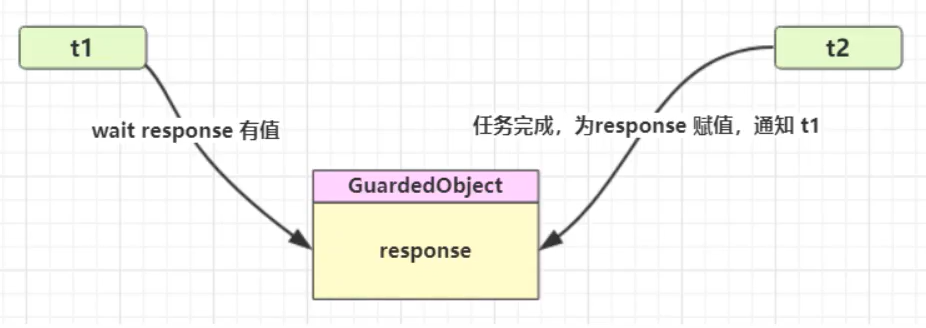

### 1）基本实现

```java
public class SampleCode12 {    //线程1等待线程2的结果    public static void main(String[] args) {        //同一个GuardedObject对象        GuardedObject guardedObject = new GuardedObject();        new Thread(() -> {            System.out.println("t1等待结果");            List<String> response = (List<String>) guardedObject.getResponse();            System.out.println("下载内容：" + response.toString());        }, "t1").start();        new Thread(() -> {            System.out.println("t2执行下载");            try {                List<String> list = Downloader.download();                guardedObject.setResponse(list);            } catch (IOException e) {                e.printStackTrace();            }        }, "t2").start();    }}//class GuardedObject {    //结果    private Object response;    //获取结果    public Object getResponse() {        synchronized (this) {            //还没有结果            while(response == null) {                try {                    this.wait();                } catch (InterruptedException e) {                    e.printStackTrace();                }            }            return response;        }    }    //限时等待     public Object getResponse(long timeout) {        synchronized (this) {            //还没有结果            long beginTime = System.currentTimeMillis();            long passedTime = 0;            while(response == null) {                //这轮循环应该等待的时间                long waitTime = timeout - passedTime;                if(waitTime <= 0)                    break;                try {                    this.wait(waitTime);                } catch (InterruptedException e) {                    e.printStackTrace();                }                passedTime = System.currentTimeMillis() - beginTime;            }            return response;        }    }    //产生结果    public void setResponse(Object object) {        synchronized (this) {            this.response = object;            this.notifyAll();        }    }}class Downloader {    public static List<String> download() throws IOException {        HttpURLConnection conn = (HttpURLConnection) new URL("https://www.baidu.com").openConnection();        List<String> lines = new ArrayList<>();        BufferedReader reader = new BufferedReader(new InputStreamReader(conn.getInputStream(), StandardCharsets.UTF_8));        String line;        while((line = reader.readLine()) != null) {            lines.add(line);        }        return lines;    }}
```

### 2）join原理

- 获取当前时间
- 进入循环之后，计算还需要等待的时间
- 判断需要等待的时间是否有效，如果小于0则跳出循环
- 调用wait(delay)等待需要等待的时间
- 获取已经等待的时间

```java
public final synchronized void join(long millis)    throws InterruptedException {    long base = System.currentTimeMillis();    long now = 0;    if (millis < 0) {        throw new IllegalArgumentException("timeout value is negative");    }    if (millis == 0) {        while (isAlive()) {            wait(0);        }    } else {        while (isAlive()) {            long delay = millis - now;            if (delay <= 0) {                break;            }            wait(delay);            now = System.currentTimeMillis() - base;        }    }}
```

### 3）扩展

如果需要多个类之间使用GuardedObject对象，作为参数传递不是很方便，可以设计一个**解耦的中间类**，这样不仅可以**解耦结果等待着和结果生产者**，还能同时**支持多个任务的管理**。

- GuardedObject类需要增加id标识


- 使用Mailboxes类来解耦收信和送信

```java
public class SampleCode12 {    //线程1等待线程2的结果    public static void main(String[] args) throws InterruptedException {        for(int i = 0; i < 3; i++) {            new People().start();        }        TimeUnit.SECONDS.sleep(1);        for (Integer id : Mailboxes.getIds()) {            new Postman(id, "内容" + id).start();        }    }}//class GuardedObject {    private int id;    public GuardedObject(int id) {        this.id = id;    }    public int getId() {        return id;    }    //结果    private Object response;    //获取结果    public Object getResponse() {        synchronized (this) {            //还没有结果            while(response == null) {                try {                    this.wait();                } catch (InterruptedException e) {                    e.printStackTrace();                }            }            return response;        }    }    //限时等待    public Object getResponse(long timeout) {        synchronized (this) {            //还没有结果            long beginTime = System.currentTimeMillis();            long passedTime = 0;            while(response == null) {                //这轮循环应该等待的时间                long waitTime = timeout - passedTime;                if(waitTime <= 0)                    break;                try {                    this.wait(waitTime);                } catch (InterruptedException e) {                    e.printStackTrace();                }                passedTime = System.currentTimeMillis() - beginTime;            }            return response;        }    }    //产生结果    public void setResponse(Object object) {        synchronized (this) {            this.response = object;            this.notifyAll();        }    }}class People extends Thread{    @Override    public void run() {        //收信        GuardedObject guardedObject = Mailboxes.createGuardedObject();        System.out.println("收信 id：" + guardedObject.getId());        Object mail = guardedObject.getResponse(5000);        System.out.println("收到信后 id：" + guardedObject.getId() + " 内容：" + guardedObject.getResponse());    }}class Postman extends Thread{    private int id;    private String mail;    public Postman(int id, String mail) {        this.id = id;        this.mail = mail;    }    @Override    public void run() {        GuardedObject guardedObject = Mailboxes.getGuardedObject(id);        guardedObject.setResponse(mail);    }}class Mailboxes {    private static  Map<Integer, GuardedObject> boxes = new Hashtable<>();    private static int id = 1;    public static GuardedObject getGuardedObject(int id) {        return boxes.remove(id);    }    //产生唯一的id    private static synchronized  int generatedId() {        return id++;    }    public static GuardedObject createGuardedObject() {        GuardedObject go = new GuardedObject(generatedId());        boxes.put(go.getId(), go);        return go;    }    public static Set<Integer> getIds() {        return boxes.keySet();    }}
```

## 3.7 异步模式之生产者/消费者

> 上边的保护性暂停是同步的并且是1对1的，而生产者/消费者是异步的多对多的。

- 不需要产生结果和消费结果的线程一一对应
- 消费队列可以用来平衡生产和消费的线程资源
- 生产者仅负责产生结果数据，不关心数据该如何处理，而消费者专心处理结果数据
- **消息队列是有容量限制的**，满时不会再加入数据，空时不会再消耗数据
- JDK中各种阻塞队列，采用的就是这种模式

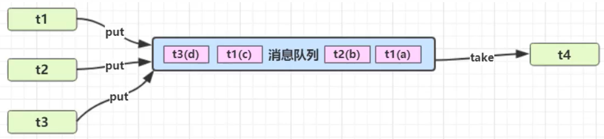

```java
package com.spzhang.chap3;import java.util.LinkedList;import java.util.concurrent.TimeUnit;/** * 生产者消费者 */public class SampleCode14 {    public static void main(String[] args) {        MessageQueue queue = new MessageQueue(2);        for(int i = 0; i < 3; i++) {            int id = i;            new Thread(() -> {                queue.put(new Message(id, "id值" + id));            }, "生产者" + i).start();        }        new Thread(() -> {            while(true) {                try {                    TimeUnit.SECONDS.sleep(1);                } catch (InterruptedException e) {                    e.printStackTrace();                }                queue.take();            }        }, "消费者").start();    }}//消息队列类，java线程之间通信class MessageQueue {    //消息的队列集合    private LinkedList<Message> list = new LinkedList<>();    //队列容量    private int capcity;    //获取消息    public MessageQueue(int capcity) {        this.capcity = capcity;    }    public synchronized Message take() {        //检查队列是否为空        synchronized (list) {            while(list.isEmpty()) {                try {                    System.out.println("队列为空，消费者线程等待");                    list.wait();                } catch (InterruptedException e) {                    e.printStackTrace();                }            }            //从队列头部获取消息并返回            Message message = list.removeFirst();            list.notifyAll();            System.out.println("消费者已消费数据");            return message;        }    }    //存入消息    public void put(Message message) {        synchronized (list) {            while(list.size() == capcity) {                try {                    System.out.println("队列已满，生产者线程只能等待");                    list.wait();                } catch (InterruptedException e) {                    e.printStackTrace();                }            }            //将消息加入队列尾部            list.addLast(message);            System.out.println("生产者已生产消息");            list.notifyAll();        }    }}final class Message {    private int id;    private Object value;    @Override    public String toString() {        return "Message{" +                "id=" + id +                ", value=" + value +                '}';    }    public int getId() {        return id;    }    public Object getValue() {        return value;    }    public Message(int id, Object value) {        this.id = id;        this.value = value;    }}
```

## 3.8 park和unpark

### 1）基本使用

它们是LockSupport类中的方法

```java
//在线程内调用LockSupport.park();LockSupport.unpark(线程名);
```

与Object的wait和notify相比

- wait和notify必须在synchronized代码块中使用，而park和unpark不必
- park和unpark是以线程为单位来阻塞和唤醒线程，而notify只能随机唤醒一个等待线程，notifyAll是唤醒所有线程
- unpark可以在线程park前调用，也可以在线程park之后调用

### 2）原理

每个线程都有自己的一个Park对象，由_counter,\_cond和\_mutex组成。

- 每次调用park就是看需不需要停下来休息
  - 如果备用干粮耗尽（_counter=0），那么钻进帐篷（\_cond）歇息
  - 如果备用干粮充足（\_counter>0），那么不需要停留，吃一块干粮，继续前进
- 调用unpark，就好比令干粮充足
  - 如果这时线程还在帐篷，就唤醒让他继续前进
  - 如果这时线程还在运行，那么下次他调用park时，仅是消耗掉备用干粮，不需停留继续前进
    - 因为背包空间有限，**多次调用unpark仅会补充一份备用干粮**

#### park() -> unpark(Thread_0)

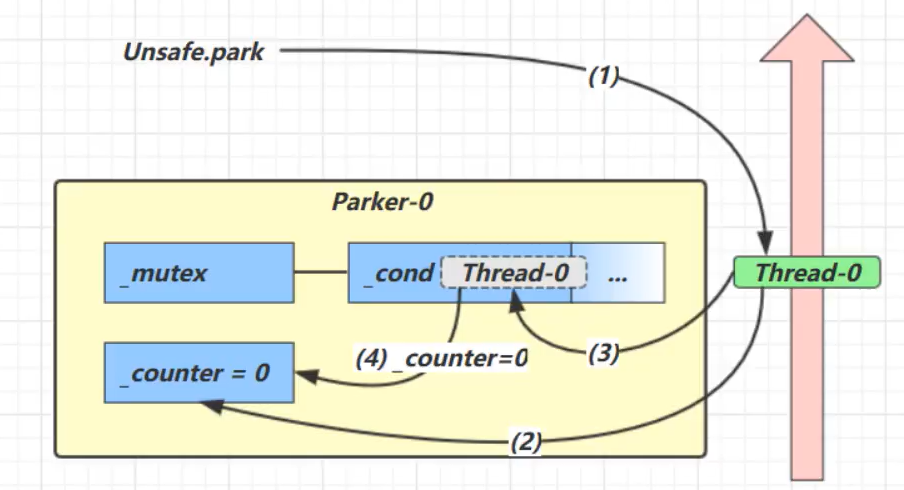

1. 当前线程调用Unsafe.park()方法
2. 检查\_counter,本情况如0，这时获得_mutex互斥锁
3. 线程进入_cond条件变量阻塞
4. 设置_counter=0


1. 调用Unsafe.unpark(Thread_0)方法，设置_counter为1
2. 唤醒_cond条件变量中的Thread_0
3. Thread_0恢复运行
4. 设置_counter为0

#### unpark(Thread_0) -> park()

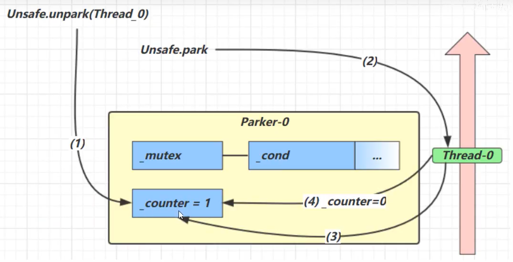

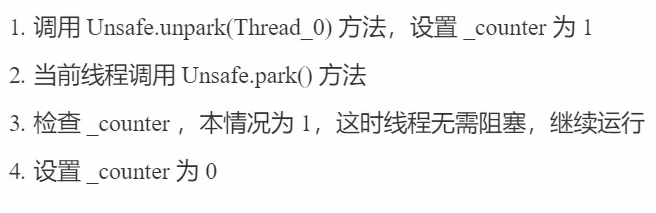

1. 调用Unsafe.unpark(Thread_0)方法，设置_counter为1
2. 当前线程调用Unsafe.park()方法
3. 检查_counter,本情况为1，这时线程无需阻塞，继续运行
4. 设置_counter为0

### 3）LockSupport.park()与Thread.sleep(millis)比较

> LockSupport.park()还有几个兄弟方法——parkNanos()、parkUtil()等，我们这里说的park()方法统称这一类方法。

（1）从功能上来说，Thread.sleep()和LockSupport.park()方法类似，**都是阻塞当前线程的执行**，且**都不会释放当前线程占有的锁资源**；

（2）**Thread.sleep()没法从外部唤醒**，只能自己醒过来；LockSupport.park()方法可以被另一个线程调用LockSupport.unpark()方法唤醒；

（4）**Thread.sleep()方法声明上抛出了InterruptedException中断异常**，所以调用者需要捕获这个异常或者再抛出；LockSupport.park()方法不需要捕获中断异常；

（6）**Thread.sleep()本身就是一个native方法**；LockSupport**.park()**底层是**调用的Unsafe的native方法；**

### 4）Object.wait()和LockSupport.park()的区别

（1）obj.wait()方法需要在synchronized块中执行；LockSupport.park()可以在任意地方执行；

（2）**obj.wait()方法声明抛出了中断异常**，调用者需要捕获或者再抛出；LockSupport.park()不需要捕获中断异常

（3）**obj.wait()不带超时的，需要另一个线程执行notify()来唤醒**，但不一定继续执行后续内容；**LockSupport.park()不带超时的，需要另一个线程执行unpark()来唤醒，一定会继续执行后续内容**；

（4）如果在wait()之前执行了notify()会怎样？**抛出IllegalMonitorStateException异常**；如果在park()之前执行了unpark()会怎样？**线程不会被阻塞，直接跳过park()，继续执行后续内容**；

（5）wait为实例方法，park为静态方法

## 3.9 重新理解线程转换


> 假设有线程t
>
> **park()、wait()、join()都可以被interrupt打断，而sleep()不可以被打断**

### 情况1 NEW --> RUNNABLE

- 当调用t.start()方法时，t的状态由NEW变为RUNNABLE，该状态转换只会发生一次

### 情况2 RUNNABLE <--> WAITING

t线程用synchronized(obj)获取了对象锁后

- 调用**obj.wait()**方法时，t线程从RUNNABLE -->WAITING状态
- 调用**obj.notify()**, obj.notifyAll(),**t.interrupt()**时
  - 竞争锁成功：t线程从WAITING --> RUNNABLE(可以被调度)
  - 竞争锁失败：t线程从WAITING --> BLOCKED

### 情况3 RUNNABLE <--> WAITING

- 当前线程调用**t.join()**方法时，当前线程从RUNNABLE --> WAITING
  - **当前线程**在t线程对象的监视器上**等待**
- t线程运行结束，或调用当前线程的**interrupt()**，当前线程从WAITING --> RUNNABLE

### 情况4 RUNNABLE <--> WAITING

- **t线程内**调用LockSupport.park()方法会让当前线程从RUNNABLE --> WAITING
- 调用**LockSupport.unpark(t)**，或者调用**t.interrupt()**，当前线程从WAITING --> RUNNABLE

### 情况5 RUNNABLE <--> TIMED_WAITING

t线程用synchronized(obj)获取了对象锁后

- 调用obj.wait(long n)方法时，t线程从RUNNABLE -->TIMED_WAITING状态
- t线程等待时间超过了n毫秒，或者调用obj.notify(), obj.notifyAll(),**t.interrupt()**时：
  - 竞争锁成功：t线程从TIMED_WAITING--> RUNNABLE(可以被调度)
  - 竞争锁失败：t线程从TIMED_WAITING --> BLOCKED

### 情况6 RUNNABLE <--> TIMED_WAITING

- 当前线程调用t.join(long n)方法时，当前线程从RUNNABLE --> TIMED_WAITING
  - 当前线程再t线程对象的监视器上等待
- t线程运行结束，或当前线程等待超过n毫秒，或**调用当前线程的interrupt()**，当前线程从TIMED_WAITING --> RUNNABLE

### 情况7 RUNNABLE <--> TIMED_WAITING

- t线程内调用LockSupport.parkNanos(long nanos)或LockSupport.parkUntil(long millis)时，t线程从RUNNABLE --> TIMED_WAITING
- 调用LockSupport.unpark(t)，或者调用**t.interrupt()**，或者等待超时，当前线程从TIMED_WAITING --> RUNNABLE

### 情况8 RUNNABLE <-->TIMED_WAITING

- 当前线程调用Thread.sleep(long n),当前线程从RUNNABLE --> TIMED_WAITING

- **当前线程等待时间超过n毫秒**，当前线程从TIME_WAITING --> RUNNABLE

### 情况9 RUNNABLE <--> BLOCKED

- t线程用synchronized(obj)获取对象锁时如果竞争时便，则从RUNNABLE --> BLOCKED
- 处于BLOCKED状态的t线程竞争锁成功，则会从BLOCKED变为RUNNABLE

### 情况10 RUNNABLE --> TERMINATED

线程内的代码运行完毕

## 3.10 多把锁

> com.spzhang.chap3. SampleCode16

一间屋子有两个功能：睡觉、学习，互不相干。

现在小南要学习，小女要睡觉，如果只用一间屋子（一个对象锁）的画，并发度很低。

解决方法是准备多个房间（多个对象锁）。

- 将锁的粒度细分，可以增强并发
  - 如果一个线程需要同时获得多把锁，容易发生死锁

```java
class BigRoom {    private final Object studyRoom= new Object();    private  final Object sleepRoom = new Object();    public void sleep() {        synchronized (sleepRoom) {            System.out.println("睡觉2小时");            try {                TimeUnit.SECONDS.sleep(2);            } catch (InterruptedException e) {                e.printStackTrace();            }        }    }    public void study() {        synchronized (studyRoom) {            System.out.println("学习1小时");            try {                TimeUnit.SECONDS.sleep(1);            } catch (InterruptedException e) {                e.printStackTrace();            }        }    }}
```

## 3.11 活跃性

> 由于某种原因，**线程内有限的代码一直执行不完**

### 1）死锁

> com.spzhang.chap3.SampleCode17

#### 基本定义

一个线程需要同时获取多把锁时，容易发生死锁。

t1线程获得A对象锁，接下来想获取B对象锁；而t2线程获得了B对象的锁，接下来想获取A对象锁。

```java
private static void test1() {    Object A = new Object();    Object B = new Object();    new Thread(() -> {        synchronized (A) {            System.out.println("线程1获取了锁A");            try {                TimeUnit.SECONDS.sleep(1);            } catch (InterruptedException e) {                e.printStackTrace();            }            synchronized (B) {                System.out.println("线程1获取了锁B");            }        }    }).start();    new Thread(() -> {        synchronized (B) {            System.out.println("线程2获取了锁B");            synchronized (A) {                System.out.println("线程1获取了锁A");            }        }    }).start();}
```

#### 定位死锁

- 检测死锁可以使用jconsole工具

  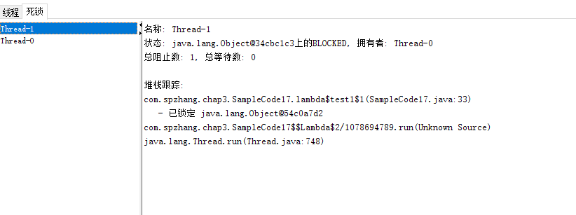

- 使用jps定位线程id，使用jstack定位死锁

  

#### 哲学家就餐问题

> com.spzhang.chap3.SampleCode18

五位哲学家，围坐在圆桌旁

- 他们只做两件事，思考和吃饭，思考一会吃一口饭，吃完饭后接着思考
- 吃饭时要用两根筷子吃饭，桌上共有5根筷子，每位哲学家左右手各有一根筷子
- 如果筷子被身边的人拿着，自己就得等待

```java
public class SampleCode18 {    public static void main(String[] args) {        Chopstick c1 = new Chopstick("1");        Chopstick c2 = new Chopstick("2");        Chopstick c3 = new Chopstick("3");        Chopstick c4 = new Chopstick("4");        Chopstick c5 = new Chopstick("5");        new Philosopher("苏格拉底", c1, c2).start();        new Philosopher("柏拉图", c2, c3).start();        new Philosopher("亚里士多德", c3, c4).start();        new Philosopher("赫拉克利特", c4, c5).start();        new Philosopher("阿基米德", c5, c1).start();    }}class Philosopher extends Thread {    private Chopstick left;    private Chopstick right;    public Philosopher(String name, Chopstick left, Chopstick right) {        super(name);        this.left = left;        this.right = right;    }    @Override    public void run() {        while(true) {            //尝试获得左手边筷子            synchronized (left) {                //尝试获得右手边筷子                synchronized (right) {                    eat();                }            }        }    }    private void eat() {        System.out.println(this.getName() + "eating...");        try {            TimeUnit.SECONDS.sleep(1);        } catch (InterruptedException e) {            e.printStackTrace();        }    }}class Chopstick {    private String name;    @Override    public String toString() {        return "Chopstick{" +                "name='" + name + '\'' +                '}';    }    public Chopstick(String name) {        this.name = name;    }}
```

### 2）活锁

**两个线程没有阻塞，但是改变了对方的结束条件**（如一个++，一个--），使得双方都不能满足结束的条件从而一直在执行。

- 可以增加一些随机的睡眠时间，来避免活锁的产生

### 3）饥饿

死锁问题如下：

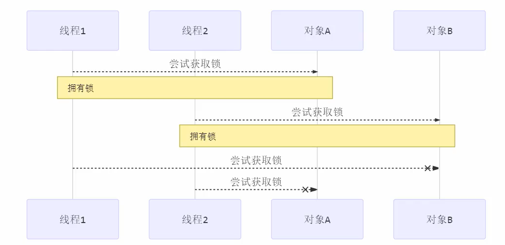

可以采用顺序加锁的方式来解决死锁问题：

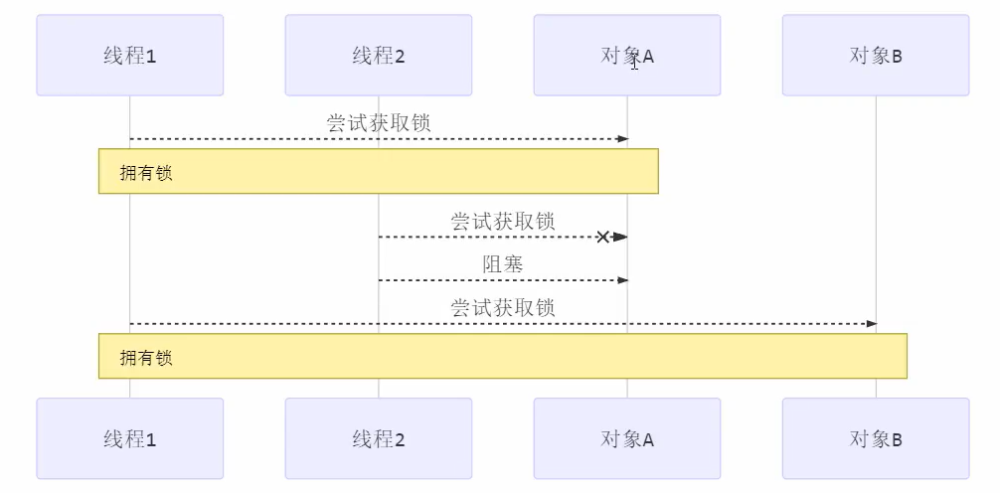

但是该解决方案存在造成某**线程饥饿（获取不到锁）**的问题。

```java
new Philosopher("苏格拉底", c1, c2).start();new Philosopher("柏拉图", c2, c3).start();new Philosopher("亚里士多德", c3, c4).start();new Philosopher("赫拉克利特", c4, c5).start();//修改获取c1和c5的顺序后可以解决死锁问题，但是会导致饥饿new Philosopher("阿基米德", c1, c5).start();
```

## 3.12 ReentrantLock

相对于synchronized，它具备如下特点：

- 可中断
- 可以设置**超时时间**
- 可以设置为**公平锁**
- 支持多个条件变量（**多个waitset**）

与synchronized一样，都支持可重入

**基本语法**

```java
//获取锁，lock()方法不可打断reentrantLock.lock();try {    //临界区} finally {    //释放锁    reentrantLock.unlock();}
```

### 1）可重入

> com.spzhang.chap3.SampleCode19

可重入是指同一个线程如果首次获得了这把锁，那么因为它是这把锁的拥有者，因此有权利再次获取这把锁。

如果是不可重入锁，那么第二次获得锁时，自己也会被锁挡住。

### 2）可打断

可以使用**lockInterruptibly()**方法来尝试获取锁：

- 如果没有竞争，则获取lock对象锁。

- 如果有竞争，就进入阻塞队列，可以被其他线程用interrupt方法打断
- 避免死锁，避免无限制等待下去

```java
public class SampleCode20 {    private static ReentrantLock reentrantLock = new ReentrantLock();    public static void main(String[] args) {        Thread t1 = new Thread(() -> {            try {                System.out.println("尝试获取锁");                reentrantLock.lockInterruptibly();            } catch (InterruptedException e) {                e.printStackTrace();                System.out.println("没有获取锁，返回");                return ;            }            try {                System.out.println("获取到锁");            } finally {                reentrantLock.unlock();            }        });        reentrantLock.lock();        t1.start();        try {            TimeUnit.SECONDS.sleep(1);        } catch (InterruptedException e) {            e.printStackTrace();        }        System.out.println("打断t1线程");        t1.interrupt();    }}
```

### 3）锁超时

> 相对于锁打断，锁超时是一种主动的避免死等的手段。

- tryLock()：尝试获取锁，返回boolean值表示是否获取到了锁，不会等待

- tryLock(long，TimeUnit)：在有限时间内尝试获取锁，如果在指定时间内未获取到锁，则返回false；支持可打断特性，**可以被其他线程打断**

  ```java
  public class SampleCode21 {    static ReentrantLock lock = new ReentrantLock();    public static void main(String[] args) {        Thread t1 = new Thread(() -> {            System.out.println("尝试获得锁");            try {                if(!lock.tryLock(2, TimeUnit.SECONDS)) {                    System.out.println("获取不到锁");                    return ;                }            } catch (InterruptedException e) {                e.printStackTrace();                System.out.println("被打断了，未获取到锁");                return ;            }            try {                System.out.println("获取到锁");            } finally {                lock.unlock();            }        });        lock.lock();        System.out.println("获取到锁");        t1.start();        try {            TimeUnit.SECONDS.sleep(1);        } catch (InterruptedException e) {            e.printStackTrace();        }        lock.unlock();    }}
  ```

#### 解决哲学家就餐问题

1. 将Chopstick类继承ReentrantLock

2. 哲学家就餐前，通过Chopstick对象的tryLock()尝试获取锁（该方法不会导致该线程一直等待对象锁）

   ```java
   class Philosopher extends Thread {    private Chopstick left;    private Chopstick right;    public Philosopher(String name, Chopstick left, Chopstick right) {        super(name);        this.left = left;        this.right = right;    }    @Override    public void run() {        while(true) {            //尝试获得左手边筷子            if(left.tryLock()) {                try{                    //尝试获得右手边筷子                    if(right.tryLock()) {                        try {                            eat();                        } finally {                            right.unlock();                        }                    }                } finally {                    left.unlock();                }            }        }    }    private void eat() {        System.out.println(this.getName() + "eating...");        try {            TimeUnit.SECONDS.sleep(1);        } catch (InterruptedException e) {            e.printStackTrace();        }    }}class Chopstick extends ReentrantLock {    private String name;    @Override    public String toString() {        return "Chopstick{" +                "name='" + name + '\'' +                '}';    }    public Chopstick(String name) {        this.name = name;    }}
   ```

### 4）公平锁

ReentrantLock默认是不公平锁；创建ReentrantLock时，可以通过构造方法传入true，则会创建一个公平锁。

- **公平锁一般没有必要，会降低并发度**

### 5）条件变量

> com.spzhang.SampleCode

synchronized中也有条件变量，即waitSet休息室，当条件不满足时进入waitSet等待；ReentrantLock对象可以创建多个条件变量，满足不同条件的线程可以进入不同的waitSet。

- 根据ReentrantLock对象创建Condition对象
- 获取锁后，可以调用该锁的Condition对象中的await()方法来将当前线程放进waitSet
- 之后可以通过Condition对象的signal()或者signalAll()来唤醒该条件变量上的线程

#### 问题模拟

> 模拟小南有烟后才能继续干活


## 3.15 拓展问题

### 1）如何保证两个线程同时执行synchronized时的线程安全

# 4. 共享模型之内存

JMM存在的问题：

- 原子性
- 可见性
- 有序性：synchronzied是通过代码块同步来保证代码有序的，与volatile原理不同。

上一章讲解的Monitor主要关注的是访问共享变量时，保证临界区代码的原子性。

这一章学习共享变量在多线程间的**可见性**问题及多条指令执行时的**有序性**问题。

## 4.1 JMM

JMM即Java Memory Model，它定义了**主存、工作内存抽象**概念，底层对应着CPU寄存器、缓存、硬件内存、CPU指令优化等。

- 主内存：存储所有共享变量的内存
- 工作内存：线程私有的内存区域

JMM体现在以下几个方面

- **原子性**：保护指令不会受到**线程上下文切换**影响
- **可见性**：保证指令不会受到**CPU缓存**的影响
- **有序性**：保证指令不会受到**CPU指令并行优化**的影响

### 1）可见性问题

一个线程修改了主存中的数据，但是由于JMM的主存、工作内存机制，这次修改对其他线程不可见。

#### 1. 问题实例

```java
package com.spzhang.chap4;

import java.util.concurrent.TimeUnit;

public class SampleCode1 {
    static boolean run = true;
    public static void main(String[] args) {
        new Thread(() -> {
            while(run) {
                //println使用synchronized修饰
//                System.out.println("run为true，继续执行");
            }
        }, "t").start();

        try {
            TimeUnit.SECONDS.sleep(1);
        } catch (InterruptedException e) {
            e.printStackTrace();
        }

        run = false;		//线程不会如期停下来
        System.out.println("尝试停止另一个线程");	
    }
}
```

为什么呢？

1. 初始状态，t线程刚开始从主内存读取了run的值到工作内存；

   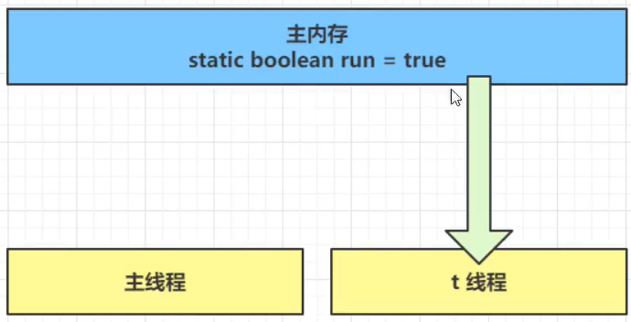

2. 因为t线程要频繁从主内存中读取run的值，JIT编译器会将run的值缓存至自己工作内存中的高速缓存中，减少对主存中run的访问，提高效率


3. 1秒之后main线程修改了run的值，并同步至主存，而t是从自己工作内存中的高速缓存中读取这个变量的值，结果永远是旧值

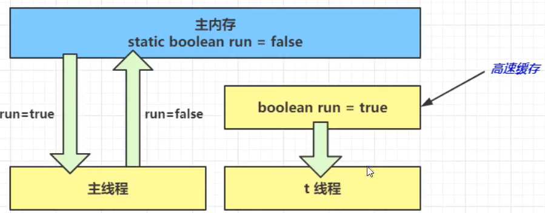

#### 2. 解决办法

**volatile**可以用来修饰成员变量和类变量，可以避免从自己的工作缓存中查找变量的值，必须到主存中获取它的值，**线程操作volatile变量都是直接操作主存**。

- synchronized关键字也可以解决可见性问题

#### 3. 可见性 VS 原子性

可见性指的是保证一个线程对共享变量的修改对另一个线程立即可见；原子性指的是一段代码在执行的过程中，不会因为上下文切换而影响代码块中变量的状态。

注意：synchronized可以保证代码块的原子性，也可以保证可见性，而volatile只能保证可见性（每次操作都是操作主存）。但synchronized属于重量级操作，性能相对较低。

- synchronized修饰了println(String)方法

#### 4. 终止模式之两阶段终止

```java
/**
 * volatile实现两阶段终止
 */
public class SampleCode2 {
    public static void main(String[] args) {
        TwoPhaseTermination tpt  = new TwoPhaseTermination();
        tpt.start();

        try {
            TimeUnit.SECONDS.sleep(3);
        } catch (InterruptedException e) {
            e.printStackTrace();
        }
        System.out.println("停止监控");
        tpt.stop();
    }
}


class TwoPhaseTermination {
    private Thread monitorThread;
    private volatile boolean stop;

    public void start() {
        monitorThread = new Thread(() -> {
            while(true) {
                Thread current = Thread.currentThread();
                //是否被打断
                if(stop) {
                    System.out.println("被打断，料理后事");
                    break;
                }
                try {
                    TimeUnit.SECONDS.sleep(1);
                    System.out.println("执行监控记录");
                } catch (InterruptedException e) {
//                    e.printStackTrace();
                }
            }
        }, "monitor");
        monitorThread.start();
    }
    public void stop() {
        stop = true;
        //让处于sleep的线程能够立即终止
        monitorThread.interrupt();
    }
}
```

#### 5. 同步模式之balking(犹豫模式)

Balking模式用在一个线程或本线程已经做了某一件相同的事，那么本线程就无需再做了，直接结束返回。

- 保护性暂停用于一个线程等待另一个线程的结果，当条件不满足时线程等待。

```java
synchronized (this) {
    if(starting) {
        System.out.println("已经执行过start");
        return ;
    }
    starting = true;
}
```

它还经常用来实现线程安全的单例(懒汉)

```java
public final class Singleton {
    private Singleton() {
    }
    private static Singleton INSTANCE = null;
    public static synchronized Singleton getInstance() {
        if(INSTANCE != null)
            return INSTANCE;
        INSTANCE = new Singleton();
        return INSTANCE;
    }
}
```

### 2）有序性

JVM会在不影响正确性的前提下，可以调整语句的执行顺序

```java
static int i;
static int j;

//在某个线程内执行如下赋值
i = ...;
j = ...;
```

可以看到，至于是先执行i还是执行j，对最终的结果不会产生影响。所以，上面代码真正执行时，既可以是

```java
i = ...;
j = ...;
```

也可以是

```java
j = ...;
i = ...;
```

这种特性称为**指令重排**，**多线程下指令重排会影响正确性**。为什么要有重排指令这项优化呢？从CPU执行指令的原理来理解一下吧

#### 1. CPU层面的指令重排序优化

现代处理器会设计为一个时钟周期内完成一条执行时间最长的CPU指令。因为指令可以再划分成一个个更小的阶段。例如，每条指令可以分为：取指令 - 指令译码 - 执行指令 - 内存访问 - 数据写回这5个阶段。

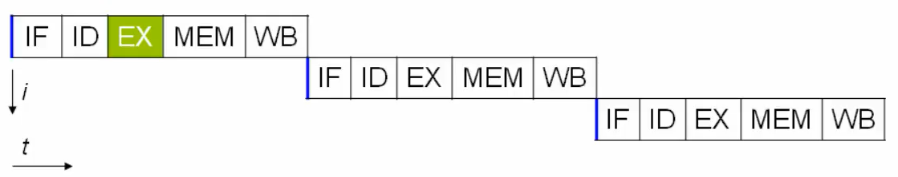

现代CPU支持多级指令流水线，例如支持同时执行取指令 - 指令 - 指令译码 - 执行指令 - 内存访问 - 数据写回的处理器，就可以称之为五级指令流水线，这时，CPU可以在一个时钟周期内，同时运行五条指令的不同阶段（相当于一条执行时间最长的复杂指令）。本质上，流水线技术并不能缩短单条指令的执行时间，但它变相地提高了指令吞吐率。

> 奔腾四支持高达35级流水线，但由于功耗太高被废弃。

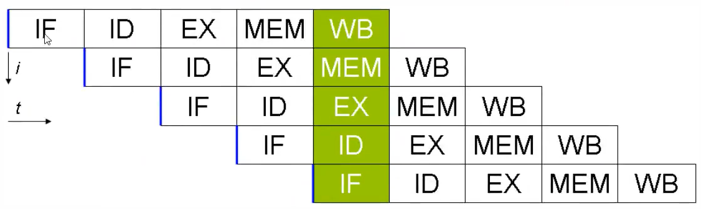

在不改变程序结果的前提下，这些指令的各个阶段可以通过重排序和组合来实现指令级并行，这一技术在80's和90's中占据了计算架构的重要地位。

> 分阶段，分工是提升效率的关键。

指令重排的前提是，重排指令不能影响结果，例如

```java
int a = 10;
int b = a - 5;
```

#### 2. Java层面的指令重排序优化

```java
int num = 0;boolean ready = false;//线程1执行此方法public void actor(I_Result r) {    if(ready) {        r.r1 = num + num;    } else {        r.rl = 1;    }}//线程2执行此方法public void actor2(I_Result r) {    num = 2;    ready = true}
```

I_Result r是一个对象，有一个属性r1用来保存结果。

问，可能的结果有几种？

情况1：线程1先执行，这时ready = false，进入else分支结果为1

情况2：线程2先执行num = 2，但还没来的及执行ready = true，所以此时结果仍为1

情况3：线程2先执行完，此时ready = true，结果为4

**情况4（指令重排优化）**：线程2先执行ready = true，切换到线程1，进入if分支，结果为0

情况4叫做**指令重排**，是**JIT编译器在运行时的一些优化**，可以借助java并发压测工具**jcstress**来复现。

> https://github.com/openjdk/jcstress

项目右键-->打开命令行，执行以下命令

```java
mvn archetype:generate -DinteractiveMode=false -DarchetypeGroupId=org.openjdk.jcstress -DarchetypeArtifactId=jcstress-java-test-archetype -DgroupId=org.sample -DartifactId=test -Dversion=1.0
```

### 3）volatile原理

> volatile关键在在JDK1.5之后才生效。

volatile的底层实现原理是内存屏障（Memory Barrier/Fence）

- 对volatile变量的**写指令后会加入写屏障**
- 对volatile变量的**读指令前会加入读屏障**

#### 1. 如何保证可见性

- 写屏障保证在该屏障之前的对所有共享变量的改动，都同步到主存当中

```java
public void actor2() {    num = 2;    ready = true;	//read是volatile，赋值操作带写屏障    //添加写屏障}
```

- 读屏障保证在屏障之后，对所有共享变量的读取，加载的是主存中最新数据

```java
public void actor1(IResult r) {    //ready是volatile变量，读取值带读屏障    //读屏障    if(ready)        r.r1 = num + num;    else        r.r1 = 1;}
```

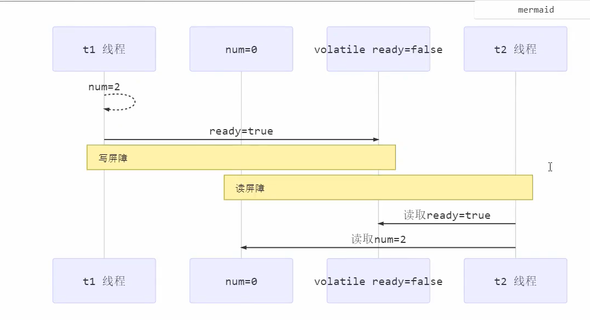

#### 2. 如何保证有序性

> 有序性的保证只是保证了本线程内相关代码不被重排序

- 写屏障会确保指令重排序时，不会将写屏障之前的代码排在写屏障之后

```java
public void actor2() {    num = 2;    ready = true;	//read是volatile，赋值操作带写屏障    //添加写屏障}
```

- 读屏障会确保指令重排序时，不会将读屏障之后的代码排在读屏障之前

```java
public void actor1(IResult r) {    //读屏障    //ready是volatile变量，读取值带读屏障    if(ready)        r.r1 = num + num;    else        r.r1 = 1;}
```


### 4）DCL问题

以著名的double-checked locking单例模式为例

```java
public final class Singleton {    private Singleton() {    }    private static Singleton INSTANCE = null;    public static Singleton getInstance() {        synchronized(Singleton.class) {            if(INSTANCE == null)                return new Singleton();        }        return INSTANCE;    }}
```

以上实现的特点：

- 懒惰实例化
- 首次使用getInstance()才使用synchronized加锁，后续使用时无需加索

存在的问题：

- **每次要获取实例对象时，都要竞争锁，开销较大**

- 可以通过double-checked来解决这个问题，使得**只有首次访问才会竞争锁**

  ```java
  public final class Singleton {    private Singleton() {    }    private static Singleton INSTANCE = null;    public static synchronized Singleton getInstance() {        if(INSTANCE == null) {            //首次访问会同步，而之后的使用没有使用synchronized            synchronized (Singleton.class) {                if(INSTANCE == null) {                    INSTANCE = new Singleton();                }            }        }        return INSTANCE;    }}
  ```

#### 1. 存在的问题

上述代码中，由于**外层的if判断在synchronzied代码块**外，在多线程执行下，由于单线程内的**指令重排**，可能导致上述代码出现问题。

这里的指令重排主要指的是，创建INSTANCE对象时的指令重排。

```
INSTANCE = new Singleton();
```

上述语句，会被翻译为四条字节码指令：

```
 0 getstatic #5 <com/spzhang/chap4/Singleton.INSTANCE> 3 ifnonnull 43 (+40) 6 ldc #6 <com/spzhang/chap4/Singleton> 8 dup 9 astore_010 monitorenter11 getstatic #5 <com/spzhang/chap4/Singleton.INSTANCE>14 ifnonnull 33 (+19)17 new #6 <com/spzhang/chap4/Singleton>20 dup21 invokespecial #7 <com/spzhang/chap4/Singleton.<init>>24 putstatic #5 <com/spzhang/chap4/Singleton.INSTANCE>27 getstatic #5 <com/spzhang/chap4/Singleton.INSTANCE>30 aload_031 monitorexit32 areturn33 aload_034 monitorexit35 goto 43 (+8)38 astore_139 aload_040 monitorexit41 aload_142 athrow43 getstatic #5 <com/spzhang/chap4/Singleton.INSTANCE>46 areturn
```

- 17表示创建对象，将对象引用入栈（只是分配内存，确定存储地址）
- 20表示复制一份对象引用（地址）
- 21表示 利用一个对象引用，调用构造方法（实例化）
- 24表示利用一个对象引用，复制给INSTANCE（将对象地址给INSTANCE）

JVM可能会对上述字节码指令进行优化，将其优化为：先执行24，再执行21。如果两个线程t1，t2按如下时间执行：


- 关键在于0 getstatic这条字节码指令在monitor之外，可以越过monitor取INSTANCE，而此时，由于字节码重排序，t1线程可能并未完成对INSTANCE的对象初始化。

#### 2. 问题解决

- 将INSTANCE使用volatile关键字修饰

```java
public final class Singleton {    private Singleton() {    }    private volatile static Singleton INSTANCE = null;    public static synchronized Singleton getInstance() {        if(INSTANCE == null) {            synchronized (Singleton.class) {                if(INSTANCE == null) {                    INSTANCE = new Singleton();                }            }        }        return INSTANCE;    }}
```

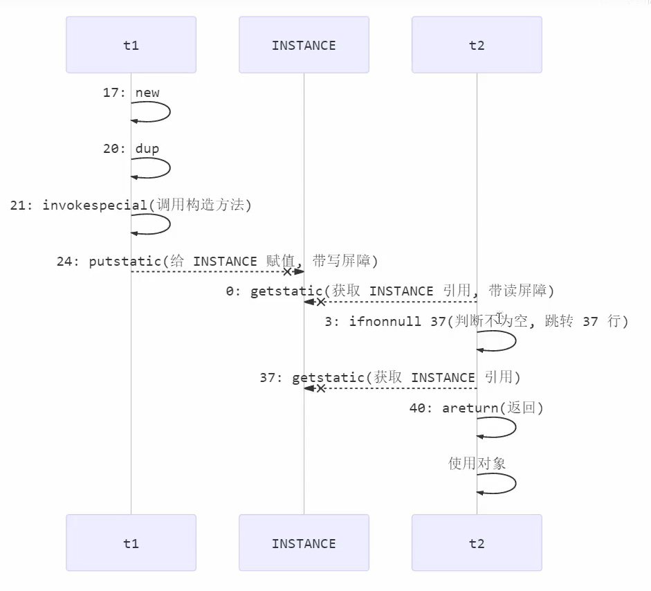

- 将INSTANCE改为volatile变量时，在对INSTANCE赋值时（putstatic字节码指令）会在该指令后添加写屏障，阻止重排序。

### 5）happens-before

happens-before规定了对共享变量的写操作对其他线程的读操作可见，它是可见性与有序性的一套规则总结。抛开以下happens-before规则，JMM并不能保证一个线程对共享变量的写，对于其他线程对该共享变量的读可见。

- 线程解锁m之前对变量的写，对于接下来对m加锁的其他线程对该变量的读可见

  ```java
  
  ```

- 线程对volatile变量的写，对接下来其他线程对该变量的读可见

- 线程start前对变量的写，对该线程开始后对该变量的读可见

- 线程结束前对变量的写，对其他线程得知它结束后的读可见（比如其他线程调用t1.isAlive()或t1.joint()等待它结束）

- 线程t1打断t2(interrupt)前对变量的写，对于其他线程得知t2被打断后对变量的读可见（t2.interrupted()或t2.isInterrupted()）

- 变量默认初始化的写，对其他线程对该变量的读可见

- 具有传递性

# 5. 共享模型之无锁

本章内容

- CAS与volatile
- 原子整数
- 原子引用
- 原子自加器
- Unsafe

## 5.1 CAS与volatile

**CAS（Compare And Swap）**，比较并设置，在CPU指令级别是原子的。底层是lock cmpxchg指令（x86架构），不管在单核还是多核CPU中都可以保证比较并设置的原子性。

```java
while(true) {
    //CAS不成功，则重新获取当前的值
    int prev = balance.get();
    int next = prev - 10;
    if(balance.compareAndSet(prev, next)) {
        //CAS成功，则完成任务退出循环
        break;
    }
}
```


**volatile**

获取共享变量时，为了保证变量的可见性，必须使用volatile来修饰这个共享变量。volatile可以修饰成员变量和静态变量，可以避免线程从自己的工作缓存中查找变量的值，必须到主存中获取它的值，线程操作volatile变量都是直接操作主存，即一个线程对volatile变量的修改，对另一个线程可见。

CAS必须配合volatile才能读取到共享变量的最新之来实现比较并交换

## 5.2 为什么无锁效率高

- 无锁情况下，即时CAS失败，但线程仍在继续运行，**没有发生上下文切换**；

- 而synchronzied获取锁失败时，线程会被阻塞，此时要发生线程上下文切换，有保存现场、恢复现场的开销

无锁也**需要额外的CPU/核的支持**，否则会阻塞其他线程（因为只有一个CPU核），线程数少于CPU数比较能发挥CAS的优势


**特点：**

结合CAS和volatile可以实现无锁并发，适用于线程少、多核CPU的场景下

- CAS是基于乐观锁的思想，不怕别的线程来修改共享变量
- synchronized基于悲观锁的思想，
- CAS体现的**无锁并发**、**无阻塞并发**
  - 因为没有使用synchronized，线程不会陷入阻塞，这是效率提升的因素之一
  - 但如果竞争激烈，重试必然频繁发生，反而会影响效率

## 5.3 原子整数

J.U.C并发包提供了

- AtomicBoolean
- AtomicInteger
- AtomicLong

### AtomicInteger

```java
//两种构造方法
//无参的默认值为0

//比较value当前值是否等于except，如果是则将其更新为update值，成功返回true，失败返回false
boolean compareAndSet(int except, int update);
//先自增，然后获取值	++value
int incrementAndGet();
//先返回，再自增
int getAndIncrement();
//先将value加num，然后将结果返回
int addAndget(int num);
//先保存当前value值，用作待会返回，然后再将value加num
int getAndAdd(int num);

AtomicInteger i = new AtomicInteger(1);
//             读取到      设置值
i.updateAndGet(value -> value * 10);
System.out.println(i.getAndUpdate(value -> value * 10));
System.out.println(i.get());
```

要调用**getAndUpdate**方法，需要传入一个**IntUnaryOperator接口**的类的对象，在接口实现中指明需要update的操作。

```java
//要调用getAndUpdate方法，需要传入一个IntUnaryOperator接口的类的对象，在接口实现中指明需要update的操作
public final int getAndUpdate(IntUnaryOperator updateFunction) {
    int prev, next;
    do {
        prev = get();
        next = updateFunction.applyAsInt(prev);
    } while (!compareAndSet(prev, next));
    return prev;
}
```

将具体要做的运算，封装起来，抽象成了


```java
@FunctionalInterface
public interface IntUnaryOperator {

    /**
     * Applies this operator to the given operand.
     *
     * @param operand the operand
     * @return the operator result
     */
    int applyAsInt(int operand);
}
```

## 5.4 原子引用

- AtomicReference
- AtomicMarkableReference
- AtomicStampedReference

AtomicReference能不能判断出共享变量被其他线程修改过？（**ABA问题**）

仅比较值不够，需要加一个版本号

**AtomicStampedReferencek**可以查看被改了多少次（现在的版本号减去之前获得的版本号）

有时候不关心被修改了多少次，只关心是否被修改

**AtomicMarkableReference**与AtomicStampedReference类似，只是在AtomicMarkableReference中提供的是boolean值标记，不是int类型的版本号。

## 5.5 原子数组

- AtomicIntegerArray
- AtomicLongArray
- AtomicReferenceArray

## 5.6 字段更新器

- AtomicReferenceFieldUpdater
- AtomicIntegerFieldUpdater
- AtomicLongFieldUpdater

字段必须为volatile。

1. 根据对象所属类、字段属性、字段名来创建一个字段更新器

   ```java
   public class Test5 {
       private volatile int field;
       public static void main(String[] args) {
           AtomicIntegerFieldUpdater fieldUpdater =
           AtomicIntegerFieldUpdater.newUpdater(Test5.class, "field");
           Test5 test5 = new Test5();
            fieldUpdater.compareAndSet(test5, 0, 10);
            // 修改成功 field = 10
            System.out.println(test5.field);
            // 修改成功 field = 20
            fieldUpdater.compareAndSet(test5, 10, 20);
            System.out.println(test5.field);
            // 修改失败 field = 20
            fieldUpdater.compareAndSet(test5, 10, 30);
            System.out.println(test5.field);
        }
   }
   ```

   

2. 通过字段更新器来对字段进行原子操作（需要传递对象、该字段目前的值、期望字段更新值）

## 5.7 原子累加器

- LongAdder

源码

Doug Lea的作品，

关键域

```java
// 累加单元数组, 懒惰初始化
transient volatile Cell[] cells;
// 基础值, 如果没有竞争, 则用 cas 累加这个域
transient volatile long base;
// 在 cells 创建或扩容时, 置为 1, 表示加锁
transient volatile int cellsBusy;
```

### 伪共享

其中Cell为累加单元

```java
//该注解防止缓存行伪共享
@sun.misc.Contended 
static final class Cell {
        volatile long value;
        Cell(long x) { value = x; }
        final boolean cas(long cmp, long val) {
            return UNSAFE.compareAndSwapLong(this, valueOffset, cmp, val);
        }

        // Unsafe mechanics
    	...
    }
```


由于CPU与内存的速度差异很大，需要靠**预读数据到缓存**来提升效率。

- 缓存以缓存行为单位，每个缓存行对应着一块内存，一般是64byte（8个long）
- 缓存的加入会造成数据副本的产生，即同一份数据会缓存在不同的缓存行
- 由于缓存一致性协议，如果某个CPU核心更改了数据，其他CPU核心对应的整个缓存行也会失效

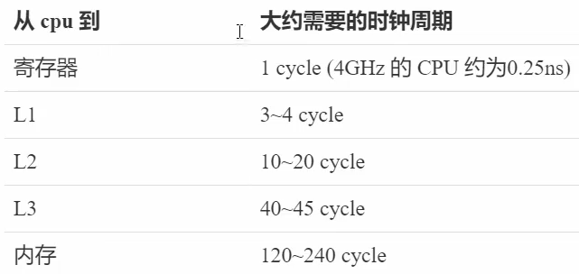

由于**Cell是数组类型，在内存中是连续存储的**，一个Cell为24字节（16字节的对象头和8字节的value），因此缓存行可以存下2个Cell对象，则存在以下问题：

- Core-0要修改Cell[0]
- Core-1要修改Cell[1]

无论谁修改成功，都会导致对方Core的缓存行失效，会导致效率降低。

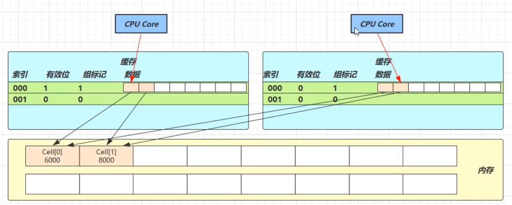

@sun.misc.Contended用来解决这个问题，它的原理是在使用此注解的对象或字段的前后各增加128字节大小的padding，从而让CPU将对象预读至缓存时占用不同的缓存行，这样，不会造成对方的缓存行失效。


### add()

```java
public void add(long x) {
 // as 为累加单元数组
 // b 为基础值
 // x 为累加值
 Cell[] as; long b, v; int m; Cell a;
 // 进入 if 的两个条件
 // 1. as 有值, 表示已经发生过竞争, 进入 if 
// 2. cas 给 base 累加时失败了, 表示 base 发生了竞争, 进入 if
 if ((as = cells) != null || !casBase(b = base, b + x)) {
 // uncontended 表示 cell 没有竞争
 boolean uncontended = true;
 if (
 // as 还没有创建
 as == null || (m = as.length - 1) < 0 ||
 // 当前线程对应的 cell 还没有
 (a = as[getProbe() & m]) == null ||
 // cas 给当前线程的 cell 累加失败 uncontended=false ( a 为当前线程的 cell )
 !(uncontended = a.cas(v = a.value, v + x))
 ) {
 // 进入 cell 数组创建、cell 创建的流程
 longAccumulate(x, null, uncontended);
 }
 }
}
```

流程图


### longAccumulate

### sum

## 5.8 Unsafe

### 获取Unsafe对象

Unsafe对象提供了非常底层的，操作内存、操作线程的方法，Unsafe对象不能直接调用，只能通过反射获得。

```java
Field theUnsafe = Unsafe.class.getDeclaredField("theUnsafe");theUnsafe.setAccessible(true);Object unsafe = (Unsafe) theUnsafe.get(null);System.out.println(unsafe);
```

### Unsafe CAS操作

1. 获取域的偏移地址
2. 执行CAS操作

```java
public static void main(String[] args) throws NoSuchFieldException, IllegalAccessException {		...        // 1. 获取域的偏移地址        long idOffset = unsafe.objectFieldOffset(Teacher.class.getDeclaredField("id"));        long nameOffset = unsafe.objectFieldOffset(Teacher.class.getDeclaredField("name"));        // 2. 执行CAS操作        unsafe.compareAndSwapInt(t, idOffset, t.getId(), t.getId() + 1);        unsafe.compareAndSwapObject(t, nameOffset, t.getName(), "spzhang1");        // 3. 验证        System.out.println(t);    }
```

### Unsafe实现AtomicInteger

- 需要使用volatile来配合CAS保证变量的可见性
- 静态初始化时初始化其value域的偏移量，方便后续调用Unsafe的CAS方法

```java
class MyAtomicInteger {    private volatile int value;    private static final long valueOffset;    static final Unsafe UNSAFE;    static {        UNSAFE = UnsafeAccessor.getUnsafe();        try {            valueOffset = UNSAFE.objectFieldOffset(MyAtomicInteger.class.getDeclaredField("value"));        } catch (NoSuchFieldException e) {            e.printStackTrace();            throw new RuntimeException(e);        }    }    public int getValue() {        return value;    }    public void decrement(int amount) {        while(true) {            int prev = value;            int next = value - amount;            if(UNSAFE.compareAndSwapInt(this, valueOffset, prev, next))                 break;        }    }}
```

# 6. 共享模型之不可变类

- 不可变类的使用
- 不可变类的设计
- 无状态类

## 6.1 不可变类的设计

String为不可变列，以它为例，说明一下不可变设计的要素。

- value为char数组类型，使用final修饰，保证该引用不能指向其他对象
  - 复制新数组的方式来保证value不会引用到外部的char数组对象（保护性拷贝）

- hash为私有的，无set和get方法，在初始化时计算
- String类被final修饰，保证其不能被继承，内部的方法不可以被覆盖，防止子类无意间破坏其不可变性

```java
public final class String
    implements java.io.Serializable, Comparable<String>, CharSequence {
    /** The value is used for character storage. */
    private final char value[];

    /** Cache the hash code for the string */
    private int hash; // Default to 0
	...
}
```

### 保护性拷贝

使用String对象时，其有一些对字符串进行修改的方法，在这些方法中都使用保护性拷贝，这种通过创建副本对象来避免共享的手段称之为保护性拷贝。

```java
public String(char value[]) {
    this.value = Arrays.copyOf(value, value.length);
}
```

### 享元模式

**Flyweight pattern**，当需要重用数量有限的同一类对象时，可以使用享元模式。

#### 体现

##### 包装类

在JDK中，Boolean，Byte，Short，Integer，Long，Character等包装类提供了valueOf()方法。例如，Long中的valueOf()方法会缓存-128~127之间的Long对象（**类加载时就创建好了**），在这个范围之间会重用对象，大于这个范围，才会新建Long对象。

- Byte，Short，Long缓存范围都是-128~127
- Integer的默认范围是-128~127，最小值不能变，但最大值可以通过调整虚拟机参数- Djava.lang.Integer.IntegerCache.high来改变
- Character缓存的范围是0~127
- Boolean缓存了TRUE和FALSE

```java
public static Long valueOf(long l) {
    final int offset = 128;
    if (l >= -128 && l <= 127) { // will cache
        return LongCache.cache[(int)l + offset];
    }
    return new Long(l);
}
```

#### 自定义 - 数据库连接池

1. 连接池大小
2. 连接对象数组
3. 连接状态-AtomicIntegerArray
4. 构造方法初始化
5. 借连接
6. 归还连接

该实现未实现以下功能：

- 动态扩容与收缩
- 连接保活（可用性检测）
- 等待超时处理
- 分布式hash

```java
class Pool {
    // 1. 连接池大小
    private final int poolSize;
    // 2. 连接对象数组
    private Connection[] connections;
    // 3. 连接状态数组 0 表示空闲，1 表示繁忙
    private AtomicIntegerArray states;

    // 4. 构造方法初始化
    public Pool(int poolSize) {
        this.poolSize = poolSize;
        this.connections = new Connection[poolSize];
        this.states = new AtomicIntegerArray(new int[poolSize]);
        for (int i = 0; i < poolSize; i++) {
            connections[i] = new MockConnection("连接" + Integer.toString(i));
        }
    }

    // 5. 借连接
    public Connection borrow() {
        while(true) {
            for(int i = 0; i < poolSize; i++) {
                //获取空闲连接
                if(states.get(i) == 0) {
                    states.compareAndSet(i, 0, 1);
                    //获取到连接
                    System.out.println("获取到连接" + connections[i]);
                    return connections[i];
                }
            }
            // 如果没有空闲连接，当前线程进入等待
            synchronized (this) {
                try {
                    System.out.println("没有获取到连接，进入等待");
                    this.wait();
                } catch (InterruptedException e) {
                    e.printStackTrace();
                }
            }
        }
    }

    // 6. 归还连接
    public void free(Connection conn) {
        for (int i = 0; i < poolSize; i++) {
            if(connections[i] == conn) {
                states.set(i, 0);
                synchronized (this) {
                    System.out.println("归还连接" + conn);
                    this.notifyAll();
                }
                break;
            }
        }
    }
}
```

## 6.2 final原理

### 设置final变量

final变量的赋值也会通过putfield指令来完成，同样在这条指令之后也**会加入写屏障**，保证在其他线程读到它的值时不会出现为0的情况。

### 获取final变量

## 6.3 无状态类

不给对象设置成员变量，那么没有任何成员变量的类是线程安全的。

# 7. 并发工具之线程池

## 7.1 自定义线程池


### BlockingQueue

> BlockingQueue是平衡消费者和生产者的桥梁

1. 任务队列

   ```java
   // 1. 任务队列
   private Deque<T> queue = new ArrayDeque<>();
   ```

2. 锁，使用RTL可以将生产者和消费者阻塞分开

   ```java
   private ReentrantLock lock = new ReentrantLock();
   ```

3. .生产者和消费者的条件变量

   ```java
   // 3. 生产者的条件变量
   private Condition fullWaitSet = lock.newCondition();
   // 4. 消费者条件变量
   private Condition emptyWaitSet = lock.newCondition();
   ```

4. 容量

   ```java
   // 5. 容量
   private int capcity;
   ```

5. 获取阻塞队列中的任务

   - 永久等待

     ```java
     // 阻塞获取
         public T take() {
             lock.lock();
             try {
                 while(queue.isEmpty()) {
                     try {
                         emptyWaitSet.await();
                     } catch (InterruptedException e) {
                         e.printStackTrace();
                     }
                 }
                 T t = queue.removeFirst();
                 fullWaitSet.signal();
                 return t;
             } finally {
                 lock.unlock();
             }
         }
     ```

   - 限时等待

     ```java
     // 限时等待
     public T take(long timeout, TimeUnit unit) {
         lock.lock();
         try {
             long nanos = unit.toNanos(timeout);
             while(queue.isEmpty()) {
                 try {
                     // 返回的剩余等待时间
                     if(nanos <= 0)
                         return null;
                     nanos = emptyWaitSet.awaitNanos(nanos);
                 } catch (InterruptedException e) {
                     e.printStackTrace();
                 }
             }
             T t= queue.removeFirst();
             fullWaitSet.signal();
             return t;
         } finally {
             lock.unlock();
         }
     
     }
     ```

6. 向队列中添加任务

   - 永久等待添加

   ```java
   // 阻塞添加
   public void put(T element) {
       lock.lock();
       try {
           while(queue.size() == capcity) {
               try {
                   fullWaitSet.await();
               } catch (InterruptedException e) {
                   e.printStackTrace();
               }
           }
           queue.addLast(element);
           emptyWaitSet.signal();
       } finally {
           lock.unlock();
       }
   }
   ```

   - 限时等待添加

     ```java
     // 限时添加
     public boolean put(T element, long timeout, TimeUnit timeUnit) {
         lock.lock();
         try {
             long nanos = timeUnit.toNanos(timeout);
             while(queue.size() == capcity) {
                 try {
                     System.out.println("等待加入任务队列" + element);
                     if(nanos <= 0)
                         return false;
                     nanos = fullWaitSet.awaitNanos(nanos);
                 } catch (InterruptedException e) {
                     e.printStackTrace();
                 }
             }
             System.out.println("成功加入任务队列" + element);
             queue.addLast(element);
             emptyWaitSet.signal();
             return true;
         } finally {
             lock.unlock();
         }
     }
     ```

7. 获取当前阻塞队列中的任务数量

```java
// 获取大小public int size() {    lock.lock();    try {        return queue.size();    } finally {        lock.unlock();    }}
```

### ThreadPool

1. 成员变量

   ```java
   // 任务队列private BlockingQueue<Runnable> taskQueue;// 线程集合private HashSet<Worker> workers = new HashSet<>();// 核心线程数private int coreSize;// 获取任务的超时时间private long timeout;private TimeUnit timeUnit;
   ```

2. 构造函数

   ```java
   public ThreadPool(int coreSize, long timeout, TimeUnit timeUnit, int capcity) {    this.coreSize = coreSize;    this.timeout = timeout;    this.timeUnit = timeUnit;    taskQueue = new BlockingQueue<>(capcity);}  
   ```

3. 执行任务

   ```java
   // 执行任务public void execute(Runnable task) {    synchronized (workers) {        // 当任务数没有超过coreSize时，直接交给worker对象执行        // 如果任务数超过coreSize时，加入任务队列暂存        if(workers.size() < coreSize) {            Worker worker = new Worker(task);            System.out.println("新增worker" + worker);            workers.add(worker);            worker.start();        } else {            System.out.println("加入任务队列" + task);            taskQueue.put(task);        }    }}
   ```

4. 处理任务的内部类（线程集合中的类）

   ```java
   // 处理任务的内部类class Worker extends Thread{    private Runnable task;    public Worker(Runnable task) {        this.task = task;    }    @Override    public void run() {        // 执行任务：1）当task不为空，则直接执行任务；2）当task执行完毕，再接着从任务队列获取任务并执行        while(task != null || (task = taskQueue.take(1000, TimeUnit.MILLISECONDS)) != null) {            try {                System.out.println("正在执行任务" + task);                task.run();            } catch(Exception e) {                e.printStackTrace();            } finally {                task = null;            }        }        synchronized (workers) {            System.out.println("worker被移除" + this);            workers.remove(this);        }    }}
   ```

### 拒绝策略

通过策略模式来实现当任务队列满时，由用户自己决定如何处理。

#### RejectPolicy接口

```java
@FunctionalInterfaceinterface RejectPolicy<T> {    void reject(BlockingQueue<T> queue, T task);}
```

#### ThreadPool成员变量

> 需要构造函数中进行初始化

```java
private RejectPolicy<Runnable> rejectPolicy;
```

#### 重写execute()

- 当任务队列满时：

```java
// taskQueue.put(task);// 1)死等；2）带超时时间等待；3）放弃任务执行；4）抛出异常；5）让调用者自己执行任务taskQueue.tryPut(rejectPolicy, task);
```

#### BlockingQueue添加tryPut()方法

```java
//拒绝策略，当任务队列满时，由用户决定如何处理public void tryPut(RejectPolicy<T> rejectPolicy, T task) {    lock.lock();    try {        // 判断队列是否满        if(queue.size() == capcity) {            rejectPolicy.reject(this, task);        } else {    // 有空闲            System.out.println("成功加入任务队列" + task);            queue.addLast(task);            emptyWaitSet.signal();        }    } finally {        lock.unlock();    }}
```

### 演示

```java
public static void main(String[] args) {    ThreadPool threadPool = new ThreadPool(2, 1000, TimeUnit.MILLISECONDS,(queue, task) -> {        // 1. 死等        // queue.put(task);        // 2. 限时等待        // queue.put(task, 200, TimeUnit.MILLISECONDS);        // 3. 让调用者放弃        // System.out.println("放弃执行" + task);        // 4. 调用者抛出异常        // throw new RuntimeException("任务执行失败" + task);        // 5. 调用者自己执行任务        task.run();    }, 5);    for (int i = 0; i < 15; i++) {        int j = i;        threadPool.execute(() -> {            try {                Thread.sleep(1000);            } catch (InterruptedException e) {                e.printStackTrace();            }            System.out.println(j);        });    }}
```

## 7.2 ThreadPoolExecutor

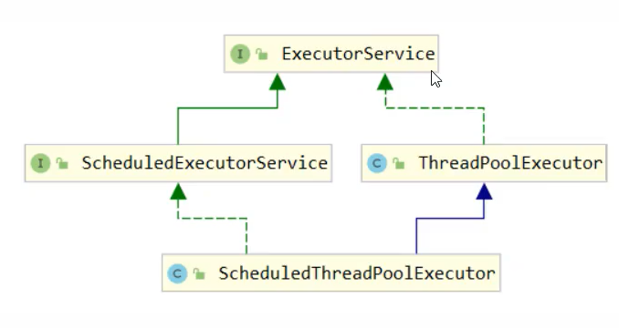

- ScheduledThreadPoolExecutor：带有任务调度的线程池

### 1）线程池状态

ThreadPoolExecutor使用int的高3位来表示线程池状态，低29位表示线程数量。

- 为什么不适用两个整数分别存储状态和线程数量?

  - 一次原子操作可以同时将状态和线程数量赋值

    ```java
    //c为旧值ctl.compareAndSet(c, ctlOf(targetState, workerCountOf(c)));//rs为高3位代表线程池状态，wc为低29位，代表线程个数，ctlPf是合并它们private static int ctlOf(int re, int wc){ return rs | wc; }
    ```

状态：

RUNNING：111

SHUTDOWN：000，不会接收新任务，但会将阻塞队列剩余任务处理完毕

STOP：001，会中断正在执行的任务（interrupt()），并抛弃阻塞队列任务

TIDYING：010，任务全部执行完毕，活动线程为0即将进入终结状态

TERMINATED：011，终结状态

TERMINATED>TIDYING>STOP>SHUTDOWN>RUNNING(最高位为1，为负数)

### 2）构造方法

```java
public ThreadPoolExecutor(int corePoolSize,                          int maximumPoolSize,                          long keepAliveTime,                          TimeUnit unit,                          BlockingQueue<Runnable> workQueue,                          ThreadFactory threadFactory,                          RejectedExecutionHandler handler) 
```

- corePoolSize：核心线程数目（最多保留的线程数）
- maximumPoolSize：最大线程数
- keepAliveTime：生存时间（针对救急线程）
- unit：时间单位（针对救急线程）
- workQueue：阻塞队列
- threadFactory：线程工厂-可以为线程创建时起个名字
- handler：拒绝策略

当阻塞队列（有界队列）满时，ThreadPoolExecutor并不会直接执行拒绝策略，而是会判断是否存在救急线程（救急线程在满生存时间时自动销毁）或者创建救急线程（可创建救急线程数=最大线程数-核心线程数），如果不可以，则再调用拒绝策略。

#### 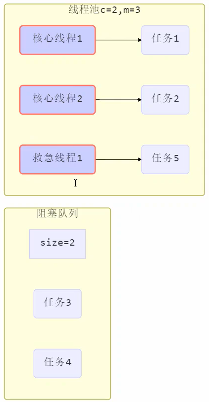

### 3）拒绝策略

如果线程池中的线程数达到了maximumPoolSize仍然有新任务到达，这时会执行拒绝策略。JDK提供了3中实现：

- AbortPolicy让调用者抛出RejectedExecutionException异常（默认策略）
- CallerRunsPolicy让调用者运行任务
- DiscardPolicy放弃本次任务
- DiscardOldestPolicy放弃队列中最早的任务，本任务取而代之


其他框架也提供了拒绝策略的实现：

- Dubbo的实现在抛出RejectExecutionException异常之前会记录日志，并dump线程栈信息，方便定位问题
- Netty的实现是创建一个新线程来执行任务
- ActiveMQ的实现，带超时等待尝试放入队列，类似之前自定义的拒绝策略
- PinPoint的实现，会逐一尝试策略联众每种拒绝策略

根据这个构造方法， JDK Executors类中提供了众多工厂方法，用于创建各种不同用途的线程池。

### 4）Executors

#### 创建固定大小的线程池

Executors提供了**new FixedThreadPool()**方法来创建固定大小的线程池，即corePoolSize跟maximumPoolSize相等，即不提供救急线程机制。

- 核心线程数=最大线程池，没有救急线程

- 阻塞队列是无界的，可以放任意数量的线程
- 适用于任务量已知，相对耗时的任务
- 核心线程并不是守护线程，执行完任务也不会主动结束

该方法有两个重载方法：

- 不提供线程工厂，使用Executors默认的线程工厂
- 提供线程工厂

```java
public static ExecutorService newFixedThreadPool(int nThreads) {    return new ThreadPoolExecutor(nThreads, nThreads,                                  0L, TimeUnit.MILLISECONDS,                                  new LinkedBlockingQueue<Runnable>());}public static ExecutorService newFixedThreadPool(int nThreads, ThreadFactory threadFactory) {    return new ThreadPoolExecutor(nThreads, nThreads,                                  0L, TimeUnit.MILLISECONDS,                                  new LinkedBlockingQueue<Runnable>(),                                  threadFactory);}
```

自定义线程工厂

```java
ExecutorService pool = Executors.newFixedThreadPool(10, new ThreadFactory() {    private AtomicInteger t = new AtomicInteger(1);    @Override    public Thread newThread(Runnable r) {        return new Thread(r, "mypool_t" + t.getAndIncrement());    }});
```

#### 创建带缓冲功能的线程池

> **如果某一任务执行时间超过60s，线程会强制回收嘛？**
>
> 

- 核心线程数为0，最大线程数为Integer.MAX_VALUE，救急线程空闲生存时间是60s
  - 全部都是救急线程
  - 救急线程可以无限创建
- 队列采用了SynchronizedQueue，实现特点
  - 没有容量，没有线程来取是放不进去的
- 线程池中的线程数会根据任务量不断增长，没有上限，适用于任务数密集，但每个任务执行事件较短的情况

```java
public static ExecutorService newCachedThreadPool() {    return new ThreadPoolExecutor(0, Integer.MAX_VALUE,                                  60L, TimeUnit.SECONDS,                                  new SynchronousQueue<Runnable>());}
```

#### 创建单线程线程池

和自己创建一个线程的区别：

- 任务执行失败时处理情况不同：自己创建线程来串行执行任务，如果任务执行失败而终止那么没有任何补救措施，而线程池还会新建一个线程，保证池的正常工作

与调用newFixedThreadPool(1)的区别：

- Executors.newSingleThreadExecutor()线程数始终为1，不能修改
  - FinalizableDelegatedExecutorService应用的是**装饰器模式**，只对外暴漏了ExecutorService接口，不能调用ThreadPoolExecutor的方法
- Executors.newFixedThreadPool(1)返回的线程池核心线程数以后还可以修改
  - 对外暴露的是ThreadPoolExecutor对象，可以强转后调用setCorePoolSize()等方法进行修改

```java
public static ExecutorService newSingleThreadExecutor() {    return new FinalizableDelegatedExecutorService        (new ThreadPoolExecutor(1, 1,                                0L, TimeUnit.MILLISECONDS,                                new LinkedBlockingQueue<Runnable>()));}
```

使用场景：希望执行的任务排队执行，线程数固定为1，任务数多于1时，会放入无界队列排队。任务执行完毕，唯一的线程也不会被释放。

#### 不推荐使用Executors创建线程池

- 使用Executors创建的线程池容易发生内存溢出：
  1. 创建缓存线程池时，Executors方法指定的最大线程数为Integer.MAX_VALUE，容易造成内存溢出
  2. 不方便控制参数

### 5） 提交任务

#### ① 执行有单个返回结果的任务

AbstractExecutorService提供了**submit()**方法，用来执行有单个返回结果的任务。

```java
public static void main(String[] args) {    ExecutorService pool = Executors.newFixedThreadPool(1);	//类似于保护性暂停    Future<String> res = pool.submit(new Callable<String>() {        @Override        public String call() throws Exception {            TimeUnit.SECONDS.sleep(1);            return "submit";        }    });    try {        System.out.println(res.get());    } catch (InterruptedException e) {        e.printStackTrace();    } catch (ExecutionException e) {        e.printStackTrace();    }}
```

#### ② 提交许多任务

AbstractExecutorService提供了invokeAll()方法，该方法接收一个继承了Callable的任务集合，会返回任务执行结果列表。此外，还提供了一个限时执行的重载版本。

```java
public <T> List<Future<T>> invokeAll(Collection<? extends Callable<T>> tasks)throws InterruptedException {}public <T> List<Future<T>> invokeAll(Collection<? extends Callable<T>> tasks,long timeout, TimeUnit unit)throws InterruptedException {}
```

#### ③ 提交一个任务

AbstractExecutorService提供了invokeAny()方法，该方法接收一个继承了Callable的任务集合，该集合中的任一任务执行完毕，会返回其执行结果，并将其他任务全部取消。此外，还提供了一个限时执行的重载版本。

```java
public <T> T invokeAny(Collection<? extends Callable<T>> tasks)    throws InterruptedException, ExecutionException {}public <T> T invokeAny(Collection<? extends Callable<T>> tasks,long timeout, TimeUnit unit)throws InterruptedException, ExecutionException, TimeoutException {}
```

### 6）关闭线程池

#### shutdown()

- 将线程池的状态变为SHUTDOWN
- 不会接收新任务
- 会将线程池中的任务执行完
- 该方法不会阻塞调用线程的执行

```java
public void shutdown() {    final ReentrantLock mainLock = this.mainLock;    mainLock.lock();    try {        checkShutdownAccess();        advanceRunState(SHUTDOWN);        // 仅会打断空闲线程        interruptIdleWorkers();        onShutdown(); // hook for ScheduledThreadPoolExecutor    } finally {        mainLock.unlock();    }    // 尝试终结（没有的运行可以立刻终结，如果还有运行的线程也不会等）    tryTerminate();}
```

#### shutdownNow()

- 线程池的状态改为STOP
- 不会接收新任务
- 会将队列中的任务返回（**会返回正在执行的任务嘛？**）
  - 正在执行的任务**不会被返回**
  - https://blog.csdn.net/lvyuan1234/article/details/78711805
- 用interrupt的方式中断正在执行的任务

```java
public List<Runnable> shutdownNow() {    List<Runnable> tasks;    final ReentrantLock mainLock = this.mainLock;    mainLock.lock();    try {        checkShutdownAccess();        advanceRunState(STOP);        // 打断所有线程        interruptWorkers();        // 获取队列中剩余任务        tasks = drainQueue();    } finally {        mainLock.unlock();    }    // 尝试终结    tryTerminate();    return tasks;}
```

#### 其他方法

```java
// 不在RUNNING状态都会返回trueboolean isShutdown();// 判断线程池是否处于TERMINATED状态boolean isTerminated();// 调用shutdown后，由于调用线程并不会等待所有任务运行结束，因此如果它想在线程池TERMINATED后做些事情，可以利用此方法等待（会阻塞调用线程）boolean awaitTermination(long timeout, TimeUnit unit) 		throws InterruptedException;
```

### 7）正确处理线程池异常

1. try{}catch{}

   ```java
   try {    int i = 1 / 0;} catch {Execption e} {    e.printTrace();}
   ```

2. 借助future对象来获取异常

   ```java
   Future<Boolean> f = pool.submit(() -> {    int i = 1 / 0;    return true;});System.out.print(f.get());
   ```

   


## 7.3 异步工作模式之工作线程

### 1）定义

不同的任务类型，应该使用不同的线程池来处理

### 2）饥饿


### 3）创建多少线程池合适

- 过小会导致程序不能充分利用系统资源，容易导致饥饿
- 过大会导致更多的线程上下文切换，占用更多内容

#### ① CPU密集型运算

通常采用CPU核数 + 1能够实现最优的CPU利用率， + 1是保证当线程由于页缺失故障（操作系统）或其他原因导致暂停时，额外的线程就可以运行，保证CPU时钟周期不被浪费。

#### ② IO密集型运算

CPU不总是处于繁忙状态，例如当执行约为计算时，会使用CPU资源，但当执行IO操作、远程RPC调用时，包括进行数据库操作时，这时CPU就闲下来了，可以利用多线程提高它的利用率。

​		线程数 = 核数 * 期望CPU利用率 * 总时间（CPU计算时间 + 等待时间） / CPU计算时间

## 7.4 延时、定时执行任务

### 1）Timer

对于一些延时、定时执行的任务，可以使用Java 提供的Timer类（过时）来达到延时、定时的效果。

缺点：

- 所有任务都只能由同一线程调度执行
- 这样其他任务容易被阻塞
- 当某一任务出现异常，则其他任务也不会被执行

```java
public class Timer_ {    @Test    public void m1() {        Timer timer = new Timer();        TimerTask task1 = new TimerTask() {            @Override            public void run() {                System.out.println("task1");                try {                    TimeUnit.SECONDS.sleep(1);                } catch (InterruptedException e) {                    e.printStackTrace();                }            }        };        TimerTask task2 = new TimerTask() {            @Override            public void run() {                System.out.println(System.currentTimeMillis() + "task2");            }        };        System.out.println(System.currentTimeMillis() + "start");        timer.schedule(task1, 1000);        timer.schedule(task2, 1000);    }}
```

### 2）ScheduledExecutorServicePool

#### ① 延时执行任务

- schedule()

```java
public void m2() {    ScheduledExecutorService pool = Executors.newScheduledThreadPool(2);    pool.schedule(() -> {        System.out.println("task1");    }, 1, TimeUnit.SECONDS);    pool.schedule(() -> {        System.out.println("task2");    }, 1, TimeUnit.SECONDS);}
```

#### ② 定时执行任务

- scheduleAtFixedRate()
- 上次开始执行的时间 + delay = 下次开始执行的时间
- scheduleWithFixedDelay()
  - 上次执行结束的时间 + delay = 下次开始执行的时间

```java
pool.scheduleAtFixedRate(() -> {    System.out.println(System.currentTimeMillis() + "running");}, 1, 1, TimeUnit.SECONDS);pool.scheduleWithFixedDelay(() -> {    System.out.println("running");},1,2,TimeUnit.SECONDS);
```

### 3）应用 - 定时任务

1. 创建线程池
2. 定义延时执行任务
   - 当前时间与初次执行时间的时间差
     - LocalDataTime获取当前时间
     - 获取目标时间，假设周三20:00
     - 如果当前时间 > 目标时间，则加一周
     - Duration计算时间差
   - 时间间隔

```java
public class RegularlyRemind {    // 实现定时提醒功能    public static void main(String[] args) {        ScheduledExecutorService pool = Executors.newScheduledThreadPool(4);        // 获取当前时间        LocalDateTime curTime = LocalDateTime.now();        System.out.println(curTime);        // 获取目标时间，只能获取本周        LocalDateTime targetTime = curTime.withHour(9).withMinute(21).withSecond(0).withNano(0).with(DayOfWeek.TUESDAY);        // 如果目标时间是在下周，则加1周        if(curTime.compareTo(targetTime) > 0) {            targetTime.plusWeeks(1);        }        System.out.println(targetTime);        long initialTime = Duration.between(curTime, targetTime).toMillis();        long delay = 1000;        pool.scheduleAtFixedRate(() -> {            System.out.println("running");        }, initialTime, delay, TimeUnit.MILLISECONDS);    }}
```

## 7.4 Fork/Join

### 1）概念

Fork/Join是JDK1.7加入的新的线程池的实现，它体现的是一种分治思想，适用于能够进行任务拆分的cpu密集型运算。

Fork/Join在分治的基础上加入了多线程，可以把每个任务的分解和合并交给不同的线程来完成，进一步提升了效率。

Fork/Join默认会创建与CPU核心数大小相同的线程池。

### 2）使用

#### ① 创建任务对象

> 有返回值的继承RecursiveTask<T>类
>
> 无返回值的继承RecursiveAction类

重写compute()方法

- 创建新的任务对象
- 执行新任务fork
- 获取结果join

#### ② 使用For/Join线程池执行任务对象

创建线程池

```java
ForkJoinPool forkJoinPool = new ForkJoinPool(4);
```

执行方法invoke(任务对象)

1. 创建任务对象
2. 使用Fork/Join线程池执行任务对象

```java
forkJoinPool.invoke(new AddTask(0, 10));
```

#### ③ 代码示例

> 以下位执行累加的代码

```java
public class ForkJoinPool_ {    public static void main(String[] args) {        ForkJoinPool forkJoinPool = new ForkJoinPool(4);        System.out.println(forkJoinPool.invoke(new AddTask(0, 10)));;    }}// 创建有返回值的累加任务class AddTask extends RecursiveTask<Integer> {    // 保为了更好的拆分任务    int begin;    int end;    public AddTask(int begin, int end) {        this.begin = begin;        this.end = end;    }    @Override    protected Integer compute() {        if(begin == end) {            return begin;        }        if(end - begin == 1) {            return begin + end;        }        int mid = begin + (end - begin) / 2;        AddTask task1 = new AddTask(begin, mid);        // 执行任务1        task1.fork();        AddTask task2 = new AddTask(mid + 1, end);        // 执行任务2        task2.fork();        int sum = task1.join() + task2.join();        return sum;    }}
```

# 8. J.U.C

## 8.1 AQS原理

### 1）概述

AQS全称是AbstractQueuedSynchronizer，是**阻塞式锁**和相关**同步器工具**的**框架**。

特点：

- 用state属性来表示资源的状态（分为独占和共享模式），**子类需要定义如何维护这个状态**，**控制如何获取锁和释放锁**
  - getState - 获取state状态
  - setState - 设置state状态
  - compareAndSetState - 乐观锁机制设置state状态
  - 独占模式是只有一个线程能够访问资源，而共享模式可以允许多个线程访问资源
- **提供了基于FIFO的等待队列**，类似于Monitor的EntryList
- 条件变量来实现等待、唤醒机制，**支持多个条件变量**，类似于Monitor的WaitSet

子类主要实现以下方法（默认抛出UnsupportedOperationException）

- tryAcquire：只会尝试一次，返回true，代表获取成功；返回false，则阻塞当前线程
- tryRelease：
- tryAcquireShared
- tryReleaseShared
- isHeldExclusively

获取锁的方式

```java
if(!tryAcquire(arg)) {
	// 入队，可以选择阻塞当前线程	park unpark
}
```

释放锁的姿势

```java
if(tryRelease(arg)) {
    // 让阻塞线程恢复运行
}
```


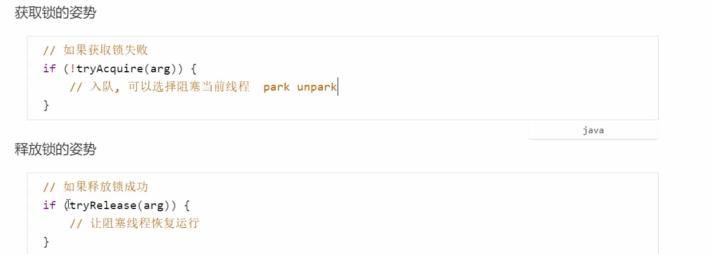

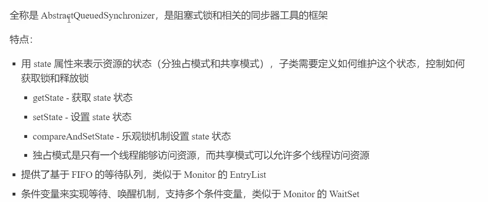