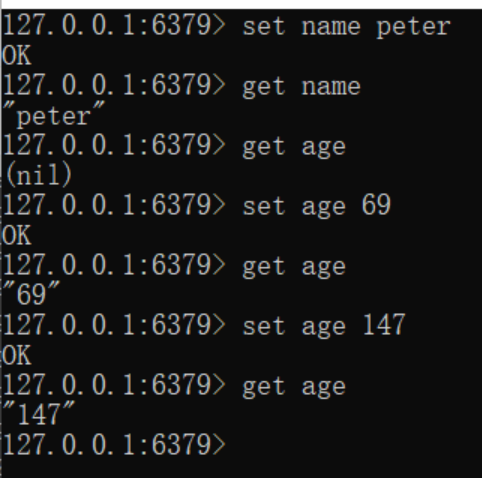

### Redis简介
#### 问题现象：
1. **海量用户**
2. **高并发**

#### 罪魁祸首--关系型数据库
- 性能瓶颈：磁盘IO性能低下，基层信息存储在磁盘，CPU-->缓存-->内存-->磁盘
    - **降低磁盘IO次数**，越低越好      ----**内存存储**
- 扩展瓶颈：数据关系复杂（网状），扩展性差，不便于大规模集群
    - **去除数据间关系**，越简单越好    -----**不存储关系，仅存储数据**

#### Nosql
> 针对大量用户，高并发的应用场景，作为对关系型数据库的补充

NoSQL: **Not-Only SQL**（泛指非关系型数据库），作为**关系型数据库的补充。**

特征：
- 要保证**扩容性**和**伸缩性**
- **大数据量下高性能**
- 灵活的数据模型
- **高可用**

常见的Nosql数据库：
- Redis
- memcache
- HBase
- MongoDB

#### 解决方案（电商场景）
商品基本信息（固定的，唯一一份，存储在MySQL）
- 名称
- 价格
- 厂商

商品附加信息（实时加载，存储在MongoDB）
- 描述
- 详情
- 评论

图片信息（分布式文件系统）

搜索关键字（ES、Lucene、solr）

上述四类信息都可能变成**热点信息**（**Redis**、memcache、tair）
- 高频
- 波段性，具有波段性

除了**数据库存储基本数据**之外，其他数据根据其特征存放到不同地方（Nosql），对外提供数据服务


### Redis
概念：Redis（**Remote Dictionary Server**）是用C语言开发的一个开源的高性能**键值对（key-value）数据库**。

#### 特征：
1. 数据间没有必然关系（**键值对，提升性能关键**）
2. 内部采用**单线程机制**进行工作，提供原子性操作，保证安全性
3. **高性能**
4. 多数据类型支持
5. **持久化支持**，可以进行数据灾难恢复

#### 应用：
- 热点数据加速查询，如热点商品、热点新闻、推广类等高访问量信息等
- 任务队列，如秒杀、抢购、购票排队等
- 即时信息查询，如公交到站信息、在线人数信息、各类网站访问统计等
- 时效性信息控制，如验证码控制、投票控制
- 分布式数据共享，如分布式集群架构中的session分裂
- 消息队列
- 分布式锁

### Redis的下载与安装
- Linux版（适合企业级开发）
    - 4.0版本作为主版本
- Windows版本
    - 3.2版本作为主版本（绿化版，只需解压，无需安装）

- redis-server：启动redis服务
- **redis-cli**：命令行客户端，进行redis操作
- redis-check-aof：持久化
- redis-benchmark：性能测试

启动redis服务端（redis-server）后，界面会显示redis的端口号
- **Port**：对外提供的服务端口号
- **IP地址**：即本机，localhost
- **PID**：每启动一个redis服务，即相当于启动了一个redis对象，PID即redis实例的ID号，随机生成


服务端日志


开启redis服务端后，双击redis-cli即可启动客户端，直接连接redis服务端


### Redis的基本操作
#### 命令行模式工具使用思考
- 功能性指令
- 清除屏幕信息
- 帮助信息查阅
- 退出指令


#### 功能性指令
信息添加
> 可以覆盖

```
set key value

set name peter
```

信息查询
根据key查询对应的value，如果不存在返回空（nil）
```
get key

get name
```


#### 清楚屏幕信息
```
clear
```

#### 帮助指令
```
help 指令名
help @群组名 
```


#### 退出客户端
```
quit
exit
<ESC>
```