# 1. Redis简介

## 1.1 问题现象

1. **海量用户**
2. **高并发**

## 1.2 罪魁祸首--关系型数据库

- 性能瓶颈：磁盘IO性能低下，基层信息存储在磁盘，CPU-->缓存-->内存-->磁盘
  - **降低磁盘IO次数**，越低越好      ----**内存存储**
- 扩展瓶颈：数据关系复杂（网状），扩展性差，不便于大规模集群
  - **去除数据间关系**，越简单越好    -----**不存储关系，仅存储数据**

## 1.3 Nosql

> 针对大量用户，高并发的应用场景，作为对关系型数据库的补充

NoSQL: **Not-Only SQL**（泛指非关系型数据库），作为**关系型数据库的补充。**

特征：

- 要保证**扩容性**和**伸缩性**
- **大数据量下高性能**
- 灵活的数据模型
- **高可用**

常见的Nosql数据库：

- Redis
- memcache
- HBase
- MongoDB

### 解决方案（电商场景）

商品基本信息（固定的，唯一一份，存储在MySQL）

- 名称
- 价格
- 厂商

商品附加信息（实时加载，存储在MongoDB）

- 描述
- 详情
- 评论

图片信息（分布式文件系统）

搜索关键字（ES、Lucene、solr）

上述四类信息都可能变成**热点信息**（**Redis**、memcache、tair）

- 高频
- 波段性，具有波段性

除了**数据库存储基本数据**之外，其他数据根据其特征存放到不同地方（Nosql），对外提供数据服务
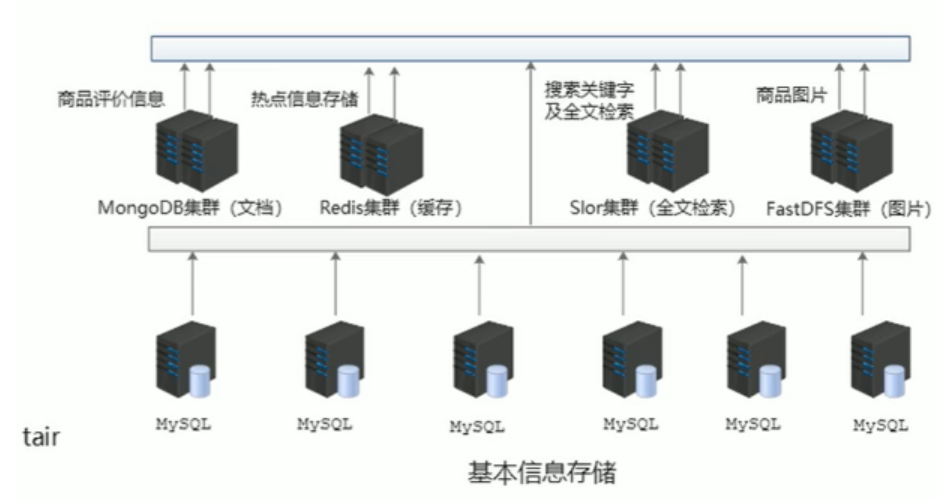

## 1.4 Redis

概念：Redis（**Remote Dictionary Server**）是用C语言开发的一个开源的高性能**键值对（key-value）数据库**。

### 特征

1. 数据间没有必然关系（**键值对，提升性能关键**）
2. 内部采用**单线程机制**进行工作，提供原子性操作，保证安全性
3. **高性能**
4. 多数据类型支持
5. **持久化支持**，可以进行数据灾难恢复

### 应用

- 热点数据加速查询，如热点商品、热点新闻、推广类等高访问量信息等
- 任务队列，如秒杀、抢购、购票排队等
- 即时信息查询，如公交到站信息、在线人数信息、各类网站访问统计等
- 时效性信息控制，如验证码控制、投票控制
- 分布式数据共享，如分布式集群架构中的session分裂
- 消息队列
- 分布式锁

## 1.5 Redis的下载与安装

- Linux版（适合企业级开发）
  - 4.0版本作为主版本
- Windows版本
  - 3.2版本作为主版本（绿化版，只需解压，无需安装）

- redis-server：启动redis服务
- **redis-cli**：命令行客户端，进行redis操作
- redis-check-aof：持久化
- redis-benchmark：性能测试

启动redis服务端（redis-server）后，界面会显示redis的端口号

- **Port**：对外提供的服务端口号
- **IP地址**：即本机，localhost
- **PID**：每启动一个redis服务，即相当于启动了一个redis对象，PID即redis实例的ID号，随机生成
  

服务端日志
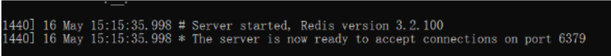

开启redis服务端后，双击redis-cli即可启动客户端，直接连接redis服务端
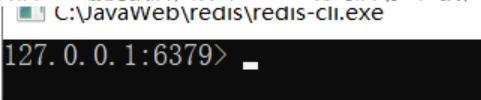

## 1.5 Redis的基本操作

### 命令行模式工具使用思考

- 功能性指令
- 清除屏幕信息
- 帮助信息查阅
- 退出指令


### 功能性指令

信息添加

> 可以覆盖

```
set key value

set name peter
```

信息查询
根据key查询对应的value，如果不存在返回空（nil）

```
get key

get name
```


### 清楚屏幕信息

```
clear
```

### 帮助指令

```
help 指令名
help @群组名 
```


### 退出客户端

```
quit
exit
<ESC>
```

# 2. 数据存储类型介绍

数据类型共有5种，为什么5种？

业务数据的特殊性：
Redis最初定位作为缓存使用，

1. 原始业务功能设计（秒杀、618活动、12306等等）
2. 运营平台监控到的突发高频访问数据（突发时政要闻）
3. 高频、复杂的统计数据（在线人数、投票排行榜）

附加功能
系统功能优化或升级

- 但服务器升级集群
- Session管理
- Token管理


基于上述使用场景，Redis包含5种常用的类型：

- string(String)
- hash(HashMap)
- list(LinkedList)
- set(HashSet)
- sorted_set(TreeSet)

## 2.1 redis数据存储格式

redis本身是一个Map，其中所有的数据都采用key:value的形式存储，其中key一定为string，value类型不一定


## 2.2 string类型

- 存储单个数据
- 存储数据的格式：一个存储空间存储一个数据
- 存储内容：通常采用字符串，如果字符串**以整数的形式显示，可以作为数字操作使用**（但**类型仍未string**）
  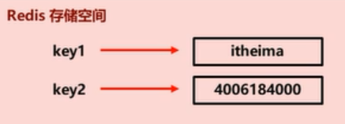

### 1）基本操作

- 添加/修改数据

```
set a 1
mset a 1 b 2 c 4      //    添加/修改多个数据  
```

- 获取数据

```
get a
mget a b c      //    获取多个数据
```

- 删除数据
  - 成功返回（Interger）1
  - 失败返回（Integer）0
- 获取数据字符个数

```
strlen a
```

- 追加信息到原始信息后部（原始信息不存在则新建），会返回添加后value的长度

```
append a 200
```

### 2）单指令操作与多指令操作执行流

> 　　Redis是远程字典服务器，指令需要发送到服务器执行

set key value 与 mset key1 value1 key2 value2 ...比较

一条指令执行过程：指令发送、执行指令、返回执行结果，均需消耗时间


**注意**：多指令操作**一次操作**过多数据（亿级别）**时间长**，对于**单线程容易造成阻塞**，及时将多指令操作进行切割

### 3）string类型数据的扩展操作

#### 业务场景一

数据量扩展到一定程度，仍采用一张表会影响查询效率，必须进行分表操作，使用多张表存储同类型数据，但是对应的主键id必须保证统一性，不能重复。Oracle数据表具有sequence设定，可以解决该问题，但是MySQL数据库并不具有类似机制。（保证主键id不重复）

- string在redis内部存储默认是字符串，**遇到incr或decr操作时，会转换为数值型进行计算**；
- **redis所有操作都是原子性的**，采用单线程处理所有业务，命令是一个一个执行的，无需考虑并发带来的数据影响
- 按值进行操作的数据，如果原始数据不能转成数值，或超越了redis数值上限范围（Long.MAX_VALUE），将报错

```
incr key            //将key加1
incrby key increment        //将key加increment
incrbyfloat key increment

decr key            //将key减1
decrby key increment        //将key减increment
```

#### 业务场景二

投票的时效性、热门商品时效性

设置数据具有指定的生命周期（可以被set覆盖）

```
setex key seconds value
psetex key milliseconds value           //毫秒

setex name 10 peter
set name peter          //覆盖原来具有时效性的name
```

**redis控制数据的生命周期**，通过数据是否失效控制业务行为，适用于所有具有时效性限定控制的操作

### 4）string类型操作的注意事项

- 运行结果是否成功
  (integer)0   ----> false
  (integer)1   ----> true
- 运行结果的值
  integer)3  ---->3个
  integer)1  ---->1个
- 数据为获取到
  (nil)   ---->null
- 数据最大存储量512MB
- 数值最大计算范围（java中long的最大值）

业务场景


解决方案


redis应用于各种结构型和非结构型**高热度数据访问加速**

key的设置约定
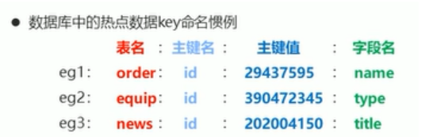

## 2.3 hash类型

- 对一系列要存储的数据进行编组，方便管理，
- 一个存储空间保存多个键值对数据
- hash类型：底层使用哈希表结构实现数据存储
  

hash存储结构优化：

- field数量较少，存储结构优化为类数组结构
- field数量较多，存储结构使用HashMap结构

### 1）基本操作

添加/修改数据

```
hset key field value

hmset key field1 value1 field2 value2  ...          //添加/修改多个数据
```

获取数据

```
hget key field  
hmget key field1 field2 ...         //获取多个数据

hgetall key     //获取所有field数据
```

删除数据

```
del key     //直接删除hash存储空间
hdel key field1 [field]
```

获取哈希表中字段的数量

```
hlen key
```

获取哈希表中是否存在指定的字段

```
hexists key field
```

hash类型数据的扩展操作
获取自己所有的键和所有的值

```
hkeys key           //获取key中所有的field

hvals key           //获取key中所有field的值（可能重复）
```

设置指定字段的数值数据增加指定范围的值

```
hincrby key field increment

hincrbyfloat key field increment
```

### 2）hash类型数据操作的注意事项

- hash类型下的value只能存储字符串，不允许存储其他数据类型，不存在嵌套，如果数据未获取到，返回(nil)
- 每个hash可以存储2^32-1个键值对
- hash类型可以灵活添加删除对象属性，但不可滥用，不可将hash作为对象列表使用
- hgetall可以获取全部属性，如果内部field过多，遍历整体数据效率就很低，有可能成为数据访问的瓶颈


### 3）hash类型应用场景

业务场景

电商网站购物车设计与实现
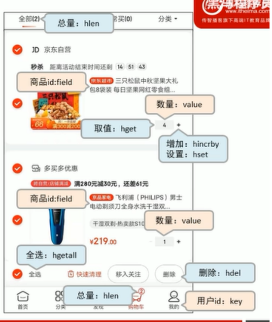

业务分析：


解决方案：
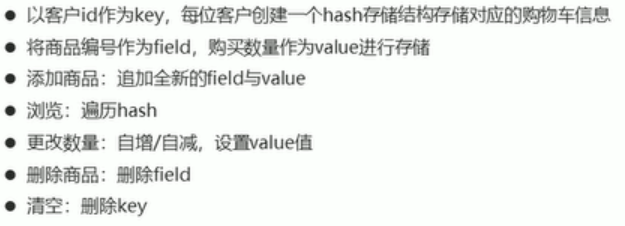

存在问题：
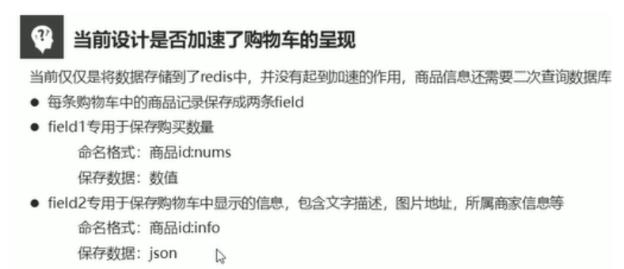

信息冗余：
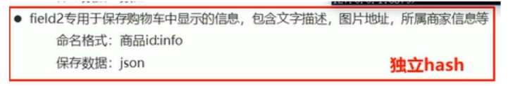

```
hsetnx key field value          //如果key的field中有值，则将不添加，如果key对应的field没有值，则value赋给field；如果没有key，则创建key，再调用hsetnx key field value
```

## 2.4 list类型

- **存储多个string数据**，并对数据**进入存储空间的顺序**进行区分
- 一个存储空间保存多个数据，且**通过数据可以体现顺序**
- 底层使用**双向链表**存储结构实现

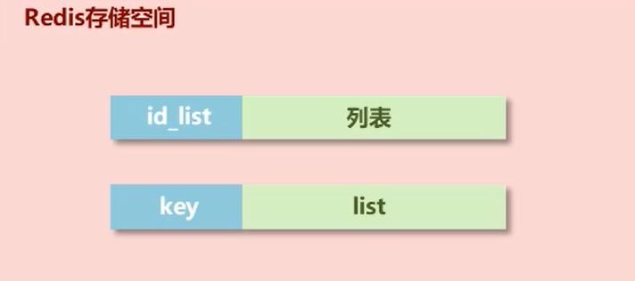

### 1）基本操作

添加/修改数据

```
lpush key value1 [value2]   ...         //插入到链表的头部
rpush key value1 [value2]   ...         //插入到链表尾部
```

获取数据

- 获取某个范围内的元素（0， -1）表示全部数据
- 获取某个位置的元素
- 获取链表的长度

```
lrange key start stop
lindex key index
llen key	//返回长度
```

获取并移除数据

```
lpop key            //从链首获取数据并将其删除
rpop key            //从链尾获取数据并将其删除
```

规定时间内获取并移除数据（阻塞获取）

- 可以等待多个list，任意列表有内容可以获取时，就会从该列表链首获取数据并移除
- 类似于任务队列

```
blop key1 [key2] timeout	//单位秒
```

### 2）list类型数据扩展

#### 业务场景一

微信朋友圈点赞，要求按照点赞顺寻显示点赞好友

如果取消点赞，移除对应好友信息（从中间移除元素）

解决方案

- 移除指定数据

```
lrem key count value

rpush 001 a b c d e
lrange 0 -1
lrem 001 count value	//count指的是删除几个数据

rpush 001 a b c a b c a b e
lrem 001 3 a		//从链首开始删除三个a元素
```

list类型数据操作注意事项

- list中保存数据是string类型，容量为2^32-1
- list具有索引的概念，操作数据时通常以队列的形式进行入队出队操作，
- 获取全部数据操作结束索引设置为-1
- **list可以对数据进行分页**，通常第一页的信息来自list，第2页及更多的信息通过数据库的形式加载

list数据类型应用场景

#### 业务场景二

企业运营过程中，大量的运营数据如何保障多台服务器操作日志的统一顺序输出？

#### 解决方案

- 依赖list的数据具有顺序的特征对信息进行管理

- 使用队列模型解决多路信息汇总合并的问题

- 使用栈模型解决最新消息问题

```
//server1
rpush logs a1..
rpush logs a1...

//server2
rpush logs b1..
rpush logs b1...

//server3
rpush logs c1..
rpush logs c1...
```

## 2.5 Set类型

- 存储大量的数据，**查询方面**提供更高的效率
- 需要的存储结构：能够保存大量数据，高效的内部存储机制，**便于查询**
- 与hash存储结构完全相同，仅存储键，不存储值，并且键值是不允许重复的

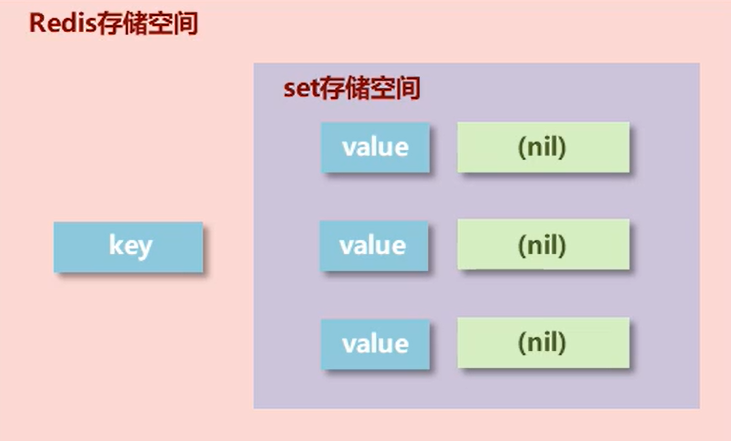

### 1）基本操作

- 添加数据

  ```
  sadd key value
  ```

- 获取全部数据

  ```
  smembers key
  ```

- 删除数据

  ```
  srem key value
  ```

- 获取set集合数据总量

  ```
  scard key
  ```

- 判断集合中是否包含指定数据

  ```
  sismember key value
  ```

### 2）扩展操作

#### 业务场景一 - 热点推荐

初次今日头条时，会设置3项爱好的内容，但是后期为了增加用户的活跃度、兴趣点，必须让用户对其他信息类别逐渐产生兴趣，增加客户留存度，如何实现？

解决方案

- 系统将各类最新的热点信息条目组织成集合
- 随机挑选其中部分信息
- 配合用户关注信息分类中的热点信息组成展示的全信息集合

- 随机获取集合中指定数量的数据（不影响原set集合），不加count时，默认随机返回一个数据

  ```
  srandmember key [count]
  ```

- 随机获取集合中的某个数据，并将该数据移除集合

  ```
  spop key
  ```

redis应用于随机推荐类信息检索，例如热点歌单推荐，热点新闻推荐，热卖旅游线路，应用APP推荐，大V推荐等

#### 业务场景 - 共同好友

共同好友、几个朋友关注了该公众号之类的

解决方案：

- 求两个集合的交、并、差集

```
sinter key1 [key2]
sunion	key1 [key2]
sdiff key1	[key2]
```


- 求两个集合的交、并、差集并存储到指定集合中

```
sinterstore destination key1 [key2]sunionstore destination key1 [key2]sdiffstore destination key1 [key2]
```


- 将指定数据从原始集合中移动到目标集合中

```
smove source destination member
```


业务场景-权限校验


#### 业务场景三

统计网站的PV（访问量）、UV（独立访客）、IP

PV：网站被访问次数，可通过刷新页面提高访问量

UV：网站被不同用户访问的次数，可以通过cookie统计访问量

IP：网站被不同IP地址访问次数，可通过IP统计访问量

解决方案

使用set集合的数据驱虫特征，记录各种访问数据

建立string类型数据，利用incr统计

建立set模型，记录cookie

建立set模型，记录ip


redis应用于同类型数据的快速去重

#### 业务场景四


解决方案

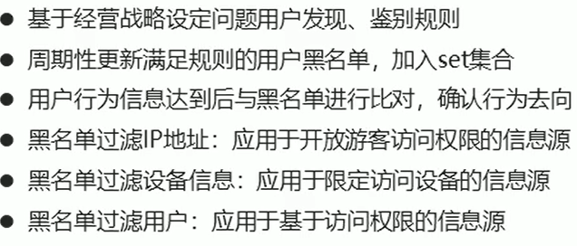

redis应用于黑白名单，对用户进行访问控制

## 2.6 sorted_set

### 1）存储结构

#### 底层结构

新的存储需求：数据排序有利于数据的展示，需要一种可以**根据自身特征进行排序**的方式

需要的存储结构：新的存储模型，可以保存可排序的数据

sorted_set类型：在set的存储结构基础上**添加可排序字段score**


#### 注意事项

- score保存的数据存储空间是64位，如果是整数范围，范围是
- score保存的数据也可以是一个双精度的double值，**基于双精度浮点数的特征，可能会丢失精度**，使用时要慎重
- score_set底层存储还是基于set结构，因此**数据不能重复**，score值被反复覆盖，保留最后一次修改的结果

### 2）基本操作

- 添加数据

  ```
  zadd key score member [score member ...]
  ```

- 获取全部数据，默认按照从小到大的顺序排列

  ```
  zrange key start stop [withscores]
  zrevrange key start stop [withscores]
  ```

- 删除数据

  ```
  zrem key member [member ...]
  ```

- 按条件获取数据，limit分页查询

  ```
  zrangebyscore key min max [withscores] [limit]
  zrevrangebyscore key min max [withscores] [limit]
  ```

- 条件删除数据

  ```
  zremrangebyrank key start stop
  zremrangebyscore key min max
  ```

- 获取集合数据总量

  ```
  zcard key
  zcount key min max
  ```

- 集合交并操作

  ```
  zinterstore destination numkeys key [key ...]
  zunionstore destination numkeys key [key ...]
  ```

### 3）扩展操作

#### 业务场景-票房排序

> 应用于计数器组合排序功能对应的排名


- **获取数据对应的索引**（排名）（默认越小排名越靠前）

  ```
  zrank key member
  zrevrank key member
  ```

- **score值获取与修改**

  ```
  zscore key memberzincrby key increment member
  ```

### 4）应用场景

#### 业务场景 - 管理过期信息

> redis应用于定时任务执行顺序管理或任务过期管理。

##### 场景描述


##### 解决方案

- 使用sorted_set保存各用户的用户id，并将处理时间（要到期的时间）记录为score，利用排序功能区分处理的先后顺序

- 记录下一个要处理的时间，当到期后处理对应任务，移除redis中的记录，并记录下一个要处理的时间

- 新任务加入时，判定并更新下一个要处理的任务

- 获取当前系统时间

  ```
  time
  ```

### 5）业务场景 - 任务/消息权重设定

#### 场景描述


#### 解决方案

- 单权重的任务，采用score记录权重，优先处理权重值高的任务
- 多权重任务，可以将多权重按照一定规则进行组合，要求组合值长度相同（不足补0），之后采用socre记录组合值，优先处理组合之高的任务

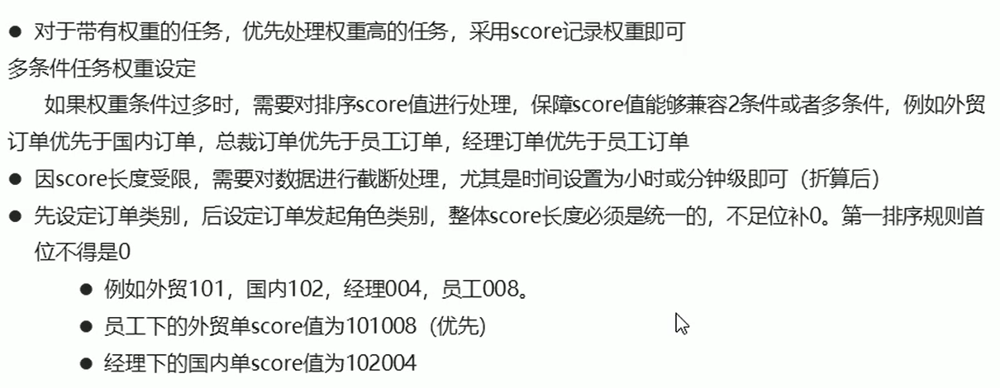

# 3. 数据类型实践案例

## 3.1 按次结算的服务控制

### 1）业务场景


### 2）解决方案

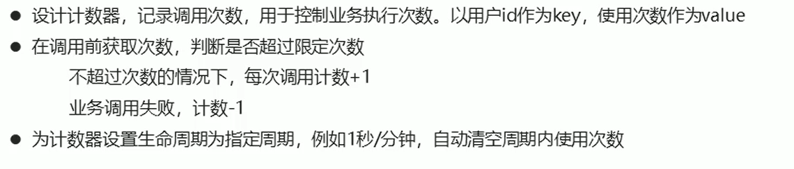

```
setex uid:00415 60 1

```

### 3）改良

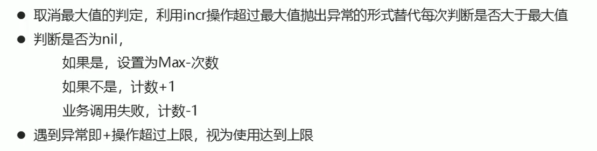

```
set uid:00415 60 
```

# 4. 常用命令

## 8.1 通用指令

## 8.1 key通用操作


## 8.2 基本操作

- 删除指定key

  ```
  del key
  ```

- 获取key是否存在

  ```
  exists key
  ```

- 获取key的类型

  ```
  type key
  ```

## 8.3 扩展操作

### 1）时效性控制

- key不存在返回值-2
- key永久（未设置有效期），返回-1

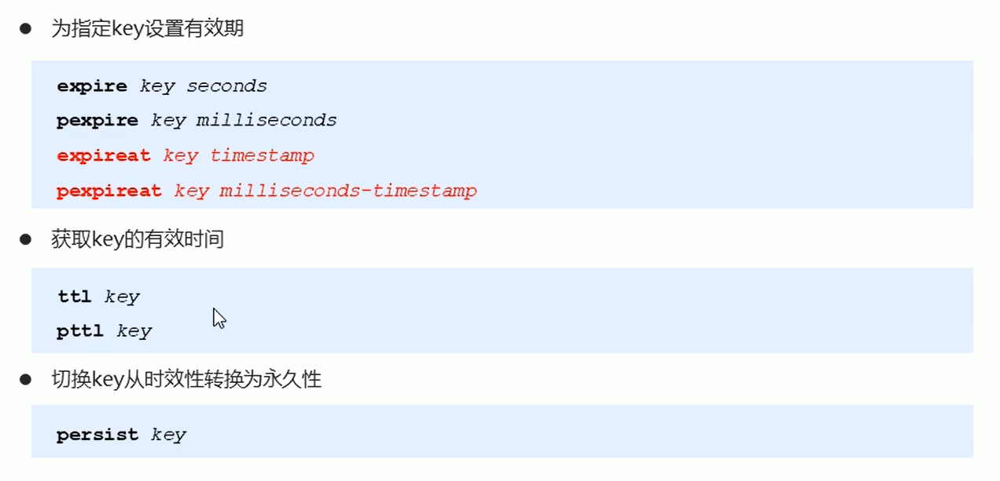

### 2）查询模式

- 查询key

```
keys pattern
```

查询规则


*

? 

[]

### 3）其他操作

- 为key改名：rename如果newkey存在，则覆盖；renamex如果newkey存在，则修改失败

  ```
  rename key newkey
  renamex key newkey
  ```

- 对所有key排序

  ```
  sort
  ```

- 其他key通用操作

  ```
  help @generic
  ```

  

## 8.4 数据库通用操作

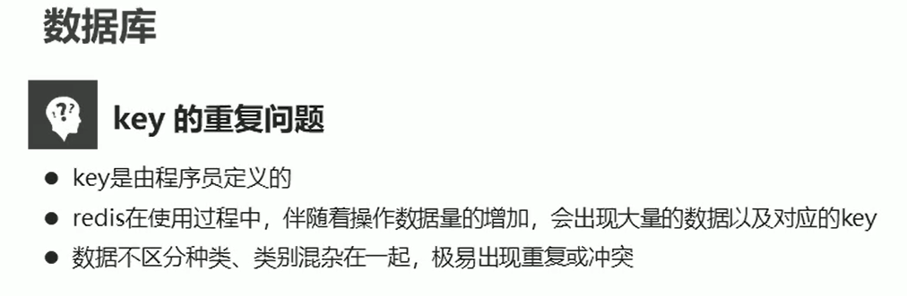

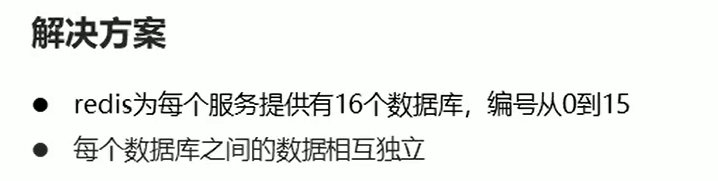

### db基本操作

- 切换数据库

  ```
  select index
  ```

- 退出

  ```
  quit
  ```

- 测试服务器是否连通

  ```
  ping
  ```

- 显示信息

  ```
  echo 信息
  ```

- 数据移动

  ```
  move key db
  ```

- 数据清除

  ```
  dbsize// 清除当前数据库flushdb// qflushall
  ```

# 9. Jedis

Java程序操作redis的工具

- Jedis

- SpringData Redis

- Lettuce

操作redis步骤

1. 连接redis
   - host
   - port
2. 操作redis
   - 方法名与redis操作方法名相同
   - 取出的数据会转换为对应的Java类型
3. 关闭连接

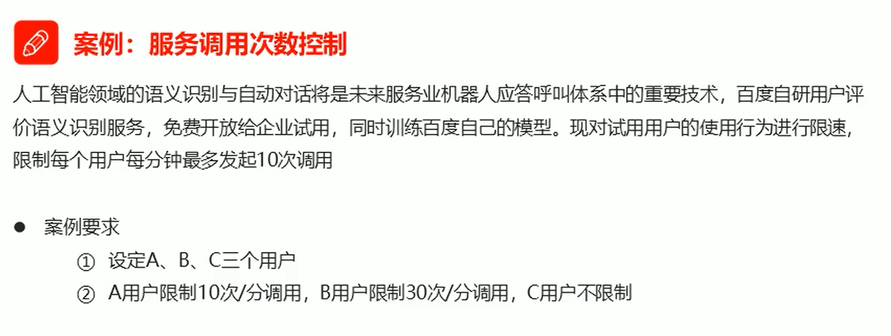


1. 设定业务方法
2. 设定多线程类，模拟用户调用

3. 设计redis控制方案
4. 启动主程序


## Jedis简易工具类开发

> Jedis连接池获取Redis连接

## 可视化客户端