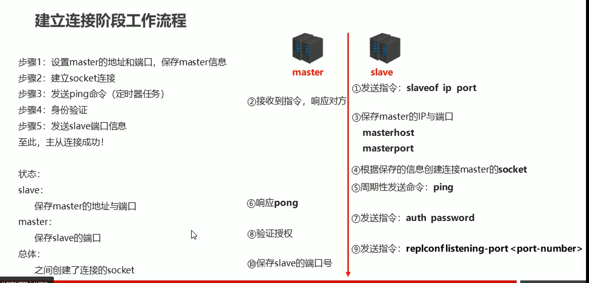
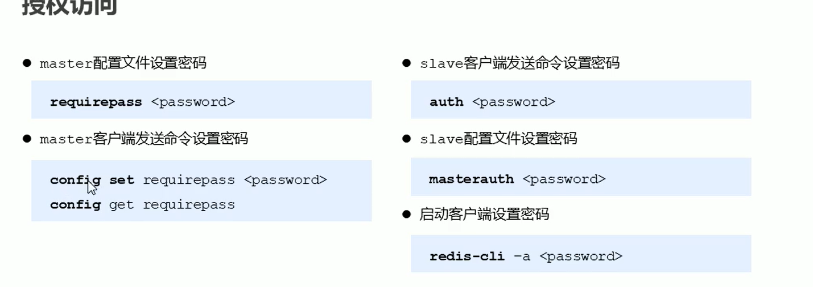
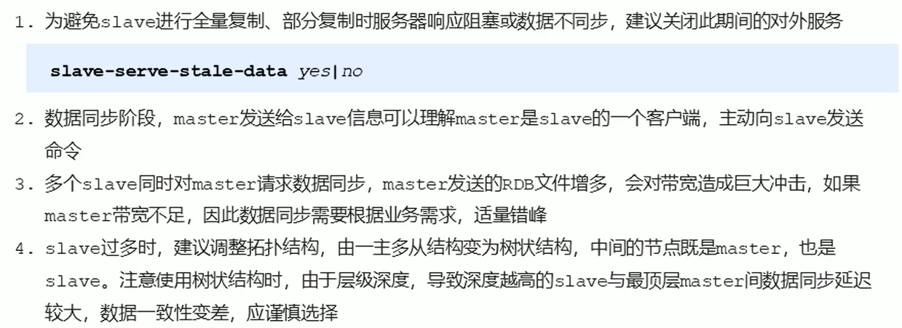
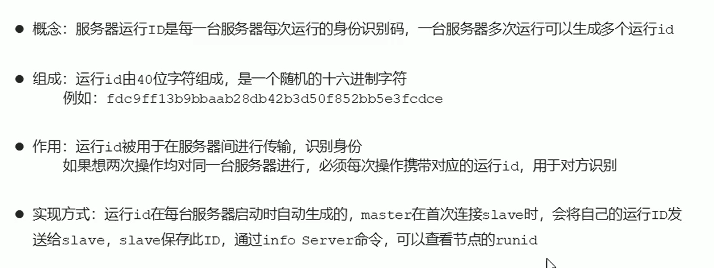
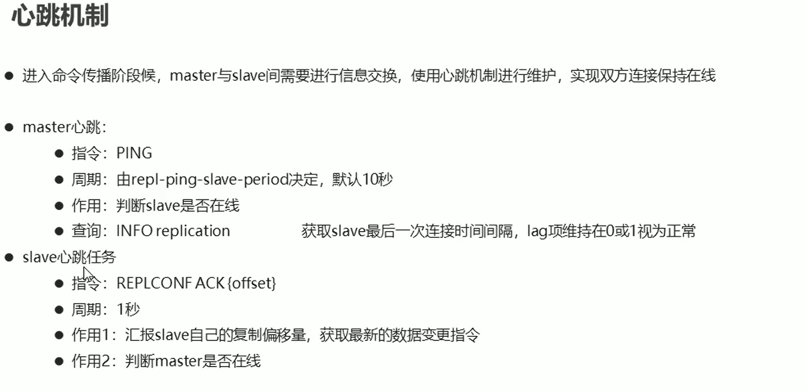

# 12. 主从复制

## 12.1 简介

Redis三条主线：

- 高性能
- **高可靠**：损失数据尽量少（持久化+主从复制）+服务时间长（主从复制）
- 高可扩展

单机Redis的风险与问题：

- **机器故障**：如硬盘故障、系统崩溃，会导致数据丢失可能对业务造成灾难性打击

为了避免单点Redis服务器故障，准备多台服务器，互相连通，将数据复制多个副本保存在不同的服务器上，连接在一起，并保证数据是同步的，来实现Redis的高可用，同时实现**数据的冗余备份**。

我们将数据提供方称为**master**（主服务器/主节点/主库/主客户端），将接收数据方称为**slave**（从服务器\从节点\从库\从客户端）。主从复制需要解决的核心问题是**数据同步**，核心工作是如何**将master中的数据即时、有效地复制到slave中**。

主从复制具有一对多的特征，即一个master可以拥有多个slave，一个slave只对应一个master。

**master主要执行写数据命令**，同时会将出现变化的数据自动同步到slave中；**slave只提供读数据的服务**。（**读写分离**）

主从复制有如下好处：

- 读写分离
- 负载均衡
- 故障恢复
- 数据冗余
- 高可用基石


## 12.2 工作流程

总述：

因为master可以连接多个slave，所以是由slave主动连接master


### 1）阶段一：建立连接


一般Redis是内部服务器，不对外提供服务，所以都是内网访问，可以不做验证



连接方式

- 方式一：从客户端发起指令

```
slaveof ip port
```

- 方式二：从客户端启动时进行配置

```
redis-server 配置文件 --slaveof ip port
```

- 方式三：在配置文件中进行配置

```
slaveof ip地址 端口号 
```

断开连接

- 从客户端发起指令

```
slaveof no one
```



授权访问

### 2）阶段二：数据同步阶段

> 由从客户端服务器发起

全量复制（发指令时全部数据）+增量复制（部分复制，全量复制时主服务器修改数据的指令）


数据同步阶段master说明

1. 如果master数据量巨大，数据同步阶段应避开流量高峰期，避免造成master阻塞，影响业务正常执行

2. 修改复制缓冲区大小

3. 

   

数据同步阶段slave说明



### 3）阶段三：命令传播阶段


服务器运行ID（runid）



复制缓冲区

将传播的命令记录下来，存储在复制缓冲区


内部工作原理

- 偏移量（master和slave都要记）
- 字节值


偏移量


数据同步+命令传播阶段工作流程

全量复制可能多次执行


心跳机制




## 12.3 常见问题


频繁的网络中断


数据不一致

