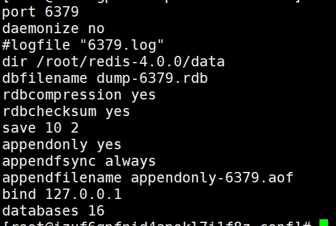
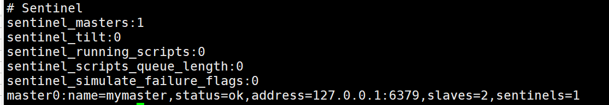
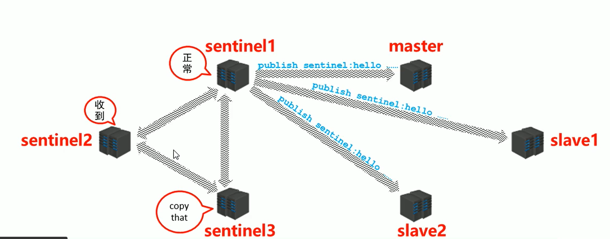
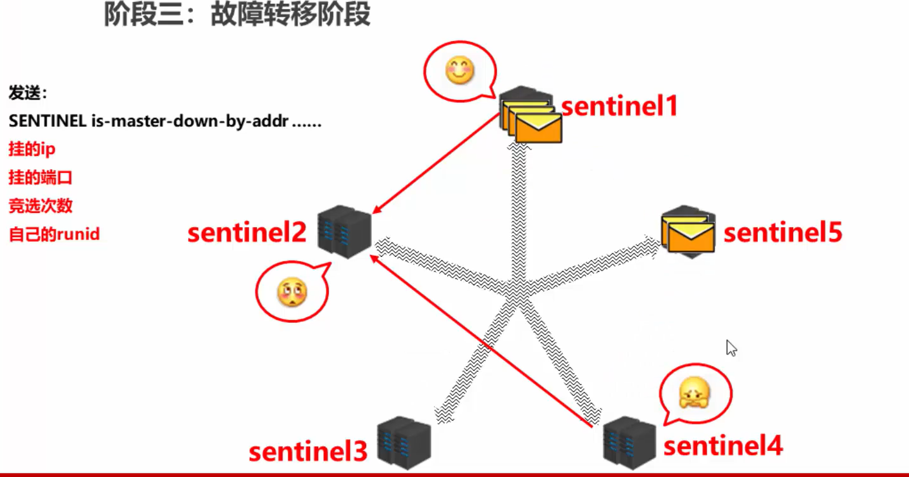
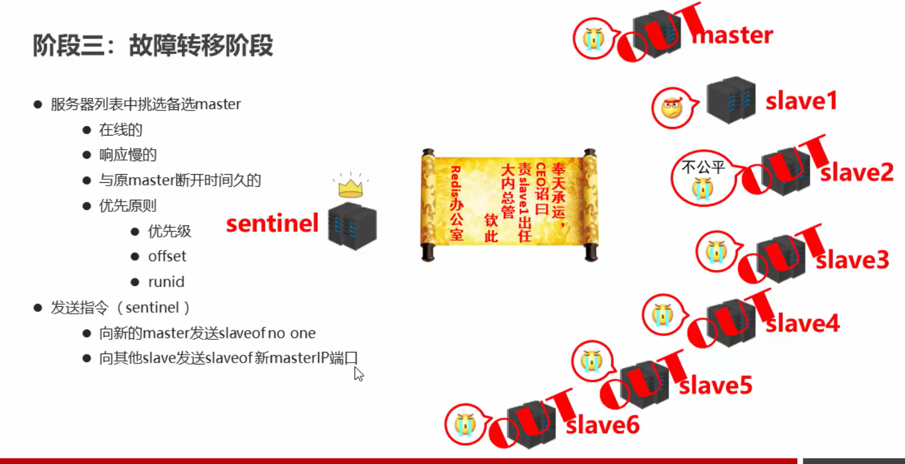

# 13. 哨兵

## 13.1 简介

为了保证Redis的高可靠性，Redis提供了主从复制机制，引入了master、slave两种不同角色的服务器，来实现当主机挂了时，仍能对外正常提供服务。主从复制部分只介绍了master和slave的工作原理，但是没有介绍当master宕机时，如何不间断服务。

当master宕机时，从数据库之间不能进行同步，同时不能对外提供写服务。

首先，我们考虑如果想实现master宕机时，能不间断服务，需要考虑以下问题：

- 主库真的挂了吗？
- 该选择哪个从库作为主库？
- 怎么把新主库的相关信息通知给从库和客户端呢？


Redis提供了哨兵机制用来完成上述任务。

哨兵（sentinel）是一个**分布式系统**，对于用主从结构中的每台服务器进行**监控**，当出现故障时，通过投票机制选择新的master并将所有的slave连接到新的master。


### 哨兵的主要作用有：

- 监控
  - 不断检查master和slave是否正常运行
  - master存货检测、master与slave运行情况检测
- 通知
  - 当被监控的服务器出现问题时，向其他（哨兵间、客户端）发送通知
- 自动故障转移
  - 断开master与slave连接，选取一个slave作为master，将其他slave连接到新的master，并告知客户端新的服务器地址

注意：哨兵也是一台redis服务器，只是不提供数据服务。通常将哨兵数量配置为单数，避免投票出现平票的情况。

## 13.2 启用哨兵模式

### 1）配置哨兵

#### ① 查看默认配置文件

sentinel.conf为哨兵的配置文件，可以通过以下指令查看默认的配置文件

```
cat sentinel.conf | grep -v "#" | grep -v "^$"
```


- **port** ：端口号（通常在监控的服务器端口号前加，如监控6379，则哨兵端口号应设置为26739）
- **dir**：日志等输出目录
- **sentinel monitor** mymaster 127.0.0.1 6379 2
  - 设置监控的master的ip地址以及端口号
  - mymaster：自定义master的别称
  - 2：判定master宕机的哨兵的数量达到2时，认定master宕机
- **sentinel down-after-milliseconds** mymaster 30000
  - 连接多长时间没响应，认定该master宕机（毫秒为单位）
- **sentinel parallel-syncs** mymaster 1
  - 宕机之后开始几个数据同步
- **sentinel failover-timeout** mymaster 180000
  - 同步超时设定

#### ② 准备哨兵及主从服务器配置文件

##### I. 准备哨兵配置文件


```
cat sentinel.conf | grep -v "#" | grep -v "^$" > conf/sentinel-26379.conf
sed 's/26379/26380/g' sentinel-26379.conf > sentinel-26380.conf 
sed 's/26379/26381/g' sentinel-26379.conf > sentinel-26381.conf 
```

##### II. master、slave配置文件

###### master

- 配置rdb
- 配置aof



###### slave

- 配置slaveof 主机ip 主机端口号


#### ③ 删除其他无关文件

```
rm -rf 
```

#### ④ 启动

启动顺序依次为：

- 主机-->从机-->哨兵

**启动哨兵**

```
redis-sentinel sentinel-26379.conf 
```

#### ⑤ 开启客户端

连接都使用

```
redis-cli -p 端口号
```

#### ⑥ 查看哨兵信息

哨兵客户端执行`info`



此时查看该哨兵对应的配置文件，会发现其发生了变化


终止master服务器时，哨兵服务器会执行以下流程

- odown：将服务器标记为odown
- vote：从slave中选出一个master
- switch：切换master
- slave：将slave连接到新的master


### 主从切换

- 监控
- 通知
- 故障转移


#### 阶段一：监控


1. sentinel 获取master信息
2. 建立了一个cmd连接（专门用于发命令）
   - sentine
   - master存储了sentinel信息
3. 获取slave信息
4. 第二个sentinel获取master信息
   - 获取到其他sentinel信息
5. sentinel之间public subscribe通道


#### 阶段二：通知阶段

由一个sentinel去向master和slave询问，通知其他sentinel



#### 阶段三：故障转移阶段

sentinel发现master断掉（主观下线/S_DOWN），则在内网中传播这一消息，其他sentinel去检查master是否真正断掉（客观下线/O_DOWN）


当标记到客观下线，则开始

- 选出领头的sentinel



- 从slave中选择一个当作master
  - 先排除掉不在线的、响应慢的、与原来master断开时间久的
  - 优先原则
    - 优先级
    - offset（）
    - runid（优先小的）



## 13.3 总结

