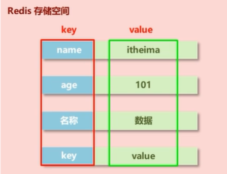
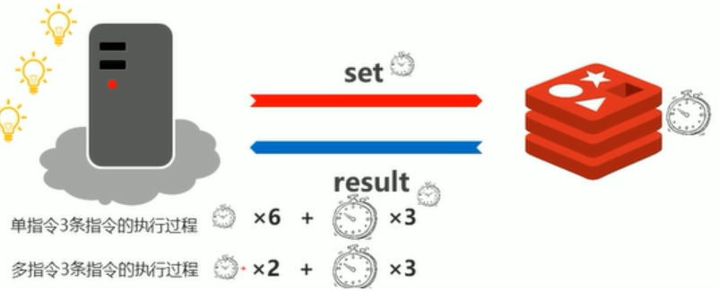
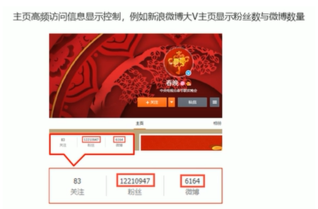
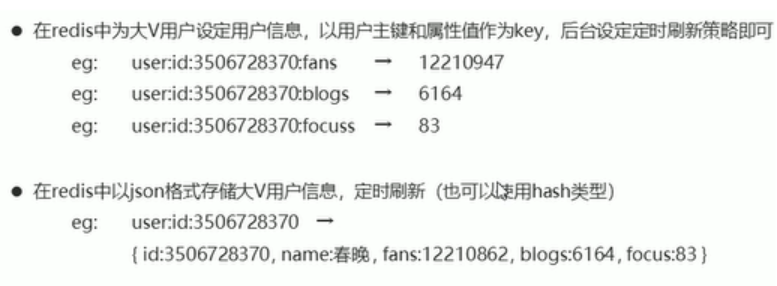

### 数据存储类型介绍
数据类型共有5种，为什么5种？

业务数据的特殊性：
Redis最初定位作为缓存使用，

1. 原始业务功能设计（秒杀、618活动、12306等等）
2. 运营平台监控到的突发高频访问数据（突发时政要闻）
3. 高频、复杂的统计数据（在线人数、投票排行榜）

附加功能
系统功能优化或升级

- 但服务器升级集群
- Session管理
- Token管理


基于上述使用场景，Redis包含5种常用的类型：
- string(String)
- hash(HashMap)
- list(LinkedList)
- set(HashSet)
- sorted_set(TreeSet)

#### redis数据存储格式

redis本身是一个Map，其中所有的数据都采用key:value的形式存储，其中key一定为string，value类型不一定


#### string类型

- 存储单个数据
- 存储数据的格式：一个存储空间存储一个数据
- 存储内容：通常采用字符串，如果字符串**以整数的形式显示，可以作为数字操作使用**（但**类型仍未string**）


##### string类型的基本操作

- 添加/修改数据
```
set a 1
mset a 1 b 2 c 4      //    添加/修改多个数据  
```
- 获取数据
```
get a
mget a b c      //    获取多个数据
```
- 删除数据
    - 成功返回（Interger）1
    - 失败返回（Integer）0
- 获取数据字符个数
```
strlen a
```
- 追加信息到原始信息后部（原始信息不存在则新建），会返回添加后value的长度
```
append a 200
```

##### 单指令操作与多指令操作执行流

> 　Redis是远程字典服务器，指令需要发送到服务器执行

set key value 与 mset key1 value1 key2 value2 ...比较

一条指令执行过程：指令发送、执行指令、返回执行结果，均需消耗时间


**注意**：多指令操作**一次操作**过多数据（亿级别）**时间长**，对于**单线程容易造成阻塞**，及时将多指令操作进行切割

#### string类型数据的扩展操作
##### 业务场景一
数据量扩展到一定程度，仍采用一张表会影响查询效率，必须进行分表操作，使用多张表存储同类型数据，但是对应的主键id必须保证统一性，不能重复。Oracle数据表具有sequence设定，可以解决该问题，但是MySQL数据库并不具有类似机制。（保证主键id不重复）

- string在redis内部存储默认是字符串，**遇到incr或decr操作时，会转换为数值型进行计算**；
- **redis所有操作都是原子性的**，采用单线程处理所有业务，命令是一个一个执行的，无需考虑并发带来的数据影响
- 按值进行操作的数据，如果原始数据不能转成数值，或超越了redis数值上限范围（Long.MAX_VALUE），将报错
```
incr key            //将key加1
incrby key increment        //将key加increment
incrbyfloat key increment

decr key            //将key减1
decrby key increment        //将key减increment
```

##### 业务场景二
投票的时效性、热门商品时效性

设置数据具有指定的生命周期（可以被set覆盖）
```
setex key seconds value
psetex key milliseconds value           //毫秒

setex name 10 peter
set name peter          //覆盖原来具有时效性的name
```
**redis控制数据的生命周期**，通过数据是否失效控制业务行为，适用于所有具有时效性限定控制的操作

##### string类型操作的注意事项
- 运行结果是否成功
(integer)0   ----> false
(integer)1   ----> true
- 运行结果的值
integer)3  ---->3个
integer)1  ---->1个
- 数据为获取到
(nil)   ---->null
- 数据最大存储量512MB
- 数值最大计算范围（java中long的最大值）

业务场景


解决方案



redis应用于各种结构型和非结构型**高热度数据访问加速**

key的设置约定
