## 1. Linux安装Redis

### 1）安装

1.  下载安装包

```shell
wget http://download.redis.io/releases/redis-4.0.0.tar.gz
```

2. 解压

```
tar -xvf redis-4.0.0.tar.gz
```

3. 进入目录查看文件夹中包含哪些文件
   - Makefile为安装的设定，默认安装到src目录

```shell
cd redis-4.0.0
ll
```

1. 安装redis（先编译再安装），在redis目录下输入如下指令：

```shell
make install
```

5. 进入src目录查看安装的文件
6. 输入redis-server即可启动

### 2）启动多台redis

#### ① 指定端口号启动

启动redis服务时，可以指定端口

```shell
redis-server --port 指定的端口号
```

使用客户端连接时，需要跟上启动的redis服务端口号

```
redis-cli -p 指定的端口号
```

#### ② 配置文件方式启动

默认安装redis目录中存在配置文件redis-conf，可以使用如下指令创建新的配置文件：

- 过滤注释信息及空白信息
- 将其输出到redis-6379.conf中

```shell
cat redis.conf | grep -v "#" | grep -v "^$" > redis-6379.conf
```

其中，主要的配置信息如下：

- port 6379：redis服务的启动宽口
- daemonize yes：是否设置为守护进程（守护进程会在后台运行）
- logfile "6379.log"：输出日志文件名
- dir /root/redis-4.0.0/logfiles：日志的输出目录

根据配置文件方式启动：

```shell
redis-server 配置文件名
```

查看启动的redis进程

```shell
ps -ef | grep redis-
```

结束该进程

```shell
kill -s 0 进程号
```

建议：创建一个conf文件夹，将所有的配置文件都放到该文件夹中。

## 2. 持久化

永久性存储介质保存数据，特定时间将保存的数据进行恢复的工作机制

防止数据意外丢失，确保数据安全。

持久化过程保存什么？

1. 快照：将当前数据状态全部保存下来，存储数据结果
   - 存储格式简单
   - 关注点在数据
2. 保存数据的操作过程，日志形式，存储操作过程存储格式复杂，关注点在数据的操作过程

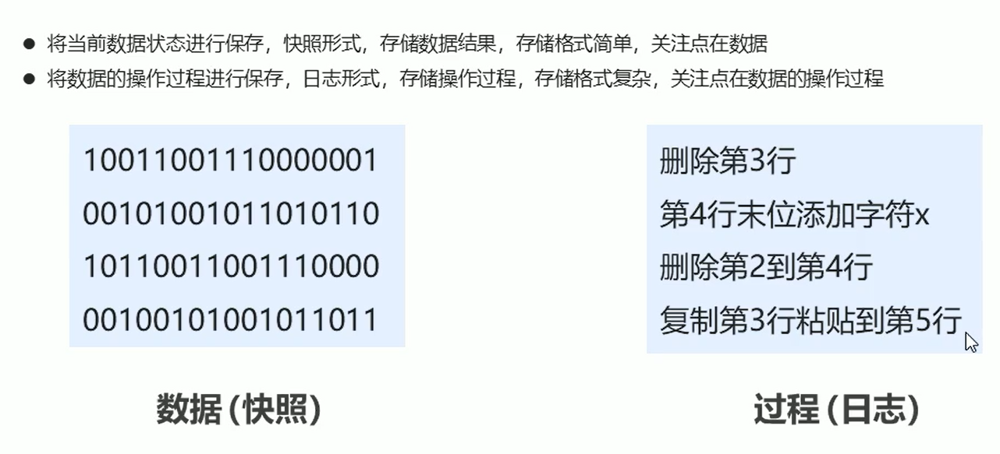

### 1）RDB

#### ① 阻塞保存 - save指令

当执行**save**指令时，redis会执行一次保存操作，生成一个dump.rdb文件，保存当前数据的快照信息。

save指令相关配置：在启动redis-server的配置文件中进行配置

- **dbfilename**：设置本地数据库文件名，默认为dump.rdp（通常设置为dump-端口号.rdb）
- **dir**：设置存储rdb文件的路径（通常将目录名称设置为data）
- **rdbcompression**：设置存储至本地数据库时是否压缩数据，默认为yes，采用LZF压缩（设置为no可以节省CPU运行时间，但是会使存储的文件变大）
- rbdchecksum：设置是否进行RDB文件格式校验，该校验过程在写文件和读文件过程均进行，默认为开启状态（设置为no，可以解决读写过程约10%时间消耗，但存在数据损坏风险）

当启动redis时，会**根据配置文件**自动将rdb中的快照恢复到数据库中

- 如果未指定配置文件启动，则数据库为空
- 只会恢复之前保存到rbd中的数据

##### save指令工作原理

由于redis服务是单线程，多个客户端的指令汇集到redis服务器时，会按顺序串行执行的。如果save指令执行时间过长，就会阻塞其他客户端的其他指令，直到当前RDB过程完成为止。所以，**线上环境不建议使用save指令。**

#### ② 非阻塞保存 - bgsave

save指令会造成redis服务器阻塞，而采用**bgsave**指令，会手动**启动后台**保存操作，但**不是立即执行**。

不同于save指令，redis在收到bgsave指令时，不会将其放到自己的执行队列中，而是会调用fork函数生成子进程，由子进程创建rdb文件，完成RDB操作，可以在日志文件中查看具体过程。


注意：bgsave指令是针对save阻塞文件做的优化，Redis内部所有涉及RDB操作都采用bgsave的方式。

除了save指令的几个配置外，bgsave指令还有如下配置：

- stop-writes-on-bgsave-error：后台存储过程中如果出现错误现象，是否停止保存操作（默认为开启）

#### ③ 自动执行

可以在conf中配置save执行的条件，当满足条件时，redis会自动**执行bgsave指令**。

```
save second changes
```

- 满足**限定时间范围**内**key的变化数量**达到指定数量即进行持久化
- 参数
  - second：监控时间范围
  - changes：监控变化的key的数量
  - second与change设置通常具有互补对应关系

#### ④ save和bgsave对比

| 方式           | save | bgsave |
| -------------- | ---- | ------ |
| 读写           | 同步 | 异步   |
| 阻塞客户端指令 | 是   | 否     |
| 额外内存消耗   | 否   | 是     |
| 启动新进程     | 否   | 是     |

#### ⑤ RDB优缺点

**优点**：

- RDB是一个紧凑压缩的二进制文件，存储效率高
- 内部存储的是某个时间点的数据快照，非常适合用于数据备份，全量复制等场景
- RDB恢复数据的速度要比AOF快很多
- 应用：服务器中每x小时执行bgsave备份，并将RDB文件拷贝到远程机器中，用于灾难恢复

**缺点**：

- 无法做到实时持久化，具有较大可能会丢失数据
- bgsave指令每次执行都要执行fork创建子进程，会降低性能
- Redis众多版本中RDB文件格式不统一，各版本服务之间可能出现数据不兼容
- 因为每次读写都是全部数据，当数据量大时，效率低下

### 2）AOF

RDB存储的弊端：

- 无法做到实时持久化，具有较大可能会丢失数据

- 因为每次读写都是全部数据，当数据量大时，效率低下

解决思路：

- 不写全数据，仅记录部分数据
- 改i安吉路数据为记录操作过程
- 对所有操作均进行记录，避免数据丢失风险

AOF（append only file）持久化：以独立日志的方式记录每次写命令，重启时再重写执行AOF文件中命令达到恢复数据的目的。与RDB相比，AOF是改记录数据为记录数据产生的过程。

- AOF主要解决了数据持久化的实时性，目前已经是Redis持久化的主流选择。

#### AOF写数据过程

AOF执行写命令时，当redis服务器收到写命令时，会先将写命令放入AOF写命令刷新缓存区中，**之后**会将命令同步到AOF文件中。

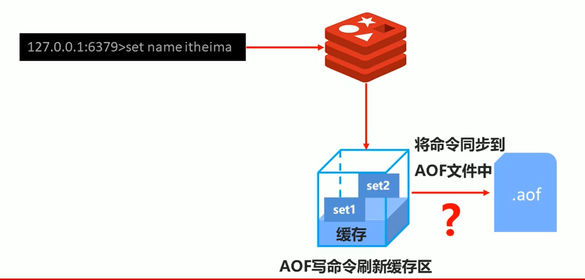

AOF提供了三种策略（appendfsync），来决定何时将缓存区中的指令同步到AOF文件中：

- always：每次写入操作均同步到AOF文件中，**数据零误差**，性能较低
- everysec：每秒将缓冲区中的指令同步到AOF文件中，数据**准确度较高**，性能较高，但是在系统突然宕机时会丢失1秒内的数据（默认配置）
- no：由系统控制何时将AOF写命令刷新缓存区中的命令同步到AOF文件中，整体过程不可控

可以在配置文件中进行配置：

- **appendonly**：配置redis是否开启AOF，可取值为yes|no

- **appendfsync**：配置AOF的同步策略，可取值为always|everysec|no
- appendfilename：AOF持久化文件名，默认为appendonly.aof，建议修改位appendonly-端口号.aof

#### AOF重写

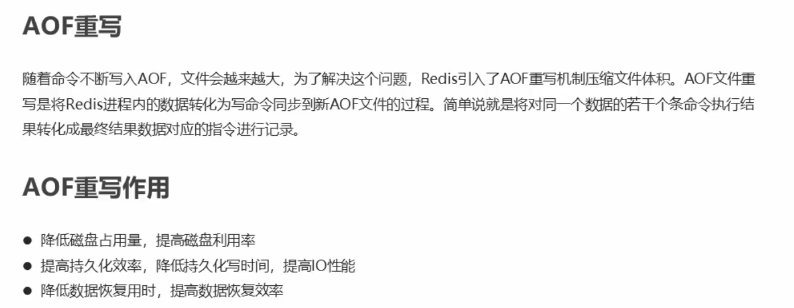

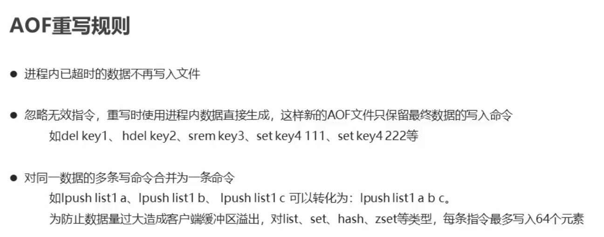

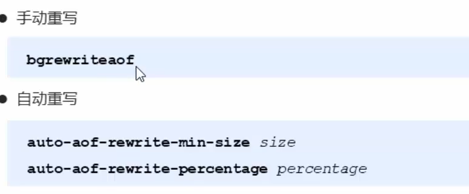

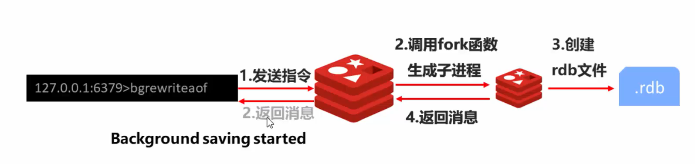

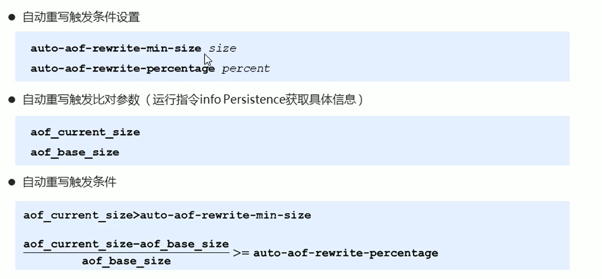

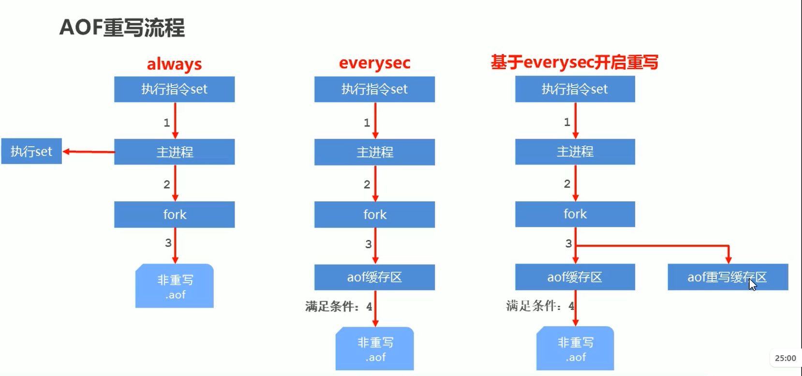

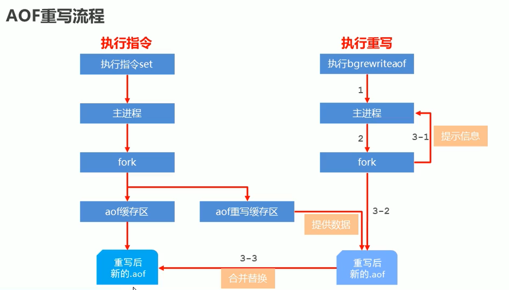

RDB  VS  AOF

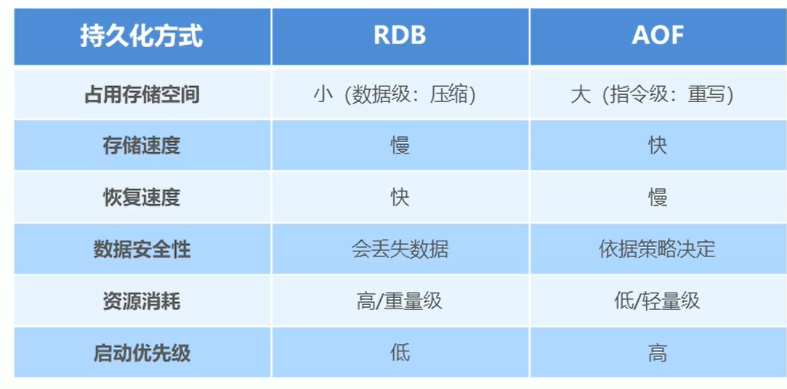

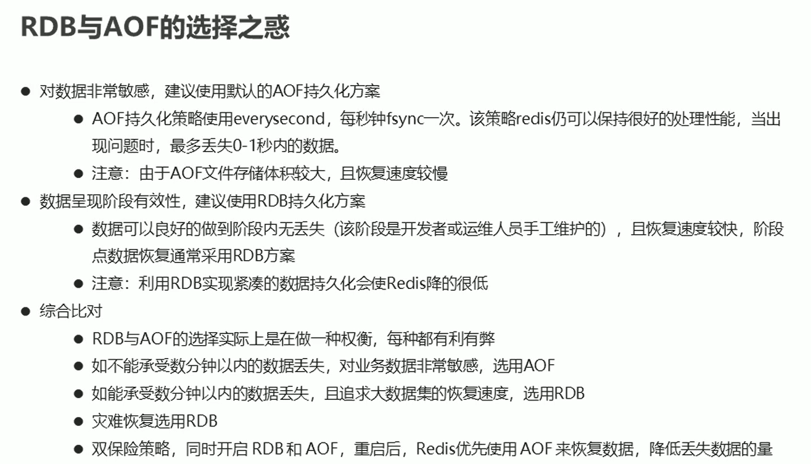

持久化应用场景

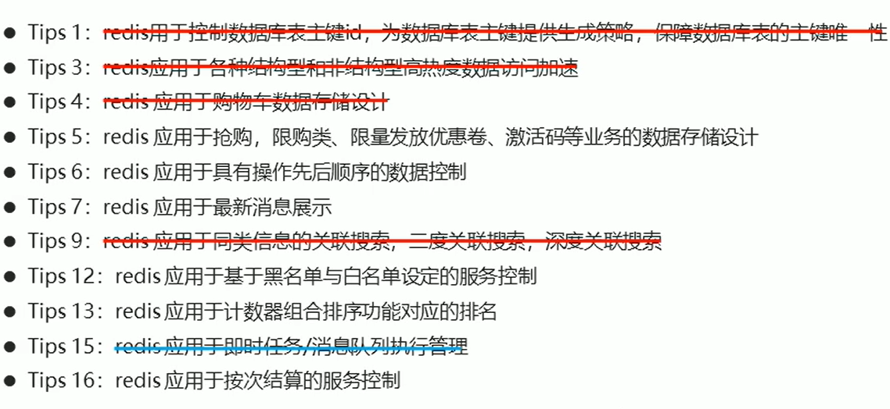

## 3. 主从复制

### 1）简介

Redis三条主线：

- 高性能
- **高可靠**：损失数据尽量少（持久化+主从复制）+服务时间长（主从复制）
- 高可扩展

单机Redis的风险与问题：

- 机器故障：如硬盘故障、系统崩溃，会导致数据丢失可能对业务造成灾难性打击
- 容量瓶颈：内存不足

为了避免单点Redis服务器故障，准备多台服务器，互相连通，将数据复制多个副本保存在不同的服务器上，连接在一起，并保证数据是同步的，来实现Redis的高可用，同时实现数据的冗余备份。


提供数据方：master

- 主服务器主节点主库著客户端

接收数据放：slave

从服务器，从节点、从库、从客户端

需要解决的问题：数据同步

核心工作：master的数据复制到slave


主从复制：将master中的数据即时、有效的复制到slave中。

- 一对多
- master：执行写数据

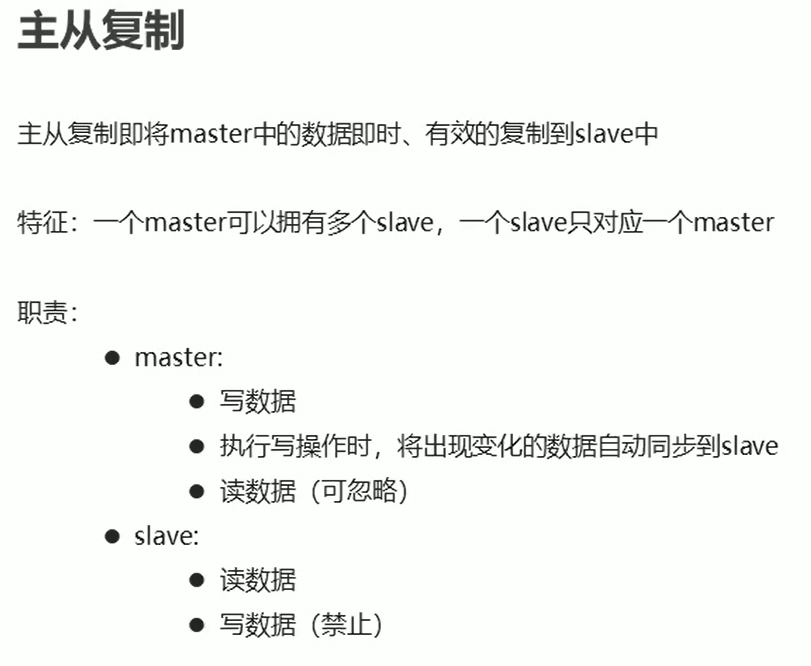


高可用集群

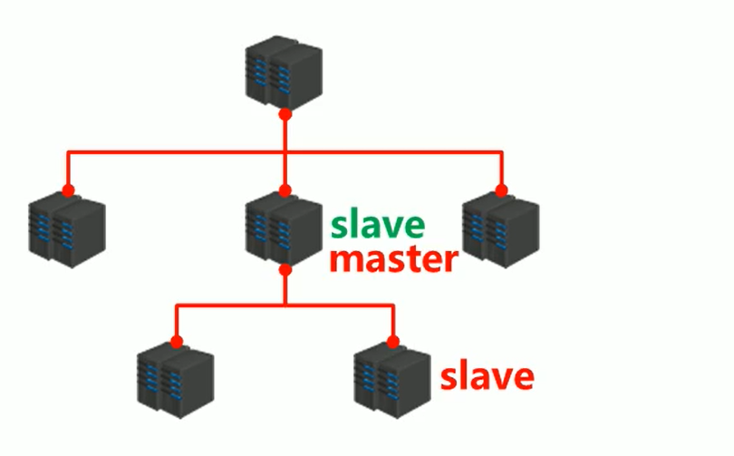

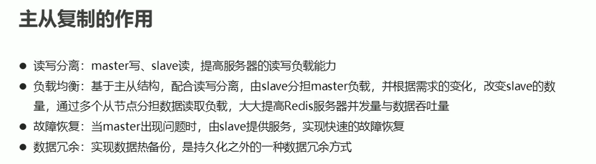


### 2）工作流程

总述：

因为master可以连接多个slave，所以是由slave主动连接master


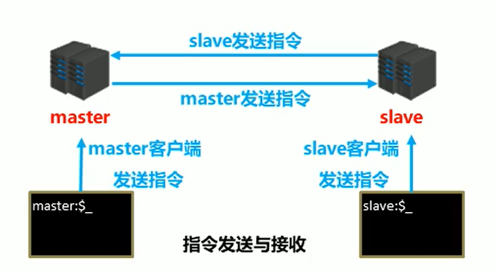

阶段一：建立连接


一般Redis是内部服务器，不对外提供服务，所以都是内网访问，可以不做验证


连接方式

- 方式一：从客户端发起指令

```
slaveof ip port
```

- 方式二：从客户端启动时进行配置

```
redis-server 配置文件 --slaveof ip port
```

- 方式三：在配置文件中进行配置

```
slaveof ip地址 端口号 
```

断开连接

- 从客户端发起指令

```
slaveof no one
```


授权访问

阶段二：数据同步阶段

> 由从客户端服务器发起

全量复制（发指令时全部数据）+增量复制（部分复制，全量复制时主服务器修改数据的指令）

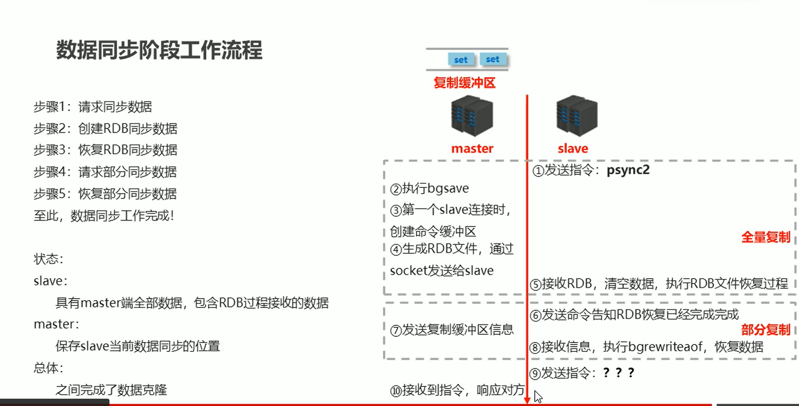


数据同步阶段master说明

1. 如果master数据量巨大，数据同步阶段应避开流量高峰期，避免造成master阻塞，影响业务正常执行

2. 修改复制缓冲区大小

3. 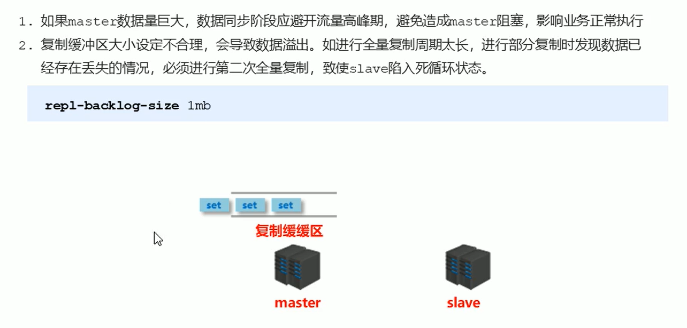

   

数据同步阶段slave说明


阶段三：命令传播阶段


服务器运行ID（runid）


复制缓冲区

将传播的命令记录下来，存储在复制缓冲区


内部工作原理

- 偏移量（master和slave都要记）
- 字节值

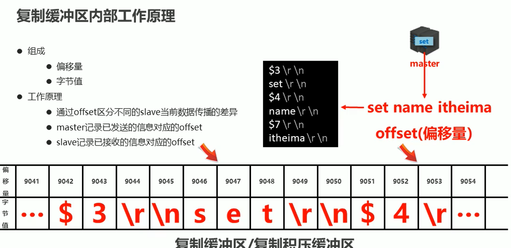

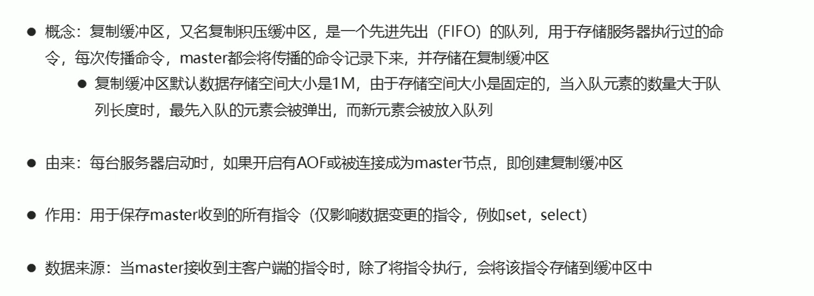

偏移量

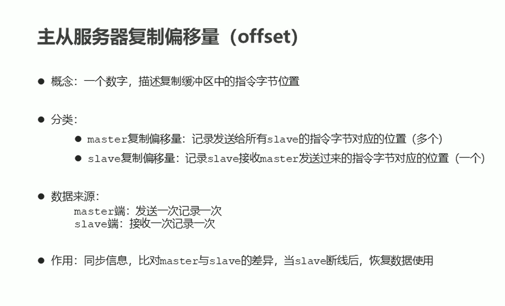

数据同步+命令传播阶段工作流程

全量复制可能多次执行


心跳机制


### 3）常见问题


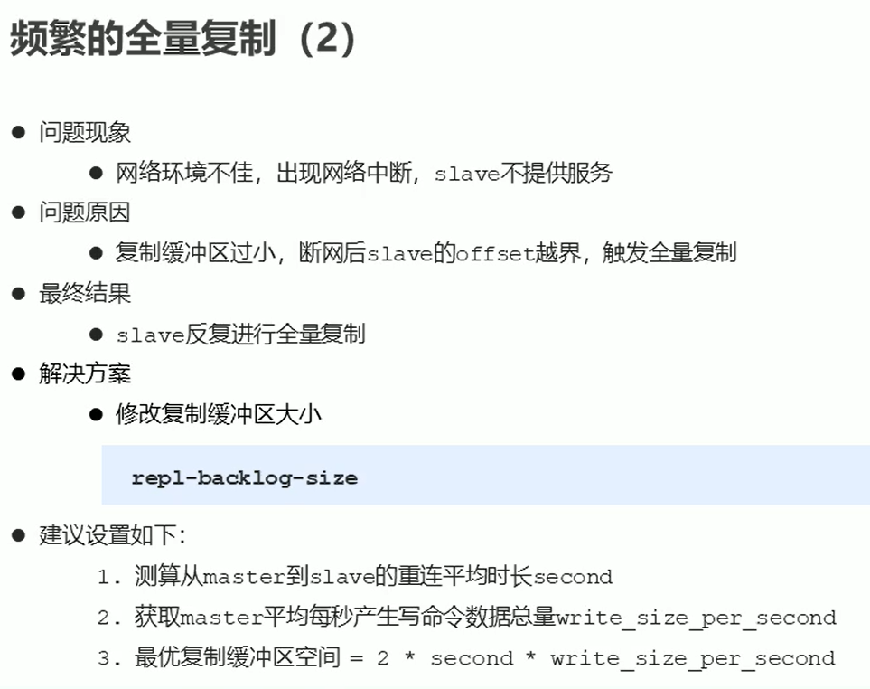

频繁的网络中断


数据不一致

