## 1. Linux安装Redis

### 1）安装

1.  下载安装包

```shell
wget http://download.redis.io/releases/redis-4.0.0.tar.gz
```

2. 解压

```
tar -xvf redis-4.0.0.tar.gz
```

3. 进入目录查看文件夹中包含哪些文件
   - Makefile为安装的设定，默认安装到src目录

```shell
cd redis-4.0.0
ll
```

1. 安装redis（先编译再安装），在redis目录下输入如下指令：

```shell
make install
```

5. 进入src目录查看安装的文件
6. 输入redis-server即可启动

### 2）启动多台redis

#### ① 指定端口号启动

启动redis服务时，可以指定端口

```shell
redis-server --port 指定的端口号
```

使用客户端连接时，需要跟上启动的redis服务端口号

```
redis-cli -p 指定的端口号
```

#### ② 配置文件方式启动

默认安装redis目录中存在配置文件redis-conf，可以使用如下指令创建新的配置文件：

- 过滤注释信息及空白信息
- 将其输出到redis-6379.conf中

```shell
cat redis.conf | grep -v "#" | grep -v "^$" > redis-6379.conf
```

其中，主要的配置信息如下：

- port 6379：redis服务的启动宽口
- daemonize yes：是否设置为守护进程（守护进程会在后台运行）
- logfile "6379.log"：输出日志文件名
- dir /root/redis-4.0.0/logfiles：日志的输出目录

根据配置文件方式启动：

```shell
redis-server 配置文件名
```

查看启动的redis进程

```shell
ps -ef | grep redis-
```

结束该进程

```shell
kill -s 0 进程号
```

建议：创建一个conf文件夹，将所有的配置文件都放到该文件夹中。


# 11. 持久化

持久化是指使用**永久性存储介质**保存数据，特定时间将保存的数据进行恢复的工作机制。持久化可以防止数据意外丢失，确保数据安全，是保证Redis**高可靠性**的一项技术。

持久化最重要的是未来特定时间可以**恢复数据**，要实现这一点，共有如下两个思路：

1. **保存数据快照**：将当前数据状态全部保存下来，存储数据结果
   - 存储格式简单
   - 关注点在数据
2. **保存数据的操作过程**，日志形式，存储操作过程存储格式复杂，关注点在数据的操作过程


## 11.1 RDB

RDB是按照第一种思路的持久化方式，即保存用户的数据快照。这里保存需要注意两点：

- 何时保存？
- 由谁去保存？

**何时保存**：RDB提供了**手动保存（指令）**和**配置自动保存**两种方式来决定合适进行RDB持久化。

**由谁去保存**：RDB提供了**save**、**bgsave**两个指令，这两个指令都可以完成RDB持久化，但是**save指令是由Redis线程完成的RDB持久化**，由于Redis是线程，所以这一过程**会阻塞其他所有指令**。而**bgsave是会fork一个子进程，由子进程完成RDB持久化**。bgsave只会在Redis线程**fork子进程时阻塞其他处理请求**。

### 1）阻塞保存 - save指令

当执行**save**指令时，redis会执行一次保存操作，生成一个**dump.rdb**文件，保存当前数据的快照信息。

save指令相关配置：在启动redis-server的配置文件中进行配置

- **dbfilename**：设置本地数据库文件名，默认为dump.rdp（通常设置为**dump-端口号.rdb**）
- **dir**：设置存储rdb文件的路径（通常将目录名称设置为data）
- **rdbcompression**：设置存储至本地数据库时是否压缩数据，默认为yes，采用LZF压缩（设置为no可以节省CPU运行时间，但是会使存储的文件变大）
- **rbdchecksum**：设置是否进行RDB文件格式校验，该校验过程在写文件和读文件过程均进行，默认为开启状态（设置为no，可以解决读写过程约10%时间消耗，但存在数据损坏风险）

**当启动redis时**，会**根据配置文件**自动将rdb中的快照恢复到数据库中

- 如果未指定配置文件启动，则数据库为空
- 只会恢复之前保存到rbd中的数据

#### save指令工作原理

由于redis服务是单线程，多个客户端的指令汇集到redis服务器时，会按顺序串行执行的。如果save指令执行时间过长，就会阻塞其他客户端的其他指令，直到当前RDB过程完成为止。所以，**线上环境不建议使用save指令。**

### 2）非阻塞保存 - bgsave

save指令会造成redis服务器阻塞，而采用**bgsave**指令，会手动**启动后台**保存操作，但**不是立即执行**。

不同于save指令，redis在收到bgsave指令时，不会将其放到自己的执行队列中，而是**会调用fork函数生成子进程**，由子进程创建rdb文件，完成RDB操作，可以在日志文件中查看具体过程。

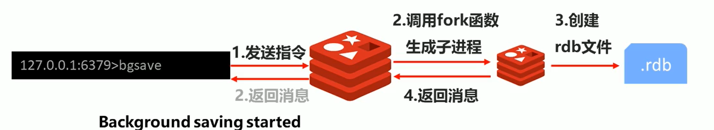

注意：bgsave指令是针对save阻塞文件做的优化，**Redis内部所有涉及RDB操作都采用bgsave的方式**。

除了save指令的几个配置外，bgsave指令还有如下配置：

- **stop-writes-on-bgsave-error**：后台存储过程中如果出现错误现象，是否停止保存操作（默认为开启）

### 3）自动执行

可以在conf中配置save执行的条件，当满足条件时，redis会自动**执行bgsave指令**。

```
save second changes
```

- 满足**限定时间范围**内**key的变化数量**达到指定数量即进行持久化
- 参数
  - second：监控时间范围
  - changes：监控变化的key的数量
  - second与change设置通常具有互补对应关系

RDB相关的配置如下：

```
# Redis服务器整体配置
prot
daemonize yes|no
logfile ""

# RDB相关配置
dbfilename 
dir
rdbcompression yes|no
rdbchecksum yes|no
stop-writes-on-bgsave-error yes|no
save second changes
```

### 4）save和bgsave对比

| 方式           | save | bgsave |
| -------------- | ---- | ------ |
| 读写           | 同步 | 异步   |
| 阻塞客户端指令 | 是   | 否     |
| 额外内存消耗   | 否   | 是     |
| 启动新进程     | 否   | 是     |

### 5）RDB优缺点

**优点**：

- RDB是一个紧凑压缩的**二进制文件**，存储效率高
- 内部存储的是某个时间点的数据快照，非常**适合用于数据备份**，**全量复制**等场景
- RDB**恢复数据的速度要比AOF快很多**
- 应用：**服务器中每 x 小时执行bgsave备份，并将RDB文件拷贝到远程机器中，用于灾难恢复**

**缺点**：

- **无法做到实时持久化**，具有较大可能会丢失数据
- bgsave指令每次执行都要执行**fork创建子进程，会降低性能**
- Redis众多版本中**RDB文件格式不统一**，各版本服务之间可能出现数据不兼容
- 因为每次读写都是全部数据，**当数据量大时，效率低下**

## 11.2 AOF

RDB存储的弊端：

- **无法做到实时持久化**，具有较大可能会丢失数据

- 因为每次读写都是全部数据，当**数据量大时，效率低下**

解决思路：

- 不写全数据，仅记录部分数据
- 改记录数据为记录操作过程
- 对所有操作均进行记录，避免数据丢失风险

**AOF（append only file）持久化**：以**独立日志**的方式**记录每次写命令（会改变数据库数据的命令）**，重启时再重写执行AOF文件中命令达到恢复数据的目的。与RDB相比，AOF是改记录数据为记录数据产生的过程。

- AOF主要解决了数据持久化的实时性，目前已经是**Redis持久化的主流选择。**
- aof中存储的是Redis自己定义的RESP协议格式的字符串（存在大量重复命令）

### 1）AOF写数据过程

AOF执行写命令时，当redis服务器收到写命令时，执行完写命令后会将写命令放入**AOF写命令刷新缓存区中**，之后根据写入策略**由fork的子进程**调用**fsync()**（会立即将缓冲区中的数据写回到磁盘）函数**将缓存区中的命令同步到AOF文件**中。

- **子进程带有主进程的数据副本**，使用子进程而不是线程，可以避免在锁的情况下，**保证数据的安全性**


为了解决RDB持久化的非实时性的问题，**AOF提供了三种策略（appendfsync）**，来决定何时将缓存区中的指令同步到AOF文件中：

- **always**：每次写入操作均同步到AOF文件中，**数据零误差**，性能较低
- **everysec**：每秒将缓冲区中的指令同步到AOF文件中，数据**准确度较高**，性能较高，但是在系统突然宕机时会丢失1秒内的数据（默认配置）
- **no**：由系统控制何时将AOF写命令刷新缓存区中的命令同步到AOF文件中，整体过程不可控

可以在配置文件中进行配置：

- **appendonly**：配置redis是否开启AOF，可取值为yes|no

- **appendfsync**：配置AOF的同步策略，可取值为always|everysec|no
- **appendfilename**：AOF持久化文件名，默认为appendonly.aof（建议修改位**appendonly-端口号.aof**）

### 2）AOF重写

当Redis执行写命令（会影响Redis数据的指令）越来越多，aof文件会越来越大（因为每一条写指令都会记录到aof文件中）。但其实，其中**很多条命令对于Redis数据库最终状态都是无效的**。同一个数据的若干条命令，我们只需要记录对其最终结果数据对应的指令（**最终数据的写入指令**）进行记录即可。这个**整理aof文件中指令**，压缩文件体积的机制，就是**AOF重写机制**。


AOF重写的作用有如下几点：

- 降低磁盘占用量，**提高磁盘利用率**
- 提高持久化效率，**降低持久化时间**，提高IO性能
- **降低数据恢复用时**，提高数据恢复效率

#### ① AOF重写规则

- 进程内已超时的数据不再写入文件
- 忽略无效指令，重写时使用进程内数据直接生成，这样**新的AOF文件只保留最终数据的写入指令**
- 对同一数据的多条写命令合并成一条命令

#### ② 手动重写

```
bgrewriteaof
```

#### ③ 自动重写

Redis提供了两种自动重写的机制：

- 将**aof文件的大小**作为是否需要重写的触发条件
- 将**aof文件大小的增长百分比**作为是否需要重写的触发条件

```
auto-aof-rewrite-min-size	size
auto-aof-rewrite-percentage	percentage
```

Redis中维护了两个参数（可以通过**info Persistence**指令来获取）

- aof_current_size：aof文件当前的大小
- aof_base_size：aof文件起始大小

Redis可以通过这两个参数来判断是否触发自动重写的条件：

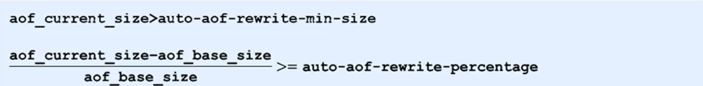


#### ④ AOF重写流程

##### I. AOF重写缓存区

子进程在进行**AOF重写期间**，服务器进程还要继续处理命令请求，而**新的命令可能对现有的数据进行修改**，这会让当前数据库的数据和重写后的AOF文件中的数据不一致。

为了解决这种数据不一致的问题，Redis增加了一个**AOF重写缓存**，这个**缓存在fork出子进程之后开始启用**，Redis服务器主进程在执行完写命令之后，会同时将这个写命令追加到AOF缓冲区和AOF重写缓冲区
即子进程在执行AOF重写时，主进程需要执行以下三个工作：

- 执行client发来的命令请求；
- 将写命令追加到现有的AOF文件中；
- **将写命令追加到AOF重写缓存中。**


##### II. 子进程完成重写后

> 主进程（Redis进程）执行信号处理函数会被阻塞
>
> 1. 子进程`发送信号`给Redis进程
> 2. Redis进程调用信号处理函数（**Redis进程被阻塞**）
>    - 将重写缓存中的内容写入到新的AOF文件
>    - 新AOF文件替换旧AOF文件

当子进程完成对AOF文件重写之后，它会向父进程发送一个完成信号，**父进程接到该完成信号之后，会调用一个信号处理函数**，该函数完成以下工作：

- **将AOF重写缓存中的内容全部写入到新的AOF文件中**；这个时候新的AOF文件所保存的数据库状态和服务器当前的数据库状态一致；
- 对新的AOF文件进行改名，原子的覆盖原有的AOF文件；**完成新旧两个AOF文件的替换**。

只有最后的“主进程写入命令到AOF缓存”和“对新的AOF文件进行改名，覆盖原有的AOF文件。”这两个步骤（信号处理函数执行期间）会造成主进程阻塞，在其他时候，AOF后台重写都不会对主进程造成阻塞，这将AOF重写对性能造成的影响降到最低。


## 11.3 RDB  VS  AOF


配置文件相关配置：

```
# 基本配置
port
# RDB、AOF、log文件输出目录
dir 
logfile ""

# RDB持久化相关
dbfilename
rdbcompression yes|no
rdbchecksum yes|no
save second changes

# AOF相关
appendfilename 
appendonly yes|no
appendfsync always|everysec|no

# AOF重写
auto-aof-rewrite-min-size	size
auto-aof-rewrite-percentage percentage
```


持久化应用场景


# 12. 主从复制

## 12.1 简介

Redis三条主线：

- 高性能
- **高可靠**：损失数据尽量少（持久化+主从复制）+服务时间长（主从复制）
- 高可扩展

单机Redis的风险与问题：

- **机器故障**：如硬盘故障、系统崩溃，会导致数据丢失可能对业务造成灾难性打击

为了避免单点Redis服务器故障，准备多台服务器，互相连通，将数据复制多个副本保存在不同的服务器上，连接在一起，并保证数据是同步的，来实现Redis的高可用，同时实现**数据的冗余备份**。

我们将数据提供方称为**master**（主服务器/主节点/主库/主客户端），将接收数据方称为**slave**（从服务器\从节点\从库\从客户端）。主从复制需要解决的核心问题是**数据同步**，核心工作是如何**将master中的数据即时、有效地复制到slave中**。

主从复制具有一对多的特征，即一个master可以拥有多个slave，一个slave只对应一个master。

**master主要执行写数据命令**，同时会将出现变化的数据自动同步到slave中；**slave只提供读数据的服务**。（**读写分离**）

主从复制有如下好处：

- 读写分离
- 负载均衡
- 故障恢复
- 数据冗余
- 高可用基石

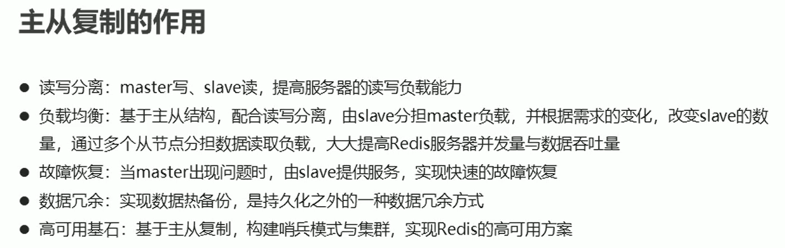

## 12.2 工作流程

总述：

因为master可以连接多个slave，所以是由slave主动连接master


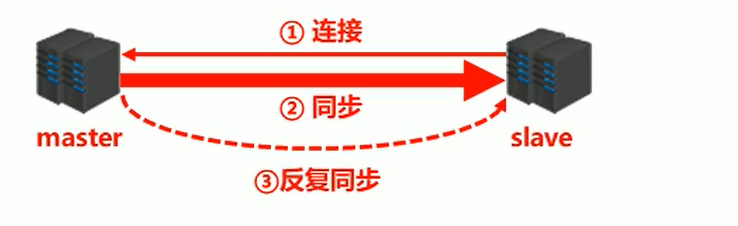


### 1）阶段一：建立连接


一般Redis是内部服务器，不对外提供服务，所以都是内网访问，可以不做验证


连接方式

- 方式一：从客户端发起指令

```
slaveof ip port
```

- 方式二：从客户端启动时进行配置

```
redis-server 配置文件 --slaveof ip port
```

- 方式三：在配置文件中进行配置

```
slaveof ip地址 端口号 
```

断开连接

- 从客户端发起指令

```
slaveof no one
```


授权访问

### 2）阶段二：数据同步阶段

> 由从客户端服务器发起

全量复制（发指令时全部数据）+增量复制（部分复制，全量复制时主服务器修改数据的指令）


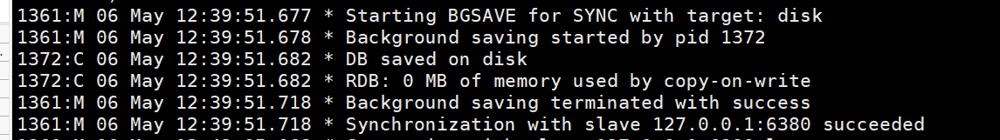

数据同步阶段master说明

1. 如果master数据量巨大，数据同步阶段应避开流量高峰期，避免造成master阻塞，影响业务正常执行

2. 修改复制缓冲区大小

3. 

   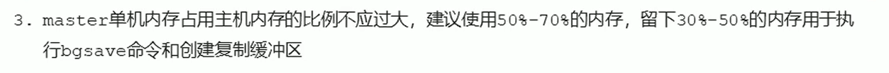

数据同步阶段slave说明


### 3）阶段三：命令传播阶段


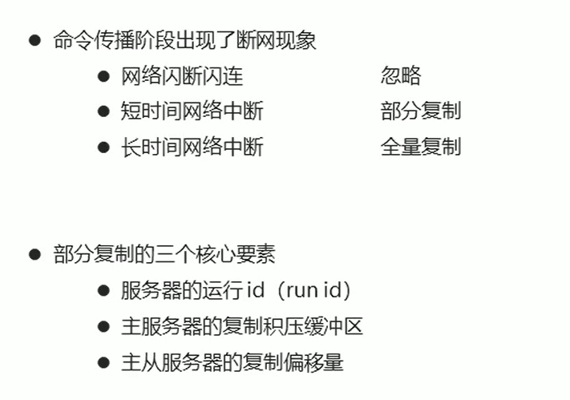

服务器运行ID（runid）


复制缓冲区

将传播的命令记录下来，存储在复制缓冲区

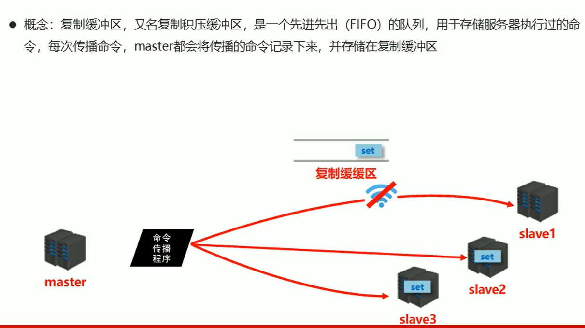

内部工作原理

- 偏移量（master和slave都要记）
- 字节值


偏移量


数据同步+命令传播阶段工作流程

全量复制可能多次执行

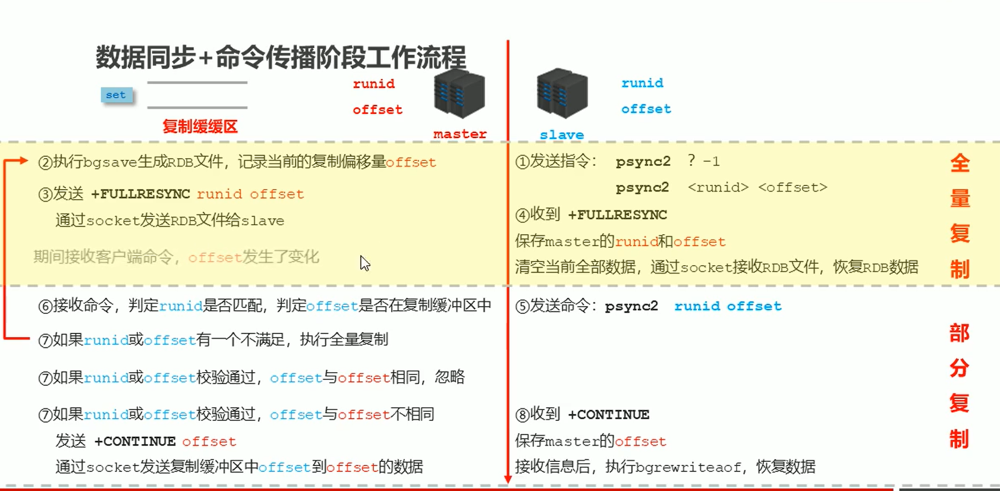

心跳机制


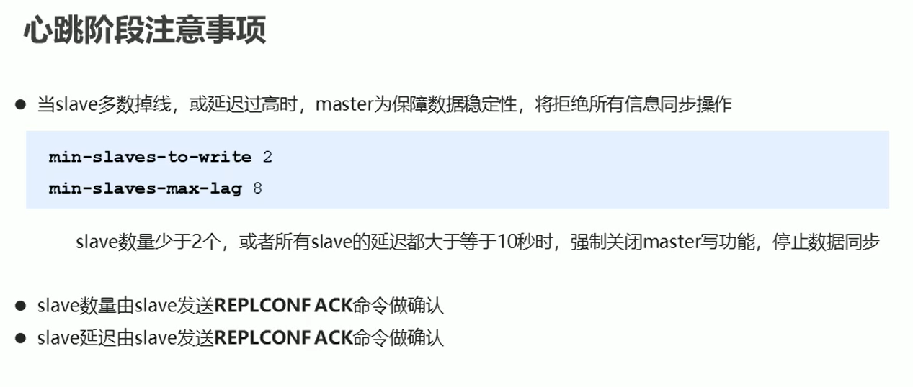

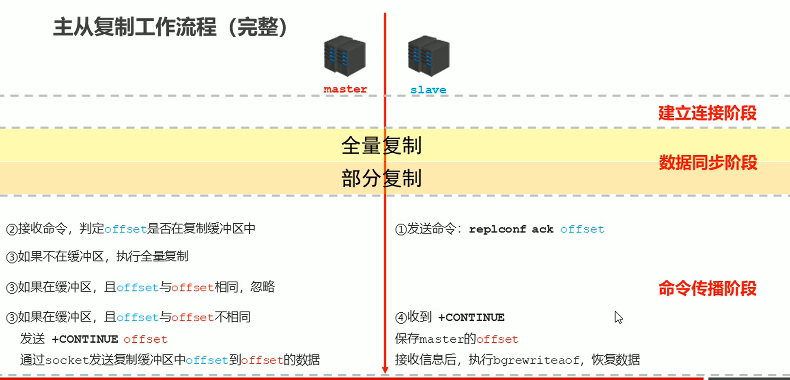

## 12.3 常见问题

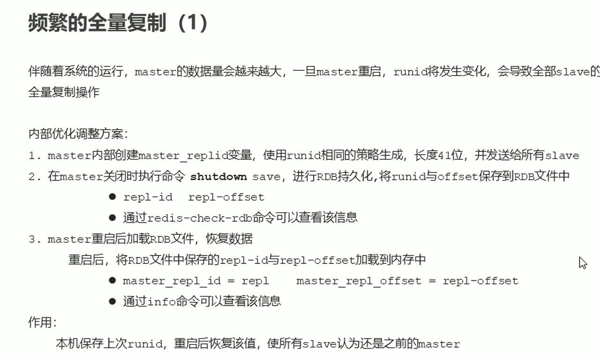


频繁的网络中断

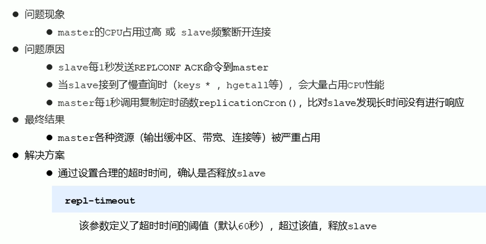


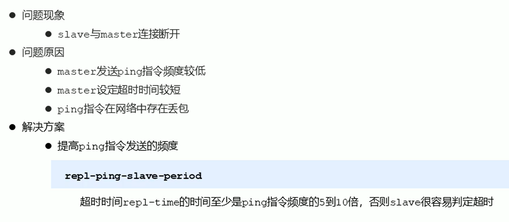

数据不一致

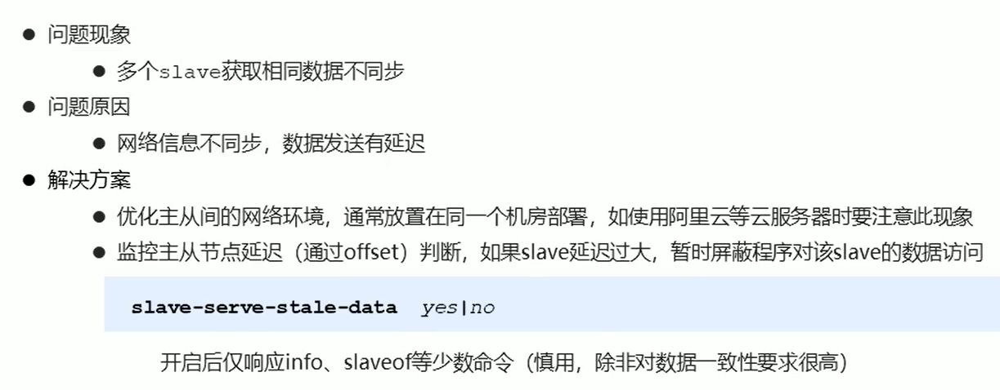

# 13. 哨兵

## 13.1 简介

为了保证Redis的高可靠性，Redis提供了主从复制机制，引入了master、slave两种不同角色的服务器，来实现当主机挂了时，仍能对外正常提供服务。主从复制部分只介绍了master和slave的工作原理，但是没有介绍当master宕机时，如何不间断服务。

当master宕机时，从数据库之间不能进行同步，同时不能对外提供写服务。

首先，我们考虑如果想实现master宕机时，能不间断服务，需要考虑以下问题：

- 主库真的挂了吗？
- 该选择哪个从库作为主库？
- 怎么把新主库的相关信息通知给从库和客户端呢？


Redis提供了哨兵机制用来完成上述任务。

哨兵（sentinel）是一个**分布式系统**，对于用主从结构中的每台服务器进行**监控**，当出现故障时，通过投票机制选择新的master并将所有的slave连接到新的master。

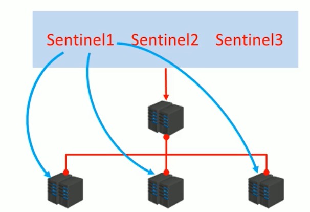

### 哨兵的主要作用有：

- 监控
  - 不断检查master和slave是否正常运行
  - master存货检测、master与slave运行情况检测
- 通知
  - 当被监控的服务器出现问题时，向其他（哨兵间、客户端）发送通知
- 自动故障转移
  - 断开master与slave连接，选取一个slave作为master，将其他slave连接到新的master，并告知客户端新的服务器地址

注意：哨兵也是一台redis服务器，只是不提供数据服务。通常将哨兵数量配置为单数，避免投票出现平票的情况。

## 13.2 启用哨兵模式

### 1）配置哨兵

#### ① 查看默认配置文件

sentinel.conf为哨兵的配置文件，可以通过以下指令查看默认的配置文件

```
cat sentinel.conf | grep -v "#" | grep -v "^$"
```

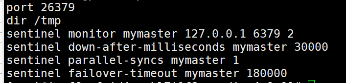

- **port** ：端口号（通常在监控的服务器端口号前加，如监控6379，则哨兵端口号应设置为26739）
- **dir**：日志等输出目录
- **sentinel monitor** mymaster 127.0.0.1 6379 2
  - 设置监控的master的ip地址以及端口号
  - mymaster：自定义master的别称
  - 2：判定master宕机的哨兵的数量达到2时，认定master宕机
- **sentinel down-after-milliseconds** mymaster 30000
  - 连接多长时间没响应，认定该master宕机（毫秒为单位）
- **sentinel parallel-syncs** mymaster 1
  - 宕机之后开始几个数据同步
- **sentinel failover-timeout** mymaster 180000
  - 同步超时设定

#### ② 准备哨兵及主从服务器配置文件

##### I. 准备哨兵配置文件

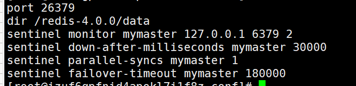

```
cat sentinel.conf | grep -v "#" | grep -v "^$" > conf/sentinel-26379.conf
sed 's/26379/26380/g' sentinel-26379.conf > sentinel-26380.conf 
sed 's/26379/26381/g' sentinel-26379.conf > sentinel-26381.conf 
```

##### II. master、slave配置文件

###### master

- 配置rdb
- 配置aof


###### slave

- 配置slaveof 主机ip 主机端口号

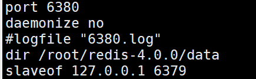

#### ③ 删除其他无关文件

```
rm -rf 
```

#### ④ 启动

启动顺序依次为：

- 主机-->从机-->哨兵

**启动哨兵**

```
redis-sentinel sentinel-26379.conf 
```

#### ⑤ 开启客户端

连接都使用

```
redis-cli -p 端口号
```

#### ⑥ 查看哨兵信息

哨兵客户端执行`info`


此时查看该哨兵对应的配置文件，会发现其发生了变化

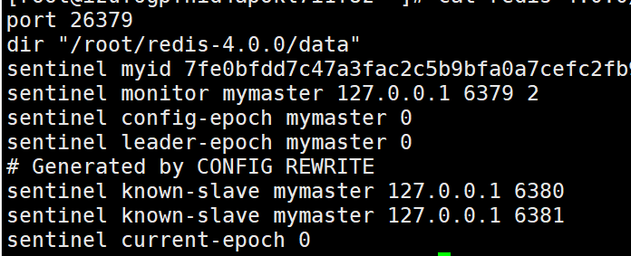

终止master服务器时，哨兵服务器会执行以下流程

- odown：将服务器标记为odown
- vote：从slave中选出一个master
- switch：切换master
- slave：将slave连接到新的master

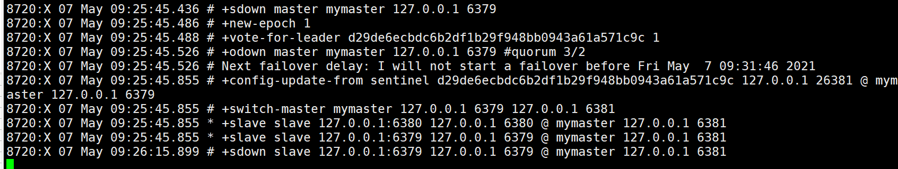

### 主从切换

- 监控
- 通知
- 故障转移


#### 阶段一：监控

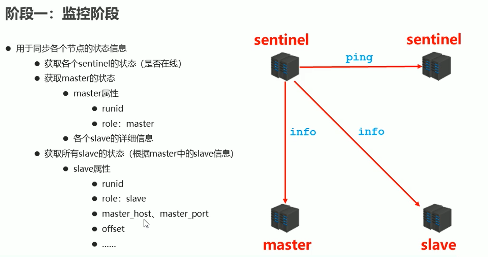

1. sentinel 获取master信息
2. 建立了一个cmd连接（专门用于发命令）
   - sentine
   - master存储了sentinel信息
3. 获取slave信息
4. 第二个sentinel获取master信息
   - 获取到其他sentinel信息
5. sentinel之间public subscribe通道

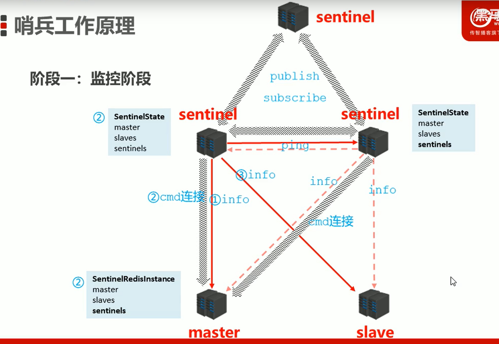

#### 阶段二：通知阶段

由一个sentinel去向master和slave询问，通知其他sentinel


#### 阶段三：故障转移阶段

sentinel发现master断掉（主观下线/S_DOWN），则在内网中传播这一消息，其他sentinel去检查master是否真正断掉（客观下线/O_DOWN）

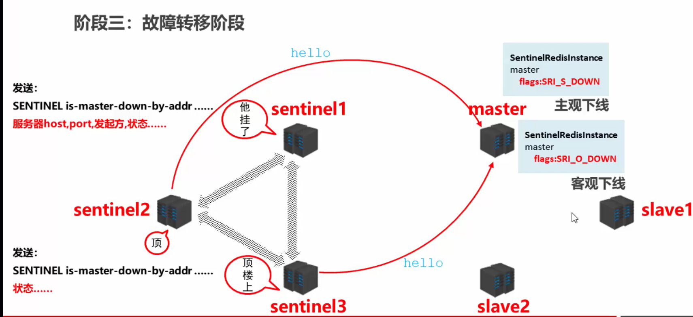

当标记到客观下线，则开始

- 选出领头的sentinel


- 从slave中选择一个当作master
  - 先排除掉不在线的、响应慢的、与原来master断开时间久的
  - 优先原则
    - 优先级
    - offset（）
    - runid（优先小的）


## 13.3 总结

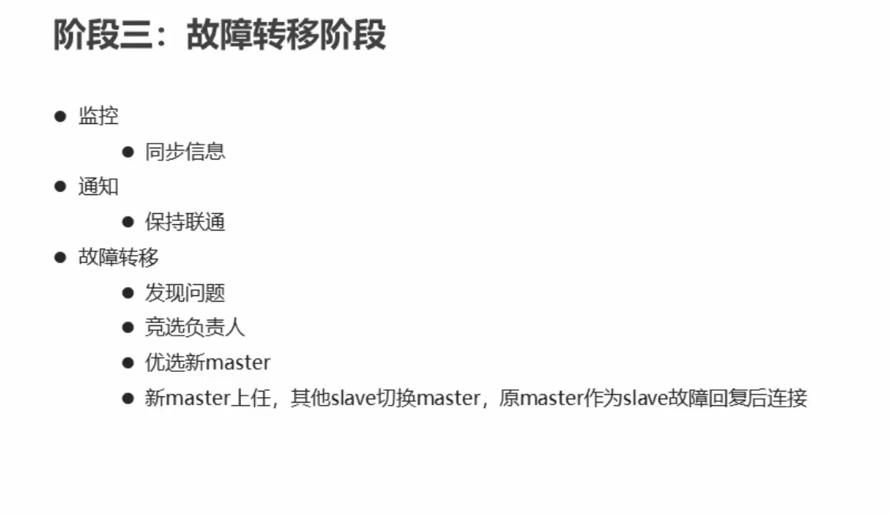