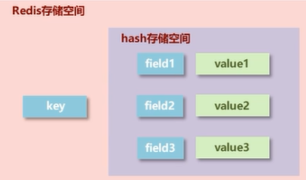
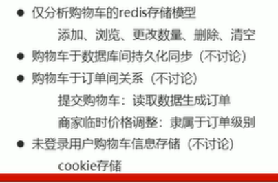

### hash类型
- 对一系列要存储的数据进行编组，方便管理，
- 一个存储空间保存多个键值对数据
- hash类型：底层使用哈希表结构实现数据存储


hash存储结构优化：
- field数量较少，存储结构优化为类数组结构
- field数量较多，存储结构使用HashMap结构

添加/修改数据
```
hset key field value

hmset key field1 value1 field2 value2  ...          //添加/修改多个数据
```
获取数据
```
hget key field  
hmget key field1 field2 ...         //获取多个数据

hgetall key     //获取所有field数据
```
删除数据
```
del key     //直接删除hash存储空间
hdel key field1 [field]
```
获取哈希表中字段的数量
```
hlen key
```
获取哈希表中是否存在指定的字段
```
hexists key field
```

hash类型数据的扩展操作
获取自己所有的键和所有的值
```
hkeys key           //获取key中所有的field

hvals key           //获取key中所有field的值（可能重复）
```
设置指定字段的数值数据增加指定范围的值
```
hincrby key field increment

hincrbyfloat key field increment
```

#### hash类型数据操作的注意事项
- hash类型下的value只能存储字符串，不允许存储其他数据类型，不存在嵌套，如果数据未获取到，返回(nil)
- 每个hash可以存储2^32-1个键值对
- hash类型可以灵活添加删除对象属性，但不可滥用，不可将hash作为对象列表使用
- hgetall可以获取全部属性，如果内部field过多，遍历整体数据效率就很低，有可能成为数据访问的瓶颈


#### hash类型应用场景
业务场景

电商网站购物车设计与实现


业务分析：


解决方案：


存在问题：


信息冗余：


```
hsetnx key field value          //如果key的field中有值，则将不添加，如果key对应的field没有值，则value赋给field；如果没有key，则创建key，再调用hsetnx key field value
```