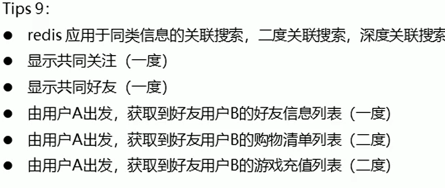
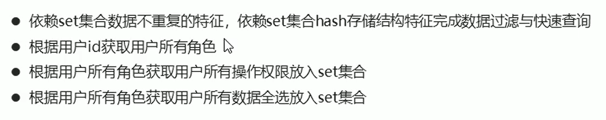
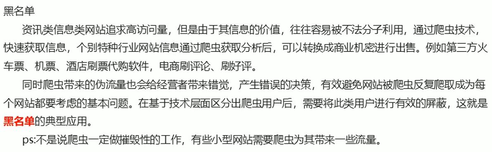
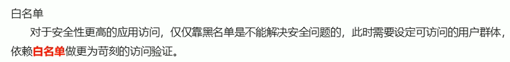

### Set类型

- 存储大量的数据，**查询方面**提供更高的效率
- 需要的存储结构：能够保存大量数据，高效的内部存储机制，**便于查询**
- 与hash存储结构完全相同，仅存储键，不存储值，并且键值是不允许重复的


### Set类型数据的基本操作

- 添加数据

  ```
  sadd key value
  ```

- 获取全部数据

  ```
  smembers key
  ```

- 删除数据

  ```
  srem key value
  ```

- 获取set集合数据总量

  ```
  scard key
  ```

- 判断集合中是否包含指定数据

  ```
  sismember key value
  ```

### set类型数据的扩展操作

#### 业务场景-热点推荐

初次今日头条时，会设置3项爱好的内容，但是后期为了增加用户的活跃度、兴趣点，必须让用户对其他信息类别逐渐产生兴趣，增加客户留存度，如何实现？

解决方案

- 系统将各类最新的热点信息条目组织成集合
- 随机挑选其中部分信息
- 配合用户关注信息分类中的热点信息组成展示的全信息集合


- 随机获取集合中指定数量的数据（不影响原set集合），不加count时，默认随机返回一个数据

  ```
  srandmember key [count]
  ```

  

- 随机获取集合中的某个数据，并将该数据移除集合

  ```
  spop key
  ```

redis应用于随机推荐类信息检索，例如热点歌单推荐，热点新闻推荐，热卖旅游线路，应用APP推荐，大V推荐等


#### 业务场景-共同好友

共同好友、几个朋友关注了该公众号之类的

解决方案：

- 求两个集合的交、并、差集

```
sinter key1 [key2]
sunion	key1 [key2]
sdiff key1	[key2]
```


- 求两个集合的交、并、差集并存储到指定集合中

```
sinterstore destination key1 [key2]
sunionstore destination key1 [key2]
sdiffstore destination key1 [key2]
```


- 将指定数据从原始集合中移动到目标集合中

```
smove source destination member
```



业务场景-权限校验



## 业务场景

统计网站的PV（访问量）、UV（独立访客）、IP

PV：网站被访问次数，可通过刷新页面提高访问量

UV：网站被不同用户访问的次数，可以通过cookie统计访问量

IP：网站被不同IP地址访问次数，可通过IP统计访问量

解决方案

使用set集合的数据驱虫特征，记录各种访问数据

建立string类型数据，利用incr统计

建立set模型，记录cookie

建立set模型，记录ip


redis应用于同类型数据的快速去重

## 业务场景





解决方案


redis应用于黑白名单，对用户进行访问控制