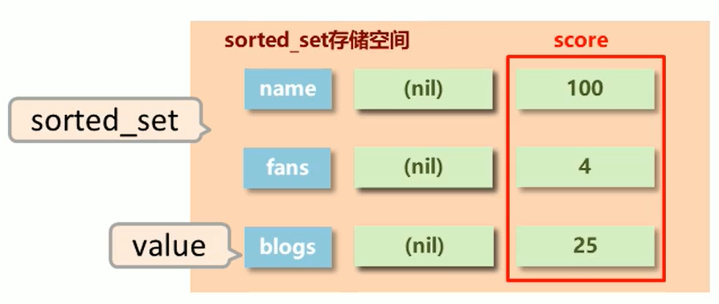
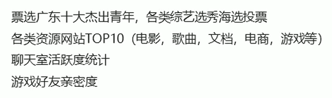
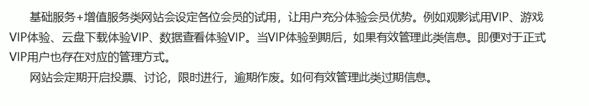

# 6. sorted_set

## 6.1 存储结构

### 1）底层结构

新的存储需求：数据排序有利于数据的展示，需要一种可以**根据自身特征进行排序**的方式

需要的存储结构：新的存储模型，可以保存可排序的数据

sorted_set类型：在set的存储结构基础上**添加可排序字段score**



### 2）注意事项

- score保存的数据存储空间是64位，如果是整数范围，范围是
- score保存的数据也可以是一个双精度的double值，**基于双精度浮点数的特征，可能会丢失精度**，使用时要慎重
- score_set底层存储还是基于set结构，因此**数据不能重复**，score值被反复覆盖，保留最后一次修改的结果

## 6.2 相关操作

### 1）基本操作-增删查

- 添加数据

  ```
  zadd key score member [score member ...]
  ```

- 获取全部数据，默认按照从小到大的顺序排列

  ```
  zrange key start stop [withscores]
  zrevrange key start stop [withscores]
  ```

- 删除数据

  ```
  zrem key member [member ...]
  ```

- 按条件获取数据，limit分页查询

  ```
  zrangebyscore key min max [withscores] [limit]
  zrevrangebyscore key min max [withscores] [limit]
  ```

- 条件删除数据

  ```
  zremrangebyrank key start stop
  zremrangebyscore key min max
  ```

- 获取集合数据总量

  ```
  zcard key
  zcount key min max
  ```

- 集合交并操作

  ```
  zinterstore destination numkeys key [key ...]
  zunionstore destination numkeys key [key ...]
  ```

### 2）扩展操作

#### 业务场景-票房排序

> 应用于计数器组合排序功能对应的排名



- **获取数据对应的索引**（排名）（默认越小排名越靠前）

  ```
  zrank key member
  zrevrank key member
  ```

- **score值获取与修改**

  ```
  zscore key member
  zincrby key increment member
  ```

## 6.3 应用场景

### 1）业务场景 - 管理过期信息

> redis应用于定时任务执行顺序管理或任务过期管理。

#### ① 场景描述



#### ② 解决方案

- 使用sorted_set保存各用户的用户id，并将处理时间（要到期的时间）记录为score，利用排序功能区分处理的先后顺序
- 记录下一个要处理的时间，当到期后处理对应任务，移除redis中的记录，并记录下一个要处理的时间
- 新任务加入时，判定并更新下一个要处理的任务

- 获取当前系统时间

  ```
  time
  ```

### 2）业务场景 - 任务/消息权重设定

#### ① 场景描述


#### ② 解决方案

- 单权重的任务，采用score记录权重，优先处理权重值高的任务
- 多权重任务，可以将多权重按照一定规则进行组合，要求组合值长度相同（不足补0），之后采用socre记录组合值，优先处理组合之高的任务

