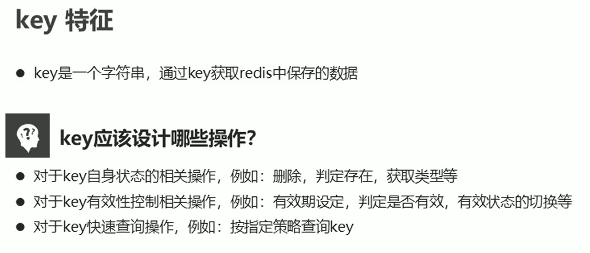
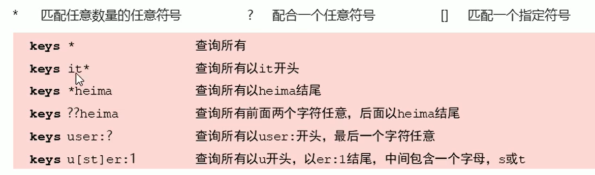

# 8. 常用命令

## 8.1 通用指令

## 8.1 key通用操作



## 8.2 基本操作

- 删除指定key

  ```
  del key
  ```

- 获取key是否存在

  ```
  exists key
  ```

- 获取key的类型

  ```
  type key
  ```

## 8.3 扩展操作

### 1）时效性控制

- key不存在返回值-2
- key永久（未设置有效期），返回-1


### 2）查询模式

- 查询key

```
keys pattern
```

查询规则



*

? 

[]

### 3）其他操作

- 为key改名：rename如果newkey存在，则覆盖；renamex如果newkey存在，则修改失败

  ```
  rename key newkey
  renamex key newkey
  ```

- 对所有key排序

  ```
  sort
  ```

- 其他key通用操作

  ```
  help @generic
  ```

  

## 8.2 数据库通用操作


### db基本操作

- 切换数据库

  ```
  select index
  ```

- 退出

  ```
  quit
  ```

- 测试服务器是否连通

  ```
  ping
  ```

- 显示信息

  ```
  echo 信息
  ```

- 数据移动

  ```
  move key db
  ```

- 数据清除

  ```
  dbsize
  // 清除当前数据库
  flushdb
  // q
  flushall
  ```

  