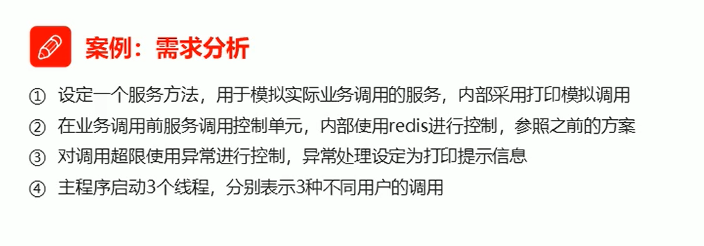

# 9. Jedis

Java程序操作redis的工具

- Jedis

- SpringData Redis

- Lettuce

操作redis步骤

1. 连接redis
   - host
   - port
2. 操作redis
   - 方法名与redis操作方法名相同
   - 取出的数据会转换为对应的Java类型
3. 关闭连接

1. 设定业务方法
2. 设定多线程类，模拟用户调用

3. 设计redis控制方案
4. 启动主程序

## Jedis简易工具类开发

> Jedis连接池获取Redis连接

## 可视化客户端