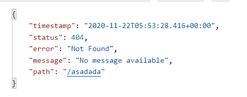

# 1. 基础入门

> 环境要求：
>
> Java 8
>
> Maven 3.3+

## 1.1 Spring与SpringBoot

> https://spring.io/


### 1）Spring

Spring整个生态圈(Spring Boot、Spring Framework、Spring Data、Spring Cloud、Spring Security等)十分庞大，可以完成以下任务：

- 微服务

- 响应式

- 云服务

- web开发

- 无服务开发

- 事件驱动

- 批处理

  ...

### 2）SpringBoot特点

SpringBoot是整合Spring技术栈的一站式框架，是简化Spring技术栈的快速开发脚手架。

Spring Boot的优点：

- 创建独立Spring应用
- 内嵌web服务器
- **自动starter依赖**，简化构建配置
- 自动配置spring以及第三方功能
- 提供生产级别的监控、健康检查、及外部化配置
- 无代码生成、无需编写XML

Spring Boot2的新特性：

- 响应式编程：从数据流构建异步流开始进行响应式开发

- 内部源码设计：基于java 8的一些新特性（如接口默认实现），重新设计源码架构。

SpringBoot缺点：

- 迭代快，需要时刻关注变化
- 封装太深，内部原理复杂，不容易精通

### 3）时代背景

#### 微服务

- 微服务是一种架构风格
- 一个应用拆分为一组小型服务
- 每个服务运行在自己的进程内
- 服务之间使用轻量级HTTP交互
- 服务围绕业务功能拆分
- 可以由全自动部署机制独立部署
- 去中心化，服务自治。服务可以使用不同的语言，不同的存储技术。

#### 分布式

由微服务架构，一个应用自然就变为分布式。

- 远程调用：不同服务之间要远程调用
- 服务发现：在哪台服务器上可以获取更好的服务
- 负载均衡：几个不同服务器的服务都能提供相同的服务，那么需要进行负载均衡
- 服务容错：
- 配置管理：
- 服务监控：各微服务
- 链路追踪
- 日志管理

由SpringBoot+SpringCloud可以解决分布式问题。

#### 云原生

原生应用如何上云：Cloud Native

上云的困难：

- 服务自愈
- 弹性伸缩
- 服务隔离
- 自动化部署
- 灰度发布
- 流量治理

上云的解决方案：

- 初识云原生
- 深入Docker-容器化技术
- 掌握星际级容器编排Kubernetes
- DevOps-实战企业CI/CD，构建企业云平台
- 云上架构与场景方案实战

## 1.2 SpringBoot2快速入门

> 1. 修改maven配置文件，选择1.8编译
> 2. 导入项目依赖
> 3. 需求：浏览器发送/hello请求，响应hello
> 4. 测试：直接运行main方法
> 5. 简化配置：application.properties
> 6. 简化部署

### 1）修改maven配置

spring boot2要求jdk 8，所以需要设置项目使用的jdk版本至少为1.8，编译目标为1.8。有两种修改方式：1）修改maven的配置文件；2）通过idea修改

- 修改maven的配置文件

  ```xml
  <profiles> 
  	<profile>
        <id>jdk-1.8</id>
  
        <activation>
          <activeByDefault>true</activeByDefault>
          <jdk>1.8</jdk>
        </activation>
        <properties>
          <maven.compiler.source>1.8</maven.compiler.source>
          <maven.compiler.target>1.8</maven.compiler.target>
          <maven.compiler.compilerVersion>1.8</maven.compiler.compilerVersion>
        </properties>
       </profile> 
  </profiles>
  ```

  

### 2）添加父工程依赖

需要在pom文件中添加：

- 父工程依赖：spring-boot-starter-parent
- web开发依赖：spring-boot-starter-web

```xml
<!-- 父工程包含了所有其他依赖的包 -->
<parent>
    <groupId>org.springframework.boot</groupId>
    <artifactId>spring-boot-starter-parent</artifactId>
    <version>2.3.4.RELEASE</version>
</parent>
<dependency>
    <groupId>org.springframework.boot</groupId>
    <artifactId>spring-boot-starter-web</artifactId>
</dependency>
```

### 3）简化配置

> https://docs.spring.io/spring-boot/docs/2.3.11.BUILD-SNAPSHOT/reference/html/appendix-application-properties.html#common-application-properties

spring boot中，所有配置均在一个application.properties配置文件中完成配置。在resources目录下创建该文件，进行配置时idea会有代码补全功能。

``` properties
server.port=8888
```

### 4）编写MainApplication

spring boot应用程序需要编写一个主程序类，该类会作为整个spring boot程序的入口。

- 对该类使用@SpringBootApplication进行注解
- main方法中调用SpringApplication的run方法，将本类以及main方法的参数传入即可

```java
/**
 * 主程序类
 * @SpringBootApplication:这是一个SpringBoot的应用
 */
@SpringBootApplication
public class MainApplication {
    public static void main(String[] args) {
        // 返回的是IOC容器
        SpringApplication.run(MainApplication.class, args);
    }
}
```

### 5）编写controller

Spring boot提供了@RestController注解，该注解同时具有@Controller和@ResponseBody两个注解的作用。

```java
//@ResponseBody
//@Controller
@RestController
public class HelloController {
    @RequestMapping("/hello")
    public String handle01() {
        return "Hello, Spring Boot 2!";
    }
}
```

### 5）简化部署

spring boot可以使用插件快捷完成整个项目的导出：

- 导入插件

```xml
<build>
    <plugins>
        <plugin>
            <groupId>org.springframework.boot</groupId>
            <artifactId>spring-boot-maven-plugin</artifactId>
        </plugin>
    </plugins>
</build>
```

- 进行打包：点击maven工具栏提供的lifecycle->package即可
- 运行：java -jar 打包文件名

## 1.3 了解自动配置

### 1）依赖管理

#### 父项目做依赖管理

- 引入spring-boot-starter-parent父项目，用来做依赖管理

```xml
<parent>
  <groupId>org.springframework.boot</groupId>
  <artifactId>spring-boot-starter-parent</artifactId>
  <version>2.3.4.RELEASE</version>
</parent>
```

引入的spring-boot-starter-parent的父项目为：

```xml
<parent>
  <groupId>org.springframework.boot</groupId>
  <artifactId>spring-boot-dependencies</artifactId>
  <version>2.3.4.RELEASE</version>
</parent>
```

#### 开发导入starter场景启动器

- 见到很多spring-boot-starter-*：*代表某种应用场景
- 只要引入starter，这个场景的所有常规依赖都会自动引入。
- 见到的*-spring-boot-starter：第三方为我们提供的简化开发的场景启动器
- 所有场景启动器最底层的依赖：

```xml
<dependency>
    <groupId>org.springframework.boot</groupId>
    <artifactId>spring-boot-starter</artifactId>
    <version>2.3.4.RELEASE</version>
    <scope>compile</scope>
</dependency>
```

#### 无需关注版本号，自动版本仲裁

在spring-boot-dependencies中声明了开发中常用的依赖的版本号（自动版本仲裁机制），在自己项目中添加依赖时，默认使用spring-boot-dependencies声明的依赖版本。

- 引入依赖默认都可以不写版本号
- 引入非版本仲裁的jar，一定要写版本号

- 可以修改版本号（在当前项目里面重写版本配置或者直接导入依赖并指定版本号）

```xml
<properties>
</properties>
```

### 2）自动配置

#### 自动配好Tomcat

- 引入tomcat依赖：spring-boot-starter-web会自动引入tomcat依赖

```xml
<dependency>
    <groupId>org.springframework.boot</groupId>
    <artifactId>spring-boot-starter-tomcat</artifactId>
    <version>2.3.4.RELEASE</version>
    <scope>compile</scope>
</dependency>
```

- 配置tomcat

#### 自动配好SpringMVC

- 引入SpringMVC：spring-boot-starter-web会自动引入SpringMVC依赖
- 自动配好SpringMVC常用功能

#### 自动配好Web常见功能，如：字符编码问题

- SpringBoot帮我们配置好了所有web开发的常见场景

```java
/**
 * 主程序类
 * @SpringBootApplication:这是一个SpringBoot的应用
 */
@SpringBootApplication
public class MainApplication {
    public static void main(String[] args) {
        // 返回的是IOC容器
        ConfigurableApplicationContext run = SpringApplication.run(MainApplication.class, args);
        // 获取所有配置好的bean组件
        String[] beanDefinitionNames = run.getBeanDefinitionNames();
        for (String beanDefinitionName : beanDefinitionNames) {
            System.out.println(beanDefinitionName);
        }
    }
}
```

#### 默认的包结构

- 主程序所在的包及其下面所有的子包都会被扫描
- 无需进行以前的包扫描配置
- 自定义扫描路径：使用@SpringBootApplication指定包扫描路径

```java
@SpringBootApplication(scanBasePackages="")
```

#### 各种配置拥有默认值

- 默认配置最终都是映射到**MultipartProperties**
- 配置文件的值最终会绑定到每个类上，这个类会在容器中创建对象

#### 按需加载所有自动配置项

- 根据引入的开发场景，该场景的自动配置才会开启
- SpringBoot所有的配置功能都在**spring-boot-autoconfigure**

### 3）组件添加

#### ① @Configuration类

##### 基本使用

- 创建配置类：使用@Configuration进行注解
- @Configuration也会把MyConfig作为组件注册到IOC容器
- 配置类里面使用@Bean给容器添加组件，默认是单实例
  - 方法名user为组件的id
  - @return 组件的实例

```java
@Configuration
public class MyConfig {
    @Bean
    public User user() {
        return new User("张三", 25);;
    }

    @Bean
    public Pet tomcatPet() {
        return new Pet("tomcat");
    }
}
```

Full模式与Lite模式

- Full模式
  - @Configuration((proxyBeanMethods = true)
  - 每次调用MyConfig的方法都去IOC容器中获取，保持单例，会造成组件依赖

 * Lite模式
    * @Configuration((proxyBeanMethods = false)
    * 每次调用MyConfig的方法会重新创建对象

- 配置类组件之间无依赖关系用Lite模式加速容器启动过程，减少判断
- 配置类组件之间有依赖关系，方法会被调用得到之前单实例组件，用Full模式

```java
package com.spzhang.boot.config;

import com.spzhang.boot.bean.Pet;
import com.spzhang.boot.bean.User;
import org.springframework.context.annotation.Bean;
import org.springframework.context.annotation.Configuration;

/**
 * 1.配置类里面使用@Bean给容器添加组件，默认是单实例
 * 2.@Configuration也会把MyConfig作为组件注册到IOC容器
 * 3.proxyBeanMethods是不是代理类的方法
 * Full(proxyBeanMethods = true)：每次调用MyConfig的方法都去IOC容器中获取，保持单例，会造成组件依赖
 * Lite(proxyBeanMethods = false)：每次调用每次调用MyConfig的方法会重新创建对象
 *
 */
@Configuration(proxyBeanMethods = false)    //
public class MyConfig {
    /**
     * 方法名user为组件的id
     * @return 组件的实例
     */
    @Bean
    public User user() {
        User user = new User("张三", 25);
        user.setMyPet(tomcatPet());
        return user;
    }

    /**
     * 方法名tomcatPet为组件的id
     * @return 组件的实例
     */
    @Bean
    public Pet tomcatPet() {
        return new Pet("tomcat");
    }
}
```

#### ② @Bean、@Controller、@Service、@Repository

#### ③ @Import

```java
@Import({User.class, DBHelper.class})   // 默认组件名为全类名
```

#### ④ @Conditional

条件装配：满足@Conditional指定的条件，则进行组件注入。可以对类、方法进行注解

```java
@ConditionalOnBean(name="tomcatPet")	// 当容器中有tomcatPet组件时，才会将user注入到IOC容器中
@Bean
public User user() {
    User user = new User("张三", 25);
    user.setMyPet(tomcatPet());
    return user;
}
```

#### ⑤ @ImportResoure

将xml配置文件中的组件配置导入到IOC中，这个注解需要添加到配置类上。

```java
@ImportResource("classpath:beans.xml")
@Configuration
class MyConfig {
}
```

### 4）配置绑定

使用Java读取到properties文件中的内容，并且把它封装到JavaBean中，以供随时使用。

```java
public void getProperties() throws IOException {
    Properties properties = new Properties();
    properties.load(new FileInputStream("a.properties"));
    Enumeration enumeration = properties.propertyNames();   //得到配置文件名字
    while(enumeration.hasMoreElements()) {
        String strKey = (String) enumeration.nextElement();
        String strValue = properties.getProperty(strKey);
        System.out.println(strKey + " = " + strValue);
        // 封装到JavaBean
    }
}
```

#### ① @Component + @ConfigurationProperties

> 只有容器中的组件才会拥有Spring Boot提供的强大功能，所以想要该注解生效，类必须设置为组件。

1. 配置文件中配置

   - mycar为prefix

   ```properties
   mycar.brand="byd"
   mycar.price=100000
   ```

2. 类中添加注解

```java
@Component
@ConfigurationProperties(prefix = "mycar")
public class Car {
    private String brand;
    private Integer price;

    // 其他构造方法、set、get方法
}
```

注：需要现在maven中启用注解处理器

```xml
<dependency>
    <groupId>org.springframework.boot</groupId>
    <artifactId>spring-boot-configuration-processor</artifactId>
    <optional>true</optional>
</dependency>
```

#### ② @EnableConfigurationProperties + @ConfigurationProperties

在配置类中添加@EnableConfigurationProperties注解：

- 开启某个类的配置绑定功能
- 自动将这个类注入到IOC容器中（第三方类可以使用这种方法）

```java
@EnableConfigurationProperties(Car.class)
```

然后在需要绑定的类上添加@ConfigurationProperties注解

### 5）自动配置原理入门

#### ① 引导加载自动配置类

> **@AutoConfigurationPackage**：**Resitrar类**自动导入自己包中的组件
>
> **@EnableAutoConfiguration**：**AutoConfigurationImportSelector类**自动导入项目场景需要的自动配置类

@SpringBootApplication注解是以下注解的合成注解

```java
@SpringBootConfiguration
@EnableAutoConfiguration
@ComponentScan(
    excludeFilters = {@Filter(
    type = FilterType.CUSTOM,
    classes = {TypeExcludeFilter.class}
), @Filter(
    type = FilterType.CUSTOM,
    classes = {AutoConfigurationExcludeFilter.class}
)}
)
```

##### I. @SpringBootConfiguration

@SpringBootConfiguration是以下注解的合成注解，代表当前类是一个配置类

```java
@Target({ElementType.TYPE})
@Retention(RetentionPolicy.RUNTIME)
@Documented
@Configuration
```

##### II. @ComponentScan

指定要扫描哪些包，Spring注解；

##### III. @EnableAutoConfiguration

```java
@AutoConfigurationPackage
@Import({AutoConfigurationImportSelector.class})
```

###### @AutoConfigurationPackage

> 将项目中自己包中组件导入到IOC中

自动配置包，将Resitrar类作为组件导入到IOC中。

```java
@Import({Resitrar.class})
public @interface AutoConfigurationPackage {}
```

利用Resitrar给容器中导入一系列组件

```java
/**
* 注解的元信息，获取到注解标注的位置信息
* 将指定的位置下的所有组件导入进来
*/
public void registerBeanDefinitions(AnnotationMetadata metadata, BeanDefinitionRegistry registry) {
    AutoConfigurationPackages.register(registry, (String[])(new AutoConfigurationPackages.PackageImports(metadata)).getPackageNames().toArray(new String[0]));
}
```

###### @Import({AutoConfigurationImportSelector.class})

> 将一些依赖的bean组件批量导入

```java
public String[] selectImports(AnnotationMetadata annotationMetadata) {
    if (!this.isEnabled(annotationMetadata)) {
        return NO_IMPORTS;
    } else { 
        // 给容器中批量导入一些组件
        AutoConfigurationImportSelector.AutoConfigurationEntry autoConfigurationEntry = this.getAutoConfigurationEntry(annotationMetadata);
        return StringUtils.toStringArray(autoConfigurationEntry.getConfigurations());
    }
}
```

获取到所有需要导入到容器中的配置类

```java
List<String> configurations = this.getCandidateConfigurations(annotationMetadata, attributes);
```

利用工厂从META-INF/spring.factories位置加载一些东西：默认扫描当前系统里面所有META-INF/spring.factories位置的文件

```java
List<String> loadFactoryNames(Class<?> factoryType, @Nullable ClassLoader classLoader)
```

 ```properties
 # 文件中写死了spring-boot一启动就要给容器加载的所有配置类
 # spring-boot-autoconfigure-2.3.4.RELEASE.jar/META-INF/spring.factories
 org.springframework.boot.autoconfigure.admin.SpringApplicationAdminJmxAutoConfiguration=
 org.springframework.boot.autoconfigure.admin.SpringApplicationAdminJmxAutoConfiguration.AutoConfigureAfter=org.springframework.boot.autoconfigure.jmx.JmxAutoConfiguration
 org.springframework.boot.autoconfigure.amqp.RabbitAnnotationDrivenConfiguration=
 org.springframework.boot.autoconfigure.amqp.RabbitAnnotationDrivenConfiguration.ConditionalOnClass=org.springframework.amqp.rabbit.annotation.EnableRabbit
 org.springframework.boot.autoconfigure.amqp.RabbitAutoConfiguration=
 org.springframework.boot.autoconfigure.amqp.RabbitAutoConfiguration$MessagingTemplateConfiguration=
 org.springframework.boot.autoconfigure.amqp.RabbitAutoConfiguration$MessagingTemplateConfiguration.ConditionalOnClass=org.springframework.amqp.rabbit.core.RabbitMessagingTemplate
 org.springframework.boot.autoconfigure.amqp.RabbitAutoConfiguration.ConditionalOnClass=com.rabbitmq.client.Channel,org.springframework.amqp.rabbit.core.RabbitTemplate
 org.springframework.boot.autoconfigure.aop.AopAutoConfiguration$AspectJAutoProxyingConfiguration=
 org.springframework.boot.autoconfigure.aop.AopAutoConfiguration$AspectJAutoProxyingConfiguration.ConditionalOnClass=org.aspectj.weaver.Advice
 org.springframework.boot.autoconfigure.batch.BatchAutoConfiguration=
 org.springframework.boot.autoconfigure.batch.BatchAutoConfiguration$DataSourceInitializerConfiguration=
 org.springframework.boot.autoconfigure.batch.BatchAutoConfiguration$DataSourceInitializerConfiguration.ConditionalOnBean=javax.sql.DataSource
 org.springframework.boot.autoconfigure.batch.BatchAutoConfiguration$DataSourceInitializerConfiguration.ConditionalOnClass=org.springframework.jdbc.datasource.init.DatabasePopulator
 org.springframework.boot.autoconfigure.batch.BatchAutoConfiguration.AutoConfigureAfter=org.springframework.boot.autoconfigure.orm.jpa.HibernateJpaAutoConfiguration
 org.springframework.boot.autoconfigure.batch.BatchAutoConfiguration.ConditionalOnBean=org.springframework.batch.core.launch.JobLauncher
 org.springframework.boot.autoconfigure.batch.BatchAutoConfiguration.ConditionalOnClass=javax.sql.DataSource,org.springframework.batch.core.launch.JobLauncher
 org.springframework.boot.autoconfigure.batch.BatchConfigurerConfiguration=
 org.springframework.boot.autoconfigure.batch.BatchConfigurerConfiguration$JpaBatchConfiguration=
 org.springframework.boot.autoconfigure.batch.BatchConfigurerConfiguration$JpaBatchConfiguration.ConditionalOnBean=
 org.springframework.boot.autoconfigure.batch.BatchConfigurerConfiguration$JpaBatchConfiguration.ConditionalOnClass=javax.persistence.EntityManagerFactory
 org.springframework.boot.autoconfigure.batch.BatchConfigurerConfiguration.ConditionalOnBean=javax.sql.DataSource
 org.springframework.boot.autoconfigure.batch.BatchConfigurerConfiguration.ConditionalOnClass=org.springframework.transaction.PlatformTransactionManager
 org.springframework.boot.autoconfigure.cache.CacheAutoConfiguration=
 org.springframework.boot.autoconfigure.cache.CacheAutoConfiguration$CacheManagerEntityManagerFactoryDependsOnPostProcessor=
 org.springframework.boot.autoconfigure.cache.CacheAutoConfiguration$CacheManagerEntityManagerFactoryDependsOnPostProcessor.ConditionalOnBean=org.springframework.orm.jpa.AbstractEntityManagerFactoryBean
 org.springframework.boot.autoconfigure.cache.CacheAutoConfiguration$CacheManagerEntityManagerFactoryDependsOnPostProcessor.ConditionalOnClass=org.springframework.orm.jpa.LocalContainerEntityManagerFactoryBean
 org.springframework.boot.autoconfigure.cache.CacheAutoConfiguration.AutoConfigureAfter=org.springframework.boot.autoconfigure.data.couchbase.CouchbaseDataAutoConfiguration,org.springframework.boot.autoconfigure.hazelcast.HazelcastAutoConfiguration,org.springframework.boot.autoconfigure.orm.jpa.HibernateJpaAutoConfiguration,org.springframework.boot.autoconfigure.data.redis.RedisAutoConfiguration
 org.springframework.boot.autoconfigure.cache.CacheAutoConfiguration.ConditionalOnBean=org.springframework.cache.interceptor.CacheAspectSupport
 org.springframework.boot.autoconfigure.cache.CacheAutoConfiguration.ConditionalOnClass=org.springframework.cache.CacheManager
 org.springframework.boot.autoconfigure.cache.CaffeineCacheConfiguration=
 org.springframework.boot.autoconfigure.cache.CaffeineCacheConfiguration.ConditionalOnClass=com.github.benmanes.caffeine.cache.Caffeine,org.springframework.cache.caffeine.CaffeineCacheManager
 org.springframework.boot.autoconfigure.cache.CouchbaseCacheConfiguration=
 org.springframework.boot.autoconfigure.cache.CouchbaseCacheConfiguration.ConditionalOnClass=com.couchbase.client.java.Cluster,org.springframework.data.couchbase.cache.CouchbaseCacheManager,org.springframework.data.couchbase.CouchbaseClientFactory
 org.springframework.boot.autoconfigure.cache.CouchbaseCacheConfiguration.ConditionalOnSingleCandidate=org.springframework.data.couchbase.CouchbaseClientFactory
 org.springframework.boot.autoconfigure.cache.EhCacheCacheConfiguration=
 org.springframework.boot.autoconfigure.cache.EhCacheCacheConfiguration.ConditionalOnClass=net.sf.ehcache.Cache,org.springframework.cache.ehcache.EhCacheCacheManager
 org.springframework.boot.autoconfigure.cache.GenericCacheConfiguration=
 org.springframework.boot.autoconfigure.cache.GenericCacheConfiguration.ConditionalOnBean=org.springframework.cache.Cache
 org.springframework.boot.autoconfigure.cache.HazelcastCacheConfiguration=
 org.springframework.boot.autoconfigure.cache.HazelcastCacheConfiguration.ConditionalOnClass=com.hazelcast.core.HazelcastInstance,com.hazelcast.spring.cache.HazelcastCacheManager
 org.springframework.boot.autoconfigure.cache.HazelcastCacheConfiguration.ConditionalOnSingleCandidate=com.hazelcast.core.HazelcastInstance
 org.springframework.boot.autoconfigure.cache.HazelcastJCacheCustomizationConfiguration=
 org.springframework.boot.autoconfigure.cache.HazelcastJCacheCustomizationConfiguration.ConditionalOnClass=com.hazelcast.core.HazelcastInstance
 org.springframework.boot.autoconfigure.cache.InfinispanCacheConfiguration=
 org.springframework.boot.autoconfigure.cache.InfinispanCacheConfiguration.ConditionalOnClass=org.infinispan.spring.embedded.provider.SpringEmbeddedCacheManager
 org.springframework.boot.autoconfigure.cache.JCacheCacheConfiguration=
 org.springframework.boot.autoconfigure.cache.JCacheCacheConfiguration$JCacheAvailableCondition$CustomJCacheCacheManager=
 org.springframework.boot.autoconfigure.cache.JCacheCacheConfiguration$JCacheAvailableCondition$CustomJCacheCacheManager.ConditionalOnSingleCandidate=javax.cache.CacheManager
 org.springframework.boot.autoconfigure.cache.JCacheCacheConfiguration.ConditionalOnClass=javax.cache.Caching,org.springframework.cache.jcache.JCacheCacheManager
 org.springframework.boot.autoconfigure.cache.RedisCacheConfiguration=
 org.springframework.boot.autoconfigure.cache.RedisCacheConfiguration.AutoConfigureAfter=org.springframework.boot.autoconfigure.data.redis.RedisAutoConfiguration
 org.springframework.boot.autoconfigure.cache.RedisCacheConfiguration.ConditionalOnBean=org.springframework.data.redis.connection.RedisConnectionFactory
 org.springframework.boot.autoconfigure.cache.RedisCacheConfiguration.ConditionalOnClass=org.springframework.data.redis.connection.RedisConnectionFactory
 org.springframework.boot.autoconfigure.cassandra.CassandraAutoConfiguration=
 org.springframework.boot.autoconfigure.cassandra.CassandraAutoConfiguration.ConditionalOnClass=com.datastax.oss.driver.api.core.CqlSession
 org.springframework.boot.autoconfigure.context.MessageSourceAutoConfiguration=
 org.springframework.boot.autoconfigure.context.MessageSourceAutoConfiguration.AutoConfigureOrder=-2147483648
 org.springframework.boot.autoconfigure.context.PropertyPlaceholderAutoConfiguration=
 org.springframework.boot.autoconfigure.context.PropertyPlaceholderAutoConfiguration.AutoConfigureOrder=-2147483648
 org.springframework.boot.autoconfigure.couchbase.CouchbaseAutoConfiguration=
 org.springframework.boot.autoconfigure.couchbase.CouchbaseAutoConfiguration.ConditionalOnClass=com.couchbase.client.java.Cluster
 org.springframework.boot.autoconfigure.dao.PersistenceExceptionTranslationAutoConfiguration=
 org.springframework.boot.autoconfigure.dao.PersistenceExceptionTranslationAutoConfiguration.ConditionalOnClass=org.springframework.dao.annotation.PersistenceExceptionTranslationPostProcessor
 org.springframework.boot.autoconfigure.data.cassandra.CassandraDataAutoConfiguration=
 org.springframework.boot.autoconfigure.data.cassandra.CassandraDataAutoConfiguration.AutoConfigureAfter=org.springframework.boot.autoconfigure.cassandra.CassandraAutoConfiguration
 org.springframework.boot.autoconfigure.data.cassandra.CassandraDataAutoConfiguration.ConditionalOnBean=com.datastax.oss.driver.api.core.CqlSession
 org.springframework.boot.autoconfigure.data.cassandra.CassandraDataAutoConfiguration.ConditionalOnClass=com.datastax.oss.driver.api.core.CqlSession,org.springframework.data.cassandra.core.CassandraAdminOperations
 org.springframework.boot.autoconfigure.data.cassandra.CassandraReactiveDataAutoConfiguration=
 org.springframework.boot.autoconfigure.data.cassandra.CassandraReactiveDataAutoConfiguration.AutoConfigureAfter=org.springframework.boot.autoconfigure.data.cassandra.CassandraDataAutoConfiguration
 org.springframework.boot.autoconfigure.data.cassandra.CassandraReactiveDataAutoConfiguration.ConditionalOnBean=com.datastax.oss.driver.api.core.CqlSession
 org.springframework.boot.autoconfigure.data.cassandra.CassandraReactiveDataAutoConfiguration.ConditionalOnClass=com.datastax.oss.driver.api.core.CqlSession,reactor.core.publisher.Flux,org.springframework.data.cassandra.core.ReactiveCassandraTemplate
 org.springframework.boot.autoconfigure.data.cassandra.CassandraReactiveRepositoriesAutoConfiguration=
 org.springframework.boot.autoconfigure.data.cassandra.CassandraReactiveRepositoriesAutoConfiguration.AutoConfigureAfter=org.springframework.boot.autoconfigure.data.cassandra.CassandraReactiveDataAutoConfiguration
 org.springframework.boot.autoconfigure.data.cassandra.CassandraReactiveRepositoriesAutoConfiguration.ConditionalOnClass=org.springframework.data.cassandra.ReactiveSession,org.springframework.data.cassandra.repository.ReactiveCassandraRepository
 org.springframework.boot.autoconfigure.data.cassandra.CassandraRepositoriesAutoConfiguration=
 org.springframework.boot.autoconfigure.data.cassandra.CassandraRepositoriesAutoConfiguration.ConditionalOnClass=com.datastax.oss.driver.api.core.CqlSession,org.springframework.data.cassandra.repository.CassandraRepository
 org.springframework.boot.autoconfigure.data.couchbase.CouchbaseClientFactoryConfiguration=
 org.springframework.boot.autoconfigure.data.couchbase.CouchbaseClientFactoryConfiguration.ConditionalOnSingleCandidate=com.couchbase.client.java.Cluster
 org.springframework.boot.autoconfigure.data.couchbase.CouchbaseClientFactoryDependentConfiguration=
 org.springframework.boot.autoconfigure.data.couchbase.CouchbaseClientFactoryDependentConfiguration.ConditionalOnSingleCandidate=org.springframework.data.couchbase.CouchbaseClientFactory
 org.springframework.boot.autoconfigure.data.couchbase.CouchbaseDataAutoConfiguration=
 org.springframework.boot.autoconfigure.data.couchbase.CouchbaseDataAutoConfiguration$ValidationConfiguration=
 org.springframework.boot.autoconfigure.data.couchbase.CouchbaseDataAutoConfiguration$ValidationConfiguration.ConditionalOnClass=javax.validation.Validator
 org.springframework.boot.autoconfigure.data.couchbase.CouchbaseDataAutoConfiguration.AutoConfigureAfter=org.springframework.boot.autoconfigure.couchbase.CouchbaseAutoConfiguration,org.springframework.boot.autoconfigure.validation.ValidationAutoConfiguration
 org.springframework.boot.autoconfigure.data.couchbase.CouchbaseDataAutoConfiguration.ConditionalOnClass=com.couchbase.client.java.Bucket,org.springframework.data.couchbase.repository.CouchbaseRepository
 org.springframework.boot.autoconfigure.data.couchbase.CouchbaseReactiveDataAutoConfiguration=
 org.springframework.boot.autoconfigure.data.couchbase.CouchbaseReactiveDataAutoConfiguration.AutoConfigureAfter=org.springframework.boot.autoconfigure.data.couchbase.CouchbaseDataAutoConfiguration
 org.springframework.boot.autoconfigure.data.couchbase.CouchbaseReactiveDataAutoConfiguration.ConditionalOnClass=com.couchbase.client.java.Cluster,reactor.core.publisher.Flux,org.springframework.data.couchbase.repository.ReactiveCouchbaseRepository
 org.springframework.boot.autoconfigure.data.couchbase.CouchbaseReactiveDataConfiguration=
 org.springframework.boot.autoconfigure.data.couchbase.CouchbaseReactiveDataConfiguration.ConditionalOnSingleCandidate=org.springframework.data.couchbase.CouchbaseClientFactory
 org.springframework.boot.autoconfigure.data.couchbase.CouchbaseReactiveRepositoriesAutoConfiguration=
 org.springframework.boot.autoconfigure.data.couchbase.CouchbaseReactiveRepositoriesAutoConfiguration.AutoConfigureAfter=org.springframework.boot.autoconfigure.data.couchbase.CouchbaseReactiveDataAutoConfiguration
 org.springframework.boot.autoconfigure.data.couchbase.CouchbaseReactiveRepositoriesAutoConfiguration.ConditionalOnBean=org.springframework.data.couchbase.repository.config.ReactiveRepositoryOperationsMapping
 org.springframework.boot.autoconfigure.data.couchbase.CouchbaseReactiveRepositoriesAutoConfiguration.ConditionalOnClass=com.couchbase.client.java.Cluster,reactor.core.publisher.Flux,org.springframework.data.couchbase.repository.ReactiveCouchbaseRepository
 org.springframework.boot.autoconfigure.data.couchbase.CouchbaseRepositoriesAutoConfiguration=
 org.springframework.boot.autoconfigure.data.couchbase.CouchbaseRepositoriesAutoConfiguration.ConditionalOnBean=org.springframework.data.couchbase.repository.config.RepositoryOperationsMapping
 org.springframework.boot.autoconfigure.data.couchbase.CouchbaseRepositoriesAutoConfiguration.ConditionalOnClass=com.couchbase.client.java.Bucket,org.springframework.data.couchbase.repository.CouchbaseRepository
 org.springframework.boot.autoconfigure.data.elasticsearch.ElasticsearchDataAutoConfiguration=
 org.springframework.boot.autoconfigure.data.elasticsearch.ElasticsearchDataAutoConfiguration.AutoConfigureAfter=org.springframework.boot.autoconfigure.elasticsearch.ElasticsearchRestClientAutoConfiguration,org.springframework.boot.autoconfigure.data.elasticsearch.ReactiveElasticsearchRestClientAutoConfiguration
 org.springframework.boot.autoconfigure.data.elasticsearch.ElasticsearchDataAutoConfiguration.ConditionalOnClass=org.springframework.data.elasticsearch.core.ElasticsearchTemplate
 org.springframework.boot.autoconfigure.data.elasticsearch.ElasticsearchDataConfiguration$ReactiveRestClientConfiguration=
 org.springframework.boot.autoconfigure.data.elasticsearch.ElasticsearchDataConfiguration$ReactiveRestClientConfiguration.ConditionalOnClass=org.springframework.data.elasticsearch.core.ReactiveElasticsearchOperations,org.springframework.web.reactive.function.client.WebClient
 org.springframework.boot.autoconfigure.data.elasticsearch.ElasticsearchDataConfiguration$RestClientConfiguration=
 org.springframework.boot.autoconfigure.data.elasticsearch.ElasticsearchDataConfiguration$RestClientConfiguration.ConditionalOnClass=org.elasticsearch.client.RestHighLevelClient
 org.springframework.boot.autoconfigure.data.elasticsearch.ElasticsearchRepositoriesAutoConfiguration=
 org.springframework.boot.autoconfigure.data.elasticsearch.ElasticsearchRepositoriesAutoConfiguration.ConditionalOnClass=org.elasticsearch.client.Client,org.springframework.data.elasticsearch.repository.ElasticsearchRepository
 org.springframework.boot.autoconfigure.data.elasticsearch.ReactiveElasticsearchRepositoriesAutoConfiguration=
 org.springframework.boot.autoconfigure.data.elasticsearch.ReactiveElasticsearchRepositoriesAutoConfiguration.ConditionalOnClass=org.springframework.data.elasticsearch.client.reactive.ReactiveElasticsearchClient,org.springframework.data.elasticsearch.repository.ReactiveElasticsearchRepository
 org.springframework.boot.autoconfigure.data.elasticsearch.ReactiveElasticsearchRestClientAutoConfiguration=
 org.springframework.boot.autoconfigure.data.elasticsearch.ReactiveElasticsearchRestClientAutoConfiguration.ConditionalOnClass=reactor.netty.http.client.HttpClient,org.springframework.data.elasticsearch.client.reactive.ReactiveRestClients,org.springframework.web.reactive.function.client.WebClient
 org.springframework.boot.autoconfigure.data.jdbc.JdbcRepositoriesAutoConfiguration=
 org.springframework.boot.autoconfigure.data.jdbc.JdbcRepositoriesAutoConfiguration.AutoConfigureAfter=org.springframework.boot.autoconfigure.jdbc.JdbcTemplateAutoConfiguration,org.springframework.boot.autoconfigure.jdbc.DataSourceTransactionManagerAutoConfiguration
 org.springframework.boot.autoconfigure.data.jdbc.JdbcRepositoriesAutoConfiguration.ConditionalOnBean=org.springframework.jdbc.core.namedparam.NamedParameterJdbcOperations,org.springframework.transaction.PlatformTransactionManager
 org.springframework.boot.autoconfigure.data.jdbc.JdbcRepositoriesAutoConfiguration.ConditionalOnClass=org.springframework.data.jdbc.repository.config.AbstractJdbcConfiguration,org.springframework.jdbc.core.namedparam.NamedParameterJdbcOperations
 org.springframework.boot.autoconfigure.data.jpa.JpaRepositoriesAutoConfiguration=
 org.springframework.boot.autoconfigure.data.jpa.JpaRepositoriesAutoConfiguration.AutoConfigureAfter=org.springframework.boot.autoconfigure.orm.jpa.HibernateJpaAutoConfiguration,org.springframework.boot.autoconfigure.task.TaskExecutionAutoConfiguration
 org.springframework.boot.autoconfigure.data.jpa.JpaRepositoriesAutoConfiguration.ConditionalOnBean=javax.sql.DataSource
 org.springframework.boot.autoconfigure.data.jpa.JpaRepositoriesAutoConfiguration.ConditionalOnClass=org.springframework.data.jpa.repository.JpaRepository
 org.springframework.boot.autoconfigure.data.ldap.LdapRepositoriesAutoConfiguration=
 org.springframework.boot.autoconfigure.data.ldap.LdapRepositoriesAutoConfiguration.ConditionalOnClass=javax.naming.ldap.LdapContext,org.springframework.data.ldap.repository.LdapRepository
 org.springframework.boot.autoconfigure.data.mongo.MongoDataAutoConfiguration=
 org.springframework.boot.autoconfigure.data.mongo.MongoDataAutoConfiguration.AutoConfigureAfter=org.springframework.boot.autoconfigure.mongo.MongoAutoConfiguration
 org.springframework.boot.autoconfigure.data.mongo.MongoDataAutoConfiguration.ConditionalOnClass=com.mongodb.client.MongoClient,org.springframework.data.mongodb.core.MongoTemplate
 org.springframework.boot.autoconfigure.data.mongo.MongoDatabaseFactoryConfiguration=
 org.springframework.boot.autoconfigure.data.mongo.MongoDatabaseFactoryConfiguration.ConditionalOnSingleCandidate=com.mongodb.client.MongoClient
 org.springframework.boot.autoconfigure.data.mongo.MongoDatabaseFactoryDependentConfiguration=
 org.springframework.boot.autoconfigure.data.mongo.MongoDatabaseFactoryDependentConfiguration.ConditionalOnBean=org.springframework.data.mongodb.MongoDatabaseFactory
 org.springframework.boot.autoconfigure.data.mongo.MongoReactiveDataAutoConfiguration=
 org.springframework.boot.autoconfigure.data.mongo.MongoReactiveDataAutoConfiguration.AutoConfigureAfter=org.springframework.boot.autoconfigure.mongo.MongoReactiveAutoConfiguration
 org.springframework.boot.autoconfigure.data.mongo.MongoReactiveDataAutoConfiguration.ConditionalOnBean=com.mongodb.reactivestreams.client.MongoClient
 org.springframework.boot.autoconfigure.data.mongo.MongoReactiveDataAutoConfiguration.ConditionalOnClass=com.mongodb.reactivestreams.client.MongoClient,org.springframework.data.mongodb.core.ReactiveMongoTemplate
 org.springframework.boot.autoconfigure.data.mongo.MongoReactiveRepositoriesAutoConfiguration=
 org.springframework.boot.autoconfigure.data.mongo.MongoReactiveRepositoriesAutoConfiguration.AutoConfigureAfter=org.springframework.boot.autoconfigure.data.mongo.MongoReactiveDataAutoConfiguration
 org.springframework.boot.autoconfigure.data.mongo.MongoReactiveRepositoriesAutoConfiguration.ConditionalOnClass=com.mongodb.reactivestreams.client.MongoClient,org.springframework.data.mongodb.repository.ReactiveMongoRepository
 org.springframework.boot.autoconfigure.data.mongo.MongoRepositoriesAutoConfiguration=
 org.springframework.boot.autoconfigure.data.mongo.MongoRepositoriesAutoConfiguration.AutoConfigureAfter=org.springframework.boot.autoconfigure.data.mongo.MongoDataAutoConfiguration
 org.springframework.boot.autoconfigure.data.mongo.MongoRepositoriesAutoConfiguration.ConditionalOnClass=com.mongodb.client.MongoClient,org.springframework.data.mongodb.repository.MongoRepository
 org.springframework.boot.autoconfigure.data.neo4j.Neo4jBookmarkManagementConfiguration=
 org.springframework.boot.autoconfigure.data.neo4j.Neo4jBookmarkManagementConfiguration.ConditionalOnBean=org.springframework.data.neo4j.bookmark.BeanFactoryBookmarkOperationAdvisor,org.springframework.data.neo4j.bookmark.BookmarkInterceptor
 org.springframework.boot.autoconfigure.data.neo4j.Neo4jBookmarkManagementConfiguration.ConditionalOnClass=com.github.benmanes.caffeine.cache.Caffeine,org.springframework.cache.caffeine.CaffeineCacheManager
 org.springframework.boot.autoconfigure.data.neo4j.Neo4jDataAutoConfiguration=
 org.springframework.boot.autoconfigure.data.neo4j.Neo4jDataAutoConfiguration$Neo4jWebConfiguration=
 org.springframework.boot.autoconfigure.data.neo4j.Neo4jDataAutoConfiguration$Neo4jWebConfiguration.ConditionalOnClass=org.springframework.data.neo4j.web.support.OpenSessionInViewInterceptor,org.springframework.web.servlet.config.annotation.WebMvcConfigurer
 org.springframework.boot.autoconfigure.data.neo4j.Neo4jDataAutoConfiguration$Neo4jWebConfiguration.ConditionalOnWebApplication=SERVLET
 org.springframework.boot.autoconfigure.data.neo4j.Neo4jDataAutoConfiguration.ConditionalOnClass=org.neo4j.ogm.session.SessionFactory,org.springframework.data.neo4j.transaction.Neo4jTransactionManager,org.springframework.transaction.PlatformTransactionManager
 org.springframework.boot.autoconfigure.data.neo4j.Neo4jRepositoriesAutoConfiguration=
 org.springframework.boot.autoconfigure.data.neo4j.Neo4jRepositoriesAutoConfiguration.AutoConfigureAfter=org.springframework.boot.autoconfigure.data.neo4j.Neo4jDataAutoConfiguration
 org.springframework.boot.autoconfigure.data.neo4j.Neo4jRepositoriesAutoConfiguration.ConditionalOnClass=org.neo4j.ogm.session.Neo4jSession,org.springframework.data.neo4j.repository.Neo4jRepository
 org.springframework.boot.autoconfigure.data.r2dbc.R2dbcDataAutoConfiguration=
 org.springframework.boot.autoconfigure.data.r2dbc.R2dbcDataAutoConfiguration.AutoConfigureAfter=org.springframework.boot.autoconfigure.r2dbc.R2dbcAutoConfiguration
 org.springframework.boot.autoconfigure.data.r2dbc.R2dbcDataAutoConfiguration.ConditionalOnClass=org.springframework.data.r2dbc.core.DatabaseClient
 org.springframework.boot.autoconfigure.data.r2dbc.R2dbcDataAutoConfiguration.ConditionalOnSingleCandidate=io.r2dbc.spi.ConnectionFactory
 org.springframework.boot.autoconfigure.data.r2dbc.R2dbcRepositoriesAutoConfiguration=
 org.springframework.boot.autoconfigure.data.r2dbc.R2dbcRepositoriesAutoConfiguration.AutoConfigureAfter=org.springframework.boot.autoconfigure.data.r2dbc.R2dbcDataAutoConfiguration
 org.springframework.boot.autoconfigure.data.r2dbc.R2dbcRepositoriesAutoConfiguration.ConditionalOnBean=org.springframework.data.r2dbc.core.DatabaseClient
 org.springframework.boot.autoconfigure.data.r2dbc.R2dbcRepositoriesAutoConfiguration.ConditionalOnClass=io.r2dbc.spi.ConnectionFactory,org.springframework.data.r2dbc.repository.R2dbcRepository
 org.springframework.boot.autoconfigure.data.r2dbc.R2dbcTransactionManagerAutoConfiguration=
 org.springframework.boot.autoconfigure.data.r2dbc.R2dbcTransactionManagerAutoConfiguration.AutoConfigureBefore=org.springframework.boot.autoconfigure.transaction.TransactionAutoConfiguration
 org.springframework.boot.autoconfigure.data.r2dbc.R2dbcTransactionManagerAutoConfiguration.AutoConfigureOrder=2147483647
 org.springframework.boot.autoconfigure.data.r2dbc.R2dbcTransactionManagerAutoConfiguration.ConditionalOnClass=org.springframework.data.r2dbc.connectionfactory.R2dbcTransactionManager,org.springframework.transaction.ReactiveTransactionManager
 org.springframework.boot.autoconfigure.data.r2dbc.R2dbcTransactionManagerAutoConfiguration.ConditionalOnSingleCandidate=io.r2dbc.spi.ConnectionFactory
 org.springframework.boot.autoconfigure.data.redis.JedisConnectionConfiguration=
 org.springframework.boot.autoconfigure.data.redis.JedisConnectionConfiguration.ConditionalOnClass=org.apache.commons.pool2.impl.GenericObjectPool,redis.clients.jedis.Jedis,org.springframework.data.redis.connection.jedis.JedisConnection
 org.springframework.boot.autoconfigure.data.redis.LettuceConnectionConfiguration=
 org.springframework.boot.autoconfigure.data.redis.LettuceConnectionConfiguration.ConditionalOnClass=io.lettuce.core.RedisClient
 org.springframework.boot.autoconfigure.data.redis.RedisAutoConfiguration=
 org.springframework.boot.autoconfigure.data.redis.RedisAutoConfiguration.ConditionalOnClass=org.springframework.data.redis.core.RedisOperations
 org.springframework.boot.autoconfigure.data.redis.RedisReactiveAutoConfiguration=
 org.springframework.boot.autoconfigure.data.redis.RedisReactiveAutoConfiguration.AutoConfigureAfter=org.springframework.boot.autoconfigure.data.redis.RedisAutoConfiguration
 org.springframework.boot.autoconfigure.data.redis.RedisReactiveAutoConfiguration.ConditionalOnClass=reactor.core.publisher.Flux,org.springframework.data.redis.connection.ReactiveRedisConnectionFactory,org.springframework.data.redis.core.ReactiveRedisTemplate
 org.springframework.boot.autoconfigure.data.redis.RedisRepositoriesAutoConfiguration=
 org.springframework.boot.autoconfigure.data.redis.RedisRepositoriesAutoConfiguration.AutoConfigureAfter=org.springframework.boot.autoconfigure.data.redis.RedisAutoConfiguration
 org.springframework.boot.autoconfigure.data.redis.RedisRepositoriesAutoConfiguration.ConditionalOnBean=org.springframework.data.redis.connection.RedisConnectionFactory
 org.springframework.boot.autoconfigure.data.redis.RedisRepositoriesAutoConfiguration.ConditionalOnClass=org.springframework.data.redis.repository.configuration.EnableRedisRepositories
 org.springframework.boot.autoconfigure.data.rest.RepositoryRestMvcAutoConfiguration=
 org.springframework.boot.autoconfigure.data.rest.RepositoryRestMvcAutoConfiguration.AutoConfigureAfter=org.springframework.boot.autoconfigure.http.HttpMessageConvertersAutoConfiguration,org.springframework.boot.autoconfigure.jackson.JacksonAutoConfiguration
 org.springframework.boot.autoconfigure.data.rest.RepositoryRestMvcAutoConfiguration.ConditionalOnClass=org.springframework.data.rest.webmvc.config.RepositoryRestMvcConfiguration
 org.springframework.boot.autoconfigure.data.rest.RepositoryRestMvcAutoConfiguration.ConditionalOnWebApplication=SERVLET
 org.springframework.boot.autoconfigure.data.solr.SolrRepositoriesAutoConfiguration=
 org.springframework.boot.autoconfigure.data.solr.SolrRepositoriesAutoConfiguration.ConditionalOnClass=org.apache.solr.client.solrj.SolrClient,org.springframework.data.solr.repository.SolrRepository
 org.springframework.boot.autoconfigure.data.web.SpringDataWebAutoConfiguration=
 org.springframework.boot.autoconfigure.data.web.SpringDataWebAutoConfiguration.AutoConfigureAfter=org.springframework.boot.autoconfigure.data.rest.RepositoryRestMvcAutoConfiguration
 org.springframework.boot.autoconfigure.data.web.SpringDataWebAutoConfiguration.ConditionalOnClass=org.springframework.data.web.PageableHandlerMethodArgumentResolver,org.springframework.web.servlet.config.annotation.WebMvcConfigurer
 org.springframework.boot.autoconfigure.data.web.SpringDataWebAutoConfiguration.ConditionalOnWebApplication=SERVLET
 org.springframework.boot.autoconfigure.elasticsearch.ElasticsearchRestClientAutoConfiguration=
 org.springframework.boot.autoconfigure.elasticsearch.ElasticsearchRestClientAutoConfiguration.ConditionalOnClass=org.elasticsearch.client.RestClient
 org.springframework.boot.autoconfigure.elasticsearch.ElasticsearchRestClientConfigurations$RestHighLevelClientConfiguration=
 org.springframework.boot.autoconfigure.elasticsearch.ElasticsearchRestClientConfigurations$RestHighLevelClientConfiguration.ConditionalOnClass=org.elasticsearch.client.RestHighLevelClient
 org.springframework.boot.autoconfigure.flyway.FlywayAutoConfiguration=
 org.springframework.boot.autoconfigure.flyway.FlywayAutoConfiguration$FlywayDataSourceCondition$DataSourceBeanCondition=
 org.springframework.boot.autoconfigure.flyway.FlywayAutoConfiguration$FlywayDataSourceCondition$DataSourceBeanCondition.ConditionalOnBean=javax.sql.DataSource
 org.springframework.boot.autoconfigure.flyway.FlywayAutoConfiguration$FlywayEntityManagerFactoryDependsOnPostProcessor=
 org.springframework.boot.autoconfigure.flyway.FlywayAutoConfiguration$FlywayEntityManagerFactoryDependsOnPostProcessor.ConditionalOnBean=org.springframework.orm.jpa.AbstractEntityManagerFactoryBean
 org.springframework.boot.autoconfigure.flyway.FlywayAutoConfiguration$FlywayEntityManagerFactoryDependsOnPostProcessor.ConditionalOnClass=org.springframework.orm.jpa.LocalContainerEntityManagerFactoryBean
 org.springframework.boot.autoconfigure.flyway.FlywayAutoConfiguration$FlywayJdbcOperationsDependsOnPostProcessor=
 org.springframework.boot.autoconfigure.flyway.FlywayAutoConfiguration$FlywayJdbcOperationsDependsOnPostProcessor.ConditionalOnBean=org.springframework.jdbc.core.JdbcOperations
 org.springframework.boot.autoconfigure.flyway.FlywayAutoConfiguration$FlywayJdbcOperationsDependsOnPostProcessor.ConditionalOnClass=org.springframework.jdbc.core.JdbcOperations
 org.springframework.boot.autoconfigure.flyway.FlywayAutoConfiguration$FlywayMigrationInitializerEntityManagerFactoryDependsOnPostProcessor=
 org.springframework.boot.autoconfigure.flyway.FlywayAutoConfiguration$FlywayMigrationInitializerEntityManagerFactoryDependsOnPostProcessor.ConditionalOnBean=org.springframework.orm.jpa.AbstractEntityManagerFactoryBean
 org.springframework.boot.autoconfigure.flyway.FlywayAutoConfiguration$FlywayMigrationInitializerEntityManagerFactoryDependsOnPostProcessor.ConditionalOnClass=org.springframework.orm.jpa.LocalContainerEntityManagerFactoryBean
 org.springframework.boot.autoconfigure.flyway.FlywayAutoConfiguration$FlywayMigrationInitializerJdbcOperationsDependsOnPostProcessor=
 org.springframework.boot.autoconfigure.flyway.FlywayAutoConfiguration$FlywayMigrationInitializerJdbcOperationsDependsOnPostProcessor.ConditionalOnBean=org.springframework.jdbc.core.JdbcOperations
 org.springframework.boot.autoconfigure.flyway.FlywayAutoConfiguration$FlywayMigrationInitializerJdbcOperationsDependsOnPostProcessor.ConditionalOnClass=org.springframework.jdbc.core.JdbcOperations
 org.springframework.boot.autoconfigure.flyway.FlywayAutoConfiguration$FlywayMigrationInitializerNamedParameterJdbcOperationsDependsOnPostProcessor=
 org.springframework.boot.autoconfigure.flyway.FlywayAutoConfiguration$FlywayMigrationInitializerNamedParameterJdbcOperationsDependsOnPostProcessor.ConditionalOnBean=org.springframework.jdbc.core.namedparam.NamedParameterJdbcOperations
 org.springframework.boot.autoconfigure.flyway.FlywayAutoConfiguration$FlywayMigrationInitializerNamedParameterJdbcOperationsDependsOnPostProcessor.ConditionalOnClass=org.springframework.jdbc.core.namedparam.NamedParameterJdbcOperations
 org.springframework.boot.autoconfigure.flyway.FlywayAutoConfiguration$FlywayNamedParameterJdbcOperationsDependencyConfiguration=
 org.springframework.boot.autoconfigure.flyway.FlywayAutoConfiguration$FlywayNamedParameterJdbcOperationsDependencyConfiguration.ConditionalOnBean=org.springframework.jdbc.core.namedparam.NamedParameterJdbcOperations
 org.springframework.boot.autoconfigure.flyway.FlywayAutoConfiguration$FlywayNamedParameterJdbcOperationsDependencyConfiguration.ConditionalOnClass=org.springframework.jdbc.core.namedparam.NamedParameterJdbcOperations
 org.springframework.boot.autoconfigure.flyway.FlywayAutoConfiguration.AutoConfigureAfter=org.springframework.boot.autoconfigure.jdbc.DataSourceAutoConfiguration,org.springframework.boot.autoconfigure.jdbc.JdbcTemplateAutoConfiguration,org.springframework.boot.autoconfigure.orm.jpa.HibernateJpaAutoConfiguration
 org.springframework.boot.autoconfigure.flyway.FlywayAutoConfiguration.ConditionalOnClass=org.flywaydb.core.Flyway
 org.springframework.boot.autoconfigure.freemarker.FreeMarkerAutoConfiguration=
 org.springframework.boot.autoconfigure.freemarker.FreeMarkerAutoConfiguration.ConditionalOnClass=freemarker.template.Configuration,org.springframework.ui.freemarker.FreeMarkerConfigurationFactory
 org.springframework.boot.autoconfigure.freemarker.FreeMarkerReactiveWebConfiguration=
 org.springframework.boot.autoconfigure.freemarker.FreeMarkerReactiveWebConfiguration.AutoConfigureAfter=org.springframework.boot.autoconfigure.web.reactive.WebFluxAutoConfiguration
 org.springframework.boot.autoconfigure.freemarker.FreeMarkerReactiveWebConfiguration.ConditionalOnWebApplication=REACTIVE
 org.springframework.boot.autoconfigure.freemarker.FreeMarkerServletWebConfiguration=
 org.springframework.boot.autoconfigure.freemarker.FreeMarkerServletWebConfiguration.AutoConfigureAfter=org.springframework.boot.autoconfigure.web.servlet.WebMvcAutoConfiguration
 org.springframework.boot.autoconfigure.freemarker.FreeMarkerServletWebConfiguration.ConditionalOnClass=javax.servlet.Servlet,org.springframework.web.servlet.view.freemarker.FreeMarkerConfigurer
 org.springframework.boot.autoconfigure.freemarker.FreeMarkerServletWebConfiguration.ConditionalOnWebApplication=SERVLET
 org.springframework.boot.autoconfigure.groovy.template.GroovyTemplateAutoConfiguration=
 org.springframework.boot.autoconfigure.groovy.template.GroovyTemplateAutoConfiguration$GroovyMarkupConfiguration=
 org.springframework.boot.autoconfigure.groovy.template.GroovyTemplateAutoConfiguration$GroovyMarkupConfiguration.ConditionalOnClass=org.springframework.web.servlet.view.groovy.GroovyMarkupConfigurer
 org.springframework.boot.autoconfigure.groovy.template.GroovyTemplateAutoConfiguration$GroovyWebConfiguration=
 org.springframework.boot.autoconfigure.groovy.template.GroovyTemplateAutoConfiguration$GroovyWebConfiguration.ConditionalOnClass=javax.servlet.Servlet,org.springframework.context.i18n.LocaleContextHolder,org.springframework.web.servlet.view.UrlBasedViewResolver
 org.springframework.boot.autoconfigure.groovy.template.GroovyTemplateAutoConfiguration$GroovyWebConfiguration.ConditionalOnWebApplication=SERVLET
 org.springframework.boot.autoconfigure.groovy.template.GroovyTemplateAutoConfiguration.AutoConfigureAfter=org.springframework.boot.autoconfigure.web.servlet.WebMvcAutoConfiguration
 org.springframework.boot.autoconfigure.groovy.template.GroovyTemplateAutoConfiguration.ConditionalOnClass=groovy.text.markup.MarkupTemplateEngine
 org.springframework.boot.autoconfigure.gson.GsonAutoConfiguration=
 org.springframework.boot.autoconfigure.gson.GsonAutoConfiguration.ConditionalOnClass=com.google.gson.Gson
 org.springframework.boot.autoconfigure.h2.H2ConsoleAutoConfiguration=
 org.springframework.boot.autoconfigure.h2.H2ConsoleAutoConfiguration.AutoConfigureAfter=org.springframework.boot.autoconfigure.jdbc.DataSourceAutoConfiguration
 org.springframework.boot.autoconfigure.h2.H2ConsoleAutoConfiguration.ConditionalOnClass=org.h2.server.web.WebServlet
 org.springframework.boot.autoconfigure.h2.H2ConsoleAutoConfiguration.ConditionalOnWebApplication=SERVLET
 org.springframework.boot.autoconfigure.hateoas.HypermediaAutoConfiguration=
 org.springframework.boot.autoconfigure.hateoas.HypermediaAutoConfiguration$HypermediaConfiguration=
 org.springframework.boot.autoconfigure.hateoas.HypermediaAutoConfiguration$HypermediaConfiguration.ConditionalOnClass=com.fasterxml.jackson.databind.ObjectMapper
 org.springframework.boot.autoconfigure.hateoas.HypermediaAutoConfiguration.AutoConfigureAfter=org.springframework.boot.autoconfigure.web.servlet.WebMvcAutoConfiguration,org.springframework.boot.autoconfigure.jackson.JacksonAutoConfiguration,org.springframework.boot.autoconfigure.http.HttpMessageConvertersAutoConfiguration,org.springframework.boot.autoconfigure.data.rest.RepositoryRestMvcAutoConfiguration
 org.springframework.boot.autoconfigure.hateoas.HypermediaAutoConfiguration.ConditionalOnClass=org.springframework.hateoas.EntityModel,org.springframework.plugin.core.Plugin,org.springframework.web.bind.annotation.RequestMapping,org.springframework.web.servlet.mvc.method.annotation.RequestMappingHandlerAdapter
 org.springframework.boot.autoconfigure.hateoas.HypermediaAutoConfiguration.ConditionalOnWebApplication=
 org.springframework.boot.autoconfigure.hazelcast.HazelcastAutoConfiguration=
 org.springframework.boot.autoconfigure.hazelcast.HazelcastAutoConfiguration.ConditionalOnClass=com.hazelcast.core.HazelcastInstance
 org.springframework.boot.autoconfigure.hazelcast.HazelcastClientConfiguration=
 org.springframework.boot.autoconfigure.hazelcast.HazelcastClientConfiguration$HazelcastClientConfigConfiguration=
 org.springframework.boot.autoconfigure.hazelcast.HazelcastClientConfiguration$HazelcastClientConfigConfiguration.ConditionalOnSingleCandidate=com.hazelcast.client.config.ClientConfig
 org.springframework.boot.autoconfigure.hazelcast.HazelcastClientConfiguration.ConditionalOnClass=com.hazelcast.client.HazelcastClient
 org.springframework.boot.autoconfigure.hazelcast.HazelcastJpaDependencyAutoConfiguration=
 org.springframework.boot.autoconfigure.hazelcast.HazelcastJpaDependencyAutoConfiguration$OnHazelcastAndJpaCondition$HasHazelcastInstance=
 org.springframework.boot.autoconfigure.hazelcast.HazelcastJpaDependencyAutoConfiguration$OnHazelcastAndJpaCondition$HasHazelcastInstance.ConditionalOnBean=
 org.springframework.boot.autoconfigure.hazelcast.HazelcastJpaDependencyAutoConfiguration$OnHazelcastAndJpaCondition$HasJpa=
 org.springframework.boot.autoconfigure.hazelcast.HazelcastJpaDependencyAutoConfiguration$OnHazelcastAndJpaCondition$HasJpa.ConditionalOnBean=org.springframework.orm.jpa.AbstractEntityManagerFactoryBean
 org.springframework.boot.autoconfigure.hazelcast.HazelcastJpaDependencyAutoConfiguration.AutoConfigureAfter=org.springframework.boot.autoconfigure.hazelcast.HazelcastAutoConfiguration,org.springframework.boot.autoconfigure.orm.jpa.HibernateJpaAutoConfiguration
 org.springframework.boot.autoconfigure.hazelcast.HazelcastJpaDependencyAutoConfiguration.ConditionalOnClass=com.hazelcast.core.HazelcastInstance,org.springframework.orm.jpa.LocalContainerEntityManagerFactoryBean
 org.springframework.boot.autoconfigure.hazelcast.HazelcastServerConfiguration$HazelcastServerConfigConfiguration=
 org.springframework.boot.autoconfigure.hazelcast.HazelcastServerConfiguration$HazelcastServerConfigConfiguration.ConditionalOnSingleCandidate=com.hazelcast.config.Config
 org.springframework.boot.autoconfigure.http.GsonHttpMessageConvertersConfiguration=
 org.springframework.boot.autoconfigure.http.GsonHttpMessageConvertersConfiguration$GsonHttpMessageConverterConfiguration=
 org.springframework.boot.autoconfigure.http.GsonHttpMessageConvertersConfiguration$GsonHttpMessageConverterConfiguration.ConditionalOnBean=com.google.gson.Gson
 org.springframework.boot.autoconfigure.http.GsonHttpMessageConvertersConfiguration$JacksonAndJsonbUnavailableCondition$JacksonAvailable=
 org.springframework.boot.autoconfigure.http.GsonHttpMessageConvertersConfiguration$JacksonAndJsonbUnavailableCondition$JacksonAvailable.ConditionalOnBean=org.springframework.http.converter.json.MappingJackson2HttpMessageConverter
 org.springframework.boot.autoconfigure.http.GsonHttpMessageConvertersConfiguration.ConditionalOnClass=com.google.gson.Gson
 org.springframework.boot.autoconfigure.http.HttpMessageConvertersAutoConfiguration=
 org.springframework.boot.autoconfigure.http.HttpMessageConvertersAutoConfiguration$NotReactiveWebApplicationCondition$ReactiveWebApplication=
 org.springframework.boot.autoconfigure.http.HttpMessageConvertersAutoConfiguration$NotReactiveWebApplicationCondition$ReactiveWebApplication.ConditionalOnWebApplication=REACTIVE
 org.springframework.boot.autoconfigure.http.HttpMessageConvertersAutoConfiguration$StringHttpMessageConverterConfiguration=
 org.springframework.boot.autoconfigure.http.HttpMessageConvertersAutoConfiguration$StringHttpMessageConverterConfiguration.ConditionalOnClass=org.springframework.http.converter.StringHttpMessageConverter
 org.springframework.boot.autoconfigure.http.HttpMessageConvertersAutoConfiguration.AutoConfigureAfter=org.springframework.boot.autoconfigure.gson.GsonAutoConfiguration,org.springframework.boot.autoconfigure.jackson.JacksonAutoConfiguration,org.springframework.boot.autoconfigure.jsonb.JsonbAutoConfiguration
 org.springframework.boot.autoconfigure.http.HttpMessageConvertersAutoConfiguration.ConditionalOnClass=org.springframework.http.converter.HttpMessageConverter
 org.springframework.boot.autoconfigure.http.JacksonHttpMessageConvertersConfiguration$MappingJackson2HttpMessageConverterConfiguration=
 org.springframework.boot.autoconfigure.http.JacksonHttpMessageConvertersConfiguration$MappingJackson2HttpMessageConverterConfiguration.ConditionalOnBean=com.fasterxml.jackson.databind.ObjectMapper
 org.springframework.boot.autoconfigure.http.JacksonHttpMessageConvertersConfiguration$MappingJackson2HttpMessageConverterConfiguration.ConditionalOnClass=com.fasterxml.jackson.databind.ObjectMapper
 org.springframework.boot.autoconfigure.http.JacksonHttpMessageConvertersConfiguration$MappingJackson2XmlHttpMessageConverterConfiguration=
 org.springframework.boot.autoconfigure.http.JacksonHttpMessageConvertersConfiguration$MappingJackson2XmlHttpMessageConverterConfiguration.ConditionalOnBean=org.springframework.http.converter.json.Jackson2ObjectMapperBuilder
 org.springframework.boot.autoconfigure.http.JacksonHttpMessageConvertersConfiguration$MappingJackson2XmlHttpMessageConverterConfiguration.ConditionalOnClass=com.fasterxml.jackson.dataformat.xml.XmlMapper
 org.springframework.boot.autoconfigure.http.JsonbHttpMessageConvertersConfiguration=
 org.springframework.boot.autoconfigure.http.JsonbHttpMessageConvertersConfiguration$JsonbHttpMessageConverterConfiguration=
 org.springframework.boot.autoconfigure.http.JsonbHttpMessageConvertersConfiguration$JsonbHttpMessageConverterConfiguration.ConditionalOnBean=javax.json.bind.Jsonb
 org.springframework.boot.autoconfigure.http.JsonbHttpMessageConvertersConfiguration.ConditionalOnClass=javax.json.bind.Jsonb
 org.springframework.boot.autoconfigure.http.codec.CodecsAutoConfiguration=
 org.springframework.boot.autoconfigure.http.codec.CodecsAutoConfiguration$JacksonCodecConfiguration=
 org.springframework.boot.autoconfigure.http.codec.CodecsAutoConfiguration$JacksonCodecConfiguration.ConditionalOnClass=com.fasterxml.jackson.databind.ObjectMapper
 org.springframework.boot.autoconfigure.http.codec.CodecsAutoConfiguration.AutoConfigureAfter=org.springframework.boot.autoconfigure.jackson.JacksonAutoConfiguration
 org.springframework.boot.autoconfigure.http.codec.CodecsAutoConfiguration.ConditionalOnClass=org.springframework.http.codec.CodecConfigurer,org.springframework.web.reactive.function.client.WebClient
 org.springframework.boot.autoconfigure.influx.InfluxDbAutoConfiguration=
 org.springframework.boot.autoconfigure.influx.InfluxDbAutoConfiguration.ConditionalOnClass=org.influxdb.InfluxDB
 org.springframework.boot.autoconfigure.integration.IntegrationAutoConfiguration=
 org.springframework.boot.autoconfigure.integration.IntegrationAutoConfiguration$IntegrationJdbcConfiguration=
 org.springframework.boot.autoconfigure.integration.IntegrationAutoConfiguration$IntegrationJdbcConfiguration.ConditionalOnClass=org.springframework.integration.jdbc.store.JdbcMessageStore
 org.springframework.boot.autoconfigure.integration.IntegrationAutoConfiguration$IntegrationJdbcConfiguration.ConditionalOnSingleCandidate=javax.sql.DataSource
 org.springframework.boot.autoconfigure.integration.IntegrationAutoConfiguration$IntegrationJmxConfiguration=
 org.springframework.boot.autoconfigure.integration.IntegrationAutoConfiguration$IntegrationJmxConfiguration.ConditionalOnBean=javax.management.MBeanServer
 org.springframework.boot.autoconfigure.integration.IntegrationAutoConfiguration$IntegrationJmxConfiguration.ConditionalOnClass=org.springframework.integration.jmx.config.EnableIntegrationMBeanExport
 org.springframework.boot.autoconfigure.integration.IntegrationAutoConfiguration$IntegrationManagementConfiguration=
 org.springframework.boot.autoconfigure.integration.IntegrationAutoConfiguration$IntegrationManagementConfiguration.ConditionalOnClass=org.springframework.integration.config.EnableIntegrationManagement
 org.springframework.boot.autoconfigure.integration.IntegrationAutoConfiguration$IntegrationRSocketConfiguration=
 org.springframework.boot.autoconfigure.integration.IntegrationAutoConfiguration$IntegrationRSocketConfiguration$AnyRSocketChannelAdapterAvailable$IntegrationRSocketEndpointAvailable=
 org.springframework.boot.autoconfigure.integration.IntegrationAutoConfiguration$IntegrationRSocketConfiguration$AnyRSocketChannelAdapterAvailable$IntegrationRSocketEndpointAvailable.ConditionalOnBean=org.springframework.integration.rsocket.IntegrationRSocketEndpoint
 org.springframework.boot.autoconfigure.integration.IntegrationAutoConfiguration$IntegrationRSocketConfiguration$AnyRSocketChannelAdapterAvailable$RSocketOutboundGatewayAvailable=
 org.springframework.boot.autoconfigure.integration.IntegrationAutoConfiguration$IntegrationRSocketConfiguration$AnyRSocketChannelAdapterAvailable$RSocketOutboundGatewayAvailable.ConditionalOnBean=org.springframework.integration.rsocket.outbound.RSocketOutboundGateway
 org.springframework.boot.autoconfigure.integration.IntegrationAutoConfiguration$IntegrationRSocketConfiguration$IntegrationRSocketServerConfiguration=
 org.springframework.boot.autoconfigure.integration.IntegrationAutoConfiguration$IntegrationRSocketConfiguration$IntegrationRSocketServerConfiguration.AutoConfigureBefore=org.springframework.boot.autoconfigure.rsocket.RSocketMessagingAutoConfiguration
 org.springframework.boot.autoconfigure.integration.IntegrationAutoConfiguration$IntegrationRSocketConfiguration$IntegrationRSocketServerConfiguration.ConditionalOnClass=io.rsocket.transport.netty.server.TcpServerTransport
 org.springframework.boot.autoconfigure.integration.IntegrationAutoConfiguration$IntegrationRSocketConfiguration.ConditionalOnClass=io.rsocket.RSocketFactory,org.springframework.integration.rsocket.IntegrationRSocketEndpoint,org.springframework.messaging.rsocket.RSocketRequester
 org.springframework.boot.autoconfigure.integration.IntegrationAutoConfiguration.AutoConfigureAfter=org.springframework.boot.autoconfigure.jdbc.DataSourceAutoConfiguration,org.springframework.boot.autoconfigure.jmx.JmxAutoConfiguration
 org.springframework.boot.autoconfigure.integration.IntegrationAutoConfiguration.ConditionalOnClass=org.springframework.integration.config.EnableIntegration
 org.springframework.boot.autoconfigure.jackson.JacksonAutoConfiguration=
 org.springframework.boot.autoconfigure.jackson.JacksonAutoConfiguration$Jackson2ObjectMapperBuilderCustomizerConfiguration=
 org.springframework.boot.autoconfigure.jackson.JacksonAutoConfiguration$Jackson2ObjectMapperBuilderCustomizerConfiguration.ConditionalOnClass=org.springframework.http.converter.json.Jackson2ObjectMapperBuilder
 org.springframework.boot.autoconfigure.jackson.JacksonAutoConfiguration$JacksonObjectMapperBuilderConfiguration=
 org.springframework.boot.autoconfigure.jackson.JacksonAutoConfiguration$JacksonObjectMapperBuilderConfiguration.ConditionalOnClass=org.springframework.http.converter.json.Jackson2ObjectMapperBuilder
 org.springframework.boot.autoconfigure.jackson.JacksonAutoConfiguration$JacksonObjectMapperConfiguration=
 org.springframework.boot.autoconfigure.jackson.JacksonAutoConfiguration$JacksonObjectMapperConfiguration.ConditionalOnClass=org.springframework.http.converter.json.Jackson2ObjectMapperBuilder
 org.springframework.boot.autoconfigure.jackson.JacksonAutoConfiguration$ParameterNamesModuleConfiguration=
 org.springframework.boot.autoconfigure.jackson.JacksonAutoConfiguration$ParameterNamesModuleConfiguration.ConditionalOnClass=com.fasterxml.jackson.module.paramnames.ParameterNamesModule
 org.springframework.boot.autoconfigure.jackson.JacksonAutoConfiguration.ConditionalOnClass=com.fasterxml.jackson.databind.ObjectMapper
 org.springframework.boot.autoconfigure.jdbc.DataSourceAutoConfiguration=
 org.springframework.boot.autoconfigure.jdbc.DataSourceAutoConfiguration.ConditionalOnClass=javax.sql.DataSource,org.springframework.jdbc.datasource.embedded.EmbeddedDatabaseType
 org.springframework.boot.autoconfigure.jdbc.DataSourceConfiguration$Dbcp2=
 org.springframework.boot.autoconfigure.jdbc.DataSourceConfiguration$Dbcp2.ConditionalOnClass=org.apache.commons.dbcp2.BasicDataSource
 org.springframework.boot.autoconfigure.jdbc.DataSourceConfiguration$Hikari=
 org.springframework.boot.autoconfigure.jdbc.DataSourceConfiguration$Hikari.ConditionalOnClass=com.zaxxer.hikari.HikariDataSource
 org.springframework.boot.autoconfigure.jdbc.DataSourceConfiguration$Tomcat=
 org.springframework.boot.autoconfigure.jdbc.DataSourceConfiguration$Tomcat.ConditionalOnClass=org.apache.tomcat.jdbc.pool.DataSource
 org.springframework.boot.autoconfigure.jdbc.DataSourceJmxConfiguration$Hikari=
 org.springframework.boot.autoconfigure.jdbc.DataSourceJmxConfiguration$Hikari.ConditionalOnClass=com.zaxxer.hikari.HikariDataSource
 org.springframework.boot.autoconfigure.jdbc.DataSourceJmxConfiguration$Hikari.ConditionalOnSingleCandidate=javax.sql.DataSource
 org.springframework.boot.autoconfigure.jdbc.DataSourceJmxConfiguration$TomcatDataSourceJmxConfiguration=
 org.springframework.boot.autoconfigure.jdbc.DataSourceJmxConfiguration$TomcatDataSourceJmxConfiguration.ConditionalOnClass=org.apache.tomcat.jdbc.pool.DataSourceProxy
 org.springframework.boot.autoconfigure.jdbc.DataSourceJmxConfiguration$TomcatDataSourceJmxConfiguration.ConditionalOnSingleCandidate=javax.sql.DataSource
 org.springframework.boot.autoconfigure.jdbc.DataSourceTransactionManagerAutoConfiguration=
 org.springframework.boot.autoconfigure.jdbc.DataSourceTransactionManagerAutoConfiguration$DataSourceTransactionManagerConfiguration=
 org.springframework.boot.autoconfigure.jdbc.DataSourceTransactionManagerAutoConfiguration$DataSourceTransactionManagerConfiguration.ConditionalOnSingleCandidate=javax.sql.DataSource
 org.springframework.boot.autoconfigure.jdbc.DataSourceTransactionManagerAutoConfiguration.AutoConfigureOrder=2147483647
 org.springframework.boot.autoconfigure.jdbc.DataSourceTransactionManagerAutoConfiguration.ConditionalOnClass=org.springframework.jdbc.core.JdbcTemplate,org.springframework.transaction.PlatformTransactionManager
 org.springframework.boot.autoconfigure.jdbc.JdbcTemplateAutoConfiguration=
 org.springframework.boot.autoconfigure.jdbc.JdbcTemplateAutoConfiguration.AutoConfigureAfter=org.springframework.boot.autoconfigure.jdbc.DataSourceAutoConfiguration
 org.springframework.boot.autoconfigure.jdbc.JdbcTemplateAutoConfiguration.ConditionalOnClass=javax.sql.DataSource,org.springframework.jdbc.core.JdbcTemplate
 org.springframework.boot.autoconfigure.jdbc.JdbcTemplateAutoConfiguration.ConditionalOnSingleCandidate=javax.sql.DataSource
 org.springframework.boot.autoconfigure.jdbc.JndiDataSourceAutoConfiguration=
 org.springframework.boot.autoconfigure.jdbc.JndiDataSourceAutoConfiguration.AutoConfigureBefore=org.springframework.boot.autoconfigure.jdbc.XADataSourceAutoConfiguration,org.springframework.boot.autoconfigure.jdbc.DataSourceAutoConfiguration
 org.springframework.boot.autoconfigure.jdbc.JndiDataSourceAutoConfiguration.ConditionalOnClass=javax.sql.DataSource,org.springframework.jdbc.datasource.embedded.EmbeddedDatabaseType
 org.springframework.boot.autoconfigure.jdbc.NamedParameterJdbcTemplateConfiguration=
 org.springframework.boot.autoconfigure.jdbc.NamedParameterJdbcTemplateConfiguration.ConditionalOnSingleCandidate=org.springframework.jdbc.core.JdbcTemplate
 org.springframework.boot.autoconfigure.jdbc.XADataSourceAutoConfiguration=
 org.springframework.boot.autoconfigure.jdbc.XADataSourceAutoConfiguration.AutoConfigureBefore=org.springframework.boot.autoconfigure.jdbc.DataSourceAutoConfiguration
 org.springframework.boot.autoconfigure.jdbc.XADataSourceAutoConfiguration.ConditionalOnBean=org.springframework.boot.jdbc.XADataSourceWrapper
 org.springframework.boot.autoconfigure.jdbc.XADataSourceAutoConfiguration.ConditionalOnClass=javax.sql.DataSource,javax.transaction.TransactionManager,org.springframework.jdbc.datasource.embedded.EmbeddedDatabaseType
 org.springframework.boot.autoconfigure.jdbc.metadata.DataSourcePoolMetadataProvidersConfiguration$CommonsDbcp2PoolDataSourceMetadataProviderConfiguration=
 org.springframework.boot.autoconfigure.jdbc.metadata.DataSourcePoolMetadataProvidersConfiguration$CommonsDbcp2PoolDataSourceMetadataProviderConfiguration.ConditionalOnClass=org.apache.commons.dbcp2.BasicDataSource
 org.springframework.boot.autoconfigure.jdbc.metadata.DataSourcePoolMetadataProvidersConfiguration$HikariPoolDataSourceMetadataProviderConfiguration=
 org.springframework.boot.autoconfigure.jdbc.metadata.DataSourcePoolMetadataProvidersConfiguration$HikariPoolDataSourceMetadataProviderConfiguration.ConditionalOnClass=com.zaxxer.hikari.HikariDataSource
 org.springframework.boot.autoconfigure.jdbc.metadata.DataSourcePoolMetadataProvidersConfiguration$TomcatDataSourcePoolMetadataProviderConfiguration=
 org.springframework.boot.autoconfigure.jdbc.metadata.DataSourcePoolMetadataProvidersConfiguration$TomcatDataSourcePoolMetadataProviderConfiguration.ConditionalOnClass=org.apache.tomcat.jdbc.pool.DataSource
 org.springframework.boot.autoconfigure.jersey.JerseyAutoConfiguration=
 org.springframework.boot.autoconfigure.jersey.JerseyAutoConfiguration$JacksonResourceConfigCustomizer=
 org.springframework.boot.autoconfigure.jersey.JerseyAutoConfiguration$JacksonResourceConfigCustomizer$JaxbObjectMapperCustomizer=
 org.springframework.boot.autoconfigure.jersey.JerseyAutoConfiguration$JacksonResourceConfigCustomizer$JaxbObjectMapperCustomizer.ConditionalOnClass=com.fasterxml.jackson.module.jaxb.JaxbAnnotationIntrospector,javax.xml.bind.annotation.XmlElement
 org.springframework.boot.autoconfigure.jersey.JerseyAutoConfiguration$JacksonResourceConfigCustomizer.ConditionalOnClass=org.glassfish.jersey.jackson.JacksonFeature
 org.springframework.boot.autoconfigure.jersey.JerseyAutoConfiguration$JacksonResourceConfigCustomizer.ConditionalOnSingleCandidate=com.fasterxml.jackson.databind.ObjectMapper
 org.springframework.boot.autoconfigure.jersey.JerseyAutoConfiguration.AutoConfigureAfter=org.springframework.boot.autoconfigure.jackson.JacksonAutoConfiguration
 org.springframework.boot.autoconfigure.jersey.JerseyAutoConfiguration.AutoConfigureBefore=org.springframework.boot.autoconfigure.web.servlet.DispatcherServletAutoConfiguration
 org.springframework.boot.autoconfigure.jersey.JerseyAutoConfiguration.AutoConfigureOrder=-2147483648
 org.springframework.boot.autoconfigure.jersey.JerseyAutoConfiguration.ConditionalOnBean=org.glassfish.jersey.server.ResourceConfig
 org.springframework.boot.autoconfigure.jersey.JerseyAutoConfiguration.ConditionalOnClass=javax.servlet.ServletRegistration,org.glassfish.jersey.server.spring.SpringComponentProvider
 org.springframework.boot.autoconfigure.jersey.JerseyAutoConfiguration.ConditionalOnWebApplication=SERVLET
 org.springframework.boot.autoconfigure.jms.JmsAnnotationDrivenConfiguration=
 org.springframework.boot.autoconfigure.jms.JmsAnnotationDrivenConfiguration.ConditionalOnClass=org.springframework.jms.annotation.EnableJms
 org.springframework.boot.autoconfigure.jms.JmsAutoConfiguration=
 org.springframework.boot.autoconfigure.jms.JmsAutoConfiguration$MessagingTemplateConfiguration=
 org.springframework.boot.autoconfigure.jms.JmsAutoConfiguration$MessagingTemplateConfiguration.ConditionalOnClass=org.springframework.jms.core.JmsMessagingTemplate
 org.springframework.boot.autoconfigure.jms.JmsAutoConfiguration.ConditionalOnBean=javax.jms.ConnectionFactory
 org.springframework.boot.autoconfigure.jms.JmsAutoConfiguration.ConditionalOnClass=javax.jms.Message,org.springframework.jms.core.JmsTemplate
 org.springframework.boot.autoconfigure.jms.JndiConnectionFactoryAutoConfiguration=
 org.springframework.boot.autoconfigure.jms.JndiConnectionFactoryAutoConfiguration.AutoConfigureBefore=org.springframework.boot.autoconfigure.jms.JmsAutoConfiguration
 org.springframework.boot.autoconfigure.jms.JndiConnectionFactoryAutoConfiguration.ConditionalOnClass=org.springframework.jms.core.JmsTemplate
 org.springframework.boot.autoconfigure.jms.activemq.ActiveMQAutoConfiguration=
 org.springframework.boot.autoconfigure.jms.activemq.ActiveMQAutoConfiguration.AutoConfigureAfter=org.springframework.boot.autoconfigure.jms.JndiConnectionFactoryAutoConfiguration
 org.springframework.boot.autoconfigure.jms.activemq.ActiveMQAutoConfiguration.AutoConfigureBefore=org.springframework.boot.autoconfigure.jms.JmsAutoConfiguration
 org.springframework.boot.autoconfigure.jms.activemq.ActiveMQAutoConfiguration.ConditionalOnClass=javax.jms.ConnectionFactory,org.apache.activemq.ActiveMQConnectionFactory
 org.springframework.boot.autoconfigure.jms.activemq.ActiveMQConnectionFactoryConfiguration$PooledConnectionFactoryConfiguration=
 org.springframework.boot.autoconfigure.jms.activemq.ActiveMQConnectionFactoryConfiguration$PooledConnectionFactoryConfiguration.ConditionalOnClass=org.apache.commons.pool2.PooledObject,org.messaginghub.pooled.jms.JmsPoolConnectionFactory
 org.springframework.boot.autoconfigure.jms.activemq.ActiveMQConnectionFactoryConfiguration$SimpleConnectionFactoryConfiguration$CachingConnectionFactoryConfiguration=
 org.springframework.boot.autoconfigure.jms.activemq.ActiveMQConnectionFactoryConfiguration$SimpleConnectionFactoryConfiguration$CachingConnectionFactoryConfiguration.ConditionalOnClass=org.springframework.jms.connection.CachingConnectionFactory
 org.springframework.boot.autoconfigure.jms.activemq.ActiveMQXAConnectionFactoryConfiguration=
 org.springframework.boot.autoconfigure.jms.activemq.ActiveMQXAConnectionFactoryConfiguration.ConditionalOnBean=org.springframework.boot.jms.XAConnectionFactoryWrapper
 org.springframework.boot.autoconfigure.jms.activemq.ActiveMQXAConnectionFactoryConfiguration.ConditionalOnClass=javax.transaction.TransactionManager
 org.springframework.boot.autoconfigure.jms.artemis.ArtemisAutoConfiguration=
 org.springframework.boot.autoconfigure.jms.artemis.ArtemisAutoConfiguration.AutoConfigureAfter=org.springframework.boot.autoconfigure.jms.JndiConnectionFactoryAutoConfiguration
 org.springframework.boot.autoconfigure.jms.artemis.ArtemisAutoConfiguration.AutoConfigureBefore=org.springframework.boot.autoconfigure.jms.JmsAutoConfiguration
 org.springframework.boot.autoconfigure.jms.artemis.ArtemisAutoConfiguration.ConditionalOnClass=javax.jms.ConnectionFactory,org.apache.activemq.artemis.jms.client.ActiveMQConnectionFactory
 org.springframework.boot.autoconfigure.jms.artemis.ArtemisConnectionFactoryConfiguration$PooledConnectionFactoryConfiguration=
 org.springframework.boot.autoconfigure.jms.artemis.ArtemisConnectionFactoryConfiguration$PooledConnectionFactoryConfiguration.ConditionalOnClass=org.apache.commons.pool2.PooledObject,org.messaginghub.pooled.jms.JmsPoolConnectionFactory
 org.springframework.boot.autoconfigure.jms.artemis.ArtemisConnectionFactoryConfiguration$SimpleConnectionFactoryConfiguration=
 org.springframework.boot.autoconfigure.jms.artemis.ArtemisConnectionFactoryConfiguration$SimpleConnectionFactoryConfiguration.ConditionalOnClass=org.springframework.jms.connection.CachingConnectionFactory
 org.springframework.boot.autoconfigure.jms.artemis.ArtemisEmbeddedServerConfiguration=
 org.springframework.boot.autoconfigure.jms.artemis.ArtemisEmbeddedServerConfiguration.ConditionalOnClass=org.apache.activemq.artemis.core.server.embedded.EmbeddedActiveMQ
 org.springframework.boot.autoconfigure.jms.artemis.ArtemisXAConnectionFactoryConfiguration=
 org.springframework.boot.autoconfigure.jms.artemis.ArtemisXAConnectionFactoryConfiguration.ConditionalOnBean=org.springframework.boot.jms.XAConnectionFactoryWrapper
 org.springframework.boot.autoconfigure.jms.artemis.ArtemisXAConnectionFactoryConfiguration.ConditionalOnClass=javax.transaction.TransactionManager
 org.springframework.boot.autoconfigure.jmx.JmxAutoConfiguration=
 org.springframework.boot.autoconfigure.jmx.JmxAutoConfiguration.ConditionalOnClass=org.springframework.jmx.export.MBeanExporter
 org.springframework.boot.autoconfigure.jooq.JooqAutoConfiguration=
 org.springframework.boot.autoconfigure.jooq.JooqAutoConfiguration.AutoConfigureAfter=org.springframework.boot.autoconfigure.jdbc.DataSourceAutoConfiguration,org.springframework.boot.autoconfigure.transaction.TransactionAutoConfiguration
 org.springframework.boot.autoconfigure.jooq.JooqAutoConfiguration.ConditionalOnBean=javax.sql.DataSource
 org.springframework.boot.autoconfigure.jooq.JooqAutoConfiguration.ConditionalOnClass=org.jooq.DSLContext
 org.springframework.boot.autoconfigure.jsonb.JsonbAutoConfiguration=
 org.springframework.boot.autoconfigure.jsonb.JsonbAutoConfiguration.ConditionalOnClass=javax.json.bind.Jsonb
 org.springframework.boot.autoconfigure.kafka.KafkaAnnotationDrivenConfiguration=
 org.springframework.boot.autoconfigure.kafka.KafkaAnnotationDrivenConfiguration.ConditionalOnClass=org.springframework.kafka.annotation.EnableKafka
 org.springframework.boot.autoconfigure.kafka.KafkaAutoConfiguration=
 org.springframework.boot.autoconfigure.kafka.KafkaAutoConfiguration.ConditionalOnClass=org.springframework.kafka.core.KafkaTemplate
 org.springframework.boot.autoconfigure.kafka.KafkaStreamsAnnotationDrivenConfiguration=
 org.springframework.boot.autoconfigure.kafka.KafkaStreamsAnnotationDrivenConfiguration.ConditionalOnBean=
 org.springframework.boot.autoconfigure.kafka.KafkaStreamsAnnotationDrivenConfiguration.ConditionalOnClass=org.apache.kafka.streams.StreamsBuilder
 org.springframework.boot.autoconfigure.ldap.LdapAutoConfiguration=
 org.springframework.boot.autoconfigure.ldap.LdapAutoConfiguration.ConditionalOnClass=org.springframework.ldap.core.ContextSource
 org.springframework.boot.autoconfigure.ldap.embedded.EmbeddedLdapAutoConfiguration=
 org.springframework.boot.autoconfigure.ldap.embedded.EmbeddedLdapAutoConfiguration$EmbeddedLdapContextConfiguration=
 org.springframework.boot.autoconfigure.ldap.embedded.EmbeddedLdapAutoConfiguration$EmbeddedLdapContextConfiguration.ConditionalOnClass=org.springframework.ldap.core.ContextSource
 org.springframework.boot.autoconfigure.ldap.embedded.EmbeddedLdapAutoConfiguration.AutoConfigureBefore=org.springframework.boot.autoconfigure.ldap.LdapAutoConfiguration
 org.springframework.boot.autoconfigure.ldap.embedded.EmbeddedLdapAutoConfiguration.ConditionalOnClass=com.unboundid.ldap.listener.InMemoryDirectoryServer
 org.springframework.boot.autoconfigure.liquibase.LiquibaseAutoConfiguration=
 org.springframework.boot.autoconfigure.liquibase.LiquibaseAutoConfiguration$LiquibaseDataSourceCondition$DataSourceBeanCondition=
 org.springframework.boot.autoconfigure.liquibase.LiquibaseAutoConfiguration$LiquibaseDataSourceCondition$DataSourceBeanCondition.ConditionalOnBean=javax.sql.DataSource
 org.springframework.boot.autoconfigure.liquibase.LiquibaseAutoConfiguration$LiquibaseEntityManagerFactoryDependsOnPostProcessor=
 org.springframework.boot.autoconfigure.liquibase.LiquibaseAutoConfiguration$LiquibaseEntityManagerFactoryDependsOnPostProcessor.ConditionalOnBean=org.springframework.orm.jpa.AbstractEntityManagerFactoryBean
 org.springframework.boot.autoconfigure.liquibase.LiquibaseAutoConfiguration$LiquibaseEntityManagerFactoryDependsOnPostProcessor.ConditionalOnClass=org.springframework.orm.jpa.LocalContainerEntityManagerFactoryBean
 org.springframework.boot.autoconfigure.liquibase.LiquibaseAutoConfiguration$LiquibaseJdbcOperationsDependsOnPostProcessor=
 org.springframework.boot.autoconfigure.liquibase.LiquibaseAutoConfiguration$LiquibaseJdbcOperationsDependsOnPostProcessor.ConditionalOnBean=org.springframework.jdbc.core.JdbcOperations
 org.springframework.boot.autoconfigure.liquibase.LiquibaseAutoConfiguration$LiquibaseJdbcOperationsDependsOnPostProcessor.ConditionalOnClass=org.springframework.jdbc.core.JdbcOperations
 org.springframework.boot.autoconfigure.liquibase.LiquibaseAutoConfiguration$LiquibaseNamedParameterJdbcOperationsDependsOnPostProcessor=
 org.springframework.boot.autoconfigure.liquibase.LiquibaseAutoConfiguration$LiquibaseNamedParameterJdbcOperationsDependsOnPostProcessor.ConditionalOnBean=org.springframework.jdbc.core.namedparam.NamedParameterJdbcOperations
 org.springframework.boot.autoconfigure.liquibase.LiquibaseAutoConfiguration$LiquibaseNamedParameterJdbcOperationsDependsOnPostProcessor.ConditionalOnClass=org.springframework.jdbc.core.namedparam.NamedParameterJdbcOperations
 org.springframework.boot.autoconfigure.liquibase.LiquibaseAutoConfiguration.AutoConfigureAfter=org.springframework.boot.autoconfigure.jdbc.DataSourceAutoConfiguration,org.springframework.boot.autoconfigure.orm.jpa.HibernateJpaAutoConfiguration
 org.springframework.boot.autoconfigure.liquibase.LiquibaseAutoConfiguration.ConditionalOnClass=liquibase.change.DatabaseChange,liquibase.integration.spring.SpringLiquibase
 org.springframework.boot.autoconfigure.mail.MailSenderAutoConfiguration=
 org.springframework.boot.autoconfigure.mail.MailSenderAutoConfiguration.ConditionalOnClass=javax.activation.MimeType,javax.mail.internet.MimeMessage,org.springframework.mail.MailSender
 org.springframework.boot.autoconfigure.mail.MailSenderJndiConfiguration=
 org.springframework.boot.autoconfigure.mail.MailSenderJndiConfiguration.ConditionalOnClass=javax.mail.Session
 org.springframework.boot.autoconfigure.mail.MailSenderValidatorAutoConfiguration=
 org.springframework.boot.autoconfigure.mail.MailSenderValidatorAutoConfiguration.AutoConfigureAfter=org.springframework.boot.autoconfigure.mail.MailSenderAutoConfiguration
 org.springframework.boot.autoconfigure.mail.MailSenderValidatorAutoConfiguration.ConditionalOnSingleCandidate=org.springframework.mail.javamail.JavaMailSenderImpl
 org.springframework.boot.autoconfigure.mongo.MongoAutoConfiguration=
 org.springframework.boot.autoconfigure.mongo.MongoAutoConfiguration.ConditionalOnClass=com.mongodb.client.MongoClient
 org.springframework.boot.autoconfigure.mongo.MongoReactiveAutoConfiguration=
 org.springframework.boot.autoconfigure.mongo.MongoReactiveAutoConfiguration$NettyDriverConfiguration=
 org.springframework.boot.autoconfigure.mongo.MongoReactiveAutoConfiguration$NettyDriverConfiguration.ConditionalOnClass=io.netty.channel.nio.NioEventLoopGroup,io.netty.channel.socket.SocketChannel
 org.springframework.boot.autoconfigure.mongo.MongoReactiveAutoConfiguration.ConditionalOnClass=com.mongodb.reactivestreams.client.MongoClient,reactor.core.publisher.Flux
 org.springframework.boot.autoconfigure.mongo.embedded.EmbeddedMongoAutoConfiguration=
 org.springframework.boot.autoconfigure.mongo.embedded.EmbeddedMongoAutoConfiguration$EmbeddedMongoClientDependsOnBeanFactoryPostProcessor=
 org.springframework.boot.autoconfigure.mongo.embedded.EmbeddedMongoAutoConfiguration$EmbeddedMongoClientDependsOnBeanFactoryPostProcessor.ConditionalOnClass=com.mongodb.client.MongoClient,org.springframework.data.mongodb.core.MongoClientFactoryBean
 org.springframework.boot.autoconfigure.mongo.embedded.EmbeddedMongoAutoConfiguration$EmbeddedReactiveStreamsMongoClientDependsOnBeanFactoryPostProcessor=
 org.springframework.boot.autoconfigure.mongo.embedded.EmbeddedMongoAutoConfiguration$EmbeddedReactiveStreamsMongoClientDependsOnBeanFactoryPostProcessor.ConditionalOnClass=com.mongodb.reactivestreams.client.MongoClient,org.springframework.data.mongodb.core.ReactiveMongoClientFactoryBean
 org.springframework.boot.autoconfigure.mongo.embedded.EmbeddedMongoAutoConfiguration$RuntimeConfigConfiguration=
 org.springframework.boot.autoconfigure.mongo.embedded.EmbeddedMongoAutoConfiguration$RuntimeConfigConfiguration.ConditionalOnClass=org.slf4j.Logger
 org.springframework.boot.autoconfigure.mongo.embedded.EmbeddedMongoAutoConfiguration.AutoConfigureBefore=org.springframework.boot.autoconfigure.mongo.MongoAutoConfiguration
 org.springframework.boot.autoconfigure.mongo.embedded.EmbeddedMongoAutoConfiguration.ConditionalOnClass=com.mongodb.MongoClientSettings,de.flapdoodle.embed.mongo.MongodStarter
 org.springframework.boot.autoconfigure.mustache.MustacheAutoConfiguration=
 org.springframework.boot.autoconfigure.mustache.MustacheAutoConfiguration.ConditionalOnClass=com.samskivert.mustache.Mustache
 org.springframework.boot.autoconfigure.mustache.MustacheReactiveWebConfiguration=
 org.springframework.boot.autoconfigure.mustache.MustacheReactiveWebConfiguration.ConditionalOnWebApplication=REACTIVE
 org.springframework.boot.autoconfigure.mustache.MustacheServletWebConfiguration=
 org.springframework.boot.autoconfigure.mustache.MustacheServletWebConfiguration.ConditionalOnWebApplication=SERVLET
 org.springframework.boot.autoconfigure.orm.jpa.HibernateJpaAutoConfiguration=
 org.springframework.boot.autoconfigure.orm.jpa.HibernateJpaAutoConfiguration.AutoConfigureAfter=org.springframework.boot.autoconfigure.jdbc.DataSourceAutoConfiguration
 org.springframework.boot.autoconfigure.orm.jpa.HibernateJpaAutoConfiguration.ConditionalOnClass=javax.persistence.EntityManager,org.hibernate.engine.spi.SessionImplementor,org.springframework.orm.jpa.LocalContainerEntityManagerFactoryBean
 org.springframework.boot.autoconfigure.orm.jpa.HibernateJpaConfiguration=
 org.springframework.boot.autoconfigure.orm.jpa.HibernateJpaConfiguration.ConditionalOnSingleCandidate=javax.sql.DataSource
 org.springframework.boot.autoconfigure.orm.jpa.JpaBaseConfiguration$JpaWebConfiguration=
 org.springframework.boot.autoconfigure.orm.jpa.JpaBaseConfiguration$JpaWebConfiguration.ConditionalOnClass=org.springframework.web.servlet.config.annotation.WebMvcConfigurer
 org.springframework.boot.autoconfigure.orm.jpa.JpaBaseConfiguration$JpaWebConfiguration.ConditionalOnWebApplication=SERVLET
 org.springframework.boot.autoconfigure.quartz.QuartzAutoConfiguration=
 org.springframework.boot.autoconfigure.quartz.QuartzAutoConfiguration$JdbcStoreTypeConfiguration=
 org.springframework.boot.autoconfigure.quartz.QuartzAutoConfiguration$JdbcStoreTypeConfiguration$QuartzSchedulerDependencyConfiguration$LiquibaseQuartzSchedulerDependencyConfiguration=
 org.springframework.boot.autoconfigure.quartz.QuartzAutoConfiguration$JdbcStoreTypeConfiguration$QuartzSchedulerDependencyConfiguration$LiquibaseQuartzSchedulerDependencyConfiguration.ConditionalOnClass=liquibase.integration.spring.SpringLiquibase
 org.springframework.boot.autoconfigure.quartz.QuartzAutoConfiguration$JdbcStoreTypeConfiguration.ConditionalOnSingleCandidate=javax.sql.DataSource
 org.springframework.boot.autoconfigure.quartz.QuartzAutoConfiguration.AutoConfigureAfter=org.springframework.boot.autoconfigure.jdbc.DataSourceAutoConfiguration,org.springframework.boot.autoconfigure.orm.jpa.HibernateJpaAutoConfiguration,org.springframework.boot.autoconfigure.liquibase.LiquibaseAutoConfiguration,org.springframework.boot.autoconfigure.flyway.FlywayAutoConfiguration
 org.springframework.boot.autoconfigure.quartz.QuartzAutoConfiguration.ConditionalOnClass=org.quartz.Scheduler,org.springframework.scheduling.quartz.SchedulerFactoryBean,org.springframework.transaction.PlatformTransactionManager
 org.springframework.boot.autoconfigure.r2dbc.ConnectionFactoryConfigurations$Pool=
 org.springframework.boot.autoconfigure.r2dbc.ConnectionFactoryConfigurations$Pool.ConditionalOnClass=io.r2dbc.pool.ConnectionPool
 org.springframework.boot.autoconfigure.r2dbc.R2dbcAutoConfiguration=
 org.springframework.boot.autoconfigure.r2dbc.R2dbcAutoConfiguration.AutoConfigureBefore=org.springframework.boot.autoconfigure.jdbc.DataSourceAutoConfiguration
 org.springframework.boot.autoconfigure.r2dbc.R2dbcAutoConfiguration.ConditionalOnClass=io.r2dbc.spi.ConnectionFactory
 org.springframework.boot.autoconfigure.rsocket.RSocketMessagingAutoConfiguration=
 org.springframework.boot.autoconfigure.rsocket.RSocketMessagingAutoConfiguration.AutoConfigureAfter=org.springframework.boot.autoconfigure.rsocket.RSocketStrategiesAutoConfiguration
 org.springframework.boot.autoconfigure.rsocket.RSocketMessagingAutoConfiguration.ConditionalOnClass=io.rsocket.RSocketFactory,io.rsocket.transport.netty.server.TcpServerTransport,org.springframework.messaging.rsocket.RSocketRequester
 org.springframework.boot.autoconfigure.rsocket.RSocketRequesterAutoConfiguration=
 org.springframework.boot.autoconfigure.rsocket.RSocketRequesterAutoConfiguration.AutoConfigureAfter=org.springframework.boot.autoconfigure.rsocket.RSocketStrategiesAutoConfiguration
 org.springframework.boot.autoconfigure.rsocket.RSocketRequesterAutoConfiguration.ConditionalOnClass=io.rsocket.RSocketFactory,io.rsocket.transport.netty.server.TcpServerTransport,reactor.netty.http.server.HttpServer,org.springframework.messaging.rsocket.RSocketRequester
 org.springframework.boot.autoconfigure.rsocket.RSocketServerAutoConfiguration=
 org.springframework.boot.autoconfigure.rsocket.RSocketServerAutoConfiguration$OnRSocketWebServerCondition$IsReactiveWebApplication=
 org.springframework.boot.autoconfigure.rsocket.RSocketServerAutoConfiguration$OnRSocketWebServerCondition$IsReactiveWebApplication.ConditionalOnWebApplication=REACTIVE
 org.springframework.boot.autoconfigure.rsocket.RSocketServerAutoConfiguration.AutoConfigureAfter=org.springframework.boot.autoconfigure.rsocket.RSocketStrategiesAutoConfiguration
 org.springframework.boot.autoconfigure.rsocket.RSocketServerAutoConfiguration.ConditionalOnBean=org.springframework.messaging.rsocket.annotation.support.RSocketMessageHandler
 org.springframework.boot.autoconfigure.rsocket.RSocketServerAutoConfiguration.ConditionalOnClass=io.rsocket.core.RSocketServer,io.rsocket.transport.netty.server.TcpServerTransport,reactor.netty.http.server.HttpServer,org.springframework.messaging.rsocket.RSocketStrategies
 org.springframework.boot.autoconfigure.rsocket.RSocketStrategiesAutoConfiguration=
 org.springframework.boot.autoconfigure.rsocket.RSocketStrategiesAutoConfiguration$JacksonCborStrategyConfiguration=
 org.springframework.boot.autoconfigure.rsocket.RSocketStrategiesAutoConfiguration$JacksonCborStrategyConfiguration.ConditionalOnClass=com.fasterxml.jackson.databind.ObjectMapper,com.fasterxml.jackson.dataformat.cbor.CBORFactory
 org.springframework.boot.autoconfigure.rsocket.RSocketStrategiesAutoConfiguration$JacksonJsonStrategyConfiguration=
 org.springframework.boot.autoconfigure.rsocket.RSocketStrategiesAutoConfiguration$JacksonJsonStrategyConfiguration.ConditionalOnClass=com.fasterxml.jackson.databind.ObjectMapper
 org.springframework.boot.autoconfigure.rsocket.RSocketStrategiesAutoConfiguration.AutoConfigureAfter=org.springframework.boot.autoconfigure.jackson.JacksonAutoConfiguration
 org.springframework.boot.autoconfigure.rsocket.RSocketStrategiesAutoConfiguration.ConditionalOnClass=io.netty.buffer.PooledByteBufAllocator,io.rsocket.RSocketFactory,org.springframework.messaging.rsocket.RSocketStrategies
 org.springframework.boot.autoconfigure.security.SecurityDataConfiguration=
 org.springframework.boot.autoconfigure.security.SecurityDataConfiguration.ConditionalOnClass=org.springframework.security.data.repository.query.SecurityEvaluationContextExtension
 org.springframework.boot.autoconfigure.security.oauth2.client.reactive.ReactiveOAuth2ClientAutoConfiguration=
 org.springframework.boot.autoconfigure.security.oauth2.client.reactive.ReactiveOAuth2ClientAutoConfiguration$NonServletApplicationCondition$ServletApplicationCondition=
 org.springframework.boot.autoconfigure.security.oauth2.client.reactive.ReactiveOAuth2ClientAutoConfiguration$NonServletApplicationCondition$ServletApplicationCondition.ConditionalOnWebApplication=SERVLET
 org.springframework.boot.autoconfigure.security.oauth2.client.reactive.ReactiveOAuth2ClientAutoConfiguration.AutoConfigureBefore=org.springframework.boot.autoconfigure.security.reactive.ReactiveSecurityAutoConfiguration
 org.springframework.boot.autoconfigure.security.oauth2.client.reactive.ReactiveOAuth2ClientAutoConfiguration.ConditionalOnClass=reactor.core.publisher.Flux,org.springframework.security.config.annotation.web.reactive.EnableWebFluxSecurity,org.springframework.security.oauth2.client.registration.ClientRegistration
 org.springframework.boot.autoconfigure.security.oauth2.client.reactive.ReactiveOAuth2ClientConfigurations$ReactiveOAuth2ClientConfiguration=
 org.springframework.boot.autoconfigure.security.oauth2.client.reactive.ReactiveOAuth2ClientConfigurations$ReactiveOAuth2ClientConfiguration$SecurityWebFilterChainConfiguration=
 org.springframework.boot.autoconfigure.security.oauth2.client.reactive.ReactiveOAuth2ClientConfigurations$ReactiveOAuth2ClientConfiguration$SecurityWebFilterChainConfiguration.ConditionalOnWebApplication=REACTIVE
 org.springframework.boot.autoconfigure.security.oauth2.client.reactive.ReactiveOAuth2ClientConfigurations$ReactiveOAuth2ClientConfiguration.ConditionalOnBean=org.springframework.security.oauth2.client.registration.ReactiveClientRegistrationRepository
 org.springframework.boot.autoconfigure.security.oauth2.client.servlet.OAuth2ClientAutoConfiguration=
 org.springframework.boot.autoconfigure.security.oauth2.client.servlet.OAuth2ClientAutoConfiguration.AutoConfigureBefore=org.springframework.boot.autoconfigure.security.servlet.SecurityAutoConfiguration
 org.springframework.boot.autoconfigure.security.oauth2.client.servlet.OAuth2ClientAutoConfiguration.ConditionalOnClass=org.springframework.security.config.annotation.web.configuration.EnableWebSecurity,org.springframework.security.oauth2.client.registration.ClientRegistration
 org.springframework.boot.autoconfigure.security.oauth2.client.servlet.OAuth2ClientAutoConfiguration.ConditionalOnWebApplication=SERVLET
 org.springframework.boot.autoconfigure.security.oauth2.client.servlet.OAuth2WebSecurityConfiguration=
 org.springframework.boot.autoconfigure.security.oauth2.client.servlet.OAuth2WebSecurityConfiguration.ConditionalOnBean=org.springframework.security.oauth2.client.registration.ClientRegistrationRepository
 org.springframework.boot.autoconfigure.security.oauth2.resource.reactive.ReactiveOAuth2ResourceServerAutoConfiguration=
 org.springframework.boot.autoconfigure.security.oauth2.resource.reactive.ReactiveOAuth2ResourceServerAutoConfiguration.AutoConfigureBefore=org.springframework.boot.autoconfigure.security.reactive.ReactiveSecurityAutoConfiguration,org.springframework.boot.autoconfigure.security.reactive.ReactiveUserDetailsServiceAutoConfiguration
 org.springframework.boot.autoconfigure.security.oauth2.resource.reactive.ReactiveOAuth2ResourceServerAutoConfiguration.ConditionalOnClass=org.springframework.security.config.annotation.web.reactive.EnableWebFluxSecurity
 org.springframework.boot.autoconfigure.security.oauth2.resource.reactive.ReactiveOAuth2ResourceServerAutoConfiguration.ConditionalOnWebApplication=REACTIVE
 org.springframework.boot.autoconfigure.security.oauth2.resource.reactive.ReactiveOAuth2ResourceServerConfiguration$JwtConfiguration=
 org.springframework.boot.autoconfigure.security.oauth2.resource.reactive.ReactiveOAuth2ResourceServerConfiguration$JwtConfiguration.ConditionalOnClass=org.springframework.security.oauth2.jwt.ReactiveJwtDecoder,org.springframework.security.oauth2.server.resource.BearerTokenAuthenticationToken
 org.springframework.boot.autoconfigure.security.oauth2.resource.reactive.ReactiveOAuth2ResourceServerConfiguration$OpaqueTokenConfiguration=
 org.springframework.boot.autoconfigure.security.oauth2.resource.reactive.ReactiveOAuth2ResourceServerConfiguration$OpaqueTokenConfiguration.ConditionalOnClass=org.springframework.security.oauth2.server.resource.BearerTokenAuthenticationToken,org.springframework.security.oauth2.server.resource.introspection.ReactiveOpaqueTokenIntrospector
 org.springframework.boot.autoconfigure.security.oauth2.resource.servlet.OAuth2ResourceServerAutoConfiguration=
 org.springframework.boot.autoconfigure.security.oauth2.resource.servlet.OAuth2ResourceServerAutoConfiguration.AutoConfigureBefore=org.springframework.boot.autoconfigure.security.servlet.SecurityAutoConfiguration,org.springframework.boot.autoconfigure.security.servlet.UserDetailsServiceAutoConfiguration
 org.springframework.boot.autoconfigure.security.oauth2.resource.servlet.OAuth2ResourceServerAutoConfiguration.ConditionalOnClass=org.springframework.security.oauth2.server.resource.BearerTokenAuthenticationToken
 org.springframework.boot.autoconfigure.security.oauth2.resource.servlet.OAuth2ResourceServerAutoConfiguration.ConditionalOnWebApplication=SERVLET
 org.springframework.boot.autoconfigure.security.oauth2.resource.servlet.Oauth2ResourceServerConfiguration$JwtConfiguration=
 org.springframework.boot.autoconfigure.security.oauth2.resource.servlet.Oauth2ResourceServerConfiguration$JwtConfiguration.ConditionalOnClass=org.springframework.security.oauth2.jwt.JwtDecoder
 org.springframework.boot.autoconfigure.security.reactive.ReactiveSecurityAutoConfiguration=
 org.springframework.boot.autoconfigure.security.reactive.ReactiveSecurityAutoConfiguration$EnableWebFluxSecurityConfiguration=
 org.springframework.boot.autoconfigure.security.reactive.ReactiveSecurityAutoConfiguration$EnableWebFluxSecurityConfiguration.ConditionalOnWebApplication=REACTIVE
 org.springframework.boot.autoconfigure.security.reactive.ReactiveSecurityAutoConfiguration.ConditionalOnClass=reactor.core.publisher.Flux,org.springframework.security.config.annotation.web.reactive.EnableWebFluxSecurity,org.springframework.security.web.server.WebFilterChainProxy,org.springframework.web.reactive.config.WebFluxConfigurer
 org.springframework.boot.autoconfigure.security.reactive.ReactiveUserDetailsServiceAutoConfiguration=
 org.springframework.boot.autoconfigure.security.reactive.ReactiveUserDetailsServiceAutoConfiguration$ReactiveUserDetailsServiceCondition$RSocketSecurityEnabledCondition=
 org.springframework.boot.autoconfigure.security.reactive.ReactiveUserDetailsServiceAutoConfiguration$ReactiveUserDetailsServiceCondition$RSocketSecurityEnabledCondition.ConditionalOnBean=org.springframework.messaging.rsocket.annotation.support.RSocketMessageHandler
 org.springframework.boot.autoconfigure.security.reactive.ReactiveUserDetailsServiceAutoConfiguration$ReactiveUserDetailsServiceCondition$ReactiveWebApplicationCondition=
 org.springframework.boot.autoconfigure.security.reactive.ReactiveUserDetailsServiceAutoConfiguration$ReactiveUserDetailsServiceCondition$ReactiveWebApplicationCondition.ConditionalOnWebApplication=REACTIVE
 org.springframework.boot.autoconfigure.security.reactive.ReactiveUserDetailsServiceAutoConfiguration.AutoConfigureAfter=org.springframework.boot.autoconfigure.rsocket.RSocketMessagingAutoConfiguration
 org.springframework.boot.autoconfigure.security.reactive.ReactiveUserDetailsServiceAutoConfiguration.ConditionalOnClass=org.springframework.security.authentication.ReactiveAuthenticationManager
 org.springframework.boot.autoconfigure.security.rsocket.RSocketSecurityAutoConfiguration=
 org.springframework.boot.autoconfigure.security.rsocket.RSocketSecurityAutoConfiguration.ConditionalOnClass=org.springframework.security.rsocket.core.SecuritySocketAcceptorInterceptor
 org.springframework.boot.autoconfigure.security.saml2.Saml2LoginConfiguration=
 org.springframework.boot.autoconfigure.security.saml2.Saml2LoginConfiguration.ConditionalOnBean=org.springframework.security.saml2.provider.service.registration.RelyingPartyRegistrationRepository
 org.springframework.boot.autoconfigure.security.saml2.Saml2RelyingPartyAutoConfiguration=
 org.springframework.boot.autoconfigure.security.saml2.Saml2RelyingPartyAutoConfiguration.AutoConfigureBefore=org.springframework.boot.autoconfigure.security.servlet.SecurityAutoConfiguration
 org.springframework.boot.autoconfigure.security.saml2.Saml2RelyingPartyAutoConfiguration.ConditionalOnClass=org.springframework.security.saml2.provider.service.registration.RelyingPartyRegistrationRepository
 org.springframework.boot.autoconfigure.security.saml2.Saml2RelyingPartyAutoConfiguration.ConditionalOnWebApplication=SERVLET
 org.springframework.boot.autoconfigure.security.servlet.SecurityAutoConfiguration=
 org.springframework.boot.autoconfigure.security.servlet.SecurityAutoConfiguration.ConditionalOnClass=org.springframework.security.authentication.DefaultAuthenticationEventPublisher
 org.springframework.boot.autoconfigure.security.servlet.SecurityFilterAutoConfiguration=
 org.springframework.boot.autoconfigure.security.servlet.SecurityFilterAutoConfiguration.AutoConfigureAfter=org.springframework.boot.autoconfigure.security.servlet.SecurityAutoConfiguration
 org.springframework.boot.autoconfigure.security.servlet.SecurityFilterAutoConfiguration.ConditionalOnClass=org.springframework.security.config.http.SessionCreationPolicy,org.springframework.security.web.context.AbstractSecurityWebApplicationInitializer
 org.springframework.boot.autoconfigure.security.servlet.SecurityFilterAutoConfiguration.ConditionalOnWebApplication=SERVLET
 org.springframework.boot.autoconfigure.security.servlet.SpringBootWebSecurityConfiguration=
 org.springframework.boot.autoconfigure.security.servlet.SpringBootWebSecurityConfiguration.ConditionalOnClass=org.springframework.security.config.annotation.web.configuration.WebSecurityConfigurerAdapter
 org.springframework.boot.autoconfigure.security.servlet.SpringBootWebSecurityConfiguration.ConditionalOnWebApplication=SERVLET
 org.springframework.boot.autoconfigure.security.servlet.UserDetailsServiceAutoConfiguration=
 org.springframework.boot.autoconfigure.security.servlet.UserDetailsServiceAutoConfiguration.ConditionalOnBean=org.springframework.security.config.annotation.ObjectPostProcessor
 org.springframework.boot.autoconfigure.security.servlet.UserDetailsServiceAutoConfiguration.ConditionalOnClass=org.springframework.security.authentication.AuthenticationManager
 org.springframework.boot.autoconfigure.security.servlet.WebSecurityEnablerConfiguration=
 org.springframework.boot.autoconfigure.security.servlet.WebSecurityEnablerConfiguration.ConditionalOnBean=org.springframework.security.config.annotation.web.configuration.WebSecurityConfigurerAdapter
 org.springframework.boot.autoconfigure.security.servlet.WebSecurityEnablerConfiguration.ConditionalOnWebApplication=SERVLET
 org.springframework.boot.autoconfigure.sendgrid.SendGridAutoConfiguration=
 org.springframework.boot.autoconfigure.sendgrid.SendGridAutoConfiguration.ConditionalOnClass=com.sendgrid.SendGrid
 org.springframework.boot.autoconfigure.session.HazelcastSessionConfiguration=
 org.springframework.boot.autoconfigure.session.HazelcastSessionConfiguration.ConditionalOnBean=com.hazelcast.core.HazelcastInstance
 org.springframework.boot.autoconfigure.session.HazelcastSessionConfiguration.ConditionalOnClass=org.springframework.session.hazelcast.HazelcastIndexedSessionRepository
 org.springframework.boot.autoconfigure.session.JdbcSessionConfiguration=
 org.springframework.boot.autoconfigure.session.JdbcSessionConfiguration.ConditionalOnBean=javax.sql.DataSource
 org.springframework.boot.autoconfigure.session.JdbcSessionConfiguration.ConditionalOnClass=org.springframework.jdbc.core.JdbcTemplate,org.springframework.session.jdbc.JdbcIndexedSessionRepository
 org.springframework.boot.autoconfigure.session.MongoReactiveSessionConfiguration=
 org.springframework.boot.autoconfigure.session.MongoReactiveSessionConfiguration.ConditionalOnBean=org.springframework.data.mongodb.core.ReactiveMongoOperations
 org.springframework.boot.autoconfigure.session.MongoReactiveSessionConfiguration.ConditionalOnClass=org.springframework.data.mongodb.core.ReactiveMongoOperations,org.springframework.session.data.mongo.ReactiveMongoSessionRepository
 org.springframework.boot.autoconfigure.session.MongoSessionConfiguration=
 org.springframework.boot.autoconfigure.session.MongoSessionConfiguration.ConditionalOnBean=org.springframework.data.mongodb.core.MongoOperations
 org.springframework.boot.autoconfigure.session.MongoSessionConfiguration.ConditionalOnClass=org.springframework.data.mongodb.core.MongoOperations,org.springframework.session.data.mongo.MongoIndexedSessionRepository
 org.springframework.boot.autoconfigure.session.RedisReactiveSessionConfiguration=
 org.springframework.boot.autoconfigure.session.RedisReactiveSessionConfiguration.ConditionalOnBean=org.springframework.data.redis.connection.ReactiveRedisConnectionFactory
 org.springframework.boot.autoconfigure.session.RedisReactiveSessionConfiguration.ConditionalOnClass=org.springframework.data.redis.connection.ReactiveRedisConnectionFactory,org.springframework.session.data.redis.ReactiveRedisSessionRepository
 org.springframework.boot.autoconfigure.session.RedisSessionConfiguration=
 org.springframework.boot.autoconfigure.session.RedisSessionConfiguration.ConditionalOnBean=org.springframework.data.redis.connection.RedisConnectionFactory
 org.springframework.boot.autoconfigure.session.RedisSessionConfiguration.ConditionalOnClass=org.springframework.data.redis.core.RedisTemplate,org.springframework.session.data.redis.RedisIndexedSessionRepository
 org.springframework.boot.autoconfigure.session.SessionAutoConfiguration=
 org.springframework.boot.autoconfigure.session.SessionAutoConfiguration$DefaultCookieSerializerCondition$CookieHttpSessionIdResolverAvailable=
 org.springframework.boot.autoconfigure.session.SessionAutoConfiguration$DefaultCookieSerializerCondition$CookieHttpSessionIdResolverAvailable.ConditionalOnBean=org.springframework.session.web.http.CookieHttpSessionIdResolver
 org.springframework.boot.autoconfigure.session.SessionAutoConfiguration$ReactiveSessionConfiguration=
 org.springframework.boot.autoconfigure.session.SessionAutoConfiguration$ReactiveSessionConfiguration.ConditionalOnWebApplication=REACTIVE
 org.springframework.boot.autoconfigure.session.SessionAutoConfiguration$ServletSessionConfiguration=
 org.springframework.boot.autoconfigure.session.SessionAutoConfiguration$ServletSessionConfiguration$RememberMeServicesConfiguration=
 org.springframework.boot.autoconfigure.session.SessionAutoConfiguration$ServletSessionConfiguration$RememberMeServicesConfiguration.ConditionalOnClass=org.springframework.security.web.authentication.RememberMeServices
 org.springframework.boot.autoconfigure.session.SessionAutoConfiguration$ServletSessionConfiguration.ConditionalOnWebApplication=SERVLET
 org.springframework.boot.autoconfigure.session.SessionAutoConfiguration.AutoConfigureAfter=org.springframework.boot.autoconfigure.jdbc.DataSourceAutoConfiguration,org.springframework.boot.autoconfigure.hazelcast.HazelcastAutoConfiguration,org.springframework.boot.autoconfigure.jdbc.JdbcTemplateAutoConfiguration,org.springframework.boot.autoconfigure.data.mongo.MongoDataAutoConfiguration,org.springframework.boot.autoconfigure.data.mongo.MongoReactiveDataAutoConfiguration,org.springframework.boot.autoconfigure.data.redis.RedisAutoConfiguration,org.springframework.boot.autoconfigure.data.redis.RedisReactiveAutoConfiguration
 org.springframework.boot.autoconfigure.session.SessionAutoConfiguration.AutoConfigureBefore=org.springframework.boot.autoconfigure.web.reactive.HttpHandlerAutoConfiguration
 org.springframework.boot.autoconfigure.session.SessionAutoConfiguration.ConditionalOnClass=org.springframework.session.Session
 org.springframework.boot.autoconfigure.session.SessionAutoConfiguration.ConditionalOnWebApplication=
 org.springframework.boot.autoconfigure.session.SessionRepositoryFilterConfiguration=
 org.springframework.boot.autoconfigure.session.SessionRepositoryFilterConfiguration.ConditionalOnBean=org.springframework.session.web.http.SessionRepositoryFilter
 org.springframework.boot.autoconfigure.solr.SolrAutoConfiguration=
 org.springframework.boot.autoconfigure.solr.SolrAutoConfiguration.ConditionalOnClass=org.apache.solr.client.solrj.impl.CloudSolrClient,org.apache.solr.client.solrj.impl.HttpSolrClient
 org.springframework.boot.autoconfigure.task.TaskExecutionAutoConfiguration=
 org.springframework.boot.autoconfigure.task.TaskExecutionAutoConfiguration.ConditionalOnClass=org.springframework.scheduling.concurrent.ThreadPoolTaskExecutor
 org.springframework.boot.autoconfigure.task.TaskSchedulingAutoConfiguration=
 org.springframework.boot.autoconfigure.task.TaskSchedulingAutoConfiguration.AutoConfigureAfter=org.springframework.boot.autoconfigure.task.TaskExecutionAutoConfiguration
 org.springframework.boot.autoconfigure.task.TaskSchedulingAutoConfiguration.ConditionalOnClass=org.springframework.scheduling.concurrent.ThreadPoolTaskScheduler
 org.springframework.boot.autoconfigure.thymeleaf.ThymeleafAutoConfiguration=
 org.springframework.boot.autoconfigure.thymeleaf.ThymeleafAutoConfiguration$DataAttributeDialectConfiguration=
 org.springframework.boot.autoconfigure.thymeleaf.ThymeleafAutoConfiguration$DataAttributeDialectConfiguration.ConditionalOnClass=com.github.mxab.thymeleaf.extras.dataattribute.dialect.DataAttributeDialect
 org.springframework.boot.autoconfigure.thymeleaf.ThymeleafAutoConfiguration$ThymeleafJava8TimeDialect=
 org.springframework.boot.autoconfigure.thymeleaf.ThymeleafAutoConfiguration$ThymeleafJava8TimeDialect.ConditionalOnClass=org.thymeleaf.extras.java8time.dialect.Java8TimeDialect
 org.springframework.boot.autoconfigure.thymeleaf.ThymeleafAutoConfiguration$ThymeleafReactiveConfiguration=
 org.springframework.boot.autoconfigure.thymeleaf.ThymeleafAutoConfiguration$ThymeleafReactiveConfiguration.ConditionalOnWebApplication=REACTIVE
 org.springframework.boot.autoconfigure.thymeleaf.ThymeleafAutoConfiguration$ThymeleafSecurityDialectConfiguration=
 org.springframework.boot.autoconfigure.thymeleaf.ThymeleafAutoConfiguration$ThymeleafSecurityDialectConfiguration.ConditionalOnClass=org.thymeleaf.extras.springsecurity5.dialect.SpringSecurityDialect
 org.springframework.boot.autoconfigure.thymeleaf.ThymeleafAutoConfiguration$ThymeleafWebFluxConfiguration=
 org.springframework.boot.autoconfigure.thymeleaf.ThymeleafAutoConfiguration$ThymeleafWebFluxConfiguration.ConditionalOnWebApplication=REACTIVE
 org.springframework.boot.autoconfigure.thymeleaf.ThymeleafAutoConfiguration$ThymeleafWebLayoutConfiguration=
 org.springframework.boot.autoconfigure.thymeleaf.ThymeleafAutoConfiguration$ThymeleafWebLayoutConfiguration.ConditionalOnClass=nz.net.ultraq.thymeleaf.LayoutDialect
 org.springframework.boot.autoconfigure.thymeleaf.ThymeleafAutoConfiguration$ThymeleafWebMvcConfiguration=
 org.springframework.boot.autoconfigure.thymeleaf.ThymeleafAutoConfiguration$ThymeleafWebMvcConfiguration.ConditionalOnWebApplication=SERVLET
 org.springframework.boot.autoconfigure.thymeleaf.ThymeleafAutoConfiguration.AutoConfigureAfter=org.springframework.boot.autoconfigure.web.servlet.WebMvcAutoConfiguration,org.springframework.boot.autoconfigure.web.reactive.WebFluxAutoConfiguration
 org.springframework.boot.autoconfigure.thymeleaf.ThymeleafAutoConfiguration.ConditionalOnClass=org.thymeleaf.spring5.SpringTemplateEngine,org.thymeleaf.templatemode.TemplateMode
 org.springframework.boot.autoconfigure.transaction.TransactionAutoConfiguration=
 org.springframework.boot.autoconfigure.transaction.TransactionAutoConfiguration$EnableTransactionManagementConfiguration=
 org.springframework.boot.autoconfigure.transaction.TransactionAutoConfiguration$EnableTransactionManagementConfiguration.ConditionalOnBean=org.springframework.transaction.TransactionManager
 org.springframework.boot.autoconfigure.transaction.TransactionAutoConfiguration$TransactionTemplateConfiguration=
 org.springframework.boot.autoconfigure.transaction.TransactionAutoConfiguration$TransactionTemplateConfiguration.ConditionalOnSingleCandidate=org.springframework.transaction.PlatformTransactionManager
 org.springframework.boot.autoconfigure.transaction.TransactionAutoConfiguration.AutoConfigureAfter=org.springframework.boot.autoconfigure.transaction.jta.JtaAutoConfiguration,org.springframework.boot.autoconfigure.orm.jpa.HibernateJpaAutoConfiguration,org.springframework.boot.autoconfigure.jdbc.DataSourceTransactionManagerAutoConfiguration,org.springframework.boot.autoconfigure.data.neo4j.Neo4jDataAutoConfiguration
 org.springframework.boot.autoconfigure.transaction.TransactionAutoConfiguration.ConditionalOnClass=org.springframework.transaction.PlatformTransactionManager
 org.springframework.boot.autoconfigure.transaction.jta.AtomikosJtaConfiguration=
 org.springframework.boot.autoconfigure.transaction.jta.AtomikosJtaConfiguration$AtomikosJtaJmsConfiguration=
 org.springframework.boot.autoconfigure.transaction.jta.AtomikosJtaConfiguration$AtomikosJtaJmsConfiguration.ConditionalOnClass=javax.jms.Message
 org.springframework.boot.autoconfigure.transaction.jta.AtomikosJtaConfiguration.ConditionalOnClass=com.atomikos.icatch.jta.UserTransactionManager,org.springframework.transaction.jta.JtaTransactionManager
 org.springframework.boot.autoconfigure.transaction.jta.BitronixJtaConfiguration=
 org.springframework.boot.autoconfigure.transaction.jta.BitronixJtaConfiguration$BitronixJtaJmsConfiguration=
 org.springframework.boot.autoconfigure.transaction.jta.BitronixJtaConfiguration$BitronixJtaJmsConfiguration.ConditionalOnClass=javax.jms.Message
 org.springframework.boot.autoconfigure.transaction.jta.BitronixJtaConfiguration.ConditionalOnClass=bitronix.tm.jndi.BitronixContext,org.springframework.transaction.jta.JtaTransactionManager
 org.springframework.boot.autoconfigure.transaction.jta.JndiJtaConfiguration=
 org.springframework.boot.autoconfigure.transaction.jta.JndiJtaConfiguration.ConditionalOnClass=org.springframework.transaction.jta.JtaTransactionManager
 org.springframework.boot.autoconfigure.transaction.jta.JtaAutoConfiguration=
 org.springframework.boot.autoconfigure.transaction.jta.JtaAutoConfiguration.AutoConfigureBefore=org.springframework.boot.autoconfigure.jdbc.XADataSourceAutoConfiguration,org.springframework.boot.autoconfigure.jms.activemq.ActiveMQAutoConfiguration,org.springframework.boot.autoconfigure.jms.artemis.ArtemisAutoConfiguration,org.springframework.boot.autoconfigure.orm.jpa.HibernateJpaAutoConfiguration
 org.springframework.boot.autoconfigure.transaction.jta.JtaAutoConfiguration.ConditionalOnClass=javax.transaction.Transaction
 org.springframework.boot.autoconfigure.validation.ValidationAutoConfiguration=
 org.springframework.boot.autoconfigure.validation.ValidationAutoConfiguration.ConditionalOnClass=javax.validation.executable.ExecutableValidator
 org.springframework.boot.autoconfigure.web.client.RestTemplateAutoConfiguration=
 org.springframework.boot.autoconfigure.web.client.RestTemplateAutoConfiguration$NotReactiveWebApplicationCondition$ReactiveWebApplication=
 org.springframework.boot.autoconfigure.web.client.RestTemplateAutoConfiguration$NotReactiveWebApplicationCondition$ReactiveWebApplication.ConditionalOnWebApplication=REACTIVE
 org.springframework.boot.autoconfigure.web.client.RestTemplateAutoConfiguration.AutoConfigureAfter=org.springframework.boot.autoconfigure.http.HttpMessageConvertersAutoConfiguration
 org.springframework.boot.autoconfigure.web.client.RestTemplateAutoConfiguration.ConditionalOnClass=org.springframework.web.client.RestTemplate
 org.springframework.boot.autoconfigure.web.embedded.EmbeddedWebServerFactoryCustomizerAutoConfiguration=
 org.springframework.boot.autoconfigure.web.embedded.EmbeddedWebServerFactoryCustomizerAutoConfiguration$JettyWebServerFactoryCustomizerConfiguration=
 org.springframework.boot.autoconfigure.web.embedded.EmbeddedWebServerFactoryCustomizerAutoConfiguration$JettyWebServerFactoryCustomizerConfiguration.ConditionalOnClass=org.eclipse.jetty.server.Server,org.eclipse.jetty.util.Loader,org.eclipse.jetty.webapp.WebAppContext
 org.springframework.boot.autoconfigure.web.embedded.EmbeddedWebServerFactoryCustomizerAutoConfiguration$NettyWebServerFactoryCustomizerConfiguration=
 org.springframework.boot.autoconfigure.web.embedded.EmbeddedWebServerFactoryCustomizerAutoConfiguration$NettyWebServerFactoryCustomizerConfiguration.ConditionalOnClass=reactor.netty.http.server.HttpServer
 org.springframework.boot.autoconfigure.web.embedded.EmbeddedWebServerFactoryCustomizerAutoConfiguration$TomcatWebServerFactoryCustomizerConfiguration=
 org.springframework.boot.autoconfigure.web.embedded.EmbeddedWebServerFactoryCustomizerAutoConfiguration$TomcatWebServerFactoryCustomizerConfiguration.ConditionalOnClass=org.apache.catalina.startup.Tomcat,org.apache.coyote.UpgradeProtocol
 org.springframework.boot.autoconfigure.web.embedded.EmbeddedWebServerFactoryCustomizerAutoConfiguration$UndertowWebServerFactoryCustomizerConfiguration=
 org.springframework.boot.autoconfigure.web.embedded.EmbeddedWebServerFactoryCustomizerAutoConfiguration$UndertowWebServerFactoryCustomizerConfiguration.ConditionalOnClass=io.undertow.Undertow,org.xnio.SslClientAuthMode
 org.springframework.boot.autoconfigure.web.embedded.EmbeddedWebServerFactoryCustomizerAutoConfiguration.ConditionalOnWebApplication=
 org.springframework.boot.autoconfigure.web.reactive.HttpHandlerAutoConfiguration=
 org.springframework.boot.autoconfigure.web.reactive.HttpHandlerAutoConfiguration.AutoConfigureAfter=org.springframework.boot.autoconfigure.web.reactive.WebFluxAutoConfiguration
 org.springframework.boot.autoconfigure.web.reactive.HttpHandlerAutoConfiguration.AutoConfigureOrder=-2147483638
 org.springframework.boot.autoconfigure.web.reactive.HttpHandlerAutoConfiguration.ConditionalOnClass=org.springframework.http.server.reactive.HttpHandler,org.springframework.web.reactive.DispatcherHandler
 org.springframework.boot.autoconfigure.web.reactive.HttpHandlerAutoConfiguration.ConditionalOnWebApplication=REACTIVE
 org.springframework.boot.autoconfigure.web.reactive.ReactiveWebServerFactoryAutoConfiguration=
 org.springframework.boot.autoconfigure.web.reactive.ReactiveWebServerFactoryAutoConfiguration.AutoConfigureOrder=-2147483648
 org.springframework.boot.autoconfigure.web.reactive.ReactiveWebServerFactoryAutoConfiguration.ConditionalOnClass=org.springframework.http.ReactiveHttpInputMessage
 org.springframework.boot.autoconfigure.web.reactive.ReactiveWebServerFactoryAutoConfiguration.ConditionalOnWebApplication=REACTIVE
 org.springframework.boot.autoconfigure.web.reactive.ReactiveWebServerFactoryConfiguration$EmbeddedJetty=
 org.springframework.boot.autoconfigure.web.reactive.ReactiveWebServerFactoryConfiguration$EmbeddedJetty.ConditionalOnClass=org.eclipse.jetty.server.Server,org.eclipse.jetty.servlet.ServletHolder
 org.springframework.boot.autoconfigure.web.reactive.ReactiveWebServerFactoryConfiguration$EmbeddedNetty=
 org.springframework.boot.autoconfigure.web.reactive.ReactiveWebServerFactoryConfiguration$EmbeddedNetty.ConditionalOnClass=reactor.netty.http.server.HttpServer
 org.springframework.boot.autoconfigure.web.reactive.ReactiveWebServerFactoryConfiguration$EmbeddedTomcat=
 org.springframework.boot.autoconfigure.web.reactive.ReactiveWebServerFactoryConfiguration$EmbeddedTomcat.ConditionalOnClass=org.apache.catalina.startup.Tomcat
 org.springframework.boot.autoconfigure.web.reactive.ReactiveWebServerFactoryConfiguration$EmbeddedUndertow=
 org.springframework.boot.autoconfigure.web.reactive.ReactiveWebServerFactoryConfiguration$EmbeddedUndertow.ConditionalOnClass=io.undertow.Undertow
 org.springframework.boot.autoconfigure.web.reactive.WebFluxAutoConfiguration=
 org.springframework.boot.autoconfigure.web.reactive.WebFluxAutoConfiguration.AutoConfigureAfter=org.springframework.boot.autoconfigure.web.reactive.ReactiveWebServerFactoryAutoConfiguration,org.springframework.boot.autoconfigure.http.codec.CodecsAutoConfiguration,org.springframework.boot.autoconfigure.validation.ValidationAutoConfiguration
 org.springframework.boot.autoconfigure.web.reactive.WebFluxAutoConfiguration.AutoConfigureOrder=-2147483638
 org.springframework.boot.autoconfigure.web.reactive.WebFluxAutoConfiguration.ConditionalOnClass=org.springframework.web.reactive.config.WebFluxConfigurer
 org.springframework.boot.autoconfigure.web.reactive.WebFluxAutoConfiguration.ConditionalOnWebApplication=REACTIVE
 org.springframework.boot.autoconfigure.web.reactive.error.ErrorWebFluxAutoConfiguration=
 org.springframework.boot.autoconfigure.web.reactive.error.ErrorWebFluxAutoConfiguration.AutoConfigureBefore=org.springframework.boot.autoconfigure.web.reactive.WebFluxAutoConfiguration
 org.springframework.boot.autoconfigure.web.reactive.error.ErrorWebFluxAutoConfiguration.ConditionalOnClass=org.springframework.web.reactive.config.WebFluxConfigurer
 org.springframework.boot.autoconfigure.web.reactive.error.ErrorWebFluxAutoConfiguration.ConditionalOnWebApplication=REACTIVE
 org.springframework.boot.autoconfigure.web.reactive.function.client.ClientHttpConnectorAutoConfiguration=
 org.springframework.boot.autoconfigure.web.reactive.function.client.ClientHttpConnectorAutoConfiguration.ConditionalOnClass=org.springframework.web.reactive.function.client.WebClient
 org.springframework.boot.autoconfigure.web.reactive.function.client.ClientHttpConnectorConfiguration$JettyClient=
 org.springframework.boot.autoconfigure.web.reactive.function.client.ClientHttpConnectorConfiguration$JettyClient.ConditionalOnClass=org.eclipse.jetty.reactive.client.ReactiveRequest
 org.springframework.boot.autoconfigure.web.reactive.function.client.ClientHttpConnectorConfiguration$ReactorNetty=
 org.springframework.boot.autoconfigure.web.reactive.function.client.ClientHttpConnectorConfiguration$ReactorNetty.ConditionalOnClass=reactor.netty.http.client.HttpClient
 org.springframework.boot.autoconfigure.web.reactive.function.client.WebClientAutoConfiguration=
 org.springframework.boot.autoconfigure.web.reactive.function.client.WebClientAutoConfiguration$WebClientCodecsConfiguration=
 org.springframework.boot.autoconfigure.web.reactive.function.client.WebClientAutoConfiguration$WebClientCodecsConfiguration.ConditionalOnBean=org.springframework.boot.web.codec.CodecCustomizer
 org.springframework.boot.autoconfigure.web.reactive.function.client.WebClientAutoConfiguration.AutoConfigureAfter=org.springframework.boot.autoconfigure.http.codec.CodecsAutoConfiguration,org.springframework.boot.autoconfigure.web.reactive.function.client.ClientHttpConnectorAutoConfiguration
 org.springframework.boot.autoconfigure.web.reactive.function.client.WebClientAutoConfiguration.ConditionalOnClass=org.springframework.web.reactive.function.client.WebClient
 org.springframework.boot.autoconfigure.web.servlet.DispatcherServletAutoConfiguration=
 org.springframework.boot.autoconfigure.web.servlet.DispatcherServletAutoConfiguration$DispatcherServletConfiguration=
 org.springframework.boot.autoconfigure.web.servlet.DispatcherServletAutoConfiguration$DispatcherServletConfiguration.ConditionalOnClass=javax.servlet.ServletRegistration
 org.springframework.boot.autoconfigure.web.servlet.DispatcherServletAutoConfiguration$DispatcherServletRegistrationConfiguration=
 org.springframework.boot.autoconfigure.web.servlet.DispatcherServletAutoConfiguration$DispatcherServletRegistrationConfiguration.ConditionalOnClass=javax.servlet.ServletRegistration
 org.springframework.boot.autoconfigure.web.servlet.DispatcherServletAutoConfiguration.AutoConfigureAfter=org.springframework.boot.autoconfigure.web.servlet.ServletWebServerFactoryAutoConfiguration
 org.springframework.boot.autoconfigure.web.servlet.DispatcherServletAutoConfiguration.AutoConfigureOrder=-2147483648
 org.springframework.boot.autoconfigure.web.servlet.DispatcherServletAutoConfiguration.ConditionalOnClass=org.springframework.web.servlet.DispatcherServlet
 org.springframework.boot.autoconfigure.web.servlet.DispatcherServletAutoConfiguration.ConditionalOnWebApplication=SERVLET
 org.springframework.boot.autoconfigure.web.servlet.HttpEncodingAutoConfiguration=
 org.springframework.boot.autoconfigure.web.servlet.HttpEncodingAutoConfiguration.ConditionalOnClass=org.springframework.web.filter.CharacterEncodingFilter
 org.springframework.boot.autoconfigure.web.servlet.HttpEncodingAutoConfiguration.ConditionalOnWebApplication=SERVLET
 org.springframework.boot.autoconfigure.web.servlet.MultipartAutoConfiguration=
 org.springframework.boot.autoconfigure.web.servlet.MultipartAutoConfiguration.ConditionalOnClass=javax.servlet.MultipartConfigElement,javax.servlet.Servlet,org.springframework.web.multipart.support.StandardServletMultipartResolver
 org.springframework.boot.autoconfigure.web.servlet.MultipartAutoConfiguration.ConditionalOnWebApplication=SERVLET
 org.springframework.boot.autoconfigure.web.servlet.ServletWebServerFactoryAutoConfiguration=
 org.springframework.boot.autoconfigure.web.servlet.ServletWebServerFactoryAutoConfiguration.AutoConfigureOrder=-2147483648
 org.springframework.boot.autoconfigure.web.servlet.ServletWebServerFactoryAutoConfiguration.ConditionalOnClass=javax.servlet.ServletRequest
 org.springframework.boot.autoconfigure.web.servlet.ServletWebServerFactoryAutoConfiguration.ConditionalOnWebApplication=SERVLET
 org.springframework.boot.autoconfigure.web.servlet.ServletWebServerFactoryConfiguration$EmbeddedJetty=
 org.springframework.boot.autoconfigure.web.servlet.ServletWebServerFactoryConfiguration$EmbeddedJetty.ConditionalOnClass=javax.servlet.Servlet,org.eclipse.jetty.server.Server,org.eclipse.jetty.util.Loader,org.eclipse.jetty.webapp.WebAppContext
 org.springframework.boot.autoconfigure.web.servlet.ServletWebServerFactoryConfiguration$EmbeddedTomcat=
 org.springframework.boot.autoconfigure.web.servlet.ServletWebServerFactoryConfiguration$EmbeddedTomcat.ConditionalOnClass=javax.servlet.Servlet,org.apache.catalina.startup.Tomcat,org.apache.coyote.UpgradeProtocol
 org.springframework.boot.autoconfigure.web.servlet.ServletWebServerFactoryConfiguration$EmbeddedUndertow=
 org.springframework.boot.autoconfigure.web.servlet.ServletWebServerFactoryConfiguration$EmbeddedUndertow.ConditionalOnClass=io.undertow.Undertow,javax.servlet.Servlet,org.xnio.SslClientAuthMode
 org.springframework.boot.autoconfigure.web.servlet.WebMvcAutoConfiguration=
 org.springframework.boot.autoconfigure.web.servlet.WebMvcAutoConfiguration.AutoConfigureAfter=org.springframework.boot.autoconfigure.web.servlet.DispatcherServletAutoConfiguration,org.springframework.boot.autoconfigure.task.TaskExecutionAutoConfiguration,org.springframework.boot.autoconfigure.validation.ValidationAutoConfiguration
 org.springframework.boot.autoconfigure.web.servlet.WebMvcAutoConfiguration.AutoConfigureOrder=-2147483638
 org.springframework.boot.autoconfigure.web.servlet.WebMvcAutoConfiguration.ConditionalOnClass=javax.servlet.Servlet,org.springframework.web.servlet.config.annotation.WebMvcConfigurer,org.springframework.web.servlet.DispatcherServlet
 org.springframework.boot.autoconfigure.web.servlet.WebMvcAutoConfiguration.ConditionalOnWebApplication=SERVLET
 org.springframework.boot.autoconfigure.web.servlet.error.ErrorMvcAutoConfiguration=
 org.springframework.boot.autoconfigure.web.servlet.error.ErrorMvcAutoConfiguration.AutoConfigureBefore=org.springframework.boot.autoconfigure.web.servlet.WebMvcAutoConfiguration
 org.springframework.boot.autoconfigure.web.servlet.error.ErrorMvcAutoConfiguration.ConditionalOnClass=javax.servlet.Servlet,org.springframework.web.servlet.DispatcherServlet
 org.springframework.boot.autoconfigure.web.servlet.error.ErrorMvcAutoConfiguration.ConditionalOnWebApplication=SERVLET
 org.springframework.boot.autoconfigure.webservices.WebServicesAutoConfiguration=
 org.springframework.boot.autoconfigure.webservices.WebServicesAutoConfiguration.AutoConfigureAfter=org.springframework.boot.autoconfigure.web.servlet.ServletWebServerFactoryAutoConfiguration
 org.springframework.boot.autoconfigure.webservices.WebServicesAutoConfiguration.ConditionalOnClass=org.springframework.ws.transport.http.MessageDispatcherServlet
 org.springframework.boot.autoconfigure.webservices.WebServicesAutoConfiguration.ConditionalOnWebApplication=SERVLET
 org.springframework.boot.autoconfigure.webservices.client.WebServiceTemplateAutoConfiguration=
 org.springframework.boot.autoconfigure.webservices.client.WebServiceTemplateAutoConfiguration.ConditionalOnClass=org.springframework.oxm.Marshaller,org.springframework.oxm.Unmarshaller,org.springframework.ws.client.core.WebServiceTemplate
 org.springframework.boot.autoconfigure.websocket.reactive.WebSocketReactiveAutoConfiguration=
 org.springframework.boot.autoconfigure.websocket.reactive.WebSocketReactiveAutoConfiguration$TomcatWebSocketConfiguration=
 org.springframework.boot.autoconfigure.websocket.reactive.WebSocketReactiveAutoConfiguration$TomcatWebSocketConfiguration.ConditionalOnClass=org.apache.catalina.startup.Tomcat,org.apache.tomcat.websocket.server.WsSci
 org.springframework.boot.autoconfigure.websocket.reactive.WebSocketReactiveAutoConfiguration.AutoConfigureBefore=org.springframework.boot.autoconfigure.web.reactive.ReactiveWebServerFactoryAutoConfiguration
 org.springframework.boot.autoconfigure.websocket.reactive.WebSocketReactiveAutoConfiguration.ConditionalOnClass=javax.servlet.Servlet,javax.websocket.server.ServerContainer
 org.springframework.boot.autoconfigure.websocket.reactive.WebSocketReactiveAutoConfiguration.ConditionalOnWebApplication=REACTIVE
 org.springframework.boot.autoconfigure.websocket.servlet.WebSocketMessagingAutoConfiguration=
 org.springframework.boot.autoconfigure.websocket.servlet.WebSocketMessagingAutoConfiguration$WebSocketMessageConverterConfiguration=
 org.springframework.boot.autoconfigure.websocket.servlet.WebSocketMessagingAutoConfiguration$WebSocketMessageConverterConfiguration.ConditionalOnBean=org.springframework.web.socket.config.annotation.DelegatingWebSocketMessageBrokerConfiguration,com.fasterxml.jackson.databind.ObjectMapper
 org.springframework.boot.autoconfigure.websocket.servlet.WebSocketMessagingAutoConfiguration$WebSocketMessageConverterConfiguration.ConditionalOnClass=com.fasterxml.jackson.databind.ObjectMapper,org.springframework.messaging.simp.config.AbstractMessageBrokerConfiguration
 org.springframework.boot.autoconfigure.websocket.servlet.WebSocketMessagingAutoConfiguration.AutoConfigureAfter=org.springframework.boot.autoconfigure.jackson.JacksonAutoConfiguration
 org.springframework.boot.autoconfigure.websocket.servlet.WebSocketMessagingAutoConfiguration.ConditionalOnClass=org.springframework.web.socket.config.annotation.WebSocketMessageBrokerConfigurer
 org.springframework.boot.autoconfigure.websocket.servlet.WebSocketMessagingAutoConfiguration.ConditionalOnWebApplication=SERVLET
 org.springframework.boot.autoconfigure.websocket.servlet.WebSocketServletAutoConfiguration=
 org.springframework.boot.autoconfigure.websocket.servlet.WebSocketServletAutoConfiguration$JettyWebSocketConfiguration=
 org.springframework.boot.autoconfigure.websocket.servlet.WebSocketServletAutoConfiguration$JettyWebSocketConfiguration.ConditionalOnClass=org.eclipse.jetty.websocket.jsr356.server.deploy.WebSocketServerContainerInitializer
 org.springframework.boot.autoconfigure.websocket.servlet.WebSocketServletAutoConfiguration$TomcatWebSocketConfiguration=
 org.springframework.boot.autoconfigure.websocket.servlet.WebSocketServletAutoConfiguration$TomcatWebSocketConfiguration.ConditionalOnClass=org.apache.catalina.startup.Tomcat,org.apache.tomcat.websocket.server.WsSci
 org.springframework.boot.autoconfigure.websocket.servlet.WebSocketServletAutoConfiguration$UndertowWebSocketConfiguration=
 org.springframework.boot.autoconfigure.websocket.servlet.WebSocketServletAutoConfiguration$UndertowWebSocketConfiguration.ConditionalOnClass=io.undertow.websockets.jsr.Bootstrap
 org.springframework.boot.autoconfigure.websocket.servlet.WebSocketServletAutoConfiguration.AutoConfigureBefore=org.springframework.boot.autoconfigure.web.servlet.ServletWebServerFactoryAutoConfiguration
 org.springframework.boot.autoconfigure.websocket.servlet.WebSocketServletAutoConfiguration.ConditionalOnClass=javax.servlet.Servlet,javax.websocket.server.ServerContainer
 org.springframework.boot.autoconfigure.websocket.servlet.WebSocketServletAutoConfiguration.ConditionalOnWebApplication=SERVLET
 ```

#### ② 按需开启自动配置项

虽然我们127个场景的所有自动配置启动的时候默认全部加载，但最后会按条件装配规则，最红需加载

- @ConditionalOnClass

自动配置DispatcherServlcet

```java
@Bean(
    name = {"dispatcherServlet"}
)
public DispatcherServlet dispatcherServlet(WebMvcProperties webMvcProperties) {
    DispatcherServlet dispatcherServlet = new DispatcherServlet();
    dispatcherServlet.setDispatchOptionsRequest(webMvcProperties.isDispatchOptionsRequest());
    dispatcherServlet.setDispatchTraceRequest(webMvcProperties.isDispatchTraceRequest());
    dispatcherServlet.setThrowExceptionIfNoHandlerFound(webMvcProperties.isThrowExceptionIfNoHandlerFound());
    dispatcherServlet.setPublishEvents(webMvcProperties.isPublishRequestHandledEvents());
    dispatcherServlet.setEnableLoggingRequestDetails(webMvcProperties.isLogRequestDetails());
    return dispatcherServlet;
}
```

#### ③ 定制化修改自动配置

```java
@Bean
@ConditionalOnBean({MultipartResolver.class})	// 当容器中有这个组件
@ConditionalOnMissingBean(
    name = {"multipartResolver"}
)	//当容器中没有这个名字的组件
public MultipartResolver multipartResolver(MultipartResolver resolver) {
    // 给@Bean标注的方法传入了对象参数，这个参数的值就会从容器中找
    // 防止用户配置的文件上传解析器不符合规范
    return resolver;
}
// 给容器中加入了文件上传解析器

```

SpringBoot默认会在底层配好所有的组件，但是如果用户自己配置了以用户的优先。

```java
@Bean
@ConditionalOnMissingBean
```

总结：

- SpringBoot先加载所有的自动配置类  xxxAutoConfiguration

- 每个自动配置类按照需要生效，默认都会绑定配置文件指定的值。xxxProperties里面拿，xxxProperties和配置文件进行了绑定。
- 生效的配置类就会给容器中装配很多组件
- 只要容器中有这些组件，相当于这些功能就有了
- 只要用户有自己配置的，就以用户的优先

定制化配置：

- 用户直接自己@Bean替换底层的组件
- 用户去看组件是获取的配置文件什么值，去配置文件中修改

xxxAutoConfiguration --> 组件 --> xxxProperties里面拿 --> application.properties

#### ④ 最佳实践

- 引入场景依赖
  - https://docs.spring.io/spring-boot/docs/current/reference/html/using-spring-boot.html#using-boot-starter
- 查看自动配置了哪些（选做）
  - application.properties中设置debug=true开启自动配置报告，Negative（不生效）/Positive（生效）
- 是否需要需改
  - 参考文档修改配置项：https://docs.spring.io/spring-boot/docs/current/reference/html/appendix-application-properties.html#common-application-properties
  - 自定义加入或替换组件 

## 1.4 开发小技巧

### 1）Lombok

Lombok可以简化javebean的开发，要使用Lombok，需要以下几步：

1. 添加lombok依赖（SpringBoot中有定义版本）

```xml
<dependency>
    <groupId>org.projectlombok</groupId>
    <artifactId>lombok</artifactId>
</dependency>
```

2. 安装插件
3. 使用lombok提供的标记

```java
@Data		// get、set方法
@ToString	// toString()方法
@AllArgsConstructor	// 全参构造器
@NoArgsConstructor	// 无参构造器
@Slf4j		// 日志记录器，提供了log对象，可以使用log.info()来打印日志
```

### 2）dev-tools

> 自动重启，
>
> JRebel为付费的插件，可以提供热更新的功能

1. 启用devtools

```xml
<dependency>
    <groupId>org.springframework.boot</groupId>
    <artifactId>spring-boot-devtools</artifactId>
    <optional>true</optional>
</dependency>
```

2. 重新编译项目（Ctrl+F9）时，就可以更新项目

### 3）Spring Initializr


# 2. SpringBoot核心功能

## 2.1 配置文件

### 1）properties

同之前的properties，properties中的配置优先级高于yaml。

### 2）yaml

*YAML*是"YAML Ain't a Markup Language"（YAML不是一种[标记语言](https://baike.baidu.com/item/标记语言)）的[递归缩写](https://baike.baidu.com/item/递归缩写)。在开发的这种语言时，*YAML* 的意思其实是："Yet Another Markup Language"（仍是一种[标记语言](https://baike.baidu.com/item/标记语言)），但为了强调这种语言以数据做为中心，而不是以标记语言为重点，而用反向缩略语重命名。

#### 基本语法

- key: value(kv之间有空格)
- 大小写敏感
- 使用缩进来表示层级关系
- 缩进不允许使用tab，只允许使用空格
- #表示注释
- 字符串不用加引号，如果要加''与""表示字符串内容
  - 单引号会将\n作为字符串输出（单引号不会转义）
  - 双引号会将\n作为换行输出（双引号会转义）

#### 数据类型

- 字面量：单个的、不可再分的值（date、boolean、string、number、null）

```yaml
k: v
```

- 对象：键值对的集合（map、hash、set、object）

```yaml
# 行内写法
k: {k1: v1,k2: v2,k3: v3}
# 多行缩进写法
k:
  k1: v1
  k2: v2
  k3: v3
```

- 数组：一组按次序排列的值（array、list、queue）

```yaml
# 行内写法
k: [v1, v2, v3]
# 多行缩进写法
k: 
  - v1
  - v2
  - v3
```

## 2.2 web开发

### 1）简单功能分析

#### ① 静态资源访问

##### 静态资源目录

只要静态资源放在：classpath: /static（或者/public、/resources、/META-INF/resources），都可以通过当前项目根路径+静态资源名的方式访问到。

- classpath：类路径指resouces路径
- 当前项目根路径：指部署在tomcat上的启动路径，如http://localhost:8080/projectname

原理：静态映射默认为/**，当服务器收到请求，先去找Controller看能不能处理，不能处理的所有请求都交给静态资源处理器。静态资源也找不到，则响应404。

改变默认的静态资源路径：

```yaml
# 默认为[classpath:/static,classpath:/resources,classpath:/public,classpath:/META-INF/resources]
spring:
  web:
    resources:
      static-locations: 
```

##### 静态资源访问前缀

默认无前缀，可以通过下属设置设置访问的前缀，设置后，在访问静态资源时，就必须加上前缀才能访问到。

```yaml
# http://localhost:8080/projectname/res/资源名
# 默认取值/**
spring:
  mvc:
    static-path-pattern: /res/**
```

##### webjar

> https://www.webjars.org/ 

要使用webjar，需要添加相应的依赖。

自动映射 /webjars


访问地址：http://localhost:8080/webjars/jquery/3.5.1/jquery.js  后面地址要按照依赖 里面的包路径

#### ② 欢迎页支持

- 静态资源路径下index.html

- 配置处理/index的controller

#### ③ 自定义Favicon

favicon.ico放在静态资源目录下即可。

### 2）静态资源配置原理

### 3）请求参数处理

#### ① 请求映射


静态资源

数据访问

单元测试

指标监控

原理解析


## 2.3 web实验

### 1）后台管理系统基本功能

> web实验实现的主要功能有：
>
> 1. 打开网站先进入登录页面
> 2. 登录成功后跳转到主页
> 3. 主页获取登录的用户信息

#### ① 登录页面

将登陆页面login.html放置在templates目录下，编写LoginController的loginPage方法，处理用户请求。

- 该方法处理来自http://localhost:8080/以及http://localhost:8080/login的GET请求，并自动跳转到templates下的login.html

```java
@GetMapping(value = {"/","/login"})
public String loginPage() {
    // resources/templates/login.html
    return "login";
}
```

#### ② 处理登录

编写login.html

- 改为发送给/login的post请求（使用**th:action=@{}**）

```html
<form class="form-signin" method="post" th:action="@{/login}">
```

- 设置用户名和密码框的name

```html
<input type="text" name="userName" class="form-control" placeholder="User ID" autofocus>
<input type="password" name="password" class="form-control" placeholder="Password">
```

- 处理未登录的提示信息（main方法中登陆失败时，会向Model中添加msg）

```html
<label style="color: red" th:text="${msg}"/>
```

创建User类，用来封装登录请求时，提交的用户名和密码。

- 字段名与html中name相同

```java
@Datapublic class User {    private String userName;    private String password;}
```

编写LoginController的main方法，处理用户/login的POST请求。

- 该方法处理来自http://localhost:8080/login的POST请求
- 未登陆成功时，通过Model返回提示信息，并返回/login
- 登陆成功，将user保存到session，（保存到model中，转发给main.html的时候，不会转发过去），之后转发给/main.html，方便判断是登录成功转发还是直接路径访问、
  - **转发的都使用HttpSession保存**
  - 这样的方式可以解决表单重复提交问题

```java
// 使用HttpSession封装登陆的USer@PostMapping("/login")public String main(User user, HttpSession session, Model model) {    if(user.getUserName().length() != 0 && user.getPassword().length() != 0) {        // 把登陆成功的用户保存起来        session.setAttribute("loginUser", user);        // 登录成功重定向到main.html，解决表单重复提交问题        return "redirect:/main.html";    } else {        model.addAttribute("msg", "账号密码错误");        return "login";    }}
```

#### ③ 主页获取登录的用户信息

编写mainPage方法来处理登录成功的请求

- 通过判断session中是否有loginUser对象来解决通过路径直接登陆的情况
- 如果登录未成功，则转到login页面，并发送消息

```java
@GetMapping("/main.html")public String mainPage(HttpSession session, Model model) {    // 是否登录   拦截器、过滤器    Object loginUser = session.getAttribute("loginUser");    if(loginUser != null) {        // 如果是登陆后进入该页面        return "main";    } else {        model.addAttribute("msg", "未登录");        // 直接访问返回login页面        return "login";    }}
```

编写main.html来获取登陆的用户信息

- 在标签外使用[[${}]]来获取controller传来的数据

```html
[[${session.loginUser.userName}]]<span class="caret"></span>
```

### 2）公共页面抽取

1. 在templates文件夹下创建**common.html**来存放所有的页面的公共部分，并使用thymeleaf提供的**th:fragment**来为每个公共部分创建引用名

```html
<div th:fragment="commonleft"><!-- 公共部分内容 --></div>
```

2. 某页面要引用公共部分时，使用**th:include**标签进行引用

```html
<!-- common为公共页面的文件名（会自动去templates文件夹下找对应的html文件）commonleft为使用th:fragment创建的公共引用 --><div th:include="common :: commonleft"></div><!-- 替换效果为 --><div><!-- 公共部分内容 --></div>
```

如果使用**th:insert**，替换效果为

```html
<div>    <div>		<!-- 公共部分内容 -->    </div></div>
```

如果使用**th:replace**，替换效果为

```html
<div><!-- 这个是公共页面中的<div>标签 -->	<!-- 公共部分内容 --></div>
```

3. 使用**th:href="@{/}"**修改页面跳转

```html
<ul class="sub-menu-list">    <li class="active"><a th:href="@{/basic_table}"> Basic Table</a></li>    <li><a th:href="@{/dynamic_table}"> Advanced Table</a></li>    <li><a th:href="@{/responsive_table}"> Responsive Table</a></li>    <li><a th:href="@{/editable_table}"> Edit Table</a></li></ul>
```

### 3）表格遍历内容

编写controller，将数据通过Model传递给view页面

```java
    @GetMapping("/dynamic_table")    public String dynamic_table(Model model) {        // 表格内容的遍历        List<User> users = Arrays.asList(new User("sha", "12313"), new User("shae", "jiad123"),                new User("hha", "joada"));        model.addAttribute("users", users);        return "table/dynamic_table";    }
```

编写对应的html页面，遍历从controller获取到的数据

- th:each="user:${users}"

```html
<tbody>    <tr class="gradeX" th:each="user,status:${users}">        <td>status</td>        <td th:text="${user.userName}"></td>        <td th:text="${user.password}"></td>    </tr></tbody>
```

### 4）拦截器

> 1. 编写拦截器
> 2. 配置拦截器

1. 编写拦截器，配置好拦截逻辑
   - 继承HandlerInterceptor类

```java
/** * 登陆检查 */@Slf4jpublic class LoginInterceptor implements HandlerInterceptor {	// 目标方法执行前    @Override    public boolean preHandle(HttpServletRequest request, HttpServletResponse response, Object handler) throws Exception {        // 检查是否登录        HttpSession session = request.getSession();        Object loginUser = session.getAttribute("loginUser");        if(loginUser != null) {            // 登陆成功，放行            return true;        }        // 未登录，则被拦截，跳转到登录页        request.setAttribute("msg", "未登录");        request.getRequestDispatcher("/").forward(request, response);        return false;    }	// 目标方法执行完成后    @Override    public void postHandle(HttpServletRequest request, HttpServletResponse response, Object handler, ModelAndView modelAndView) throws Exception {    }	// 页面渲染以后    @Override    public void afterCompletion(HttpServletRequest request, HttpServletResponse response, Object handler, Exception ex) throws Exception {    }}
```

2. 编写配置类配置拦截器

   - 继承WebMvcConfigurer

   - addInterceptors方法

   - 截所有请求包括静态资源

```java
@Configurationpublic class AdminWebConfig implements WebMvcConfigurer {    @Override    public void addInterceptors(InterceptorRegistry registry) {        registry.addInterceptor(new LoginInterceptor())                .addPathPatterns("/**")     // 拦截所有请求包括静态资源                .excludePathPatterns("/", "/login", "/css/**", "/fonts/**", "/images/**", "/js/**");    // 放行的请求    }}
```

### 5）文件上传

> 1. 编写表单设计文件上传功能，并转发至对应的controller
> 2. 编写controller处理文件上传

#### ① 表单

设置表单的属性

- 指定要处理该表单请求的方法：**th:action="@{/upload}"**
- 方法选择post：**method="post"**
- 设置类型：**enctype="multipart/form-data"**

```html
<form role="form" th:action="@{/upload}" method="post" enctype="multipart/form-data"></form>
```

#### ② 单文件上传

- 设置label的类型：**label for="exampleInputFile"**
- 设置输入的类型：**input type="file"**
- 设置输入的名称： **name="headerImg"** 
- 设置id：**id="exampleInputFile"**

```html
<div class="form-group">    <label for="exampleInputFile">头像</label>    <input type="file" name="headerImg" id="exampleInputFile">    <p class="help-block">Example block-level help text here.</p></div>
```

#### ③ 多文件上传

- 设置label的类型：**label for="exampleInputFile"**
- 设置输入的类型：**input type="file"**
- 设置输入的名称： **name="photos"** 
- 设置：**multiple**

```html
<!-- 多文件上传 --><div class="form-group">    <label for="exampleInputFile">生活照</label>    <input type="file" name="photos" multiple></div>
```

#### ④ 编写处理方法

- 使用注解参数来获取上传的文件：**@RequestPart**
- 使用**MultipartFile** 来接收上传的文件

```java
/** * MultipartFile会自动封装上传的文件 * @param email * @param password * @param headerImg * @param photos * @return */@PostMapping("/upload")public String upload(@RequestParam("email") String email,                     @RequestParam("password") String password,                     @RequestPart("headerImg")MultipartFile headerImg,                     @RequestParam("photos") MultipartFile[] photos) throws IOException {    log.info("上传的信息：email={}， password={}，headerImg={}, photos={}",            email, password, headerImg.getSize(), photos.length );    if(!headerImg.isEmpty()) {        // 获取原来的名字        String originalFilename = headerImg.getOriginalFilename();        // 保存到本地磁盘        headerImg.transferTo(new File("D:/" + originalFilename));    }    if(photos.length > 0) {        for (MultipartFile photo : photos) {            if(!photo.isEmpty()) {                String originalFilename = photo.getOriginalFilename();                photo.transferTo(new File("D:/" + originalFilename) );            }        }    }    return "main";}
```

### 6）错误处理

#### ① 默认规则

- 默认情况下，Spring Boot提供了/error处理所有错误的映射
- 对于机器客户端，它将生成JSON响应，其中包含错误，HTTP状态和异常消息的详细信息。对于浏览器客户端，相应一个“whitelabel”错误视图，以HTML格式呈现相同的数据。



### 7）整合Mybatis

